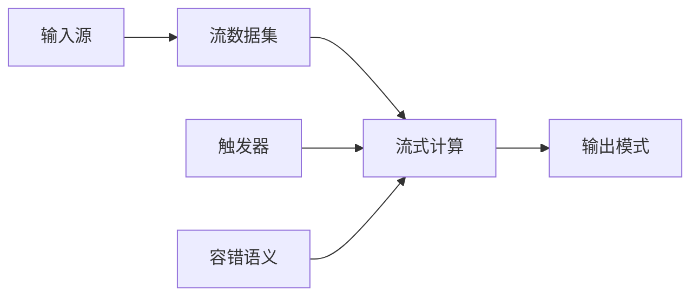

# Structured Streaming原理与代码实例讲解

## 1.背景介绍

在当今的大数据时代,数据量呈现爆炸式增长,传统的批处理系统已经无法满足实时数据处理的需求。为了应对这一挑战,流式处理(Stream Processing)应运而生。Apache Spark作为一种统一的大数据处理引擎,提供了结构化流(Structured Streaming)这一强大的流式处理框架,使得开发人员能够以熟悉的Spark SQL的方式进行流式计算。

Structured Streaming以微批处理(Micro-Batching)的方式工作,将持续不断的数据流拆分为一系列小批次,并对每个小批次数据执行类似批处理的操作。与此同时,它还提供了端到端的容错保证、事件时间(Event-time)语义等高级功能,使得流式计算变得更加简单和高效。

## 2.核心概念与联系

### 2.1 输入源(Input Sources)

Structured Streaming支持多种输入源,包括文件系统、Apache Kafka、Kinesis等。输入源定义了数据的来源以及如何从源中获取数据。

### 2.2 流数据集(Stream Dataset/DataFrame)

流数据集是指一个无界的、持续不断更新的数据集。它与静态数据集的主要区别在于,流数据集会随着时间的推移而不断增长。

### 2.3 流式计算(Stream Computation)

流式计算定义了对流数据集执行的操作,例如选择(select)、过滤(filter)、聚合(aggregate)等。这些操作与静态数据集的操作语法相同,但内部实现方式不同。

### 2.4 输出模式(Output Modes)

输出模式决定了流式计算的结果如何被写入外部系统(如文件系统或数据库)。Structured Streaming支持三种输出模式:

1. Append模式:仅将新输出行追加到现有输出中。
2. Complete模式:对输出进行重写,使其包含计算所得的所有输出行。
3. Update模式:仅输出自上次触发后发生更改的行。

### 2.5 触发器(Triggers)

触发器定义了流式查询何时应该被执行以生成新的输出批次。Structured Streaming支持基于处理时间和事件时间的触发器。

### 2.6 容错语义(Fault Tolerance Semantics)

Structured Streaming提供端到端的容错语义,确保即使在发生故障的情况下,计算也能够正确恢复并继续执行。它支持至少一次(At-least-once)和精确一次(Exactly-once)两种容错语义。

### 2.7 Mermaid流程图



## 3.核心算法原理具体操作步骤

Structured Streaming的核心算法原理可以概括为以下几个步骤:

1. **获取输入数据**:根据配置的输入源,不断地从外部系统(如Kafka、文件系统等)获取新的数据。

2. **将数据划分为小批次**:将获取到的连续数据流按照指定的时间间隔(如1秒)划分为一系列小批次。

3. **对小批次执行增量计算**:对每个小批次的数据执行类似批处理的操作,如选择、过滤、聚合等。这些操作是增量式的,即每个小批次的计算结果都是基于前一个小批次的结果进行更新。

4. **生成输出**:根据配置的输出模式,将计算结果输出到外部系统(如文件系统、数据库等)。

5. **管理状态**:Structured Streaming会自动管理流式计算所需的状态,如聚合操作中的中间结果。这些状态会被持久化到容错存储(如HDFS)中,以确保故障发生时能够正确恢复。

6. **容错恢复**:如果发生故障(如节点宕机、代码异常等),Structured Streaming会根据容错语义(至少一次或精确一次)从最近的检查点恢复计算,确保数据不会丢失或重复计算。

7. **触发新的批次**:根据配置的触发器,不断地触发新的小批次计算,实现流式处理的连续性。

这种基于增量计算的微批处理架构,使得Structured Streaming能够在保证低延迟的同时,充分利用Spark的批处理优势,提供高吞吐量和容错能力。

## 4.数学模型和公式详细讲解举例说明

在Structured Streaming中,一些核心概念和操作可以用数学模型和公式来表示,以帮助更好地理解其内在原理。

### 4.1 流数据集(Stream Dataset/DataFrame)

假设我们有一个无界的数据流 $S$,它是一系列数据元素 $e_1, e_2, e_3, \ldots$ 的集合,即:

$$S = \{e_1, e_2, e_3, \ldots\}$$

我们将这个无界数据流划分为一系列有界的小批次 $B_1, B_2, B_3, \ldots$,其中每个小批次 $B_i$ 包含一段时间内的数据元素:

$$B_1 = \{e_1, e_2, \ldots, e_m\}$$
$$B_2 = \{e_{m+1}, e_{m+2}, \ldots, e_n\}$$
$$\vdots$$
$$B_i = \{e_j, e_{j+1}, \ldots, e_k\}$$

这些小批次就构成了流数据集,它是一个随时间不断增长的数据集合:

$$\text{Stream Dataset} = B_1 \cup B_2 \cup B_3 \cup \ldots \cup B_i \cup \ldots$$

### 4.2 流式计算

对于一个流式计算操作 $f$,它会对每个小批次 $B_i$ 执行相应的计算,生成一个新的小批次结果 $R_i$:

$$R_i = f(B_i)$$

例如,对于一个简单的过滤操作 $f(x) = x > 10$,如果 $B_i = \{5, 8, 12, 15\}$,那么计算结果就是 $R_i = \{12, 15\}$。

对于一些需要维护状态的操作,如聚合(aggregate)、join等,计算结果 $R_i$ 不仅依赖于当前小批次 $B_i$,还依赖于之前小批次的状态 $S_{i-1}$:

$$R_i = f(B_i, S_{i-1})$$

例如,对于一个计算每个键的运行总和的聚合操作,如果 $B_i = \{(k_1, 2), (k_2, 3)\}$,且之前的状态为 $S_{i-1} = \{(k_1, 5), (k_2, 7)\}$,那么计算结果就是 $R_i = \{(k_1, 7), (k_2, 10)\}$,同时新的状态变为 $S_i = \{(k_1, 7), (k_2, 10)\}$。

### 4.3 输出模式

不同的输出模式决定了流式计算结果 $R_i$ 如何被写入外部系统。假设我们有一个外部系统的初始状态为 $O_0$,那么在不同的输出模式下,最终的输出状态 $O_n$ 可以表示为:

- Append模式:
  $$O_n = O_0 \cup R_1 \cup R_2 \cup \ldots \cup R_n$$

- Complete模式:
  $$O_n = R_n$$

- Update模式:
  $$O_n = (O_0 \cup R_1) \ominus (O_0 \cup R_1 \cup \ldots \cup R_{n-1}) \cup R_n$$
  其中 $\ominus$ 表示从左侧集合中移除右侧集合中存在的元素。

以上数学模型和公式有助于我们更好地理解Structured Streaming的核心概念和操作原理。

## 5.项目实践:代码实例和详细解释说明

为了更好地理解Structured Streaming的使用方法,我们将通过一个实际项目案例来演示如何使用Structured Streaming进行流式计算。

### 5.1 项目背景

假设我们有一个电商网站,需要实时统计每个产品类别的点击量(Page View,PV)。我们将使用Kafka作为数据源,Spark Structured Streaming作为流式计算引擎,最终将结果输出到控制台。

### 5.2 数据准备

我们首先需要准备一些模拟的点击数据,并将其发送到Kafka主题中。下面是一个Python脚本,它每隔1秒钟就向Kafka发送一条点击数据:

```python
from kafka import KafkaProducer
import json
import time
import random

# Kafka配置
bootstrap_servers = 'localhost:9092'
topic_name = 'product_clicks'

# 创建Kafka生产者
producer = KafkaProducer(bootstrap_servers=bootstrap_servers,
                         value_serializer=lambda v: json.dumps(v).encode('utf-8'))

# 产品类别列表
categories = ['Electronics', 'Clothing', 'Books', 'Sports', 'Toys']

while True:
    # 随机生成一条点击数据
    category = random.choice(categories)
    click_data = {'category': category, 'timestamp': int(time.time())}

    # 发送数据到Kafka
    producer.send(topic_name, value=click_data)
    print(f'Sent click data: {click_data}')

    # 每隔1秒发送一条数据
    time.sleep(1)
```

### 5.3 Spark Structured Streaming代码

接下来,我们使用Spark Structured Streaming来消费Kafka中的点击数据,并实时统计每个产品类别的PV。

```scala
import org.apache.spark.sql.functions._
import org.apache.spark.sql.streaming.Trigger

// 创建SparkSession
val spark = SparkSession.builder()
  .appName("ProductClicksAnalytics")
  .getOrCreate()

// 定义Schema
val clickSchema = new StructType()
  .add("category", StringType)
  .add("timestamp", LongType)

// 创建流数据集
val clicks = spark.readStream
  .format("kafka")
  .option("kafka.bootstrap.servers", "localhost:9092")
  .option("subscribe", "product_clicks")
  .load()
  .select(from_json(col("value").cast("string"), clickSchema).alias("data"))
  .selectExpr("data.category", "data.timestamp")

// 统计每个类别的PV
val pvCounts = clicks
  .withWatermark("timestamp", "10 seconds")
  .groupBy(window($"timestamp", "10 seconds", "5 seconds"), $"category")
  .count()
  .sort($"window")

// 启动流式查询
val query = pvCounts
  .writeStream
  .format("console")
  .outputMode("complete")
  .trigger(Trigger.ProcessingTime("5 seconds"))
  .start()

// 等待终止
query.awaitTermination()
```

代码解释:

1. 首先,我们创建一个SparkSession对象,用于后续的Spark操作。

2. 定义了一个Schema,描述了点击数据的结构。

3. 使用`spark.readStream`创建了一个流数据集,从Kafka主题中读取点击数据。我们使用`from_json`函数将JSON格式的数据解析为结构化的DataFrame。

4. 对流数据集执行以下操作:
   - `withWatermark("timestamp", "10 seconds")`:设置事件时间的水印,允许10秒的延迟。
   - `groupBy(window($"timestamp", "10 seconds", "5 seconds"), $"category")`:根据10秒的滚动窗口和产品类别进行分组。
   - `count()`:对每个组计算点击量。
   - `sort($"window")`:按照窗口时间对结果进行排序。

5. 使用`writeStream`启动一个流式查询,将结果输出到控制台。我们设置了以下配置:
   - `outputMode("complete")`:使用Complete模式,每次都输出完整的结果。
   - `trigger(Trigger.ProcessingTime("5 seconds"))`:每隔5秒触发一次计算。

6. 最后,我们调用`query.awaitTermination()`等待流式查询的终止。

运行上述代码后,你将在控制台看到每隔5秒输出一次最新的PV统计结果,类似于:

```
+------------------------------------------+--------+-----+
|window                                    |category|count|
+------------------------------------------+--------+-----+
|[2023-05-28 14:35:00, 2023-05-28 14:35:10]|Clothing|3    |
|[2023-05-28 14:35:00, 2023-05-28 14:35:10]|Books   |2    |
|[2023-05-28 14:35:05, 2023-05-28 14:35:15]|Sports  |1    |
|[2023-05-28 14:35:05, 2023-05-28 14:35:15]|Toys    |4    |
+------------------------------------------+--------+-----+
```

通过这个实例,我们可以看到如何使用Structured Streaming从Kafka