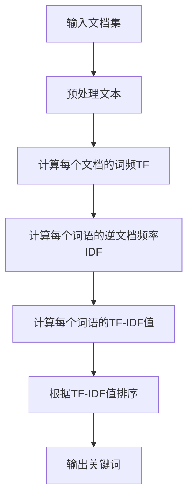

# TF-IDF：关键词提取的利器

## 1. 背景介绍

在现代信息时代,我们每天都会接触到大量的文本数据,无论是网页、新闻报道、社交媒体还是各种文档。在这么多文本数据中,如何快速准确地提取出关键词就成为了一个重要的问题。关键词提取技术可以帮助我们高效地总结文本内容,提高信息检索和文本挖掘的效率。

TF-IDF(Term Frequency-Inverse Document Frequency)是一种经典的关键词提取算法,它结合了词频(TF)和逆文档频率(IDF)两个指标,能够较为准确地评估一个词对于一个文档集或语料库的重要程度。TF-IDF算法简单高效,被广泛应用于信息检索、文本挖掘、自然语言处理等领域。

## 2. 核心概念与联系

### 2.1 词频(Term Frequency, TF)

词频是指某个词语在文档中出现的次数,用来衡量该词语对于文档的重要程度。一般来说,一个词在文档中出现的次数越多,则该词对于文档的重要性越高。但是,有些常见的词语(如"的"、"了"等功能词)虽然在文档中出现频率很高,但对于表达文档主题内容的作用并不大,因此单纯使用词频作为衡量指标是不够的。

### 2.2 逆文档频率(Inverse Document Frequency, IDF)

逆文档频率是用来衡量一个词语在整个文档集或语料库中的重要程度。一个词语在文档集中出现的频率越高,则该词语的重要性就越低。IDF可以抑制一些在整个文档集中频繁出现的常见词,从而提高那些在少数文档中出现但与这些文档主题相关的词语的权重。

### 2.3 TF-IDF

TF-IDF就是将词频(TF)和逆文档频率(IDF)相结合,用于评估一个词语对于一个文档集或语料库的重要程度。TF-IDF的计算公式如下:

$$\mathrm{TF-IDF}(t,d,D) = \mathrm{TF}(t,d) \times \mathrm{IDF}(t,D)$$

其中:

- $t$ 表示词语(term)
- $d$ 表示文档(document)
- $D$ 表示文档集或语料库(corpus)
- $\mathrm{TF}(t,d)$ 表示词语 $t$ 在文档 $d$ 中的词频
- $\mathrm{IDF}(t,D)$ 表示词语 $t$ 在文档集 $D$ 中的逆文档频率

通过将TF和IDF相乘,TF-IDF算法能够综合考虑一个词语在单个文档中的重要性(词频)和在整个文档集中的独特性(逆文档频率),从而更好地评估该词语对于文档集的重要程度。

## 3. 核心算法原理具体操作步骤

### 3.1 计算词频(TF)

对于一个给定的文档 $d$,词语 $t$ 的词频 $\mathrm{TF}(t,d)$ 可以使用以下几种方式计算:

1. **词袋模型(Bag of Words)**

   最简单的方法是统计词语 $t$ 在文档 $d$ 中出现的次数,即:

   $$\mathrm{TF}(t,d) = \text{count}(t,d)$$

2. **词频-归一化(Term Frequency-Normalization)**

   由于不同文档长度不同,单纯使用词语出现次数作为词频会受文档长度的影响。为了消除这种影响,可以将词频归一化,使其值在 $[0,1]$ 范围内:

   $$\mathrm{TF}(t,d) = \frac{\text{count}(t,d)}{\sum_{t'\in d}\text{count}(t',d)}$$

   其中,分母是文档 $d$ 中所有词语的出现次数之和。

3. **词频-对数归一化(Term Frequency-Log Normalization)**

   有时候,一个词语在一个文档中出现的次数可能会非常高,为了防止这些高频词语对结果产生过多的影响,可以使用对数归一化:

   $$\mathrm{TF}(t,d) = 1 + \log(\text{count}(t,d))$$

   通过对数函数,可以压缩高频词语的权重。

### 3.2 计算逆文档频率(IDF)

逆文档频率 $\mathrm{IDF}(t,D)$ 的计算公式如下:

$$\mathrm{IDF}(t,D) = \log\left(\frac{|D|}{|\{d\in D:t\in d\}|} + 1\right)$$

其中:

- $|D|$ 表示文档集 $D$ 中文档的总数
- $|\{d\in D:t\in d\}|$ 表示包含词语 $t$ 的文档数量
- 分母加 1 是为了避免分母为 0 的情况

IDF的值越大,说明词语 $t$ 在整个文档集中出现的频率越低,则该词语的重要性越高。

### 3.3 计算TF-IDF

将上面计算得到的 $\mathrm{TF}(t,d)$ 和 $\mathrm{IDF}(t,D)$ 相乘,就可以得到词语 $t$ 对于文档 $d$ 在文档集 $D$ 中的 TF-IDF 值:

$$\mathrm{TF-IDF}(t,d,D) = \mathrm{TF}(t,d) \times \mathrm{IDF}(t,D)$$

对于一个文档 $d$,我们可以计算每个词语的 TF-IDF 值,然后选取 TF-IDF 值较高的词语作为该文档的关键词。

### 3.4 算法流程图

下面是 TF-IDF 算法的流程图:



## 4. 数学模型和公式详细讲解举例说明

### 4.1 词频(TF)计算示例

假设我们有一个文档 $d$,其内容如下:

```
Python is a popular programming language. Python is easy to learn and use. Python has a large and active community.
```

我们可以使用不同的方式计算每个词语的词频:

1. **词袋模型**

   ```python
   term_freq = {}
   for word in doc:
       term_freq[word] = term_freq.get(word, 0) + 1
   ```

   结果为:

   ```
   {'Python': 3, 'is': 2, 'a': 1, 'popular': 1, 'programming': 1, 'language.': 1, 'easy': 1, 'to': 2, 'learn': 1, 'and': 2, 'use.': 1, 'has': 1, 'large': 1, 'active': 1, 'community.': 1}
   ```

2. **词频-归一化**

   ```python
   total_count = sum(term_freq.values())
   for word in term_freq:
       term_freq[word] /= total_count
   ```

   结果为:

   ```
   {'Python': 0.2, 'is': 0.13333333333333333, 'a': 0.06666666666666667, 'popular': 0.06666666666666667, 'programming': 0.06666666666666667, 'language.': 0.06666666666666667, 'easy': 0.06666666666666667, 'to': 0.13333333333333333, 'learn': 0.06666666666666667, 'and': 0.13333333333333333, 'use.': 0.06666666666666667, 'has': 0.06666666666666667, 'large': 0.06666666666666667, 'active': 0.06666666666666667, 'community.': 0.06666666666666667}
   ```

3. **词频-对数归一化**

   ```python
   import math
   for word in term_freq:
       term_freq[word] = 1 + math.log(term_freq[word])
   ```

   结果为:

   ```
   {'Python': 1.7917594692280548, 'is': 1.3862943611198906, 'a': 1.0, 'popular': 1.0, 'programming': 1.0, 'language.': 1.0, 'easy': 1.0, 'to': 1.3862943611198906, 'learn': 1.0, 'and': 1.3862943611198906, 'use.': 1.0, 'has': 1.0, 'large': 1.0, 'active': 1.0, 'community.': 1.0}
   ```

### 4.2 逆文档频率(IDF)计算示例

假设我们有一个文档集 $D$,包含以下 5 个文档:

```
d1: Python is a popular programming language.
d2: Python is easy to learn and use.
d3: Java is also a popular programming language.
d4: Python has a large and active community.
d5: I like to use Python for data analysis.
```

我们可以计算每个词语的逆文档频率 $\mathrm{IDF}(t,D)$:

```python
import math

N = 5  # 文档集中文档的总数
idf = {}
for doc in corpus:
    words = set(doc.split())
    for word in words:
        idf[word] = idf.get(word, 0) + 1

for word in idf:
    idf[word] = math.log(N / idf[word]) + 1
```

结果为:

```
{'Python': 0.9162907318741551, 'is': 1.5108256237659905, 'a': 1.0986122886681098, 'popular': 1.5108256237659905, 'programming': 1.5108256237659905, 'language.': 1.5108256237659905, 'easy': 1.9162907318741551, 'to': 1.5108256237659905, 'learn': 1.9162907318741551, 'and': 1.9162907318741551, 'use.': 1.9162907318741551, 'has': 1.9162907318741551, 'large': 1.9162907318741551, 'active': 1.9162907318741551, 'community.': 1.9162907318741551, 'Java': 1.9162907318741551, 'also': 1.9162907318741551, 'I': 1.9162907318741551, 'like': 1.9162907318741551, 'for': 1.9162907318741551, 'data': 1.9162907318741551, 'analysis.': 1.9162907318741551}
```

可以看到,像 "Python"、"is"、"a" 等在多个文档中出现的词语,其 IDF 值较低;而像 "easy"、"learn"、"and" 等只在少数文档中出现的词语,其 IDF 值较高。

### 4.3 TF-IDF计算示例

现在,我们可以将词频 TF 和逆文档频率 IDF 相乘,计算每个词语在每个文档中的 TF-IDF 值。以文档 $d_1$ 为例:

```python
d1 = "Python is a popular programming language."
tf = {}
for word in d1.split():
    tf[word] = tf.get(word, 0) + 1

for word in tf:
    tf[word] /= len(d1.split())

tfidf = {word: tf[word] * idf[word] for word in tf}
```

结果为:

```
{'Python': 0.18325814637483102, 'is': 0.20216395861915896, 'a': 0.07332325855393241, 'popular': 0.10081448428041481, 'programming': 0.10081448428041481, 'language.': 0.10081448428041481}
```

可以看到,在文档 $d_1$ 中,"Python" 和 "is" 的 TF-IDF 值较高,说明它们是该文档的关键词。而像 "a" 这种常见词语,虽然词频较高,但由于 IDF 值较低,导致其 TF-IDF 值较低。

通过对每个文档重复上述过程,我们就可以得到每个文档的关键词及其 TF-IDF 值。

## 5. 项目实践:代码实例和详细解释说明

下面是一个使用 Python 实现 TF-IDF 算法的示例代码:

```python
import math
from collections import Counter

def compute_tf(document):
    """
    计算文档中每个词语的词频(TF)
    """
    term_freq = Counter(document)
    max_freq = max(term_freq.values())
    for term in term_freq:
        term_freq[term] /= max_freq
    return term_freq

def compute_idf(corpus):
    """
    计算每个词语的逆文档频率(IDF)
    """
    n_docs = len(corpus)
    idf = {}
    for doc in corpus:
        terms = set(doc)
        for term in terms:
            idf[term] = idf.get(term, 0) + 