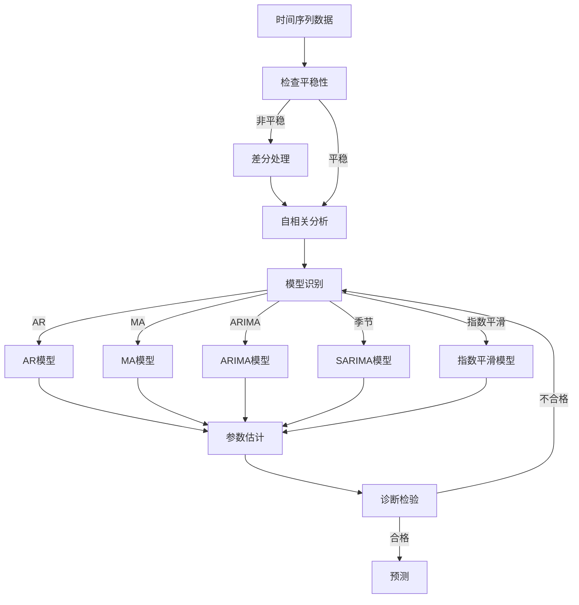

# Time Series Forecasting原理与代码实例讲解

## 1.背景介绍

时间序列预测是指使用过去的数据来预测未来值的过程。它在各个领域都有广泛的应用,例如金融、天气预报、能源需求预测等。随着大数据时代的到来,时间序列数据的积累使得时间序列预测变得越来越重要。

### 1.1 时间序列数据特征

时间序列数据具有以下几个主要特征:

- 时间依赖性:观测值与时间序列中前面的值有关
- 趋势:数据在长时间内呈现出上升或下降的趋势
- 周期性:数据在固定的时间间隔内重复出现某种模式
- 季节性:数据在一年中的某些特定时间段内呈现出周期性波动

### 1.2 时间序列预测应用场景

时间序列预测在以下领域有着广泛的应用:

- 金融:股票价格、汇率等预测
- 零售:产品销量预测
- 能源:电力负荷、天然气需求预测 
- 制造业:需求预测、库存管理
- 天气:温度、降雨量等预测
- 网络流量:带宽需求预测

## 2.核心概念与联系

时间序列预测涉及以下几个核心概念:

### 2.1 平稳性(Stationarity)

平稳性是指时间序列的统计属性(如均值、方差、自相关)在时间上不发生变化。非平稳序列需要进行差分等处理转换为平稳序列。平稳性是建模的基本假设。

### 2.2 自相关(Autocorrelation)

自相关描述了时间序列观测值与其自身滞后值之间的相关性。它反映了时间序列的内在结构,是建模的重要依据。

### 2.3 白噪声(White Noise)

白噪声是指均值为0、方差为常数的随机过程,且自相关函数为0。它是无法被预测的纯随机过程。

### 2.4 模型构建

根据时间序列的性质,常用的模型有:

- 自回归(AR)模型:当前值由过去值的线性组合表示
- 移动平均(MA)模型:当前值由过去残差的线性组合表示
- 综合(ARIMA)模型:结合AR和MA,处理非平稳序列
- 季节模型(SARIMA):考虑季节性效应
- 指数平滑模型:赋予最新观测更大权重



## 3.核心算法原理具体操作步骤

时间序列预测的一般流程包括以下步骤:

### 3.1 数据预处理

1. 可视化分析数据,了解基本统计特征
2. 检查是否存在缺失值、异常值,进行处理
3. 对非平稳序列进行差分或其他转换,使之平稳

### 3.2 自相关分析

1. 计算并分析自相关函数(ACF)和偏自相关函数(PACF)
2. 确定可能的模型类型(AR、MA、ARMA)及阶数

### 3.3 模型识别

根据自相关分析结果,选择合适的模型类型,如AR、MA、ARIMA、SARIMA等。

### 3.4 模型拟合

1. 设定模型阶数和其他超参数
2. 使用如最小二乘法等方法估计模型参数

### 3.5 诊断检验

1. 残差分析:检查残差是否为白噪声
2. 模型适当性检验:如AIC、BIC等

### 3.6 模型更新

若不满足检验标准,需返回上一步骤,重新识别模型或调整参数。

### 3.7 预测

使用通过检验的最终模型对未来时间点进行预测。

## 4.数学模型和公式详细讲解举例说明

### 4.1 自相关函数(ACF)

自相关函数描述了时间序列与其自身滞后值之间的相关性,定义为:

$$
\rho_k = \frac{cov(y_t,y_{t-k})}{var(y_t)}
$$

其中$\rho_k$为滞后k期的自相关系数,$cov$为协方差,$var$为方差。

例如,给定时间序列$y_t = \{3, 5, 8, 4, 7\}$,滞后1期的自相关系数为:

$$
\rho_1 = \frac{cov(3,5) + cov(5,8) + cov(8,4) + cov(4,7)}{var(3) + var(5) + var(8) + var(4) + var(7)} \approx 0.82
$$

### 4.2 AR(p)模型

AR(p)模型将当前观测值$y_t$表示为过去p个值的线性组合:

$$
y_t = c + \phi_1y_{t-1} + \phi_2y_{t-2} + ... + \phi_py_{t-p} + \epsilon_t
$$

其中$\phi_i$为模型参数,$\epsilon_t$为白噪声项。

例如,一个AR(2)模型为:

$$
y_t = 1.2 - 0.8y_{t-1} + 0.4y_{t-2} + \epsilon_t
$$

### 4.3 MA(q)模型 

MA(q)模型将当前观测值$y_t$表示为过去q个残差项的线性组合:

$$
y_t = c + \epsilon_t + \theta_1\epsilon_{t-1} + \theta_2\epsilon_{t-2} + ... + \theta_q\epsilon_{t-q}
$$

其中$\theta_i$为模型参数,$\epsilon_t$为白噪声项。

例如,一个MA(1)模型为:

$$
y_t = 2 + \epsilon_t - 0.6\epsilon_{t-1}
$$

### 4.4 ARIMA(p,d,q)模型

ARIMA模型结合了AR和MA模型,并引入差分阶数d来处理非平稳序列:

$$
y_t' = c + \phi_1y_{t-1}' + ... + \phi_py_{t-p}' + \theta_1\epsilon_{t-1} + ... + \theta_q\epsilon_{t-q} + \epsilon_t
$$

其中$y_t' = \nabla^d y_t$为d阶差分序列,$\nabla$为差分算子。

### 4.5 季节ARIMA(SARIMA)模型

对于存在季节性的时间序列,可使用SARIMA模型,它在ARIMA基础上增加了季节自回归和季节移动平均部分:

$$
\begin{split}
y_t' = & c + \phi_1y_{t-1}' + ... + \phi_py_{t-p}' + \Phi_1y_{t-s}'' + ... + \Phi_Py_{t-Ps}'' \\
       & + \theta_1\epsilon_{t-1} + ... + \theta_q\epsilon_{t-q} + \Theta_1\epsilon_{t-S} + ... + \Theta_Q\epsilon_{t-QS} + \epsilon_t
\end{split}
$$

其中$y_t''$为季节差分序列,s为周期长度,P和Q分别为季节AR和MA阶数。

### 4.6 指数平滑模型

指数平滑模型对较新的观测值赋予更大权重,公式为:

$$
\hat{y}_{t+1} = \alpha y_t + (1-\alpha)\hat{y}_t
$$

其中$\alpha$为平滑系数,控制新旧数据权重。$\alpha$越大,模型对新数据更敏感。

## 5.项目实践:代码实例和详细解释说明

以下是使用Python和statsmodels库对airline数据集进行SARIMA建模的示例:

```python
import pandas as pd
import matplotlib.pyplot as plt
from statsmodels.tsa.stattools import adfuller
from statsmodels.graphics.tsaplots import plot_acf, plot_pacf
from statsmodels.tsa.arima_model import ARIMA

# 载入数据
air_data = pd.read_csv('airline_passengers.csv', index_col='Month')
air_data.index = pd.to_datetime(air_data.index)

# 可视化数据
air_data.plot()
plt.show()

# 检查平稳性
print(adfuller(air_data['Thousands of Passengers']))

# 一阶差分
air_data_diff = air_data.diff().dropna()

# 差分序列ACF和PACF
fig, axes = plt.subplots(1,2,figsize=(12,3))
plot_acf(air_data_diff, ax=axes[0])
plot_pacf(air_data_diff, ax=axes[1])
plt.show()

# 建立SARIMA模型
model = ARIMA(air_data, order=(1,1,1), seasonal_order=(1,1,1,12))
model_fit = model.fit()
print(model_fit.summary())

# 预测
fc, se, conf = model_fit.forecast(12, alpha=0.05)  # 95%置信区间
fc_series = pd.Series(fc, index=air_data.index[-12:])
lower_series = pd.Series(conf[:, 0], index=air_data.index[-12:])
upper_series = pd.Series(conf[:, 1], index=air_data.index[-12:])

# 绘制预测结果
plt.figure(figsize=(12,5), dpi=100)
plt.plot(air_data, label='Original')
plt.plot(fc_series, label='Forecast')
plt.fill_between(lower_series.index, lower_series, upper_series, 
                 color='k', alpha=.15)
plt.title('Forecast vs Original')
plt.legend(loc='upper left', fontsize=8)
plt.show()
```

上述代码首先导入airline数据集,并进行可视化分析。然后检查平稳性,对非平稳序列进行一阶差分处理。

接着计算差分序列的ACF和PACF,发现存在明显的季节性自回归和移动平均模式,因此选择SARIMA模型。

代码使用ARIMA函数构建SARIMA(1,1,1)(1,1,1,12)模型,即一阶AR、一阶差分、一阶MA,以及一阶季节AR、一阶季节差分、一阶季节MA,季节周期为12。

最后,fit方法拟合模型参数,forecast方法基于拟合模型对未来12个月进行预测,并绘制预测结果与原始数据的对比图。

## 6.实际应用场景

时间序列预测在以下实际场景中有着广泛的应用:

### 6.1 电力负荷预测

准确预测未来的电力负荷对于电力系统的有效运行至关重要。时间序列模型可以结合历史负荷数据、天气情况等因素进行预测。

### 6.2 交通流量预测 

交通流量预测可以帮助缓解拥堵、优化路线规划。时间序列模型能够捕捉交通流量的周期性和趋势特征。

### 6.3 天气预报

天气预报是时间序列预测的典型应用之一。气象部门使用ARIMA等模型分析历史数据,预测未来的温度、降雨量等气象要素。

### 6.4 销售额预测

对于零售商而言,准确预测未来的销售额对于库存管理、促销策略等决策至关重要。时间序列模型可以分析历史销售数据,预测未来的销售趋势。

### 6.5 产品需求预测

在制造业中,时间序列模型可以预测未来对产品的需求量,从而指导生产计划的制定,优化资源配置。

### 6.6 网络流量预测

随着互联网的快速发展,网络流量的准确预测对于带宽分配、服务器扩容等决策至关重要。时间序列模型可以分析历史网络流量数据,预测未来的流量高峰。

## 7.工具和资源推荐

### 7.1 Python库

- Statsmodels: 提供了ARIMA等时间序列分析模型
- Pmdarima: 基于Statsmodels,提供自动ARIMA模型选择
- Prophet: Facebook开源的时间序列预测库,专注于具有周期性的业务时间序列数据
- XGBoost: 可用于时间序列预测的梯度提升决策树库

### 7.2 R库

- forecast: 综合性时间序列预测库
- tseries: 时间序列分析和计算库
- xts: 支持大量时间序列数据的处理

### 7.3 在线课程

- 时间序列分析与预测建模 