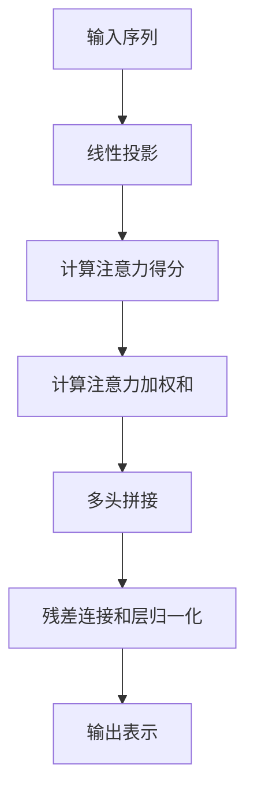

# Transformer大模型实战 多头注意力层

## 1.背景介绍

在自然语言处理和机器学习领域,Transformer模型是一种革命性的架构,它完全摒弃了传统的基于循环或卷积的序列模型,而是完全基于注意力机制来捕捉输入序列中任意两个位置之间的依赖关系。自2017年被提出以来,Transformer模型在机器翻译、文本生成、语音识别等诸多任务中表现出色,成为了目前最先进的序列模型架构。

Transformer的核心组件之一是多头注意力(Multi-Head Attention)层,它能够从不同的表示子空间中捕捉序列的长程依赖关系,是整个模型的关键部分。本文将重点介绍多头注意力层的原理、实现细节以及在实际应用中的技巧,为读者提供深入理解和实践Transformer大模型的机会。

## 2.核心概念与联系

### 2.1 注意力机制(Attention Mechanism)

注意力机制是Transformer模型的核心思想,它允许模型在计算目标位置的表示时,对输入序列中的所有位置进行加权,从而捕捉长程依赖关系。与传统的RNN和CNN不同,注意力机制不需要递归或卷积操作,可以并行计算,大大提高了计算效率。

在注意力机制中,模型首先计算查询(Query)向量与键(Key)向量之间的相似性得分,然后根据这些得分对值(Value)向量进行加权求和,得到目标位置的表示。这种机制使得模型可以选择性地关注输入序列中的不同部分,从而更好地建模长程依赖关系。

### 2.2 缩放点积注意力(Scaled Dot-Product Attention)

缩放点积注意力是Transformer中使用的一种注意力机制变体,它通过缩放点积相似性得分,来解决较长输入序列时的梯度不稳定问题。具体来说,对于查询向量$\boldsymbol{q}$、键向量$\boldsymbol{k}$和值向量$\boldsymbol{v}$,缩放点积注意力的计算过程如下:

$$\mathrm{Attention}(\boldsymbol{q}, \boldsymbol{K}, \boldsymbol{V}) = \mathrm{softmax}\left(\frac{\boldsymbol{q}\boldsymbol{K}^\top}{\sqrt{d_k}}\right)\boldsymbol{V}$$

其中$d_k$是键向量的维度,用于缩放点积相似性得分,以防止较长输入序列时的梯度饱和问题。

### 2.3 多头注意力(Multi-Head Attention)

虽然单一的注意力机制已经能够捕捉序列的依赖关系,但是由于只关注了一个表示子空间,可能会丢失一些有用的信息。为了解决这个问题,Transformer引入了多头注意力机制,它将查询、键和值向量进行线性投影,得到多组不同的表示子空间,然后在每个子空间中并行计算注意力,最后将所有注意力的结果进行拼接,得到最终的表示向量。

具体来说,对于查询向量$\boldsymbol{q}$、键向量$\boldsymbol{K}$和值向量$\boldsymbol{V}$,多头注意力的计算过程如下:

$$\begin{aligned}
\mathrm{MultiHead}(\boldsymbol{q}, \boldsymbol{K}, \boldsymbol{V}) &= \mathrm{Concat}(\mathrm{head}_1, \ldots, \mathrm{head}_h)\boldsymbol{W}^O\\
\mathrm{where}\quad \mathrm{head}_i &= \mathrm{Attention}(\boldsymbol{q}\boldsymbol{W}_i^Q, \boldsymbol{K}\boldsymbol{W}_i^K, \boldsymbol{V}\boldsymbol{W}_i^V)
\end{aligned}$$

其中$\boldsymbol{W}_i^Q\in\mathbb{R}^{d_\mathrm{model}\times d_k}$、$\boldsymbol{W}_i^K\in\mathbb{R}^{d_\mathrm{model}\times d_k}$和$\boldsymbol{W}_i^V\in\mathbb{R}^{d_\mathrm{model}\times d_v}$分别是查询、键和值的线性投影矩阵,$\boldsymbol{W}^O\in\mathbb{R}^{hd_v\times d_\mathrm{model}}$是最终的线性变换矩阵,用于将多个注意力头的结果拼接并映射回模型维度$d_\mathrm{model}$。

通过多头注意力机制,Transformer能够从不同的表示子空间中捕捉序列的依赖关系,提高了模型的表示能力。

## 3.核心算法原理具体操作步骤

多头注意力层的计算过程可以分为以下几个步骤:

1. **线性投影**:将输入的查询(Query)、键(Key)和值(Value)通过不同的线性投影矩阵进行投影,得到多组不同的表示子空间。

   $$\begin{aligned}
   \boldsymbol{Q}_i &= \boldsymbol{Q}\boldsymbol{W}_i^Q &\in\mathbb{R}^{n\times d_k}\\
   \boldsymbol{K}_i &= \boldsymbol{K}\boldsymbol{W}_i^K &\in\mathbb{R}^{n\times d_k}\\
   \boldsymbol{V}_i &= \boldsymbol{V}\boldsymbol{W}_i^V &\in\mathbb{R}^{n\times d_v}
   \end{aligned}$$

   其中$n$是输入序列的长度,$d_k$和$d_v$分别是键和值向量的维度,投影矩阵$\boldsymbol{W}_i^Q\in\mathbb{R}^{d_\mathrm{model}\times d_k}$、$\boldsymbol{W}_i^K\in\mathbb{R}^{d_\mathrm{model}\times d_k}$和$\boldsymbol{W}_i^V\in\mathbb{R}^{d_\mathrm{model}\times d_v}$是可训练的参数。

2. **计算注意力得分**:对于每个注意力头,计算查询向量和键向量之间的缩放点积注意力得分。

   $$\boldsymbol{S}_i = \mathrm{softmax}\left(\frac{\boldsymbol{Q}_i\boldsymbol{K}_i^\top}{\sqrt{d_k}}\right)$$

   其中$\boldsymbol{S}_i\in\mathbb{R}^{n\times n}$是注意力得分矩阵,每个元素$s_{ij}$表示第$i$个位置对第$j$个位置的注意力权重。

3. **计算注意力加权和**:将注意力得分与值向量进行加权求和,得到每个注意力头的输出表示。

   $$\mathrm{head}_i = \boldsymbol{S}_i\boldsymbol{V}_i$$

4. **多头拼接**:将所有注意力头的输出表示拼接在一起,然后通过一个线性变换映射回模型维度$d_\mathrm{model}$,得到多头注意力层的最终输出。

   $$\mathrm{MultiHead}(\boldsymbol{Q}, \boldsymbol{K}, \boldsymbol{V}) = \mathrm{Concat}(\mathrm{head}_1, \ldots, \mathrm{head}_h)\boldsymbol{W}^O$$

通过上述步骤,多头注意力层能够从不同的表示子空间中捕捉序列的长程依赖关系,提高了模型的表示能力。在实际应用中,通常会对多头注意力层的输出进行残差连接和层归一化,以提高模型的稳定性和收敛速度。

## 4.数学模型和公式详细讲解举例说明

在上一节中,我们介绍了多头注意力层的核心算法步骤,本节将进一步详细讲解其中涉及的数学模型和公式,并给出具体的例子说明。

### 4.1 缩放点积注意力

缩放点积注意力是Transformer中使用的一种注意力机制变体,它通过缩放点积相似性得分,来解决较长输入序列时的梯度不稳定问题。具体来说,对于查询向量$\boldsymbol{q}\in\mathbb{R}^{d_k}$、键向量$\boldsymbol{k}\in\mathbb{R}^{d_k}$和值向量$\boldsymbol{v}\in\mathbb{R}^{d_v}$,缩放点积注意力的计算过程如下:

$$\mathrm{Attention}(\boldsymbol{q}, \boldsymbol{k}, \boldsymbol{v}) = \mathrm{softmax}\left(\frac{\boldsymbol{q}\boldsymbol{k}^\top}{\sqrt{d_k}}\right)\boldsymbol{v}$$

其中$d_k$是键向量的维度,用于缩放点积相似性得分$\boldsymbol{q}\boldsymbol{k}^\top$,以防止较长输入序列时的梯度饱和问题。

**例子**:假设我们有一个查询向量$\boldsymbol{q} = [0.1, 0.2, 0.3]^\top$,一个键向量$\boldsymbol{k} = [0.4, 0.5, 0.6]^\top$和一个值向量$\boldsymbol{v} = [1.0, 2.0]^\top$,其中$d_k=3$,$d_v=2$。那么缩放点积注意力的计算过程如下:

1. 计算点积相似性得分:$\boldsymbol{q}\boldsymbol{k}^\top = [0.1, 0.2, 0.3][0.4, 0.5, 0.6] = 0.46$
2. 缩放相似性得分:$\frac{\boldsymbol{q}\boldsymbol{k}^\top}{\sqrt{d_k}} = \frac{0.46}{\sqrt{3}} \approx 0.27$
3. 应用softmax函数:$\mathrm{softmax}(0.27) = 1.0$
4. 计算注意力加权和:$\mathrm{Attention}(\boldsymbol{q}, \boldsymbol{k}, \boldsymbol{v}) = 1.0\times[1.0, 2.0]^\top = [1.0, 2.0]^\top$

可以看到,通过缩放操作,即使输入序列较长,相似性得分也不会过大或过小,从而避免了梯度饱和或消失的问题。

### 4.2 多头注意力

虽然单一的注意力机制已经能够捕捉序列的依赖关系,但是由于只关注了一个表示子空间,可能会丢失一些有用的信息。为了解决这个问题,Transformer引入了多头注意力机制,它将查询、键和值向量进行线性投影,得到多组不同的表示子空间,然后在每个子空间中并行计算注意力,最后将所有注意力的结果进行拼接,得到最终的表示向量。

具体来说,对于查询矩阵$\boldsymbol{Q}\in\mathbb{R}^{n\times d_\mathrm{model}}$、键矩阵$\boldsymbol{K}\in\mathbb{R}^{n\times d_\mathrm{model}}$和值矩阵$\boldsymbol{V}\in\mathbb{R}^{n\times d_\mathrm{model}}$,多头注意力的计算过程如下:

$$\begin{aligned}
\mathrm{MultiHead}(\boldsymbol{Q}, \boldsymbol{K}, \boldsymbol{V}) &= \mathrm{Concat}(\mathrm{head}_1, \ldots, \mathrm{head}_h)\boldsymbol{W}^O\\
\mathrm{where}\quad \mathrm{head}_i &= \mathrm{Attention}(\boldsymbol{Q}\boldsymbol{W}_i^Q, \boldsymbol{K}\boldsymbol{W}_i^K, \boldsymbol{V}\boldsymbol{W}_i^V)
\end{aligned}$$

其中$\boldsymbol{W}_i^Q\in\mathbb{R}^{d_\mathrm{model}\times d_k}$、$\boldsymbol{W}_i^K\in\mathbb{R}^{d_\mathrm{model}\times d_k}$和$\boldsymbol{W}_i^V\in\mathbb{R}^{d_\mathrm{model}\times d_v}$分别是查询、键和值的线性投影矩阵,$\boldsymbol{W}^O\in\mathbb{R}^{hd_v\times d_\mathrm{model}}$是最终的线性变换矩阵,用于将多个注意力头的结果拼接并映射回模型维度$d_\mathrm{model}$。