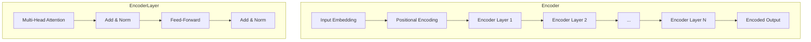

# Transformer大模型实战 编码器总览

## 1.背景介绍

随着深度学习的不断发展,Transformer模型在自然语言处理(NLP)和计算机视觉(CV)等领域取得了卓越的成就。作为一种全新的基于注意力机制(Attention Mechanism)的模型架构,Transformer彻底改变了序列数据的处理方式,摆脱了传统的循环神经网络(RNN)和卷积神经网络(CNN)架构,展现出了强大的并行计算能力。

编码器(Encoder)是Transformer模型中的关键组成部分,负责捕获输入序列的上下文信息,并将其编码为高维向量表示。这种编码方式不仅能够有效地捕获长期依赖关系,而且还能够通过注意力机制动态地分配不同位置特征的权重,从而提高模型的表现能力。

本文将深入探讨Transformer编码器的原理、架构和实现细节,旨在为读者提供全面的理解和实践指导。无论是自然语言处理、计算机视觉还是其他序列数据处理任务,了解编码器的工作机制都是构建高性能Transformer模型的关键所在。

## 2.核心概念与联系

### 2.1 注意力机制(Attention Mechanism)

注意力机制是Transformer模型的核心,它允许模型在编码输入序列时,动态地关注不同位置的特征信息,并根据它们的重要性分配不同的权重。这种机制有助于模型更好地捕获长期依赖关系,并且能够有效地处理变长序列输入。

在编码器中,注意力机制被应用于多头自注意力(Multi-Head Self-Attention)层,用于捕获输入序列中不同位置特征之间的关系。每个注意力头都会学习不同的注意力模式,最终将所有注意力头的结果进行拼接,形成最终的注意力表示。

### 2.2 位置编码(Positional Encoding)

由于Transformer模型没有像RNN那样的递归结构,因此需要一种机制来为序列中的每个位置提供位置信息。位置编码就是用来解决这个问题的技术,它将位置信息编码为向量,并将其与输入的词嵌入相加,从而使模型能够捕获序列的位置信息。

常见的位置编码方法包括正弦位置编码(Sinusoidal Positional Encoding)和学习的位置编码(Learned Positional Encoding)。前者使用预定义的正弦函数来生成位置编码向量,而后者则将位置编码向量作为模型参数进行学习。

### 2.3 层归一化(Layer Normalization)

层归一化是一种常见的归一化技术,用于加速模型的收敛并提高其泛化能力。在Transformer编码器中,层归一化被应用于每个子层的输入和输出,以确保数据在不同层之间的分布保持一致。

层归一化的工作原理是对每个样本的特征进行归一化,使其均值为0、方差为1。这种操作有助于缓解内部协变量偏移(Internal Covariate Shift)问题,从而提高模型的训练稳定性和收敛速度。

### 2.4 残差连接(Residual Connection)

残差连接是一种常见的技术,用于解决深度神经网络中的梯度消失或梯度爆炸问题。在Transformer编码器中,残差连接被应用于每个子层的输出,将输入和输出相加,形成新的输出。

这种机制有助于保留原始输入信息,并且能够更好地传播梯度,从而提高模型的训练效率和表现能力。残差连接还有助于缓解深度网络中的退化问题,使模型更容易优化。

### 2.5 前馈网络(Feed-Forward Network)

除了注意力子层之外,Transformer编码器还包含一个前馈网络子层。该子层由两个全连接层组成,第一个全连接层具有较大的维度,而第二个全连接层则将维度还原回原始大小。

前馈网络的作用是对每个位置的特征进行非线性转换,从而提供更丰富的表示能力。通常,前馈网络会使用ReLU作为激活函数,以引入非线性性。同时,前馈网络还可以看作是一种特征交叉(Feature Cross)操作,能够捕获不同特征之间的相互作用。

## 3.核心算法原理具体操作步骤

### 3.1 编码器架构概览

Transformer编码器的架构由多个相同的编码器层组成,每个编码器层包含两个子层:多头自注意力子层和前馈网络子层。编码器的输入是一个序列,通过词嵌入层和位置编码层进行处理,然后依次通过每个编码器层,最终输出一个编码后的序列表示。

### 3.2 多头自注意力(Multi-Head Self-Attention)

多头自注意力是Transformer编码器中最关键的组件之一。它允许模型在编码输入序列时,动态地关注不同位置的特征信息,并根据它们的重要性分配不同的权重。

1. 将输入序列 $X = (x_1, x_2, \dots, x_n)$ 线性映射到查询(Query)、键(Key)和值(Value)向量空间:

   $$Q = XW^Q, K = XW^K, V = XW^V$$

   其中 $W^Q, W^K, W^V$ 分别是可学习的查询、键和值的权重矩阵。

2. 计算查询和键之间的点积,获得注意力分数矩阵 $A$:

   $$A = \text{softmax}\left(\frac{QK^T}{\sqrt{d_k}}\right)$$

   其中 $d_k$ 是缩放因子,用于防止内积过大导致梯度饱和。

3. 将注意力分数矩阵 $A$ 与值向量 $V$ 相乘,得到注意力输出 $Z$:

   $$Z = AV$$

4. 对注意力输出进行线性变换,得到最终的自注意力输出:

   $$\text{Self-Attention}(X) = \text{Concat}(Z_1, Z_2, \dots, Z_h)W^O$$

   其中 $h$ 是注意力头的数量, $W^O$ 是可学习的输出权重矩阵。

多头自注意力机制通过计算不同注意力头的注意力输出,并将它们拼接在一起,从而捕获不同的注意力模式,提高模型的表现能力。

### 3.3 前馈网络(Feed-Forward Network)

前馈网络是Transformer编码器中的另一个关键组件,它对每个位置的特征进行非线性转换,从而提供更丰富的表示能力。

1. 将自注意力输出 $X'$ 通过一个全连接层进行非线性变换:

   $$F = \text{ReLU}(X'W_1 + b_1)$$

   其中 $W_1$ 和 $b_1$ 分别是可学习的权重矩阵和偏置向量。

2. 将非线性变换的输出 $F$ 通过另一个全连接层进行线性变换:

   $$\text{FFN}(X') = \text{ReLU}(F)W_2 + b_2$$

   其中 $W_2$ 和 $b_2$ 分别是可学习的权重矩阵和偏置向量。

前馈网络的作用是对每个位置的特征进行非线性转换,从而提供更丰富的表示能力。通常,前馈网络会使用ReLU作为激活函数,以引入非线性性。同时,前馈网络还可以看作是一种特征交叉操作,能够捕获不同特征之间的相互作用。

### 3.4 层归一化(Layer Normalization)和残差连接(Residual Connection)

为了加速模型的收敛并提高其泛化能力,Transformer编码器中采用了层归一化和残差连接技术。

1. 层归一化:

   在每个子层的输入和输出上应用层归一化,以确保数据在不同层之间的分布保持一致。具体操作如下:

   $$\mu = \frac{1}{H}\sum_{i=1}^{H}x_i, \sigma^2 = \frac{1}{H}\sum_{i=1}^{H}(x_i - \mu)^2$$
   $$\text{LN}(x_i) = \gamma\left(\frac{x_i - \mu}{\sqrt{\sigma^2 + \epsilon}}\right) + \beta$$

   其中 $H$ 是特征维度, $\gamma$ 和 $\beta$ 是可学习的缩放和偏移参数, $\epsilon$ 是一个很小的常数,用于避免除以0。

2. 残差连接:

   在每个子层的输出上应用残差连接,将输入和输出相加,形成新的输出。具体操作如下:

   $$\text{Output} = \text{LayerNorm}(\text{Sublayer}(X) + X)$$

   其中 $\text{Sublayer}(X)$ 表示子层的输出, $X$ 表示子层的输入。

层归一化和残差连接的结合有助于加速模型的收敛,提高模型的泛化能力,并缓解深度网络中的退化问题。

## 4.数学模型和公式详细讲解举例说明

在上一节中,我们介绍了Transformer编码器的核心算法原理和具体操作步骤。现在,我们将通过数学模型和公式,结合具体的例子,进一步深入探讨编码器的工作机制。

### 4.1 多头自注意力(Multi-Head Self-Attention)

多头自注意力是Transformer编码器中最关键的组件之一,它允许模型在编码输入序列时,动态地关注不同位置的特征信息,并根据它们的重要性分配不同的权重。

假设我们有一个长度为4的输入序列 $X = (x_1, x_2, x_3, x_4)$,其中每个 $x_i$ 是一个词嵌入向量,维度为 $d_\text{model} = 4$。我们将使用单头自注意力(Single-Head Self-Attention)来说明注意力机制的工作原理。

1. 线性映射:

   首先,我们将输入序列 $X$ 线性映射到查询(Query)、键(Key)和值(Value)向量空间:

   $$\begin{aligned}
   Q &= XW^Q = \begin{bmatrix}
   -0.5 & 0.6 & 0.2 & 0.9\\
   0.3 & -0.1 & 0.8 & 0.6\\
   0.4 & 0.7 & -0.3 & -0.8\\
   -0.2 & -0.9 & 0.4 & -0.1
   \end{bmatrix} \\
   K &= XW^K = \begin{bmatrix}
   -0.6 & -0.3 & 0.8 & 0.2\\
   0.5 & 0.1 & 0.2 & 0.7\\
   0.6 & 0.4 & -0.5 & -0.4\\
   -0.8 & -0.2 & -0.3 & 0.6
   \end{bmatrix} \\
   V &= XW^V = \begin{bmatrix}
   0.5 & 0.1 & 0.6 & 0.8\\
   0.3 & 0.2 & -0.1 & 0.4\\
   0.4 & 0.3 & -0.2 & -0.5\\
   -0.1 & -0.3 & 0.1 & -0.2
   \end{bmatrix}
   \end{aligned}$$

   其中 $W^Q, W^K, W^V$ 分别是可学习的查询、键和值的权重矩阵。

2. 计算注意力分数:

   接下来,我们计算查询和键之间的点积,获得注意力分数矩阵 $A$:

   $$A = \text{softmax}\left(\frac{QK^T}{\sqrt{d_k}}\right) = \begin{bmatrix}
   0.19 & 0.22 & 0.29 & 0.30\\
   0.28 & 0.24 & 0.27 & 0.21\\
   0.30 & 0.28 & 0.21 & 0.21\\
   0.23 & 0.26 & 0.23 & 0.28
   \end{bmatrix}$$

   其中 $d_k = 4$ 是缩放因子,用于防止内积过大导致梯度饱