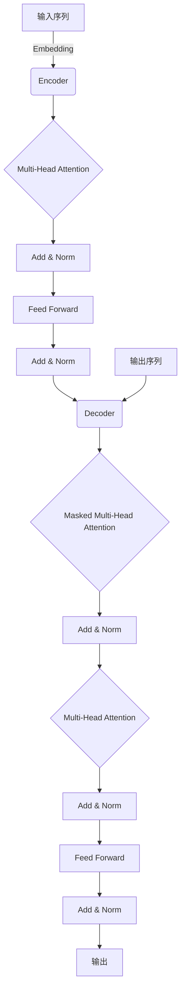

# Transformer大模型实战 跨语言模型

## 1.背景介绍

随着人工智能技术的不断发展,自然语言处理(NLP)已经成为一个非常热门的研究领域。传统的NLP模型主要依赖于特征工程和规则,效果受到了一定的限制。而近年来,基于深度学习的NLP模型取得了令人瞩目的成就,尤其是Transformer模型的出现,极大地推动了NLP技术的发展。

Transformer是一种全新的基于注意力机制(Attention Mechanism)的序列到序列(Seq2Seq)模型,最初被提出用于机器翻译任务。它不仅在机器翻译领域取得了卓越的成绩,而且在其他NLP任务中也表现出色,例如文本摘要、问答系统、语言模型等。Transformer的核心思想是完全依赖于注意力机制来捕获输入和输出之间的全局依赖关系,而不再使用循环神经网络(RNN)或卷积神经网络(CNN)。这种全新的架构设计使得Transformer模型拥有更好的并行计算能力,从而可以更高效地利用现有的硬件资源。

基于Transformer模型的进一步发展,出现了一系列大型语言模型,如GPT(Generative Pre-trained Transformer)、BERT(Bidirectional Encoder Representations from Transformers)、XLNet等。这些模型通过在大规模语料库上进行预训练,学习到了丰富的语义和语法知识,从而可以更好地理解和生成自然语言。这些大型语言模型不仅在下游的NLP任务中表现出色,而且还展现出了跨语言的能力,即在一种语言上训练的模型也可以直接应用于其他语言,这就是所谓的"跨语言模型"。

## 2.核心概念与联系

### 2.1 Transformer模型

Transformer模型是一种全新的基于注意力机制的序列到序列模型,主要由编码器(Encoder)和解码器(Decoder)两部分组成。

编码器的主要作用是将输入序列编码为一系列的向量表示,这些向量捕获了输入序列中的上下文信息。解码器则根据编码器的输出和自身的输入,生成目标序列。编码器和解码器都由多个相同的层组成,每一层都包含了多头注意力机制(Multi-Head Attention)和前馈神经网络(Feed Forward Neural Network)。

**注意力机制(Attention Mechanism)**是Transformer模型的核心,它允许模型在编码和解码时关注输入序列的不同部分,捕获长距离依赖关系。与RNN和CNN不同,注意力机制不需要按顺序处理序列,而是可以并行计算,从而提高了模型的效率。

**多头注意力机制(Multi-Head Attention)**是对注意力机制的扩展,它将注意力分成多个"头"(head),每个头对应一个注意力机制,最后将多个头的结果拼接起来,从而捕获更丰富的依赖关系。

**掩码多头注意力机制(Masked Multi-Head Attention)**是解码器中使用的一种特殊的注意力机制。它通过掩码机制,防止解码器在生成当前位置的输出时关注到未来位置的信息,保证了解码的自回归性质。

### 2.2 预训练语言模型

预训练语言模型(Pre-trained Language Model)是指在大规模语料库上预先训练得到的语言模型,它可以捕获丰富的语义和语法知识,为下游的NLP任务提供有效的初始化参数和语言表示。

常见的预训练语言模型包括:

- **GPT(Generative Pre-trained Transformer)**: 基于Transformer解码器的自回归语言模型,可以生成连贯的自然语言文本。
- **BERT(Bidirectional Encoder Representations from Transformers)**: 基于Transformer编码器的双向语言模型,可以同时捕获上下文的左右信息。
- **XLNet**: 基于Transformer的自回归语言模型,通过排列语言模型(Permutation Language Model)的方式,避免了BERT中的双向约束。

这些预训练语言模型通过在大规模语料库上进行无监督预训练,学习到了丰富的语义和语法知识,可以作为NLP任务的有效初始化参数和语言表示。

### 2.3 跨语言模型

跨语言模型(Cross-lingual Model)是指在一种语言上训练的模型也可以直接应用于其他语言的模型。传统的NLP模型通常是针对单一语言训练和应用的,而跨语言模型则可以突破这一限制,在多种语言之间共享知识和表示。

跨语言模型的核心思想是利用多语言数据进行联合训练,使模型能够同时捕获多种语言的语义和语法特征。常见的跨语言模型包括:

- **多语种BERT(Multilingual BERT)**: 在104种语言的Wikipedia语料上训练的BERT模型,可以应用于多种语言的NLP任务。
- **XLM(Cross-lingual Language Model)**: 基于Transformer的跨语言语言模型,通过对齐和语言模型化两个预训练任务,学习到了跨语言的表示。
- **mBART(Multilingual Bidirectional and Auto-Regressive Transformers)**: 基于BART(Bidirectional and Auto-Regressive Transformers)的多语种扩展,可以同时进行文本生成和理解任务。

跨语言模型不仅可以在多种语言之间共享知识和表示,还可以通过transfer learning的方式,将在一种语言上训练的模型迁移到另一种低资源语言,从而提高低资源语言NLP任务的性能。

## 3.核心算法原理具体操作步骤

### 3.1 Transformer编码器

Transformer编码器的主要作用是将输入序列编码为一系列向量表示,这些向量捕获了输入序列中的上下文信息。编码器由多个相同的层组成,每一层都包含了多头注意力机制和前馈神经网络。

具体操作步骤如下:

1. **输入嵌入(Input Embedding)**: 将输入序列的每个单词映射为一个连续的向量表示,并添加位置编码(Positional Encoding),以捕获单词在序列中的位置信息。

2. **多头注意力机制(Multi-Head Attention)**: 对嵌入后的序列进行多头注意力计算,捕获不同头的注意力信息。
   - 计算查询(Query)、键(Key)和值(Value)向量
   - 计算每个头的注意力权重
   - 将注意力权重与值向量相乘,得到每个头的注意力输出
   - 将所有头的注意力输出拼接起来

3. **残差连接和层归一化(Add & Norm)**: 将多头注意力的输出与输入相加,并进行层归一化。

4. **前馈神经网络(Feed Forward)**: 对归一化后的向量进行全连接前馈神经网络计算。

5. **残差连接和层归一化(Add & Norm)**: 将前馈神经网络的输出与上一步的输出相加,并进行层归一化。

6. **重复步骤2-5**: 对编码器的每一层重复执行步骤2-5。

7. **输出**: 最终得到编码后的序列表示。

### 3.2 Transformer解码器

Transformer解码器的作用是根据编码器的输出和自身的输入,生成目标序列。解码器与编码器的结构类似,也由多个相同的层组成,每一层都包含了掩码多头注意力机制、多头注意力机制和前馈神经网络。

具体操作步骤如下:

1. **输入嵌入(Input Embedding)**: 将输入序列的每个单词映射为一个连续的向量表示,并添加位置编码。

2. **掩码多头注意力机制(Masked Multi-Head Attention)**: 对嵌入后的序列进行掩码多头注意力计算,捕获序列中每个位置的上下文信息,但防止关注到未来位置的信息。
   - 计算查询、键和值向量
   - 计算每个头的注意力权重,并对未来位置的键向量进行掩码
   - 将注意力权重与值向量相乘,得到每个头的注意力输出
   - 将所有头的注意力输出拼接起来

3. **残差连接和层归一化(Add & Norm)**: 将掩码多头注意力的输出与输入相加,并进行层归一化。

4. **多头注意力机制(Multi-Head Attention)**: 对归一化后的向量和编码器的输出进行多头注意力计算,捕获编码器输出的上下文信息。
   - 计算查询向量(使用解码器的输出)、键向量和值向量(使用编码器的输出)
   - 计算每个头的注意力权重
   - 将注意力权重与值向量相乘,得到每个头的注意力输出
   - 将所有头的注意力输出拼接起来

5. **残差连接和层归一化(Add & Norm)**: 将多头注意力的输出与上一步的输出相加,并进行层归一化。

6. **前馈神经网络(Feed Forward)**: 对归一化后的向量进行全连接前馈神经网络计算。

7. **残差连接和层归一化(Add & Norm)**: 将前馈神经网络的输出与上一步的输出相加,并进行层归一化。

8. **重复步骤2-7**: 对解码器的每一层重复执行步骤2-7。

9. **输出**: 最终得到解码后的序列表示。

## 4.数学模型和公式详细讲解举例说明

### 4.1 注意力机制(Attention Mechanism)

注意力机制是Transformer模型的核心,它允许模型在编码和解码时关注输入序列的不同部分,捕获长距离依赖关系。

给定一个查询向量 $\boldsymbol{q}$、一组键向量 $\boldsymbol{K}=\{\boldsymbol{k}_1, \boldsymbol{k}_2, \ldots, \boldsymbol{k}_n\}$ 和一组值向量 $\boldsymbol{V}=\{\boldsymbol{v}_1, \boldsymbol{v}_2, \ldots, \boldsymbol{v}_n\}$,注意力机制的计算过程如下:

1. 计算查询向量与每个键向量的相似度分数:

$$
e_i = \boldsymbol{q} \cdot \boldsymbol{k}_i
$$

2. 对相似度分数进行软最大化(Softmax)操作,得到注意力权重:

$$
\alpha_i = \frac{e^{e_i}}{\sum_{j=1}^{n}e^{e_j}}
$$

3. 将注意力权重与值向量相乘,得到注意力输出:

$$
\boldsymbol{o} = \sum_{i=1}^{n}\alpha_i\boldsymbol{v}_i
$$

注意力机制的核心思想是通过计算查询向量与键向量的相似度,来确定应该关注输入序列的哪些部分,并将对应的值向量加权求和,从而捕获输入序列中的重要信息。

### 4.2 多头注意力机制(Multi-Head Attention)

多头注意力机制是对注意力机制的扩展,它将注意力分成多个"头"(head),每个头对应一个注意力机制,最后将多个头的结果拼接起来,从而捕获更丰富的依赖关系。

给定查询向量 $\boldsymbol{Q}$、键向量 $\boldsymbol{K}$ 和值向量 $\boldsymbol{V}$,以及头数 $h$,多头注意力机制的计算过程如下:

1. 将查询向量 $\boldsymbol{Q}$、键向量 $\boldsymbol{K}$ 和值向量 $\boldsymbol{V}$ 分别线性映射为 $h$ 组查询向量、键向量和值向量:

$$
\begin{aligned}
\boldsymbol{Q}_i &= \boldsymbol{Q}\boldsymbol{W}_i^Q \\
\boldsymbol{K}_i &= \boldsymbol{K}\boldsymbol{W}_i^K \\
\boldsymbol{V}_i &= \boldsymbol{V}\boldsymbol{W}_i^V
\end{aligned}
$$

其中 