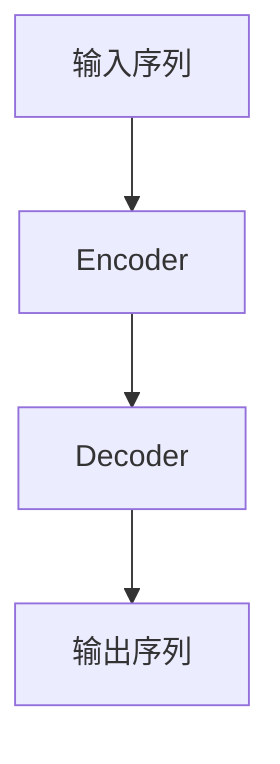

# Transformer架构剖析

## 1. 背景介绍

在自然语言处理和机器学习领域,Transformer模型是一种革命性的架构,它彻底改变了序列数据(如文本、语音等)的处理方式。传统的序列模型如RNN(Recurrent Neural Network,循环神经网络)和LSTM(Long Short-Term Memory,长短期记忆网络)存在一些固有的缺陷,例如难以并行化计算、梯度消失/爆炸问题等,这限制了它们在处理长序列数据时的性能。

2017年,Transformer被提出,它完全摒弃了RNN/LSTM的结构,采用了全新的自注意力(Self-Attention)机制,可以高效地捕捉序列中任意两个位置之间的依赖关系。Transformer模型在机器翻译、文本生成、语音识别等任务上取得了卓越的成绩,成为NLP领域的主流模型。随后,Transformer架构也被成功应用于计算机视觉、推荐系统等其他领域。

## 2. 核心概念与联系

### 2.1 Transformer的整体架构

Transformer由编码器(Encoder)和解码器(Decoder)两个主要部分组成,如下图所示:



编码器的作用是将输入序列(如源语言句子)映射为一系列连续的向量表示,解码器则根据这些向量表示生成输出序列(如目标语言句子)。

### 2.2 自注意力机制(Self-Attention)

自注意力机制是Transformer的核心,它能够捕捉序列中任意两个位置之间的依赖关系,解决了RNN/LSTM难以并行化的问题。自注意力的计算过程如下:

1. 将输入序列的每个位置映射为查询(Query)、键(Key)和值(Value)向量。
2. 计算查询与所有键的相似性得分(注意力分数)。
3. 将注意力分数与值向量相乘,得到该位置的注意力表示。
4. 对所有注意力表示求和,得到该位置的最终表示。

通过自注意力,每个位置的表示都融合了整个序列的信息,从而捕捉到长程依赖关系。

### 2.3 多头注意力机制(Multi-Head Attention)

多头注意力是在单一注意力机制的基础上,将注意力分成多个"头"(Head),每个头对应一种不同的注意力表示。多头注意力的计算过程如下:

1. 将查询、键和值分别线性映射为多组向量。
2. 对每组向量分别计算注意力。
3. 将所有头的注意力表示拼接起来。

多头注意力可以从不同的子空间捕捉序列的不同特征,提高了模型的表达能力。

### 2.4 位置编码(Positional Encoding)

由于Transformer没有循环或卷积结构,无法直接捕捉序列的位置信息。因此,需要在输入序列中加入位置编码,以显式地提供位置信息。常用的位置编码方法是使用正弦/余弦函数,它对模型的位置编码是可学习的。

### 2.5 层归一化(Layer Normalization)和残差连接(Residual Connection)

为了加速训练收敛并提高模型性能,Transformer采用了层归一化和残差连接技术。层归一化对每一层的输入进行归一化处理,可以加速训练收敛;残差连接则将上一层的输出与当前层的输出相加,有助于梯度传播和模型优化。

## 3. 核心算法原理具体操作步骤

### 3.1 编码器(Encoder)

编码器由多个相同的层组成,每一层包含两个子层:多头自注意力层和前馈全连接层。

1. **多头自注意力层**

   - 将输入序列的每个位置映射为查询(Q)、键(K)和值(V)向量。
   - 计算查询与所有键的相似性得分(注意力分数):

     $$\text{Attention}(Q, K, V) = \text{softmax}\left(\frac{QK^T}{\sqrt{d_k}}\right)V$$

     其中,$ \sqrt{d_k} $是缩放因子,用于防止内积过大导致梯度饱和。

   - 将注意力分数与值向量相乘,得到该位置的注意力表示。
   - 对所有注意力表示求和,得到该位置的最终表示。
   - 执行残差连接和层归一化。

2. **前馈全连接层**

   - 对上一层的输出执行两次全连接操作,中间加入ReLU激活函数:

     $$\text{FFN}(x) = \max(0, xW_1 + b_1)W_2 + b_2$$

   - 执行残差连接和层归一化。

编码器的输出是一系列编码向量,表示输入序列的语义信息。

### 3.2 解码器(Decoder)

解码器的结构与编码器类似,也由多个相同的层组成,每一层包含三个子层:

1. **屏蔽多头自注意力层**

   - 与编码器的多头自注意力层类似,但需要防止注意力计算时利用了当前位置之后的信息(在自回归生成任务中,这是不允许的)。
   - 使用一个掩码矩阵,将注意力分数中对应未来位置的值设置为负无穷,从而在softmax时将其置为0。

2. **多头编码器-解码器注意力层**

   - 计算查询(来自解码器的输出)与编码器输出的键和值之间的注意力,从而融合编码器的信息。

3. **前馈全连接层**

   - 与编码器中的前馈全连接层相同。

解码器的输出是一系列解码向量,用于生成最终的输出序列。

## 4. 数学模型和公式详细讲解举例说明

### 4.1 注意力计算

注意力机制是Transformer的核心,它能够捕捉序列中任意两个位置之间的依赖关系。注意力计算的数学表达式如下:

$$\text{Attention}(Q, K, V) = \text{softmax}\left(\frac{QK^T}{\sqrt{d_k}}\right)V$$

其中:

- $Q$是查询向量的集合,表示要计算注意力的位置。
- $K$是键向量的集合,表示要与查询向量计算相似性的位置。
- $V$是值向量的集合,表示要获取注意力表示的位置。
- $d_k$是缩放因子,用于防止内积过大导致梯度饱和。

具体来说,注意力计算分为以下几个步骤:

1. 计算查询$Q$与所有键$K$的相似性得分(注意力分数):

   $$\text{score}(q_i, k_j) = \frac{q_i \cdot k_j}{\sqrt{d_k}}$$

   其中,$q_i$和$k_j$分别表示第$i$个查询向量和第$j$个键向量。

2. 对注意力分数执行softmax操作,得到归一化的注意力权重:

   $$\alpha_{ij} = \text{softmax}(\text{score}(q_i, k_j)) = \frac{\exp(\text{score}(q_i, k_j))}{\sum_{l=1}^n \exp(\text{score}(q_i, k_l))}$$

3. 将注意力权重与值向量$V$相乘,得到该位置的注意力表示:

   $$\text{attn}(q_i) = \sum_{j=1}^n \alpha_{ij} v_j$$

4. 对所有注意力表示求和,得到该位置的最终表示。

通过注意力机制,每个位置的表示都融合了整个序列的信息,从而捕捉到长程依赖关系。

### 4.2 多头注意力

多头注意力是在单一注意力机制的基础上,将注意力分成多个"头"(Head),每个头对应一种不同的注意力表示。多头注意力的计算过程如下:

1. 将查询$Q$、键$K$和值$V$分别线性映射为$h$组向量:

   $$\begin{aligned}
   Q^{(1)}, \ldots, Q^{(h)} &= QW_Q^{(1)}, \ldots, QW_Q^{(h)} \\
   K^{(1)}, \ldots, K^{(h)} &= KW_K^{(1)}, \ldots, KW_K^{(h)} \\
   V^{(1)}, \ldots, V^{(h)} &= VW_V^{(1)}, \ldots, VW_V^{(h)}
   \end{aligned}$$

   其中,$W_Q^{(i)}$、$W_K^{(i)}$和$W_V^{(i)}$是可学习的线性映射矩阵。

2. 对每组向量分别计算注意力:

   $$\text{head}_i = \text{Attention}(Q^{(i)}, K^{(i)}, V^{(i)})$$

3. 将所有头的注意力表示拼接起来:

   $$\text{MultiHead}(Q, K, V) = \text{Concat}(\text{head}_1, \ldots, \text{head}_h)W^O$$

   其中,$W^O$是另一个可学习的线性映射矩阵,用于将拼接后的向量映射回原始向量空间。

多头注意力可以从不同的子空间捕捉序列的不同特征,提高了模型的表达能力。

### 4.3 位置编码

由于Transformer没有循环或卷积结构,无法直接捕捉序列的位置信息。因此,需要在输入序列中加入位置编码,以显式地提供位置信息。常用的位置编码方法是使用正弦/余弦函数:

$$\begin{aligned}
\text{PE}_{(pos, 2i)} &= \sin\left(\frac{pos}{10000^{2i/d_\text{model}}}\right) \\
\text{PE}_{(pos, 2i+1)} &= \cos\left(\frac{pos}{10000^{2i/d_\text{model}}}\right)
\end{aligned}$$

其中,$pos$表示位置索引,$i$表示维度索引,$d_\text{model}$是模型的隐藏层大小。

位置编码向量与输入向量相加,即可将位置信息融入模型中。

## 5. 项目实践:代码实例和详细解释说明

以下是一个使用PyTorch实现Transformer编码器的简单示例:

```python
import math
import torch
import torch.nn as nn

class PositionalEncoding(nn.Module):
    def __init__(self, d_model, dropout=0.1, max_len=5000):
        super(PositionalEncoding, self).__init__()
        self.dropout = nn.Dropout(p=dropout)

        pe = torch.zeros(max_len, d_model)
        position = torch.arange(0, max_len, dtype=torch.float).unsqueeze(1)
        div_term = torch.exp(torch.arange(0, d_model, 2).float() * (-math.log(10000.0) / d_model))
        pe[:, 0::2] = torch.sin(position * div_term)
        pe[:, 1::2] = torch.cos(position * div_term)
        pe = pe.unsqueeze(0)
        self.register_buffer('pe', pe)

    def forward(self, x):
        x = x + self.pe[:, :x.size(1)]
        return self.dropout(x)

class MultiHeadAttention(nn.Module):
    def __init__(self, d_model, num_heads):
        super(MultiHeadAttention, self).__init__()
        self.num_heads = num_heads
        self.d_model = d_model

        self.W_q = nn.Linear(d_model, d_model)
        self.W_k = nn.Linear(d_model, d_model)
        self.W_v = nn.Linear(d_model, d_model)
        self.W_o = nn.Linear(d_model, d_model)

    def forward(self, q, k, v, mask=None):
        batch_size = q.size(0)

        q = self.W_q(q).view(batch_size, -1, self.num_heads, self.d_model // self.num_heads).transpose(1, 2)
        k = self.W_k(k).view(batch_size, -1, self.num_heads, self.d_model // self.num_heads).transpose(1, 2)
        v = self.W_v(v).view(batch_size, -1, self.num_heads, self.d_model // self.num_heads).transpose(1, 2)

        attn_scores = torch.matmul(q, k.transpose(-2, -1)) / math.sqrt(self.d_model // self.num_heads)
        if mask is not None:
            attn_scores = attn_scores.masked_fill(mask == 0, -1e9)
        attn_probs = nn.Softmax(dim=-1)(attn_scores)
        attn_output = torch.matmul(attn_probs, v).transpose(1, 2).contiguous().view(batch_size, -1, self.d_model)

        attn_output = self.W_o(attn_