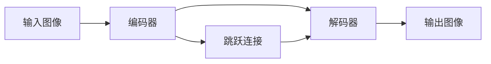

## 1.背景介绍

UNet是一个广泛应用于图像分割（尤其是医学图像分割）的深度学习模型。它的网络结构由两部分组成：编码器（Encoder）和解码器（Decoder），形成了一个“U”形的结构，因此被称为UNet。然而，对于初学者来说，理解UNet的工作原理并不容易。本文将通过可视化的方式，深入探讨UNet的内部运作机制，以及如何进行图像分割。

## 2.核心概念与联系

UNet的核心概念包括编码器、解码器、跳跃连接（skip connection）等。编码器部分主要负责提取图像的特征，解码器部分则负责将这些特征映射回原始图像空间，进行像素级别的预测。跳跃连接则是UNet的一个重要特性，它可以将编码器和解码器之间的对应层进行连接，使得深层的特征可以直接传递到浅层，从而保留更多的细节信息。



## 3.核心算法原理具体操作步骤

UNet的工作流程可以分为以下几个步骤：

1. 输入图像首先经过编码器的处理，通过一系列的卷积操作，提取出图像的高级特征。在这个过程中，图像的尺寸会逐渐缩小，而特征的深度会逐渐增大。
2. 编码器的输出接着被送入解码器。解码器通过上采样操作，将特征图的尺寸逐渐放大，同时深度逐渐减小。
3. 在解码器的每一层，都会有一个跳跃连接，将编码器的对应层的特征图连接过来。这些特征图经过一个卷积操作后，与解码器的特征图进行融合。
4. 最后，解码器的输出经过一个1x1的卷积操作，得到最终的分割结果。

## 4.数学模型和公式详细讲解举例说明

UNet的数学模型主要涉及到卷积操作和上采样操作。

卷积操作的数学公式可以表示为：

$$
Y = X * W + b
$$

其中$X$是输入特征图，$W$是卷积核，$b$是偏置项，$*$表示卷积操作，$Y$是输出特征图。

上采样操作的数学公式可以表示为：

$$
Y = U(X)
$$

其中$U$表示上采样函数，$X$是输入特征图，$Y$是输出特征图。

## 5.项目实践：代码实例和详细解释说明

以下是一个简单的UNet模型的PyTorch实现：

```python
import torch
import torch.nn as nn

class UNet(nn.Module):
    def __init__(self):
        super(UNet, self).__init__()
        # 编码器部分
        self.encoder = nn.Sequential(
            nn.Conv2d(1, 64, kernel_size=3, padding=1),
            nn.ReLU(),
            nn.MaxPool2d(kernel_size=2, stride=2)
        )
        # 解码器部分
        self.decoder = nn.Sequential(
            nn.ConvTranspose2d(64, 1, kernel_size=2, stride=2),
            nn.Sigmoid()
        )

    def forward(self, x):
        x = self.encoder(x)
        x = self.decoder(x)
        return x
```

## 6.实际应用场景

UNet在图像分割领域有广泛的应用，特别是在医学图像分割任务中。例如，可以用UNet来进行肿瘤的分割，帮助医生准确地定位肿瘤的位置和大小；也可以用UNet来进行肺部的分割，帮助诊断肺炎等疾病。

## 7.工具和资源推荐

推荐使用PyTorch或TensorFlow等深度学习框架来实现UNet。这些框架提供了丰富的API，可以方便地搭建和训练UNet模型。另外，推荐使用Visdom或TensorBoard等可视化工具，来观察模型的训练过程和结果。

## 8.总结：未来发展趋势与挑战

随着深度学习技术的发展，UNet的结构和算法也在不断优化和改进。例如，引入注意力机制，使模型能够更好地关注重要的特征；引入深度可分离卷积，减少模型的计算量和参数量。然而，如何设计更有效的网络结构，如何处理不平衡的数据，如何提高模型的鲁棒性等问题，仍是未来的挑战。

## 9.附录：常见问题与解答

1. **问：UNet适用于哪些任务？**
答：UNet主要适用于图像分割任务，尤其是医学图像分割任务。

2. **问：UNet的主要特点是什么？**
答：UNet的主要特点是其“U”形的结构，以及跳跃连接。

3. **问：如何理解跳跃连接？**
答：跳跃连接是UNet的一个重要特性，它可以将编码器和解码器之间的对应层进行连接，使得深层的特征可以直接传递到浅层，从而保留更多的细节信息。

作者：禅与计算机程序设计艺术 / Zen and the Art of Computer Programming