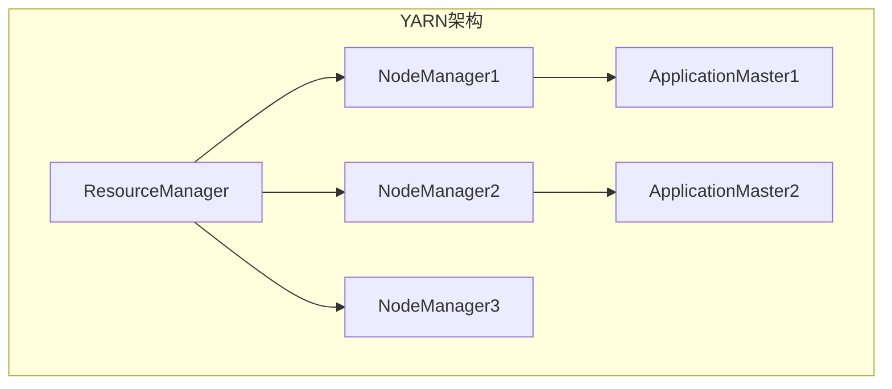
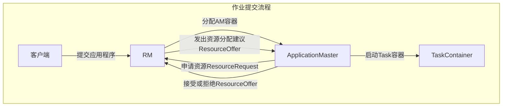

# YARN Resource Manager原理与代码实例讲解

## 1. 背景介绍

### 1.1 大数据时代的到来

随着互联网、移动互联网和物联网的快速发展,数据呈现出爆炸式增长趋势,传统的数据处理方式已经无法满足现代大数据应用的需求。大数据时代的到来,对数据存储、计算和处理能力提出了更高的要求,促进了分布式计算框架的兴起和发展。

### 1.2 Hadoop生态系统

Apache Hadoop是一个可靠、可扩展、分布式的计算平台,被广泛应用于大数据处理领域。Hadoop生态系统包括了多个核心组件,如HDFS、MapReduce、YARN等,为大数据存储、计算和资源管理提供了强有力的支持。

### 1.3 YARN的作用

YARN(Yet Another Resource Negotiator)是Hadoop的资源管理和作业调度组件,负责集群资源的统一管理和调度。它将资源管理和作业监控与计算框架解耦,使得Hadoop可以支持多种计算框架,如MapReduce、Spark、Flink等,极大地提高了集群资源利用率和系统吞吐量。

## 2. 核心概念与联系

### 2.1 YARN架构

YARN采用主从架构,由一个ResourceManager(RM)、多个NodeManager(NM)和ApplicationMaster(AM)组成。



- ResourceManager(RM)是整个YARN系统的核心,负责集群资源的统一管理和调度。
- NodeManager(NM)运行在集群的每个节点上,负责管理本节点上的资源和运行容器。
- ApplicationMaster(AM)负责与RM协商资源,并监控应用程序的执行过程。

### 2.2 核心概念

- Container: YARN中的资源抽象,封装了CPU、内存等多维度资源。
- ApplicationMaster: 每个应用程序在YARN中都有一个AM实例,负责向RM申请资源并监控应用执行。
- ResourceRequest: AM向RM申请资源的请求。
- ResourceOffer: RM根据资源情况向AM发出的资源分配建议。

## 3. 核心算法原理具体操作步骤

### 3.1 作业提交流程

1. 客户端向YARN提交应用程序。
2. RM为该应用程序分配一个AM容器。
3. AM启动后向RM申请资源(ResourceRequest)。
4. RM根据集群资源情况向AM发出资源分配建议(ResourceOffer)。
5. AM接受或拒绝ResourceOffer,并启动相应的Task容器。



### 3.2 资源调度算法

RM采用各种调度算法来合理分配资源,常用的调度算法包括:

1. **FIFO调度器**: 先来先服务,按照应用程序提交的顺序分配资源。
2. **容量调度器(Capacity Scheduler)**: 根据队列配置的资源容量比例分配资源。
3. **公平调度器(Fair Scheduler)**: 根据应用程序运行时间的公平性来分配资源。

### 3.3 容器重用

为提高资源利用率,YARN支持容器重用机制。当一个容器运行完任务后,AM可以在该容器中启动新的任务,而不需要申请新的容器。这种机制可以减少容器启动和销毁的开销,提高系统吞吐量。

## 4. 数学模型和公式详细讲解举例说明

### 4.1 资源模型

YARN采用多维度资源模型,每个容器由多种资源类型组成,如CPU、内存等。容器资源可表示为向量:

$$
\vec{r} = (r_1, r_2, \dots, r_n)
$$

其中$r_i$表示第i种资源的数量。

集群总资源向量为:

$$
\vec{R} = \sum_{i=1}^{m} \vec{r_i}
$$

其中$m$为集群节点数。

### 4.2 资源需求模型

应用程序对资源的需求可表示为:

$$
\vec{q} = (q_1, q_2, \dots, q_n)
$$

其中$q_i$表示对第i种资源的需求量。

### 4.3 资源分配模型

RM需要在满足应用程序资源需求的前提下,最大化集群资源利用率。可将其建模为约束优化问题:

$$
\begin{aligned}
\max \quad & \sum_{j=1}^{k} \vec{r_j} \cdot \vec{x_j} \\
\text{s.t.} \quad & \sum_{j=1}^{k} \vec{q_j} \cdot \vec{x_j} \leq \vec{R} \\
& \vec{x_j} \in \{0, 1\}^n, \quad j = 1, 2, \dots, k
\end{aligned}
$$

其中$k$为应用程序数量,$\vec{x_j}$为应用程序$j$的资源分配向量,取值为0或1。目标函数为集群资源利用率,约束条件为应用程序资源需求不超过集群总资源。

## 5. 项目实践: 代码实例和详细解释说明

以下是一个简单的YARN应用程序示例,使用Java语言编写。

### 5.1 ApplicationMaster代码

```java
public class MyAM extends ApplicationMaster {
    public static void main(String[] args) {
        // 初始化AM
        MyAM am = new MyAM();
        am.run();
    }

    private void run() {
        // 向RM申请资源
        Resource capability = Resource.newInstance(1024, 1);
        for (int i = 0; i < 5; i++) {
            amClient.addContainerRequest(new ContainerRequest(capability, null, null, RM_REQUEST_PRIORITY));
        }

        // 接收RM分配的容器
        while (numCompletedContainers < 5) {
            ContainerStatus containerStatus = amClient.getContainerStatusAsync().dequeue();
            if (containerStatus.getExitStatus() == 0) {
                numCompletedContainers++;
            }
        }

        // 完成应用程序
        amClient.unregisterApplicationMaster(FinalApplicationStatus.SUCCEEDED, "", "");
    }
}
```

1. 初始化AM实例。
2. 向RM申请5个容器,每个容器需求为1GB内存和1个vCPU。
3. 循环接收RM分配的容器,直到所有容器运行完成。
4. 注销AM,应用程序执行完毕。

### 5.2 容器代码

```java
public class MyContainer extends Container {
    public static void main(String[] args) {
        // 执行任务逻辑
        System.out.println("Container is running!");
        // ...
        
        // 退出容器
        System.exit(0);
    }
}
```

1. 容器执行任务逻辑。
2. 任务完成后,容器正常退出。

通过这个示例,我们可以看到YARN应用程序的基本结构和运行流程。AM负责向RM申请资源,RM分配容器给AM,AM在容器中启动任务执行。

## 6. 实际应用场景

YARN作为Apache Hadoop的资源管理和作业调度组件,在大数据领域有着广泛的应用。以下是一些典型的应用场景:

1. **大数据处理**: YARN支持在同一个集群上运行多种计算框架,如MapReduce、Spark、Flink等,可用于大规模数据处理任务。
2. **机器学习**: 利用YARN调度和管理机器学习任务,如深度学习训练、模型部署等。
3. **流处理**: 使用YARN管理和调度流处理应用,如Spark Streaming、Flink等。
4. **数据湖**: YARN可以管理和调度数据湖相关的任务,如ETL、数据分析等。
5. **物联网**: 在物联网场景下,YARN可用于管理和调度边缘计算任务。

## 7. 工具和资源推荐

1. **Apache Hadoop官网**: https://hadoop.apache.org/
2. **YARN官方文档**: https://hadoop.apache.org/docs/current/hadoop-yarn/hadoop-yarn-site/YARN.html
3. **YARN调度器源码**: https://github.com/apache/hadoop/tree/trunk/hadoop-yarn-project/hadoop-yarn/hadoop-yarn-server/hadoop-yarn-server-resourcemanager
4. **YARN资源模型教程**: https://www.cloudera.com/tutorials/yarn-resource-management.html
5. **YARN调试工具**: Apache Hadoop提供了一些调试工具,如yarn logs、yarn top等。

## 8. 总结: 未来发展趋势与挑战

### 8.1 未来发展趋势

1. **云原生支持**: 将YARN与Kubernetes等云原生技术进一步整合,支持在云环境中更好地管理和调度资源。
2. **AI加速**: 利用YARN管理和调度AI加速硬件(如GPU、TPU等),提高AI训练和推理的性能。
3. **边缘计算**: 将YARN扩展到边缘计算场景,支持在边缘节点上调度和管理任务。
4. **安全性和隔离性增强**: 提高YARN的安全性和容器隔离性,确保多租户环境下的资源隔离和安全性。

### 8.2 挑战

1. **资源异构性**: 随着计算资源类型的增加(如GPU、FPGA等),如何在YARN中统一管理和调度异构资源是一个挑战。
2. **资源过度使用**: 在多租户环境下,如何防止资源过度使用和相互影响是一个需要解决的问题。
3. **调度算法优化**: 现有的调度算法可能无法满足未来复杂场景的需求,需要持续优化和创新。
4. **可扩展性**: 随着集群规模和任务数量的增加,YARN需要保持良好的可扩展性和高吞吐量。

## 9. 附录: 常见问题与解答

1. **Q: YARN和MapReduce的关系是什么?**
   A: YARN是Hadoop的资源管理和作业调度组件,而MapReduce是一种编程模型和计算框架。YARN可以支持多种计算框架,包括MapReduce。

2. **Q: 如何监控YARN应用程序的运行状态?**
   A: YARN提供了多种监控工具,如YARN Web UI、yarn top、yarn logs等,可以查看应用程序的运行状态、资源使用情况等。

3. **Q: 如何配置YARN队列和资源分配策略?**
   A: YARN支持多种调度器,如Capacity Scheduler和Fair Scheduler。可以通过配置文件设置队列、资源分配比例等策略。

4. **Q: YARN如何实现容器资源隔离?**
   A: YARN利用操作系统的Cgroups和namespace等技术,实现对CPU、内存等资源的限制和隔离。

5. **Q: YARN是否支持GPU等加速硬件?**
   A: YARN支持GPU等加速硬件,可以通过插件的方式管理和调度这些资源。

作者: 禅与计算机程序设计艺术 / Zen and the Art of Computer Programming