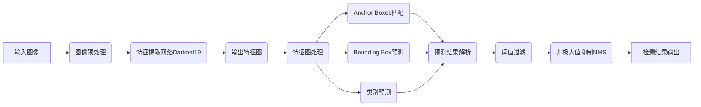

# YOLOv2原理与代码实例讲解

## 1. 背景介绍
### 1.1 目标检测的发展历程
#### 1.1.1 传统目标检测方法
#### 1.1.2 基于深度学习的目标检测方法
#### 1.1.3 YOLO系列算法的演进
### 1.2 YOLOv2的诞生
#### 1.2.1 YOLOv1的局限性
#### 1.2.2 YOLOv2的改进与创新
### 1.3 YOLOv2的应用领域
#### 1.3.1 自动驾驶
#### 1.3.2 智能监控
#### 1.3.3 人机交互

## 2. 核心概念与联系
### 2.1 Anchor Boxes
#### 2.1.1 Anchor Boxes的定义
#### 2.1.2 Anchor Boxes的作用
#### 2.1.3 Anchor Boxes的生成方法
### 2.2 Bounding Box Prediction
#### 2.2.1 Bounding Box的表示方法
#### 2.2.2 Bounding Box的预测过程
#### 2.2.3 Bounding Box的置信度计算
### 2.3 类别预测
#### 2.3.1 多类别分类问题
#### 2.3.2 Softmax函数
#### 2.3.3 类别置信度计算
### 2.4 损失函数
#### 2.4.1 定位损失
#### 2.4.2 分类损失 
#### 2.4.3 置信度损失

## 3. 核心算法原理具体操作步骤
### 3.1 输入图像预处理
#### 3.1.1 图像缩放
#### 3.1.2 图像归一化
#### 3.1.3 图像增强
### 3.2 特征提取网络
#### 3.2.1 Darknet-19网络结构
#### 3.2.2 Pass Through层
#### 3.2.3 Fine-Grained Features
### 3.3 输出特征图处理
#### 3.3.1 特征图划分网格
#### 3.3.2 Anchor Boxes匹配
#### 3.3.3 Bounding Box坐标转换
### 3.4 预测结果解析
#### 3.4.1 阈值过滤
#### 3.4.2 非极大值抑制(NMS)
#### 3.4.3 绘制检测结果

## 4. 数学模型和公式详细讲解举例说明
### 4.1 Intersection over Union (IoU) 
#### 4.1.1 IoU的定义
#### 4.1.2 IoU的计算公式
#### 4.1.3 IoU的作用
### 4.2 Bounding Box回归
#### 4.2.1 中心坐标回归
$t_x = (x-x_a)/w_a, t_y = (y-y_a)/h_a$
#### 4.2.2 宽高回归
$t_w = log(w/w_a), t_h = log(h/h_a)$  
#### 4.2.3 回归参数解释
### 4.3 Softmax分类器
#### 4.3.1 Softmax函数定义
$$\sigma(z)_j = \frac{e^{z_j}}{\sum_{k=1}^K e^{z_k}} \text{ for } j = 1, ..., K$$
#### 4.3.2 Softmax函数特性
#### 4.3.3 Softmax在分类中的应用
### 4.4 损失函数设计
#### 4.4.1 定位损失
$$\lambda_{coord} \sum_{i=0}^{S^2} \sum_{j=0}^B \mathbb{1}_{ij}^{obj} [(x_i-\hat{x}_i)^2 + (y_i-\hat{y}_i)^2 + (w_i-\hat{w}_i)^2 + (h_i-\hat{h}_i)^2]$$
#### 4.4.2 分类损失
$$\sum_{i=0}^{S^2} \mathbb{1}_{i}^{obj} \sum_{c \in classes} (p_i(c) - \hat{p}_i(c))^2$$
#### 4.4.3 置信度损失
$$\sum_{i=0}^{S^2} \sum_{j=0}^B \mathbb{1}_{ij}^{obj} (C_i - \hat{C}_i)^2 + \lambda_{noobj} \sum_{i=0}^{S^2} \sum_{j=0}^B \mathbb{1}_{ij}^{noobj} (C_i - \hat{C}_i)^2$$

## 5. 项目实践：代码实例和详细解释说明
### 5.1 环境配置
#### 5.1.1 安装深度学习框架(如PyTorch)
#### 5.1.2 下载预训练模型权重
#### 5.1.3 准备数据集
### 5.2 数据预处理
#### 5.2.1 图像读取与缩放
```python
img = cv2.imread("image.jpg")
img = cv2.resize(img, (416, 416)) 
img = img[:,:,::-1].transpose((2,0,1)) / 255.0
```
#### 5.2.2 标签格式转换
#### 5.2.3 数据增强
### 5.3 模型定义
#### 5.3.1 Darknet-19特征提取网络
```python
class Darknet19(nn.Module):
def __init__(self):
super().__init__()
self.conv1 = self._make_layers([32, 64], 3)
self.mp1 = nn.MaxPool2d(2, 2)
self.conv2 = self._make_layers([128, 64, 128], 3)
self.mp2 = nn.MaxPool2d(2, 2)
self.conv3 = self._make_layers([256, 128, 256], 3)
self.mp3 = nn.MaxPool2d(2, 2)
self.conv4 = self._make_layers([512, 256, 512, 256, 512], 3)
self.mp4 = nn.MaxPool2d(2, 2)
self.conv5 = self._make_layers([1024, 512, 1024, 512, 1024], 3)
```
#### 5.3.2 YOLOv2检测头
```python
class YOLOv2(nn.Module):
def __init__(self, num_classes=80, anchors=None):
super().__init__()
self.num_classes = num_classes
self.anchors = anchors
self.darknet = Darknet19()
self.conv = self._make_layers([1024, 1024], 3)
self.linear = nn.Linear(1024 * 13 * 13, 5 * (5 + num_classes))
```
### 5.4 模型训练
#### 5.4.1 定义数据加载器
#### 5.4.2 定义优化器和学习率调度器
#### 5.4.3 迭代训练
```python
for epoch in range(num_epochs):
for images, targets in dataloader:
images = images.to(device)
targets = targets.to(device)
 
pred = model(images)
loss = criterion(pred, targets)

optimizer.zero_grad()  
loss.backward()
optimizer.step()
```
### 5.5 模型测试与评估
#### 5.5.1 加载训练好的权重
#### 5.5.2 对测试集进行预测
#### 5.5.3 计算mAP等评估指标
### 5.6 模型部署与应用
#### 5.6.1 模型转换与优化
#### 5.6.2 模型集成到应用系统
#### 5.6.3 实时检测效果演示

## 6. 实际应用场景
### 6.1 智能交通
#### 6.1.1 车辆检测与跟踪
#### 6.1.2 交通标志识别
#### 6.1.3 行人检测
### 6.2 智慧零售
#### 6.2.1 商品识别与定位
#### 6.2.2 货架缺货检测
#### 6.2.3 顾客行为分析  
### 6.3 安防监控
#### 6.3.1 异常行为检测
#### 6.3.2 人群密度估计
#### 6.3.3 特定目标跟踪
### 6.4 无人机视觉
#### 6.4.1 障碍物检测与规避
#### 6.4.2 场景理解与建模
#### 6.4.3 目标跟踪与定位

## 7. 工具和资源推荐
### 7.1 数据集
#### 7.1.1 COCO数据集
#### 7.1.2 PASCAL VOC数据集
#### 7.1.3 自定义数据集标注工具
### 7.2 开发框架
#### 7.2.1 Darknet框架
#### 7.2.2 PyTorch
#### 7.2.3 TensorFlow
### 7.3 预训练模型
#### 7.3.1 官方提供的预训练权重
#### 7.3.2 在特定数据集上微调的模型
### 7.4 博客与教程
#### 7.4.1 YOLO官方博客
#### 7.4.2 深度学习目标检测综述
#### 7.4.3 YOLOv2代码解析

## 8. 总结：未来发展趋势与挑战
### 8.1 YOLO算法的改进方向 
#### 8.1.1 模型结构的优化
#### 8.1.2 训练策略的改进
#### 8.1.3 新型损失函数的设计
### 8.2 目标检测领域的发展趋势
#### 8.2.1 多尺度特征融合
#### 8.2.2 Anchor-Free方法
#### 8.2.3 半监督与无监督学习
### 8.3 面临的挑战
#### 8.3.1 小目标检测
#### 8.3.2 旋转目标检测
#### 8.3.3 域适应与泛化能力
### 8.4 YOLO算法的拓展应用
#### 8.4.1 3D目标检测
#### 8.4.2 实例分割
#### 8.4.3 目标跟踪

## 9. 附录：常见问题与解答
### 9.1 如何选择合适的Anchor Boxes尺寸？
### 9.2 YOLOv2与YOLOv3有何区别？
### 9.3 如何平衡检测速度与精度？
### 9.4 数据增强对检测性能的影响？
### 9.5 如何处理类别不平衡问题？
### 9.6 为什么要使用NMS？
### 9.7 如何进行模型剪枝与量化？
### 9.8 目标检测评估指标mAP的计算方法？
### 9.9 如何进行模型蒸馏？
### 9.10 YOLOv2可以应用于哪些领域？



以上是YOLOv2目标检测算法的原理介绍与代码实践。YOLOv2通过引入Anchor Boxes、改进特征提取网络、使用多尺度训练等方法，在保持实时性的同时大幅提升了检测精度。基于PyTorch的YOLOv2项目实践展示了如何训练自己的数据集，以及如何将模型部署到实际应用中。

YOLOv2是一个里程碑式的工作，为后续的YOLO系列算法奠定了基础。随着目标检测技术的不断发展，YOLO算法也在不断改进和演进。未来的研究方向包括如何进一步提高小目标检测能力、如何实现旋转目标检测、如何提升模型的泛化能力等。此外，YOLO算法也在不断拓展其应用领域，如3D检测、实例分割、多目标跟踪等。

相信通过本文的讲解，读者能够对YOLOv2的原理和实现有一个全面的了解，并为进一步学习和应用目标检测算法打下良好的基础。让我们共同期待目标检测技术的未来发展，一起为构建更加智能的计算机视觉系统而努力。

作者：禅与计算机程序设计艺术 / Zen and the Art of Computer Programming