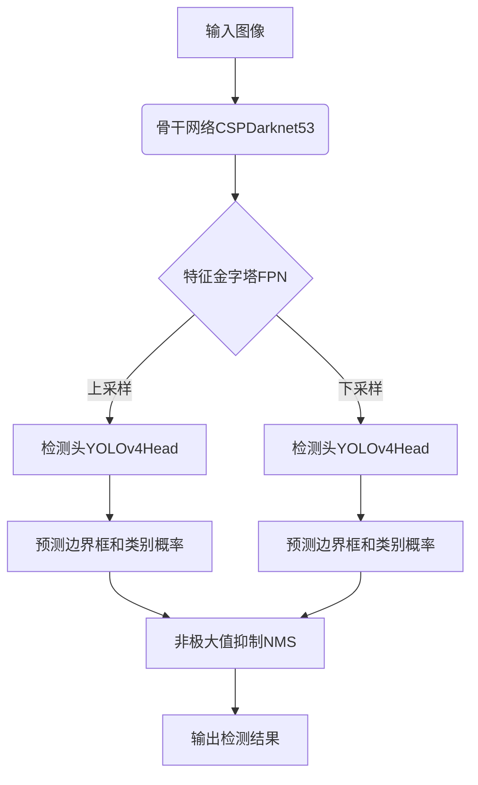
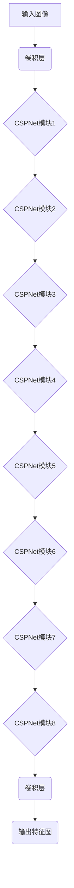
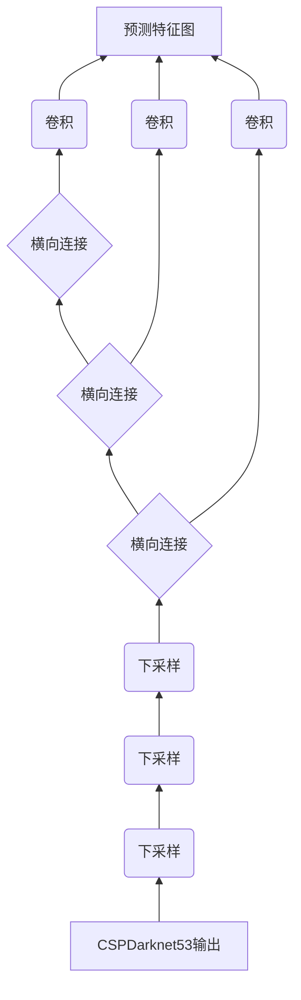

# YOLOv4原理与代码实例讲解

## 1.背景介绍

在计算机视觉领域中,目标检测是一项基础且重要的任务,它旨在从图像或视频中定位目标并识别其类别。传统的目标检测算法通常采用滑动窗口或区域候选框的方式生成建议框,再利用分类器对建议框进行分类。这种方法虽然可以获得较高的检测精度,但由于需要生成大量的建议框并逐一评估,因此计算效率较低。

为了解决这一问题,Joseph Redmon等人于2016年提出了YOLO(You Only Look Once)目标检测算法。YOLO将目标检测任务转化为回归问题,直接从图像像素数据预测目标边界框和类别概率,无需生成建议框,因此具有极高的计算效率。自问世以来,YOLO系列算法凭借其优异的速度和精度,在多个目标检测挑战赛中表现出色,受到了学术界和工业界的广泛关注。

2020年4月23日,Alexey Bochkovskiy等人在arXiv上发布了YOLOv4论文,介绍了YOLOv4目标检测算法的最新进展。YOLOv4在YOLOv3的基础上进行了多方面的改进和优化,在提高检测精度的同时也保持了较快的推理速度,被公认为目前最先进的实时目标检测系统之一。

## 2.核心概念与联系

### 2.1 YOLO系列算法

YOLO是一种基于深度学习的目标检测算法,主要包括以下几个版本:

- **YOLOv1**(2016年)是YOLO算法的首个版本,将目标检测任务转化为端到端的回归问题,无需生成建议框,大大提高了检测速度。
- **YOLOv2**(2017年)在YOLOv1的基础上引入了批量归一化、高分辨率分类器等技术,显著提升了检测精度。
- **YOLOv3**(2018年)采用了更深的骨干网络、更强的分类器等,进一步提高了检测性能。
- **YOLOv4**(2020年)是目前YOLO系列中表现最优秀的版本,融合了多种先进技术,在保持高速度的同时极大地提升了检测精度。

### 2.2 YOLOv4算法流程

YOLOv4的整体算法流程如下所示:

该流程主要包括以下几个核心步骤:

1. **骨干网络提取特征**:使用CSPDarknet53作为主干网络从输入图像中提取特征图。
2. **特征金字塔FPN**:通过FPN模块融合不同层次的特征,构建特征金字塔。
3. **检测头YOLOv4Head**:在不同尺度的特征图上应用YOLOv4检测头,预测边界框和类别概率。
4. **非极大值抑制NMS**:对检测结果进行非极大值抑制,消除重复的检测框。
5. **输出检测结果**:输出最终的目标检测结果,包括目标类别和位置。

## 3.核心算法原理具体操作步骤  

### 3.1 骨干网络CSPDarknet53

YOLOv4采用了CSPDarknet53作为主干网络,用于从输入图像中提取特征。CSPDarknet53是在Darknet53的基础上,引入了CSPNet(Cross Stage Partial Network)模块,进一步提高了网络的学习能力和计算效率。

CSPNet模块的核心思想是在网络的残差块中引入了一种新的残差结构,将特征图分为两个部分,其中一部分直接通过跨层连接传递到后续层,另一部分则通过一系列卷积层进行特征提取。最后将两个部分的特征图在通道维度上拼接,作为该层的输出。这种设计可以显著降低内存占用和计算量,同时也有助于提升模型的学习能力。

CSPDarknet53的具体结构如下所示:

在CSPDarknet53中,共有8个CSPNet模块,每个模块由一个基础模块和多个残差模块组成。基础模块负责将输入特征图分为两个部分,而残差模块则对其中一个部分进行特征提取。最终,两个部分的特征图在通道维度上拼接,作为该CSPNet模块的输出。

通过这种设计,CSPDarknet53不仅能够有效地提取图像特征,而且还具有较高的计算效率和较低的内存占用,非常适合于实时目标检测任务。

### 3.2 特征金字塔FPN

在目标检测任务中,我们需要同时检测不同尺度的目标。为了实现这一点,YOLOv4采用了FPN(Feature Pyramid Network)模块,构建了一个多尺度特征金字塔。

FPN模块的核心思想是利用自上而下的横向连接,将高层次的语义特征与低层次的位置特征进行融合,从而获得具有丰富语义信息和精确位置信息的多尺度特征图。具体来说,FPN模块包括以下几个步骤:

1. **自上而下构建金字塔**:从CSPDarknet53的输出特征图开始,通过逐层下采样和卷积操作,构建一个由多个尺度特征图组成的金字塔。
2. **横向连接**:对于金字塔中的每个尺度特征图,将其与上一层经过上采样后的特征图进行元素wise相加,融合语义信息和位置信息。
3. **预测特征图**:对融合后的特征图进行卷积操作,生成用于目标检测的预测特征图。

FPN模块的结构如下所示:

通过FPN模块,YOLOv4能够获得多尺度的预测特征图,从而同时检测不同大小的目标。这种多尺度特征融合的方式,不仅提高了检测精度,而且也增强了模型的鲁棒性。

### 3.3 检测头YOLOv4Head

在获得多尺度的预测特征图之后,YOLOv4使用了一种新的检测头YOLOv4Head,从这些特征图中预测目标的边界框和类别概率。

YOLOv4Head的核心思想是将每个预测特征图划分为多个网格,每个网格负责预测该区域内的目标。具体来说,对于每个网格,YOLOv4Head会预测以下几个值:

- 边界框坐标(x, y, w, h):表示目标边界框在该网格中的位置和大小。
- 目标置信度(confidence):表示该边界框内是否包含目标的置信度。
- 类别概率(class probabilities):表示该目标属于每个类别的概率。

为了提高检测精度,YOLOv4Head还引入了以下几种技术:

1. **CIoU损失函数**:采用CIoU(Complete IoU)损失函数代替传统的IoU损失函数,能够更好地评估预测框与真实框之间的重合程度。
2. **CmBN**:使用CmBN(Cross-mini-Batch Normalization)代替标准的批归一化,提高了小批量训练时的检测性能。
3. **DropBlock正则化**:引入DropBlock正则化,有效缓解了过拟合问题。
4. **CmBN**:使用CmBN(Cross-mini-Batch Normalization)代替标准的批归一化,提高了小批量训练时的检测性能。
5. **DropBlock正则化**:引入DropBlock正则化,有效缓解了过拟合问题。

通过这些改进,YOLOv4Head能够从预测特征图中精准预测目标的位置、大小和类别,从而实现高精度的目标检测。

### 3.4 非极大值抑制NMS

在获得初步的检测结果之后,YOLOv4还需要进行非极大值抑制(Non-Maximum Suppression, NMS)操作,以消除重复的检测框。

NMS的基本思想是:对于每个目标,保留置信度最高的那个检测框,而抑制其他与之重叠的检测框。具体来说,NMS包括以下几个步骤:

1. 根据置信度对所有检测框进行排序。
2. 选取置信度最高的检测框,将其加入最终输出。
3. 计算其余检测框与当前框的IoU(Intersection over Union)值。
4. 移除IoU值大于阈值的检测框,保留其余框。
5. 重复步骤2-4,直到所有检测框都被处理完毕。

通过NMS操作,YOLOv4能够有效地去除重复的检测框,提高目标检测的精确度。

## 4.数学模型和公式详细讲解举例说明

在YOLOv4中,涉及到了多种数学模型和公式,包括损失函数、归一化方法等。下面将详细讲解其中的几个核心公式。

### 4.1 CIoU损失函数

在目标检测任务中,我们需要评估预测边界框与真实边界框之间的重合程度。传统的IoU(Intersection over Union)损失函数只考虑了两个边界框的重叠区域,但忽略了它们之间的距离和长宽比等几何信息。

为了解决这个问题,YOLOv4引入了CIoU(Complete IoU)损失函数,它不仅考虑了重叠区域,还包含了三个额外的项:长宽比一致性、中心点距离和长宽比差距。CIoU损失函数的计算公式如下:

$$CIoU = IoU - \rho^2(b, b^{gt}) / c^2 - \alpha v$$

其中:

- $IoU$表示传统的IoU值
- $\rho(b, b^{gt})$表示预测框$b$与真实框$b^{gt}$的中心点距离
- $c$是对角线距离,用于归一化中心点距离
- $\alpha$是一个正权重参数
- $v$表示长宽比的一致性,计算公式为:

$$v = \frac{4}{\pi^2} \left( \arctan \frac{w^{gt}}{h^{gt}} - \arctan \frac{w}{h} \right)^2$$

通过引入这些额外的项,CIoU损失函数能够更好地评估预测框与真实框之间的重合程度,从而提高目标检测的精确性。

### 4.2 CmBN

在训练深度神经网络时,批归一化(Batch Normalization, BN)是一种常用的技术,可以加速收敛并提高模型的泛化能力。然而,当批量大小较小时,BN的效果会受到影响。

为了解决这个问题,YOLOv4提出了CmBN(Cross-mini-Batch Normalization)方法。CmBN的核心思想是在每个GPU上计算BN的统计量(均值和方差),然后在所有GPU之间进行同步和平均。具体来说,CmBN的计算过程如下:

1. 在每个GPU上,计算当前小批量的均值$\mu_B$和方差$\sigma_B^2$。
2. 在所有GPU之间,同步$\mu_B$和$\sigma_B^2$,计算整个大批量的均值$\mu$和方差$\sigma^2$:

$$\mu = \frac{1}{N_{GPU}} \sum_{k=1}^{N_{GPU}} \mu_B^k$$

$$\sigma^2 = \frac{