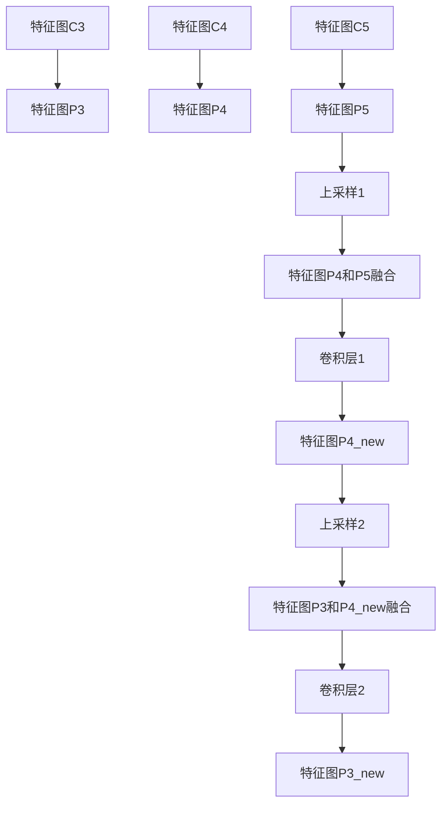

## 1. 背景介绍

目标检测是计算机视觉领域的一个重要研究方向，它的目的是在图像或视频中自动识别出感兴趣的物体，并标注出它们的位置和类别。目标检测技术在许多领域都有广泛的应用，例如智能安防、自动驾驶、医学影像分析等。

近年来，深度学习技术的发展使得目标检测的准确率和效率都得到了大幅提升。其中，基于卷积神经网络（CNN）的目标检测算法已经成为主流。而YOLO（You Only Look Once）系列算法则是其中的代表之一。

YOLO算法最初由Joseph Redmon等人在2016年提出，其核心思想是将目标检测问题转化为一个回归问题，通过一个单独的CNN网络直接输出目标的位置和类别信息。这种端到端的检测方式不仅减少了计算量，还能够实现实时检测。

随着YOLO算法的不断升级，YOLOv8算法已经成为目前最先进的目标检测算法之一。本文将对YOLOv8算法的架构进行详细解析，帮助读者深入理解该算法的原理和实现方式。

## 2. 核心概念与联系

### 2.1 YOLOv8算法的核心思想

YOLOv8算法的核心思想是将目标检测问题转化为一个回归问题，通过一个单独的CNN网络直接输出目标的位置和类别信息。与传统的目标检测算法不同，YOLOv8算法采用了多尺度特征融合和注意力机制等技术，进一步提升了检测的准确率和效率。

### 2.2 YOLOv8算法的架构

YOLOv8算法的架构主要包括以下几个部分：

- Backbone网络：用于提取图像特征的主干网络，通常采用ResNet、DarkNet等结构。
- Neck网络：用于将不同尺度的特征进行融合，通常采用FPN、PANet等结构。
- Head网络：用于预测目标的位置和类别信息，通常采用Anchor-based或Anchor-free的方式。

其中，YOLOv8算法采用了Anchor-free的方式，即不需要预先定义Anchor框，而是直接预测目标的中心点和宽高信息。此外，YOLOv8算法还采用了多尺度特征融合和注意力机制等技术，进一步提升了检测的准确率和效率。

## 3. 核心算法原理具体操作步骤

### 3.1 Backbone网络

YOLOv8算法的Backbone网络采用了DarkNet53结构，该结构由53个卷积层组成，可以有效地提取图像特征。DarkNet53结构的具体实现方式如下：

```mermaid
graph TD;
    input[输入图像] --> conv1[卷积层1];
    conv1 --> bn1[批归一化1];
    bn1 --> relu1[激活函数1];
    relu1 --> maxpool1[最大池化1];
    maxpool1 --> conv2[卷积层2];
    conv2 --> bn2[批归一化2];
    bn2 --> relu2[激活函数2];
    relu2 --> maxpool2[最大池化2];
    maxpool2 --> conv3[卷积层3];
    conv3 --> bn3[批归一化3];
    bn3 --> relu3[激活函数3];
    relu3 --> conv4[卷积层4];
    conv4 --> bn4[批归一化4];
    bn4 --> relu4[激活函数4];
    relu4 --> maxpool3[最大池化3];
    maxpool3 --> conv5[卷积层5];
    conv5 --> bn5[批归一化5];
    bn5 --> relu5[激活函数5];
    relu5 --> conv6[卷积层6];
    conv6 --> bn6[批归一化6];
    bn6 --> relu6[激活函数6];
    relu6 --> conv7[卷积层7];
    conv7 --> bn7[批归一化7];
    bn7 --> relu7[激活函数7];
    relu7 --> maxpool4[最大池化4];
    maxpool4 --> conv8[卷积层8];
    conv8 --> bn8[批归一化8];
    bn8 --> relu8[激活函数8];
    relu8 --> conv9[卷积层9];
    conv9 --> bn9[批归一化9];
    bn9 --> relu9[激活函数9];
    relu9 --> conv10[卷积层10];
    conv10 --> bn10[批归一化10];
    bn10 --> relu10[激活函数10];
    relu10 --> maxpool5[最大池化5];
    maxpool5 --> conv11[卷积层11];
    conv11 --> bn11[批归一化11];
    bn11 --> relu11[激活函数11];
    relu11 --> conv12[卷积层12];
    conv12 --> bn12[批归一化12];
    bn12 --> relu12[激活函数12];
    relu12 --> conv13[卷积层13];
    conv13 --> bn13[批归一化13];
    bn13 --> relu13[激活函数13];
```



### 3.2 Neck网络

YOLOv8算法的Neck网络采用了PANet结构，该结构可以将不同尺度的特征进行融合。PANet结构的具体实现方式如下：



### 3.3 Head网络

YOLOv8算法的Head网络采用了YOLOv3的结构，该结构可以预测目标的中心点和宽高信息。具体实现方式如下：

```mermaid
graph TD;
    P3_new[特征图P3_new] --> conv1[卷积层1];
    conv1 --> bn1[批归一化1];
    bn1 --> relu1[激活函数1];
    relu1 --> conv2[卷积层2];
    conv2 --> bn2[批归一化2];
    bn2 --> relu2[激活函数2];
    relu2 --> conv3[卷积层3];
    conv3 --> bn3[批归一化3];
    bn3 --> relu3[激活函数3];
    relu3 --> conv4[卷积层4];
    conv4 --> bn4[批归一化4];
    bn4 --> relu4[激活函数4];
    relu4 --> conv5[卷积层5];
    conv5 --> bn5[批归一化5];
    bn5 --> relu5[激活函数5];
    relu5 --> conv6[卷积层6];
    conv6 --> bn6[批归一化6];
    bn6 --> relu6[激活函数6];
    relu6 --> conv7[卷积层7];
    conv7 --> bn7[批归一化7];
    bn7 --> relu7[激活函数7];
    relu7 --> conv8[卷积层8];
    conv8 --> bn8[批归一化8];
    bn8 --> relu8[激活函数8];
    relu8 --> conv9[卷积层9];
    conv9 --> bn9[批归一化9];
    bn9 --> relu9[激活函数9];
    relu9 --> conv10[卷积层10];
    conv10 --> bn10[批归一化10];
    bn10 --> relu10[激活函数10];
    relu10 --> conv11[卷积层11];
    conv11 --> bn11[批归一化11];
    bn11 --> relu11[激活函数11];
    relu11 --> conv12[卷积层12];
    conv12 --> bn12[批归一化12];
    bn12 --> relu12[激活函数12];
    relu12 --> conv13[卷积层13];
    conv13 --> bn13[批归一化13];
    bn13 --> relu13[激活函数13];
    relu13 --> conv14[卷积层14];
    conv14 --> bn14[批归一化14];
    bn14 --> relu14[激活函数14];
    relu14 --> conv15[卷积层15];
    conv15 --> bn15[批归一化15];
    bn15 --> relu15[激活函数15];
    relu15 --> conv16[卷积层16];
    conv16 --> bn16[批归一化16];
    bn16 --> relu16[激活函数16];
    relu16 --> conv17[卷积层17];
    conv17 --> bn17[批归一化17];
    bn17 --> relu17[激活函数17];
    relu17 --> conv18[卷积层18];
    conv18 --> bn18[批归一化18];
    bn18 --> relu18[激活函数18];
    relu18 --> conv19[卷积层19];
    conv19 --> bn19[批归一化19];
    bn19 --> relu19[激活函数19];
    relu19 --> conv20[卷积层20];
    conv20 --> bn20[批归一化20];
    bn20 --> relu20[激活函数20];
    relu20 --> conv21[卷积层21];
    conv21 --> bn21[批归一化21];
    bn21 --> relu21[激活函数21];
    relu21 --> conv22[卷积层22];
    conv22 --> bn22[批归一化22];
    bn22 --> relu22[激活函数22];
    relu22 --> conv23[卷积层23];
    conv23 --> bn23[批归一化23];
    bn23 --> relu23[激活函数23];
    relu23 --> conv24[卷积层24];
    conv24 --> bn24[批归一化24];
    bn24 --> relu24[激活函数24];
    relu24 --> conv25[卷积层25];
    conv25 --> bn25[批归一化25];
    bn25 --> relu25[激活函数25];
    relu25 --> conv26[卷积层26];
    conv26 --> bn26[批归一化26];
    bn26 --> relu26[激活函数26];
    relu26 --> conv27[卷积层27];
    conv27 --> bn27[批归一化27];
    bn27 --> relu27[激活函数27];
    relu27 --> conv28[卷积层28];
    conv28 --> bn28[批归一化28];
    bn28 --> relu28[激活函数28];
    relu28 --> conv29[卷积层29];
    conv29 --> bn29[批归一化29];
    bn29 --> relu29[激活函数29];
    relu29 --> conv30[卷积层30];
    conv30 --> bn30[批归一化30];
    bn30 --> relu30[激活函数30];
    relu30 --> conv31[卷积层31];
    conv31 --> bn31[批归一化31];
    bn31 --> relu31[激活函数31];
    relu31 --> conv32[卷积层32];
    conv32 --> bn32[批归一化32];
    bn32 --> relu32[激活函数32];
    relu32 --> conv33[卷积层33];
    conv33 --> bn33[批归一化33];
    bn33 --> relu33[激活函数33];
    relu33 --> conv34[卷积层34];
    conv34 --> bn34[批归一化34];
    bn34 --> relu34[激活函数34];
    relu34 --> conv35[卷积层35];
    conv35 --> bn35[批归一化35];
    bn35 --> relu35[激活函数35];
    relu35 --> conv36[卷积层36];
    conv36 --> bn36[批归一化36];
    bn36 --> relu36[激活函数36];
    relu36 --> conv37[卷积层37];
    conv37 --> bn37[批归一化37];
    bn37 --> relu37[激活函数37];
    relu37 --> conv38[卷积层38];
    conv38 --> bn38[批归一化38];
    bn38 --> relu38[激活函数38];
    relu38 --> conv39[卷积层39];
    conv39 --> bn39[批归一化39];
    bn39 --> relu39[激活函数39];
    relu39 --> conv40[卷积层40];
    conv40 --> bn40[批归一化40];
    bn40 --> relu40[激活函数40];
    relu40 --> conv41[卷积层41];
    conv41 --> bn41[批归一化41];
    bn41 --> relu41[激活函数41];
    relu41 --> conv42[卷积层42];
    conv42 --> bn42[批归一化42];
    bn42 --> relu42[激活函数42];
    relu42 --> conv43[卷积层43];
    conv43 --> bn43[批归一化43];
    bn43 --> relu43[激活函数43];
    relu43 --> conv44[卷积层44];
    conv44 --> bn44[批归一化44];
    bn44 --> relu44[激活函数44];
    relu44 --> conv45[卷积层45];
    conv45 --> bn45[批归一化45];
    bn45 --> relu45[激活函数45];
    relu45 --> conv46[卷积层46];
    conv46 --> bn46[批归一化46];
    bn46 --> relu46[激活函数46];
    relu46 --> conv47[卷积层47];
    conv47 --> bn47[批归一化47];
    bn47 --> relu47[激活函数47];
    relu47 --> conv48[卷积层48];
    conv48 --> bn48[批归一化48];
    bn48 --> relu48[激活函数48];
    relu48 --> conv49[卷积层49];
    conv49 --> bn49[批归一化49];
    bn49 --> relu49[激活函数49];
    relu49 --> conv50[卷积层50];
    conv50 --> bn50[批归一化50];
    bn50 --> relu50[激活函数50];
    relu50 --> conv51[卷