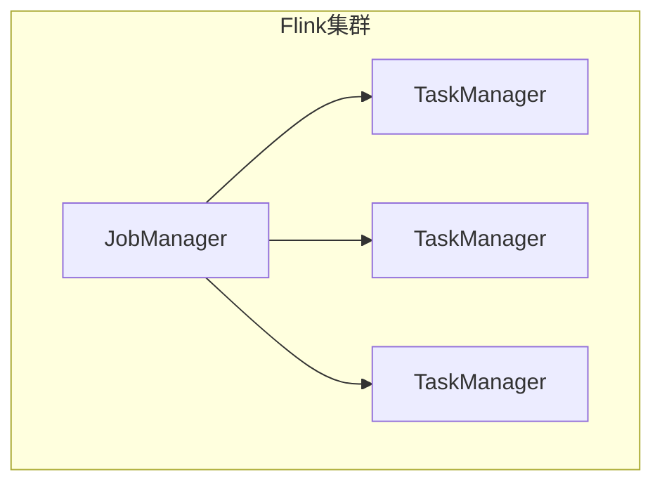
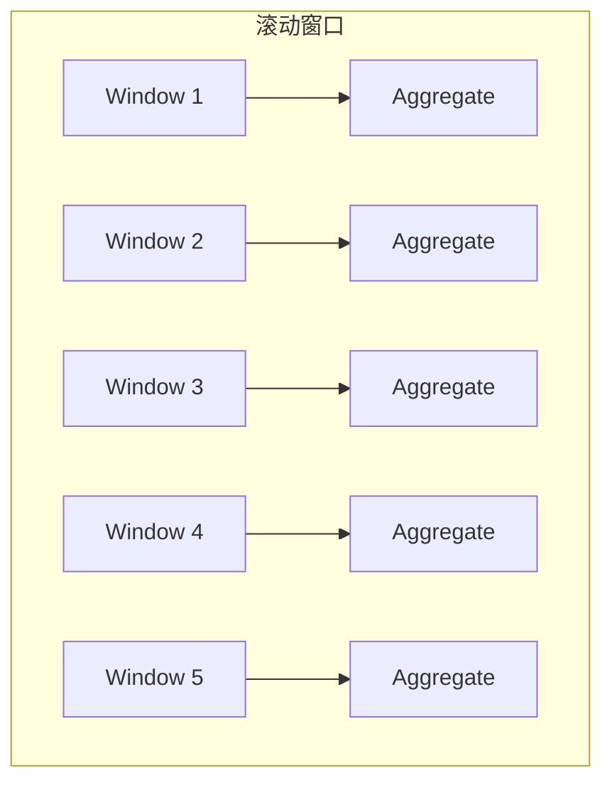

# 【AI大数据计算原理与代码实例讲解】Flink

## 1.背景介绍

随着大数据时代的到来,传统的批处理系统已经无法满足实时数据处理的需求。为了解决这一问题,Apache Flink应运而生。Flink是一个开源的分布式大数据处理引擎,专门为有状态计算而设计。它能够对有限流数据进行高效、准确的处理,并提供准确一次的状态一致性保证。

Flink具有低延迟、高吞吐、精准一次语义等优点,广泛应用于流式数据分析、批处理分析、机器学习等场景。它的核心是流式处理模型,将批处理视为流处理的一种特殊情况。Flink支持事件时间和处理时间语义,能够根据事件发生的顺序进行处理,保证事件的完整性和一致性。

### 1.1 Flink架构

Flink采用主从架构,由一个JobManager(主节点)和多个TaskManager(从节点)组成。JobManager负责调度和协调作业的执行,TaskManager负责执行具体的任务。



### 1.2 核心概念

- **Stream & Dataflow**:Flink的核心编程模型,所有的计算都被视为数据流的转换。
- **Window**:窗口是处理无限流数据的关键,可以把无限流拆分为有限的数据集。
- **State**:Flink的状态管理机制,保证了精准一次的状态一致性。
- **Time**:Flink支持基于事件时间和处理时间的窗口操作。

## 2.核心概念与联系

Flink的核心概念紧密相连,构建了其独特的流式处理模型。

### 2.1 Stream & Dataflow

Flink的编程模型是以Stream和Transformation为核心,所有的计算都被视为数据流的转换。


上图展示了一个典型的Flink作业流程,数据源(Source)经过一系列转换(Map、FlatMap、Filter等)后进入窗口(Window)操作,最后通过Reduce转换得到结果并输出到Sink。

### 2.2 Window

窗口是处理无限流数据的关键,Flink支持多种窗口类型:

- 滚动窗口(Tumbling Window)
- 滑动窗口(Sliding Window)
- 会话窗口(Session Window)
- 全局窗口(Global Window)

不同的窗口类型适用于不同的场景,灵活的窗口机制使得Flink能够高效地处理无限流数据。

### 2.3 State

Flink的状态管理机制保证了精准一次的状态一致性。状态可以存储在TaskManager的内存或者RocksDB中,并通过Checkpoint和Savepoint进行容错。状态的存在使得Flink能够支持有状态的流式计算。

### 2.4 Time

Flink支持基于事件时间和处理时间的窗口操作。事件时间是指事件实际发生的时间,处理时间是指事件进入Flink的时间。选择合适的时间语义对于保证数据的一致性和完整性至关重要。

## 3.核心算法原理具体操作步骤

### 3.1 流式处理模型

Flink的核心算法是流式处理模型,它将批处理视为流处理的一种特殊情况。流式处理模型的基本思想是将输入数据看作是一个无限的数据流,通过一系列的转换操作对数据进行处理,最终得到结果。


上图展示了Flink流式处理模型的基本结构。数据源(Source)产生无限的数据流,经过一系列转换操作(Transformation)后,最终将结果输出到Sink。

### 3.2 算子链

为了提高性能,Flink会将多个算子链接在一起,形成一个算子链(Operator Chain)。在同一个算子链中的算子可以在同一个线程中执行,避免了不必要的线程切换和数据序列化/反序列化,从而提高了系统的吞吐量。


上图展示了一个典型的Flink算子链。Source、Map、FlatMap、Filter、Window和Reduce算子被链接在一起,形成了一个算子链。

### 3.3 窗口操作

窗口是Flink处理无限流数据的关键机制。Flink支持多种窗口类型,包括滚动窗口、滑动窗口、会话窗口和全局窗口。不同的窗口类型适用于不同的场景,用户可以根据实际需求选择合适的窗口类型。

以滚动窗口为例,其操作步骤如下:

1. 将无限的数据流按照固定的时间窗口大小(如5秒)进行切分,形成多个有限的数据集。
2. 对每个数据集进行聚合操作(如sum、max等)。
3. 输出每个窗口的聚合结果。



上图展示了滚动窗口的操作过程。无限的数据流被切分为多个滚动窗口(Window 1、Window 2等),每个窗口内的数据进行聚合操作(Aggregate)后输出结果。

### 3.4 状态管理

Flink的状态管理机制保证了精准一次的状态一致性。状态可以存储在TaskManager的内存或者RocksDB中,并通过Checkpoint和Savepoint进行容错。

状态管理的基本步骤如下:

1. 定义状态:开发者需要定义需要存储的状态,如窗口计算中的聚合结果等。
2. 状态存储:Flink会将状态存储在TaskManager的内存或者RocksDB中。
3. Checkpoint:Flink会定期对状态进行Checkpoint,将状态持久化到外部存储系统(如HDFS)中。
4. 容错恢复:当发生故障时,Flink会从最近一次的Checkpoint中恢复状态,保证了精准一次的状态一致性。


上图展示了Flink状态管理的基本流程。开发者定义状态后,Flink会将状态存储在TaskManager中,并定期进行Checkpoint将状态持久化到外部存储系统中。当发生故障时,Flink会从外部存储系统中恢复状态,保证了精准一次的状态一致性。

## 4.数学模型和公式详细讲解举例说明

### 4.1 滚动窗口模型

滚动窗口是Flink中最常用的窗口类型之一。它将无限的数据流按照固定的时间窗口大小进行切分,形成多个有限的数据集。对于每个数据集,Flink会执行聚合操作(如sum、max等)并输出结果。

滚动窗口的数学模型如下:

$$
W_i = \{e_j | t_j \in [t_i, t_i + w) \}
$$

其中:

- $W_i$表示第i个滚动窗口
- $e_j$表示第j个事件
- $t_j$表示事件$e_j$的事件时间
- $t_i$表示第i个窗口的起始时间
- $w$表示窗口大小

例如,对于一个5秒的滚动窗口,第一个窗口$W_1$包含的事件为:

$$
W_1 = \{e_j | t_j \in [0, 5) \}
$$

第二个窗口$W_2$包含的事件为:

$$
W_2 = \{e_j | t_j \in [5, 10) \}
$$

以此类推。

### 4.2 滑动窗口模型

滑动窗口与滚动窗口类似,但是它允许窗口之间存在重叠。滑动窗口的数学模型如下:

$$
W_i = \{e_j | t_j \in [t_i, t_i + w) \}
$$

$$
t_{i+1} = t_i + s
$$

其中:

- $W_i$表示第i个滑动窗口
- $e_j$表示第j个事件
- $t_j$表示事件$e_j$的事件时间
- $t_i$表示第i个窗口的起始时间
- $w$表示窗口大小
- $s$表示滑动步长

例如,对于一个5秒的窗口大小和2秒的滑动步长,第一个窗口$W_1$包含的事件为:

$$
W_1 = \{e_j | t_j \in [0, 5) \}
$$

第二个窗口$W_2$包含的事件为:

$$
W_2 = \{e_j | t_j \in [2, 7) \}
$$

可以看到,第一个窗口和第二个窗口存在重叠。

### 4.3 会话窗口模型

会话窗口是根据事件之间的间隔来划分窗口的。如果两个事件之间的间隔超过了指定的间隔时间,则将它们划分到不同的窗口中。会话窗口的数学模型如下:

$$
W_i = \{e_j | t_j - t_{j-1} \le g \}
$$

其中:

- $W_i$表示第i个会话窗口
- $e_j$表示第j个事件
- $t_j$表示事件$e_j$的事件时间
- $g$表示会话间隔时间

例如,对于一个10秒的会话间隔时间,如果事件$e_1$的时间为0秒,事件$e_2$的时间为5秒,事件$e_3$的时间为12秒,那么$e_1$和$e_2$将被划分到同一个会话窗口$W_1$中,而$e_3$将被划分到另一个会话窗口$W_2$中。

$$
W_1 = \{e_1, e_2\}
$$

$$
W_2 = \{e_3\}
$$

## 5.项目实践:代码实例和详细解释说明

### 5.1 WordCount示例

WordCount是Flink中最经典的示例之一,它统计输入文本中每个单词出现的次数。下面是WordCount示例的代码:

```java
// 创建执行环境
StreamExecutionEnvironment env = StreamExecutionEnvironment.getExecutionEnvironment();

// 从socket获取输入数据
DataStream<String> text = env.socketTextStream("localhost", 9999);

// 分词并计数
DataStream<Tuple2<String, Integer>> wordCounts = text
    .flatMap(new FlatMapFunction<String, Tuple2<String, Integer>>() {
        @Override
        public void flatMap(String value, Collector<Tuple2<String, Integer>> out) {
            String[] words = value.split(" ");
            for (String word : words) {
                out.collect(new Tuple2<>(word, 1));
            }
        }
    })
    .keyBy(0)
    .sum(1);

// 打印结果
wordCounts.print();

// 执行作业
env.execute("Word Count Example");
```

代码解释:

1. 创建执行环境`StreamExecutionEnvironment`。
2. 从socket获取输入数据`env.socketTextStream("localhost", 9999)`。
3. 使用`flatMap`算子对输入数据进行分词,将每个单词映射为`(word, 1)`的元组。
4. 使用`keyBy`算子按照单词进行分组。
5. 使用`sum`算子对每个单词的计数进行求和。
6. 打印结果`wordCounts.print()`。
7. 执行作业`env.execute("Word Count Example")`。

运行示例:

1. 