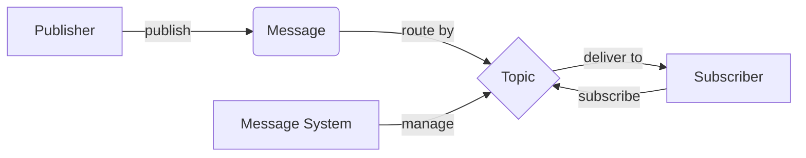

# 【AI大数据计算原理与代码实例讲解】发布订阅

## 1. 背景介绍
### 1.1 大数据时代的到来
近年来,随着互联网、物联网、云计算等新一代信息技术的迅猛发展,全球数据呈现爆发式增长。据统计,全球数据量每两年翻一番,预计到2025年,全球数据总量将达到163ZB。面对如此庞大的数据量,传统的数据处理架构和技术已经无法满足大数据时代的需求。

### 1.2 大数据计算面临的挑战
大数据计算面临着数据量大、数据类型多样、处理时效要求高等诸多挑战。传统的集中式计算架构,难以有效处理海量的分布式数据。同时,大数据应用对实时性、并发性也提出了更高的要求。因此,亟需探索新的大数据计算模式和技术,来应对大数据时代的挑战。

### 1.3 发布订阅模式的优势
发布订阅(Publish-Subscribe)模式是一种松耦合的消息通信模式,可以很好地适应分布式环境下的大数据计算需求。发布订阅模式将消息的发布者和订阅者解耦,可以实现灵活的消息路由和分发。同时,发布订阅模式天然支持多对多的通信,非常适合构建大规模分布式系统。将发布订阅模式应用于大数据计算,可以大幅提升系统的可伸缩性、可靠性和实时性。

## 2. 核心概念与联系
### 2.1 发布者(Publisher)
在发布订阅模式中,发布者是消息的生产者,负责将消息发布到消息系统中。一个系统可以有多个发布者,它们可以是不同的应用、服务或设备。发布者只需关注如何构造消息并发布,而无需关心消息的具体去向。

### 2.2 订阅者(Subscriber) 
订阅者是消息的消费者,它们向消息系统订阅感兴趣的消息。当有相关消息到达时,消息系统会将消息推送给匹配的订阅者。一个消息可以被多个订阅者消费,每个订阅者也可以消费多个消息。

### 2.3 主题(Topic)
主题是发布订阅模式中的一个重要概念,它代表了一类消息。发布者将消息发布到特定的主题,订阅者则订阅感兴趣的主题。主题提供了一种逻辑上的消息分类和路由机制。主题可以进行层次化组织,以便进行更细粒度的消息筛选。

### 2.4 消息(Message)
消息是在发布订阅模式中流动的基本单位,它包含了要传递的数据内容。一条消息通常包含消息头(元数据)和消息体(有效载荷)两部分。发布者将消息发布到主题,订阅者通过订阅主题来接收消息。

### 2.5 消息系统(Message System)
消息系统是连接发布者和订阅者的中间件,它负责缓存、路由和分发消息。消息系统提供了可靠的消息传输机制,保证消息在发布者和订阅者之间的可靠投递。常见的消息系统有Apache Kafka、RabbitMQ、RocketMQ等。

下面是发布订阅模式中核心概念之间的关系图:



## 3. 核心算法原理具体操作步骤
### 3.1 消息发布流程
1. 发布者创建待发送的消息,指定消息的主题。
2. 发布者通过消息系统提供的API将消息发布到指定主题。
3. 消息系统接收到发布者发布的消息,将其存储在内部的消息缓存中。
4. 消息系统根据主题对消息进行索引,以便后续的消息匹配和路由。

### 3.2 消息订阅流程
1. 订阅者创建订阅请求,指定感兴趣的主题。
2. 订阅者通过消息系统提供的API发起订阅请求。
3. 消息系统接收到订阅请求后,将订阅者信息与主题建立映射关系。
4. 当有新消息到达指定主题时,消息系统将消息推送给该主题下的所有订阅者。

### 3.3 消息匹配与路由
1. 消息系统在收到新消息后,根据消息的主题进行匹配。
2. 消息系统查找与主题相关联的所有订阅者。
3. 消息系统将消息复制并分发给匹配的订阅者。
4. 订阅者接收到消息后进行处理和消费。

### 3.4 消息可靠传输
1. 消息系统在接收到发布者发布的消息后,将其持久化存储。
2. 消息系统为每个订阅者维护消费进度,记录订阅者已经消费的消息位置。
3. 当订阅者消费消息失败时,消息系统支持消息重试,保证消息至少被消费一次。
4. 发布者和订阅者通过ACK机制确认消息的发布和消费状态,以实现端到端的消息可靠传输。

## 4. 数学模型和公式详细讲解举例说明
### 4.1 主题订阅模型
在发布订阅模式中,主题订阅可以用集合论的语言来描述。假设有m个发布者$P=\{p_1,p_2,...,p_m\}$和n个订阅者$S=\{s_1,s_2,...,s_n\}$,以及k个主题$T=\{t_1,t_2,...,t_k\}$。

我们定义发布者到主题的映射关系为:
$$Pub:P \rightarrow 2^T$$

其中,$2^T$表示主题集合T的幂集。对于任意发布者$p_i$,有$Pub(p_i) \subseteq T$,表示发布者$p_i$可以向主题集合$Pub(p_i)$发布消息。

同样地,我们定义订阅者到主题的映射关系为:
$$Sub:S \rightarrow 2^T$$

对于任意订阅者$s_j$,有$Sub(s_j) \subseteq T$,表示订阅者$s_j$订阅了主题集合$Sub(s_j)$。

举例说明,假设有发布者$p_1$和$p_2$,订阅者$s_1$和$s_2$,以及主题$t_1$、$t_2$和$t_3$。发布者到主题的映射关系为:
$$Pub(p_1)=\{t_1,t_2\}, Pub(p_2)=\{t_2,t_3\}$$

订阅者到主题的映射关系为:
$$Sub(s_1)=\{t_1,t_3\}, Sub(s_2)=\{t_2\}$$

当发布者$p_1$向主题$t_1$发布消息时,订阅者$s_1$将接收到该消息;当发布者$p_2$向主题$t_2$发布消息时,订阅者$s_1$和$s_2$都将接收到该消息。

### 4.2 消息吞吐量模型
消息系统的吞吐量是衡量其性能的重要指标。假设消息的到达率为$\lambda$,消息的平均服务时间为$\bar{x}$,消息系统的并发处理能力为$c$。根据排队论的M/M/c模型,我们可以得到消息系统的吞吐量公式:

$$
吞吐量 = \begin{cases} 
\lambda, & \rho < 1 \\
c\mu, & \rho \geq 1
\end{cases}
$$

其中,$\rho=\lambda/(c\mu)$,表示系统的利用率,$\mu=1/\bar{x}$,表示单位时间内处理消息的速率。

当$\rho < 1$时,系统处于稳定状态,吞吐量等于到达率$\lambda$;当$\rho \geq 1$时,系统处于饱和状态,吞吐量达到最大值$c\mu$。

举例说明,假设消息的到达率为1000条/s,消息的平均服务时间为0.1ms,消息系统的并发处理能力为10000。则有:

$$
\begin{aligned}
\lambda &= 1000 \\
\bar{x} &= 0.1ms = 0.0001s \\
c &= 10000 \\
\mu &= 1/\bar{x} = 10000 \\
\rho &= \lambda/(c\mu) = 1000/(10000 \times 10000) = 0.01 < 1
\end{aligned}
$$

因此,系统处于稳定状态,吞吐量等于到达率,即1000条/s。

## 5. 项目实践:代码实例和详细解释说明
下面以Java语言为例,演示如何使用Apache Kafka实现发布订阅模式。

### 5.1 添加依赖
在项目的pom.xml文件中添加Kafka相关依赖:

```xml
<dependency>
    <groupId>org.apache.kafka</groupId>
    <artifactId>kafka-clients</artifactId>
    <version>2.8.0</version>
</dependency>
```

### 5.2 消息发布者
创建一个消息发布者,向指定主题发布消息:

```java
public class MessagePublisher {
    private static final String TOPIC = "my-topic";
    private static final String BOOTSTRAP_SERVERS = "localhost:9092";

    public static void main(String[] args) {
        Properties props = new Properties();
        props.put("bootstrap.servers", BOOTSTRAP_SERVERS);
        props.put("key.serializer", "org.apache.kafka.common.serialization.StringSerializer");
        props.put("value.serializer", "org.apache.kafka.common.serialization.StringSerializer");

        try (KafkaProducer<String, String> producer = new KafkaProducer<>(props)) {
            for (int i = 0; i < 10; i++) {
                String message = "Message " + i;
                producer.send(new ProducerRecord<>(TOPIC, message));
                System.out.println("Published message: " + message);
            }
        }
    }
}
```

在上述代码中,我们首先创建了一个KafkaProducer实例,并配置了Kafka服务器地址、消息键和值的序列化器。然后,通过循环发送10条消息到指定主题。每条消息都被包装成一个ProducerRecord对象,指定了目标主题和消息内容。最后,通过producer.send()方法发布消息。

### 5.3 消息订阅者
创建一个消息订阅者,订阅指定主题并消费消息:

```java
public class MessageSubscriber {
    private static final String TOPIC = "my-topic";
    private static final String BOOTSTRAP_SERVERS = "localhost:9092";
    private static final String GROUP_ID = "my-group";

    public static void main(String[] args) {
        Properties props = new Properties();
        props.put("bootstrap.servers", BOOTSTRAP_SERVERS);
        props.put("group.id", GROUP_ID);
        props.put("key.deserializer", "org.apache.kafka.common.serialization.StringDeserializer");
        props.put("value.deserializer", "org.apache.kafka.common.serialization.StringDeserializer");

        try (KafkaConsumer<String, String> consumer = new KafkaConsumer<>(props)) {
            consumer.subscribe(Collections.singletonList(TOPIC));

            while (true) {
                ConsumerRecords<String, String> records = consumer.poll(Duration.ofMillis(100));
                for (ConsumerRecord<String, String> record : records) {
                    System.out.println("Received message: " + record.value());
                }
            }
        }
    }
}
```

在上述代码中,我们创建了一个KafkaConsumer实例,并配置了Kafka服务器地址、消费者组ID、消息键和值的反序列化器。然后,通过consumer.subscribe()方法订阅指定主题。在一个无限循环中,通过consumer.poll()方法拉取消息,并遍历处理每条消息。

通过运行消息发布者和订阅者,我们就可以实现消息的发布和订阅功能。发布者发布的消息将被订阅者实时接收和消费。

## 6. 实际应用场景
发布订阅模式在实际的大数据计算场景中有广泛的应用,下面列举几个典型的应用场景:

### 6.1 日志收集与分析
在分布式系统中,通常需要收集各个服务节点的日志数据,并进行集中分析和监控。可以使用发布订阅模式,让各个服务节点作为日志的发布者,将日志消息发布到指定的主题。然后,日志分析系统作为订阅者,订阅日志主题,对日志数据进行实时分析和告警。

### 6.2 实时数据处理
在许多实时数据处理场景,如实时推荐、实时风控等,