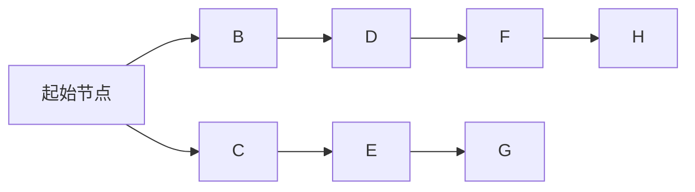

# 【AI大数据计算原理与代码实例讲解】图数据库

## 1.背景介绍

在当今大数据时代,数据的规模和复杂性不断增加,传统的关系型数据库在处理高度连接和复杂结构的数据时面临着巨大挑战。图数据库(Graph Database)作为一种新兴的NoSQL数据库,以其优异的性能和灵活性,逐渐成为处理高度互连数据的理想选择。

图数据库是一种以图形结构存储数据的数据库管理系统。它将数据建模为由节点(Node)和边(Edge)组成的图形网络,节点用于表示实体对象,边则表示实体对象之间的关系。与关系型数据库相比,图数据库更适合表达复杂的层次结构和网状关系数据,如社交网络、推荐系统、知识图谱等。

### 1.1 图数据库的优势

相较于传统的关系型数据库,图数据库具有以下优势:

1. **高效查询关联数据**: 图数据库天生支持遍历查询,可以通过节点和边的关系快速查找相关数据,避免了关系型数据库中耗时的连接操作。
2. **灵活的数据模型**: 图数据库采用无模式(Schema-free)的数据模型,可以轻松适应数据结构的变化,满足现代应用的需求。
3. **高度可扩展性**: 图数据库通常采用分布式架构,可以轻松地横向扩展,支持大规模数据存储和查询。

### 1.2 图数据库的应用场景

图数据库广泛应用于以下领域:

- **社交网络**: 表示用户之间的关系网络。
- **推荐系统**: 构建物品之间的关联关系,为用户提供个性化推荐。
- **知识图谱**: 存储结构化的知识数据,支持语义查询和推理。
- **网络和IT运维**: 表示网络拓扑结构,追踪故障和依赖关系。
- **欺诈检测**: 发现复杂的欺诈模式和异常行为。

## 2.核心概念与联系

在深入探讨图数据库的原理和实现之前,我们需要了解一些核心概念:

### 2.1 节点(Node)

节点是图数据库中最基本的实体单元,用于表示现实世界中的对象或概念。每个节点都有一个唯一的标识符(ID),并可以包含一组属性(Properties)来描述该实体的特征。

### 2.2 边(Edge)

边用于连接两个节点,表示它们之间的关系。每条边都有一个方向,从一个节点指向另一个节点。边也可以包含属性,用于描述关系的特征。


### 2.3 属性(Properties)

属性是键值对的形式,用于存储节点或边的附加信息。属性可以是基本数据类型(如字符串、数字等),也可以是复杂数据类型(如列表、嵌套对象等)。

### 2.4 标签(Label)

标签是对节点进行逻辑分组的一种方式。一个节点可以有多个标签,标签可以用于查询和约束操作。


### 2.5 路径(Path)

路径是由一系列节点和边组成的序列,表示图中的一条遍历路线。路径查询是图数据库中常见的操作,用于发现节点之间的关联关系。


## 3.核心算法原理具体操作步骤

图数据库的核心算法主要包括以下几个方面:

### 3.1 图遍历算法

图遍历算法用于在图数据库中查找节点之间的关联路径,是图数据库查询的基础。常见的图遍历算法包括:

1. **深度优先搜索(Depth-First Search, DFS)**: 从起始节点出发,沿着每一条路径尽可能深入,直到无法继续为止,然后回溯到上一个节点,继续搜索其他路径。DFS适用于查找单个目标节点或检测环路。

2. **广度优先搜索(Breadth-First Search, BFS)**: 从起始节点出发,先访问距离起始节点最近的所有节点,然后再访问距离起始节点次近的所有节点,以此类推,直到找到目标节点或遍历完所有节点。BFS适用于查找最短路径。

3. **双向搜索(Bidirectional Search)**: 同时从起始节点和目标节点出发进行搜索,直到两条搜索路径相交,从而找到连接两个节点的最短路径。双向搜索可以减少搜索空间,提高查询效率。



### 3.2 图分区和分布式存储

为了支持大规模图数据的存储和查询,图数据库通常采用分布式架构,将图数据划分为多个分区(Partition)存储在不同的节点上。常见的图分区策略包括:

1. **基于节点的分区**: 根据节点的属性或标签将节点划分到不同的分区中。相关的节点和边会存储在同一个分区内,以提高局部查询的效率。

2. **基于边的分区**: 根据边的属性或类型将边划分到不同的分区中,相关的节点会跨越多个分区存储。这种策略适用于需要频繁遍历整个图的场景。

3. **混合分区**: 结合节点和边的属性,采用多级分区策略,在分区内部再进行细粒度的划分。

在分布式环境下,图查询需要在多个分区之间进行协调和数据传输,因此图数据库还需要实现高效的分布式查询引擎和数据传输机制。

### 3.3 图索引和查询优化

为了加速图数据库的查询速度,图数据库通常采用以下索引和优化策略:

1. **节点索引**: 根据节点的属性或标签建立索引,加速节点的查找和过滤操作。

2. **边索引**: 根据边的属性或类型建立索引,加速边的查找和遍历操作。

3. **路径索引**: 预计算和存储常见的路径模式,加速路径查询的执行速度。

4. **查询重写**: 分析查询语句,将其转换为更高效的执行计划。

5. **查询缓存**: 缓存常见查询的结果,避免重复计算。

6. **并行查询**: 将查询任务划分为多个子任务,并行执行以提高查询效率。

7. **视图materialization**: 预计算和存储常用的视图数据,加速相关查询的执行速度。

## 4.数学模型和公式详细讲解举例说明

在图数据库中,一些常见的数学模型和公式可以帮助我们更好地理解和优化图算法。

### 4.1 图表示

图可以用邻接矩阵(Adjacency Matrix)或邻接表(Adjacency List)来表示。

#### 4.1.1 邻接矩阵

对于一个有 $n$ 个节点的图,邻接矩阵 $A$ 是一个 $n \times n$ 的矩阵,其中 $A_{ij}$ 表示从节点 $i$ 到节点 $j$ 是否有边相连。如果有边相连,则 $A_{ij} = 1$,否则 $A_{ij} = 0$。

$$
A = \begin{bmatrix}
0 & 1 & 0 & 1 \\
1 & 0 & 1 & 0 \\
0 & 1 & 0 & 1 \\
1 & 0 & 1 & 0
\end{bmatrix}
$$

邻接矩阵的优点是简单直观,缺点是对于稀疏图(边的数量远小于节点数的平方)会浪费大量存储空间。

#### 4.1.2 邻接表

邻接表使用链表或数组来存储每个节点的邻居节点。对于有 $n$ 个节点的图,邻接表由 $n$ 个链表或数组组成,每个链表或数组存储一个节点的邻居节点。

```
Node 0: 1, 3
Node 1: 0, 2
Node 2: 1, 3
Node 3: 0, 2
```

邻接表的优点是节省存储空间,缺点是查找邻居节点的时间复杂度为 $O(k)$,其中 $k$ 是该节点的度数(边的数量)。

### 4.2 图遍历算法复杂度分析

#### 4.2.1 深度优先搜索(DFS)

对于一个有 $n$ 个节点和 $m$ 条边的图,DFS 算法的时间复杂度为 $O(n + m)$,因为它需要访问每个节点和每条边。在最坏情况下,如果图是一条链,时间复杂度为 $O(n + m) = O(n)$。

#### 4.2.2 广度优先搜索(BFS)

BFS 算法的时间复杂度也是 $O(n + m)$,因为它需要访问每个节点和每条边。但是,BFS 算法需要使用队列来存储待访问的节点,因此它的空间复杂度为 $O(n)$,而 DFS 算法只需要递归调用栈,空间复杂度为 $O(h)$,其中 $h$ 是图的高度(最长路径的长度)。

### 4.3 PageRank 算法

PageRank 算法是一种用于计算网页重要性的算法,它也可以应用于图数据库中计算节点的重要性。PageRank 算法基于以下思想:一个节点的重要性取决于指向它的节点的重要性和数量。

设 $PR(u)$ 表示节点 $u$ 的 PageRank 值,则:

$$
PR(u) = \frac{1 - d}{n} + d \sum_{v \in B_u} \frac{PR(v)}{L(v)}
$$

其中:

- $n$ 是图中节点的总数
- $d$ 是阻尼系数(damping factor),通常取值 $0.85$
- $B_u$ 是指向节点 $u$ 的节点集合
- $L(v)$ 是节点 $v$ 的出度(指向其他节点的边的数量)

PageRank 算法通过迭代计算每个节点的 PageRank 值,直到收敛或达到最大迭代次数。

### 4.4 社区发现算法

社区发现算法旨在发现图中的密集子图(社区),这些社区内部的节点之间存在更多的连接,而与其他社区之间的连接较少。常见的社区发现算法包括:

1. **Girvan-Newman 算法**: 基于边介数(Edge Betweenness)的层次聚类算法,逐步移除介数最高的边,将图划分为多个社区。

2. **标签传播算法(Label Propagation Algorithm, LPA)**: 每个节点根据其邻居节点的标签来更新自己的标签,最终形成多个社区。

3. **Louvain 算法**: 基于模ул度(Modularity)的贪心优化算法,通过最大化模块度来划分社区。

这些算法可以帮助我们发现图中的结构模式,并应用于社交网络分析、蛋白质互作网络分析等领域。

## 5.项目实践: 代码实例和详细解释说明

为了更好地理解图数据库的原理和应用,我们将使用 Python 编程语言和 NetworkX 库来实现一些常见的图算法和操作。NetworkX 是一个用于创建、操作和研究图形和复杂网络结构的 Python 软件包。

### 5.1 创建图和添加节点/边

```python
import networkx as nx

# 创建一个无向图
G = nx.Graph()

# 添加节点
G.add_nodes_from(['A', 'B', 'C', 'D'])

# 添加边
G.add_edges_from([('A', 'B'), ('B', 'C'), ('C', 'D'), ('D', 'A')])

# 打印节点和边
print("Nodes:", G.nodes())
print("Edges:", G.edges())
```

输出:

```
Nodes: ['A', 'B', 'C', 'D']
Edges: [('A', 'B'), ('B', 'C'), ('C', 'D'), ('D', 'A')]
```

### 5.2 深度优先搜索(DFS)

```python
# 深度优先搜索
print("DFS from A:")
