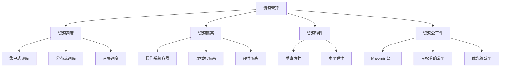

# 【AI大数据计算原理与代码实例讲解】资源管理

## 1.背景介绍

在当今大数据和人工智能时代,高效管理和利用计算资源对于AI系统的性能和成本至关重要。资源管理涉及对计算、存储、网络等各种资源的分配、调度和优化,以最大化资源利用率,提高系统吞吐量,降低延迟,节约成本。

### 1.1 大数据计算的资源挑战

- 海量异构数据的存储和计算
- 复杂计算任务的分解与调度  
- 集群资源的弹性伸缩
- 多租户资源隔离与公平性

### 1.2 AI计算的资源特点

- 深度学习模型训练的高计算强度
- 参数服务器架构的通信开销
- GPU等异构硬件加速
- 推理服务的低延迟需求

### 1.3 资源管理的目标

- 提高集群资源利用率
- 保障任务的SLA要求
- 实现弹性和高可用
- 降低能耗和成本

## 2.核心概念与联系

### 2.1 资源调度 

将待运行的任务根据一定策略分配到合适的计算节点,合理利用有限资源,提高系统吞吐量和性能。

#### 2.1.1 集中式调度

一个中心调度器掌握全局资源视图,统一分配资源,如YARN、Mesos等。

#### 2.1.2 分布式调度  

每个节点独立做出调度决策,通过协同实现全局优化,如Sparrow、Hawk等。

#### 2.1.3 两层调度

集群管理层负责粗粒度资源分配,应用框架层负责任务调度,如Kubernetes。

### 2.2 资源隔离

在多租户共享的集群中,不同用户的任务在CPU、内存、IO等资源上相互隔离,防止互相干扰。

#### 2.2.1 操作系统容器

利用cgroups等实现进程级资源隔离,如Docker。

#### 2.2.2 虚拟机隔离

每个任务运行在独立虚拟机中,天然隔离。

#### 2.2.3 硬件隔离

不同任务使用不同的物理机或NUMA节点。

### 2.3 资源弹性 

根据负载动态调整资源配置,在满足SLA的同时提高资源利用率和降低成本。

#### 2.3.1 垂直弹性

增加或减少单个任务的CPU、内存等资源分配。

#### 2.3.2 水平弹性

增加或减少任务的并行度,动态增删工作节点。

### 2.4 资源公平性

在满足优先级和SLA要求的前提下,让多个租户或用户的任务共享资源时获得公平对待。

#### 2.4.1 Max-min公平

先满足资源需求最小的任务,再平分剩余资源,如Hadoop Fair Scheduler。 

#### 2.4.2 带权重的公平

为不同任务分配权重,权重越大分配的资源越多。

#### 2.4.3 优先级公平

为任务指定优先级,优先满足高优先级任务的资源需求。

下图展示了这些核心概念之间的联系:



## 3.核心算法原理具体操作步骤

### 3.1 DRF(Dominant Resource Fairness)算法

DRF是Mesos等系统采用的多资源公平分配算法,考虑CPU、内存等不同资源维度。

#### 步骤1:计算每个任务的主导资源占比

主导资源是指任务在所有资源维度中,占集群总量百分比最大的那个资源。假设某任务在CPU上占比40%,在内存上占比60%,则内存就是其主导资源。

#### 步骤2:将任务按主导资源占比从小到大排序

#### 步骤3:从前到后遍历任务分配资源

每次分配量就是任务主导资源的最大可分配量。

#### 步骤4:更新任务主导资源占比,重复步骤3直到所有资源分配完

### 3.2 资源调度的启发式算法

调度问题通常是NP-hard的组合优化问题,可采用遗传、模拟退火等启发式算法求解。

#### 步骤1:定义问题的解空间编码

将一个调度方案编码为一个向量,如[A, C, B, D]表示在4个节点上的任务放置顺序。

#### 步骤2:定义目标函数 

如最小化任务完成时间、最小化资源碎片等。

#### 步骤3:设计算法的关键操作

如交叉、变异、选择等,使解空间朝更优方向搜索。

#### 步骤4:迭代搜索直到满足终止条件

如达到最大迭代次数、解的质量无明显提升等。

### 3.3 在线资源调整算法

根据任务动态到达和完成,在线调整长期运行服务的资源分配。

#### 步骤1:初始化

根据历史数据或经验给每个服务分配初始资源。

#### 步骤2:监控服务性能指标

如平均响应时间、吞吐量等。

#### 步骤3:判断是否需要调整  

若性能指标偏离目标值一定阈值,则触发调整。

#### 步骤4:计算资源调整量

可基于排队论模型、控制理论或强化学习等方法,考虑调整的效果和开销。

#### 步骤5:执行资源调整

分配或回收服务的CPU、内存等资源,并持续监控性能变化,重复步骤2-4。

## 4.数学模型和公式详细讲解举例说明

### 4.1 资源调度的整数规划模型

假设有 $n$ 个任务 $\{T_1, T_2, ..., T_n\}$ 和 $m$ 个节点 $\{N_1, N_2, ..., N_m\}$,目标是最小化任务完成时间。 

决策变量:
$$
x_{ij} = 
\begin{cases}
1, & \text{if task } T_i \text{ is assigned to node } N_j \\
0, & \text{otherwise}
\end{cases}
$$

$$
C_i \text{表示任务} T_i \text{的完成时间}
$$

优化目标:
$$
\min \max_{i=1}^n C_i
$$

约束条件:
$$
\sum_{j=1}^m x_{ij} = 1, \forall i \in \{1,2,...,n\} \text{(每个任务分配到且仅分配到一个节点)}
$$

$$
\sum_{i=1}^n (x_{ij} \cdot cpu_i) \leq CPU_j, \forall j \in \{1,2,...,m\} \text{(每个节点CPU资源限制)}
$$

$$
\sum_{i=1}^n (x_{ij} \cdot mem_i) \leq MEM_j, \forall j \in \{1,2,...,m\} \text{(每个节点内存资源限制)}
$$

其中 $cpu_i$ 和 $mem_i$ 分别表示任务 $T_i$ 的CPU和内存需求, $CPU_j$ 和 $MEM_j$ 分别表示节点 $N_j$ 的CPU和内存容量。

### 4.2 排队论性能模型

假设任务请求到达服从泊松分布,服务时间服从指数分布,则可用 $M/M/c$ 排队模型估算性能指标。

$\lambda$ 表示请求到达率, $\mu$ 表示单个服务器的服务率, $c$ 表示服务器个数。

#### 系统繁忙概率(所有服务器都在服务)

$$
P_0 = \left[ \sum_{k=0}^{c-1} \frac{1}{k!} \left(\frac{\lambda}{\mu}\right)^k + \frac{1}{c!} \frac{c \mu}{c\mu - \lambda} \left(\frac{\lambda}{\mu}\right)^c \right]^{-1}
$$

#### 平均队长(等待服务的请求数)

$$
L_q = \frac{P_0 (\lambda/\mu)^c \rho}{c! (1-\rho)^2}, \text{where} \ \rho = \frac{\lambda}{c\mu} 
$$

#### 平均等待时间

$$
W_q = \frac{L_q}{\lambda}
$$

#### 平均响应时间
$$
W = W_q + \frac{1}{\mu}
$$

举例: 假设请求平均到达率为120个/秒,单个服务器的平均服务时间为0.01秒,当前配置了10个服务器。则:

$\lambda = 120, \mu = 100, c = 10$

代入公式可算出:

平均队长 $L_q \approx 1.07$,平均等待时间 $W_q \approx 0.009s$,平均响应时间 $W \approx 0.019s$。

如果要使平均响应时间小于0.01秒,则需要增加服务器数量 $c$ 使得 $\rho < 0.5$,即 $c > 24$。

### 4.3 资源弹性的控制理论模型

可基于反馈控制来动态调整资源,使性能指标如平均响应时间 $y$ 逼近目标值 $y_{ref}$。

#### 系统模型

假设资源分配量 $u$ 与性能指标 $y$ 之间的关系可近似为一阶线性系统:

$$
y(k+1) = ay(k) + bu(k)
$$

其中 $a$ 和 $b$ 可通过系统辨识方法估计得到。

#### 反馈控制器

设计一个比例-积分(PI)控制器,根据性能指标偏差 $e$ 计算资源调整量:

$$
e(k) = y_{ref} - y(k)
$$
$$
u(k) = K_p e(k) + K_i \sum_{j=0}^k e(j)
$$

其中 $K_p$ 和 $K_i$ 为控制器参数,可通过设置积分时间常数 $T_i$ 调整:

$$
K_p = 0.45 \frac{T}{aT_i},  K_i = \frac{K_p}{T_i}
$$

$T$ 为采样周期。

举例: 假设系统模型参数 $a=0.8, b=0.5$,采样周期 $T=10s$,积分时间 $T_i=100s$,期望的平均响应时间 $y_{ref}=1s$。

若当前平均响应时间 $y(k)=1.5s$,则偏差 $e(k)=1-1.5=-0.5$。

控制器计算资源调整量:
$$
K_p = 0.45 \frac{10}{0.8 \times 100} = 0.056, K_i = \frac{0.056}{100} = 0.00056
$$
$$
u(k) = 0.056 \times (-0.5) + 0.00056 \times (-0.5) = -0.0283
$$

即需要减少约0.0283单位的资源以使响应时间恢复到1秒。

## 5.项目实践：代码实例和详细解释说明

下面以一个简单的多资源调度算法为例,用Python代码实现并解释说明。

```python
class Task:
    def __init__(self, cpu, mem):
        self.cpu = cpu  # CPU需求
        self.mem = mem  # 内存需求

class Node:
    def __init__(self, cpu_cap, mem_cap):
        self.cpu_cap = cpu_cap  # CPU容量
        self.mem_cap = mem_cap  # 内存容量
        self.cpu_used = 0
        self.mem_used = 0
        
    def alloc(self, task):
        self.cpu_used += task.cpu
        self.mem_used += task.mem
        
    def is_avail(self, task):
        # 检查是否有足够资源分配给任务
        return self.cpu_used + task.cpu <= self.cpu_cap and \
               self.mem_used + task.mem <= self.mem_cap

def min_makespan(tasks, nodes):
    # 按CPU需求从大到小排序任务
    tasks.sort(key=lambda t: t.cpu, reverse=True)  
    
    for task in tasks:
        node = None
        min_cpu_remain = float('inf')
        for n in nodes:
            if n.is_avail(task):
                cpu_remain = n.cpu_cap - n.cpu_used
                if cpu_remain