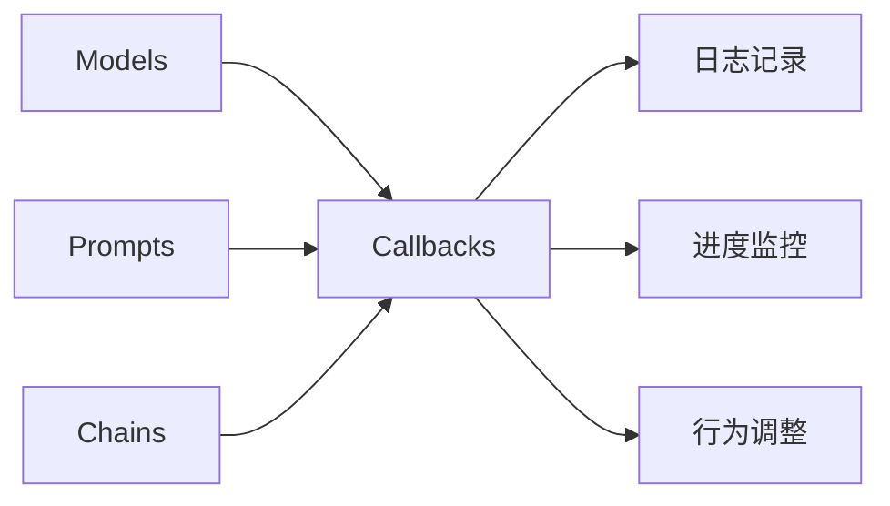
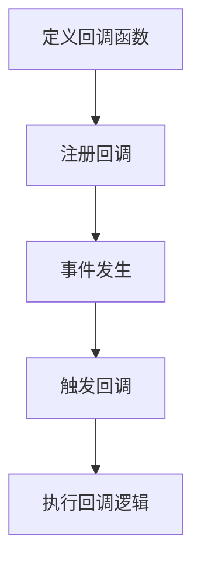

# 【LangChain编程：从入门到实践】回调机制

## 1. 背景介绍
### 1.1 LangChain的兴起
近年来，随着自然语言处理(NLP)和大语言模型(LLM)的快速发展，构建智能对话系统和知识问答系统的需求日益增长。LangChain作为一个专注于构建LLM应用的开发框架，受到了广泛关注。它提供了一系列工具和组件，帮助开发者更轻松地创建和部署基于LLM的应用程序。

### 1.2 回调机制的重要性
在LangChain的编程实践中，回调(Callback)机制扮演着至关重要的角色。回调允许开发者在关键事件发生时执行自定义的操作，如记录日志、监控进度、调整模型行为等。通过灵活运用回调机制，我们可以增强LangChain应用的可观测性、可控性和扩展性。

### 1.3 本文的目标和结构
本文旨在深入探讨LangChain编程中的回调机制，帮助读者全面理解其概念、原理和实践。我们将从回调的核心概念出发，分析其与LangChain各组件的联系，详细讲解回调的实现原理和使用步骤。同时，我们还将通过具体的代码实例和应用场景，展示回调机制的强大功能和灵活性。

## 2. 核心概念与联系
### 2.1 回调的定义和作用
回调(Callback)是一种编程模式，允许在特定事件发生时执行预定义的函数或方法。在LangChain中，回调机制提供了一种方便的方式来监听和响应各种事件，如模型推理开始/结束、Prompt生成等。通过注册回调函数，我们可以在这些事件发生时执行自定义的逻辑，实现对LLM应用的精细控制和监管。

### 2.2 回调与LangChain组件的关系
LangChain由多个核心组件构成，如Models、Prompts、Chains等。回调机制与这些组件紧密相连，贯穿于整个应用的生命周期。

- Models：回调可以监听模型推理的开始和结束事件，记录推理时间、输入/输出等信息。
- Prompts：回调可以捕获Prompt的生成过程，动态调整Prompt模板或参数。
- Chains：回调可以追踪Chain的执行流程，在每个步骤执行前后执行自定义操作。

下图展示了回调机制与LangChain各组件的关系：



## 3. 核心算法原理与具体操作步骤
### 3.1 回调的注册和触发
在LangChain中，回调的使用通常分为两个步骤：注册和触发。

1. 注册回调：通过实现自定义的回调类或函数，并将其添加到相应组件的回调列表中。
2. 触发回调：当特定事件发生时，LangChain会自动调用注册的回调函数，执行预定义的操作。

以下是一个简化的回调注册和触发流程：



### 3.2 常见的回调类型和用法
LangChain提供了多种内置的回调类型，覆盖了各种常见的使用场景。

- `StdOutCallbackHandler`：将事件信息输出到标准输出流，用于调试和日志记录。
- `LangChainTracer`：追踪LangChain应用的执行过程，生成可视化的追踪信息。
- `WandbCallbackHandler`：将事件数据发送到Weights & Biases平台，实现实验跟踪和可视化。

除了内置的回调类型，我们还可以通过继承`BaseCallbackHandler`基类来实现自定义的回调逻辑，满足特定的需求。

## 4. 数学模型和公式详细讲解举例说明
虽然回调机制本身并不涉及复杂的数学模型，但在LLM应用中，回调常常用于记录和分析模型的性能指标。例如，我们可以在模型推理的回调中计算并记录以下指标：

- 推理时间：$t_{inference} = t_{end} - t_{start}$
- 输入tokens数：$n_{input} = len(input\_tokens)$
- 输出tokens数：$n_{output} = len(output\_tokens)$
- 推理速度：$v_{inference} = \frac{n_{input} + n_{output}}{t_{inference}}$

通过在回调中收集这些指标，我们可以评估模型的性能表现，进行优化和比较。

## 5. 项目实践：代码实例和详细解释说明
下面我们通过一个具体的代码实例，演示如何在LangChain中使用回调机制。

```python
from langchain.callbacks import StdOutCallbackHandler
from langchain.chains import LLMChain
from langchain.prompts import PromptTemplate
from langchain.llms import OpenAI

# 定义Prompt模板
template = """请根据以下关键词生成一段产品描述：
{keywords}
"""
prompt = PromptTemplate(template=template, input_variables=["keywords"])

# 定义自定义回调函数
class MyCustomHandler(StdOutCallbackHandler):
    def on_llm_start(self, serialized, prompts, **kwargs):
        print(f"LLM开始推理，Prompts: {prompts}")
        
    def on_llm_end(self, response, **kwargs):
        print(f"LLM推理完成，响应: {response}")

# 创建LLM和Chain
llm = OpenAI(temperature=0.9)
chain = LLMChain(llm=llm, prompt=prompt)

# 注册回调
callback = MyCustomHandler()
chain.callbacks.append(callback)

# 运行Chain，触发回调
keywords = "智能手表, 健康监测, 运动追踪"
result = chain.run(keywords)
print(f"最终生成的产品描述：\n{result}")
```

在上述代码中，我们首先定义了一个Prompt模板和自定义的回调函数`MyCustomHandler`。然后创建了LLM和Chain对象，并将自定义回调注册到Chain的回调列表中。最后，我们运行Chain，触发回调函数，并打印最终生成的产品描述。

运行该代码，我们将看到回调函数在LLM推理的开始和结束时被触发，打印出相应的信息。这展示了回调机制在监控和记录LLM应用执行过程中的作用。

## 6. 实际应用场景
回调机制在LangChain编程中有广泛的应用场景，下面列举几个典型的例子：

### 6.1 日志记录和调试
通过在关键事件发生时触发回调，我们可以方便地记录日志信息，如模型输入/输出、执行时间等。这对于调试和问题排查非常有帮助。

### 6.2 进度监控和可视化
在长时间运行的LLM应用中，回调可以用于监控任务进度，并将进度信息发送到可视化平台，如Weights & Biases。这使我们能够实时跟踪应用的执行状态。

### 6.3 动态调整模型行为
回调机制允许我们在模型推理过程中动态调整模型的行为。例如，我们可以根据中间结果动态修改Prompt、调整模型超参数等，实现更灵活的控制。

### 6.4 自定义日志和指标收集
通过实现自定义的回调函数，我们可以收集和计算特定于业务场景的日志和指标，如用户交互次数、业务关键词出现频率等。这有助于深入理解和优化LLM应用的性能。

## 7. 工具和资源推荐
以下是一些有助于深入理解和应用LangChain回调机制的工具和资源：

- [LangChain官方文档 - Callbacks](https://python.langchain.com/en/latest/modules/callbacks/getting_started.html)：官方文档中关于回调机制的详细介绍和使用指南。
- [LangChain GitHub仓库](https://github.com/hwchase17/langchain)：LangChain的开源代码仓库，包含了各种示例和最佳实践。
- [Weights & Biases](https://wandb.ai/)：一个用于实验跟踪、可视化和协作的机器学习平台，可与LangChain的回调机制无缝集成。
- [OpenAI Cookbook](https://github.com/openai/openai-cookbook)：OpenAI官方提供的示例代码集合，展示了如何使用OpenAI API构建各种应用，其中也涉及回调的使用。

## 8. 总结：未来发展趋势与挑战
回调机制是LangChain编程中一个强大而灵活的工具，它使开发者能够在关键事件发生时执行自定义的操作，增强了LLM应用的可观测性、可控性和扩展性。随着LLM技术的不断发展，回调机制也将面临新的机遇和挑战。

未来，回调机制可能会与更多的工具和平台集成，如模型监控、数据分析等，提供更全面的洞察和优化能力。此外，随着LLM应用变得越来越复杂，回调机制需要在性能和易用性方面进一步改进，以满足日益增长的需求。

总的来说，回调机制将继续在LangChain编程中发挥重要作用，帮助开发者构建更智能、更可靠、更高效的LLM应用。掌握回调机制将是LangChain开发者必备的技能之一。

## 9. 附录：常见问题与解答
### 9.1 如何选择合适的回调类型？
选择回调类型取决于具体的使用场景和需求。如果只需要简单的日志记录，可以使用`StdOutCallbackHandler`；如果需要实验跟踪和可视化，可以使用`WandbCallbackHandler`；如果有特定的业务逻辑，可以通过继承`BaseCallbackHandler`实现自定义回调。

### 9.2 回调函数的执行顺序是怎样的？
当同一事件注册了多个回调函数时，它们会按照注册的顺序依次执行。每个回调函数的执行不会影响其他回调函数。

### 9.3 回调机制对性能有影响吗？
使用回调机制确实会引入一定的性能开销，尤其是在频繁触发回调的情况下。但在大多数情况下，这种开销是可以接受的，并且回调带来的好处（如可观测性、可控性）往往更为重要。如果对性能有严格要求，可以考虑在生产环境中关闭某些回调或优化回调的实现。

### 9.4 是否可以在回调函数中修改模型的输入和输出？
可以在回调函数中访问和修改模型的输入和输出，但需要谨慎处理。不当的修改可能会导致意外的行为或错误。一般来说，回调函数应该专注于记录、监控和分析，而不是直接干预模型的执行。

### 9.5 回调机制与日志记录框架（如logging）有什么区别？
回调机制与日志记录框架有一些相似之处，都用于记录和跟踪应用的执行情况。但回调机制更加灵活和通用，不仅限于日志记录，还可以执行各种自定义操作。此外，回调机制与LangChain的组件和事件系统紧密集成，提供了更高层次的抽象和便利性。

作者：禅与计算机程序设计艺术 / Zen and the Art of Computer Programming