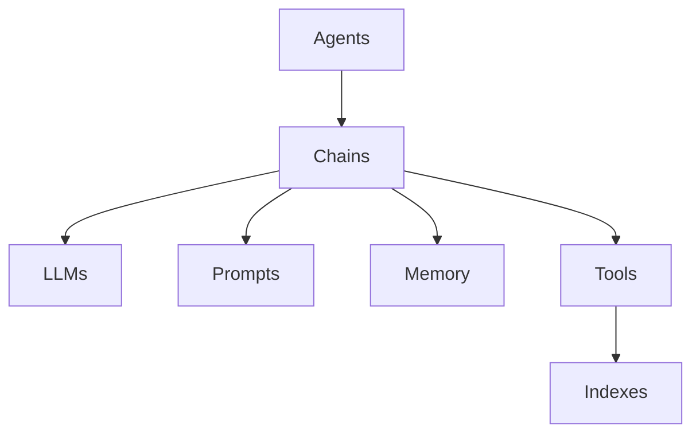
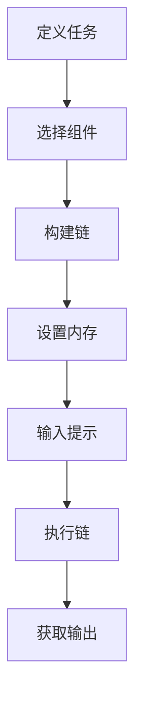
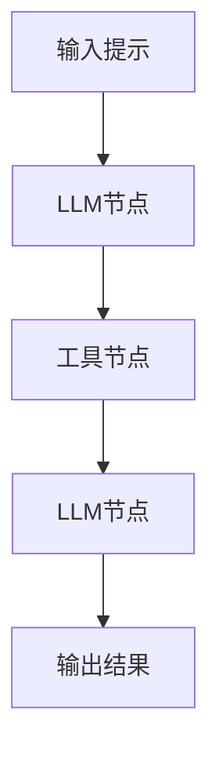

# 【LangChain编程：从入门到实践】官方博客

## 1.背景介绍

### 1.1 人工智能时代的到来

随着计算机技术和数据量的快速发展,人工智能(AI)已经从科幻电影中走进现实生活。从语音助手到自动驾驶汽车,AI无处不在。然而,构建AI系统仍然是一项艰巨的挑战,需要大量的数据、算力和编程工作。

### 1.2 LangChain的诞生

为了简化AI系统的开发过程,一个名为LangChain的Python库应运而生。LangChain旨在为AI开发者提供一个统一的编程接口,将各种大型语言模型(LLM)、数据源和其他AI组件无缝集成,从而加速AI应用程序的构建。

### 1.3 LangChain的优势

LangChain的主要优势在于:

1. **模块化设计**: 将复杂的AI系统分解为多个可重用的模块,提高了代码的可维护性和可扩展性。

2. **多模型支持**: 支持多种流行的LLM,如GPT、BERT、T5等,并提供了无缝切换的能力。

3. **数据源集成**: 能够轻松集成各种数据源,如文件、数据库、API等,为LLM提供所需的知识库。

4. **链式思维**: 通过链式组合多个LLM和其他组件,实现复杂的认知任务,如问答、总结、推理等。

5. **开源和社区支持**: LangChain拥有活跃的开源社区,持续更新和改进。

## 2.核心概念与联系

### 2.1 LangChain的核心概念

要理解LangChain,需要掌握以下几个核心概念:

1. **Agents**: 代理是LangChain中最高级别的抽象,它们封装了完成特定任务所需的所有逻辑。

2. **LLMs**: 大型语言模型(LLM)是LangChain中的核心组件,用于生成和理解自然语言。

3. **Prompts**: 提示是向LLM输入的指令或上下文,以引导其生成所需的输出。

4. **Chains**: 链是一系列预定义的步骤,用于组合多个LLM和其他组件,实现特定的任务。

5. **Memory**: 内存用于存储中间结果和上下文信息,以支持链式思维和持续对话。

6. **Tools**: 工具是指可以访问外部数据源或执行特定操作的模块,如文件读写、Web搜索等。

7. **Indexes**: 索引用于高效存储和检索大量的文本数据,为LLM提供所需的知识库。

这些概念相互关联,共同构建了LangChain的核心框架。下面是一个简单的Mermaid流程图,展示了它们之间的关系:



### 2.2 LangChain与其他AI框架的区别

与其他AI框架相比,LangChain具有以下独特之处:

1. **专注于LLM**: LangChain专门为大型语言模型(LLM)设计,而不是通用的机器学习框架。

2. **模块化设计**: LangChain采用模块化设计,使得各个组件可以独立开发和替换。

3. **链式思维**: LangChain支持通过链式组合多个LLM和其他组件来实现复杂的认知任务。

4. **数据源集成**: LangChain能够轻松集成各种数据源,为LLM提供所需的知识库。

5. **开源社区驱动**: LangChain是一个开源项目,受益于活跃的社区贡献和支持。

## 3.核心算法原理具体操作步骤

### 3.1 LangChain的工作流程

LangChain的工作流程可以概括为以下几个步骤:

1. **定义任务**: 首先,需要明确要完成的任务,如问答、总结、推理等。

2. **选择组件**: 根据任务的需求,选择合适的LLM、数据源、工具和其他组件。

3. **构建链**: 使用LangChain提供的各种链类型,将选定的组件组合成一个完整的链。

4. **设置内存**: 如果需要支持链式思维或持续对话,则需要设置合适的内存类型。

5. **输入提示**: 向链输入初始提示或上下文信息,以启动任务执行。

6. **执行链**: 链会按照预定义的步骤执行,调用各个组件完成任务。

7. **获取输出**: 最终,链会输出任务的结果,如自然语言文本、结构化数据等。

下面是一个使用Mermaid流程图展示的LangChain工作流程示例:



### 3.2 链的构建和执行

链的构建和执行是LangChain的核心部分。LangChain提供了多种预定义的链类型,如序列链、转换链、对话链等,用于满足不同的任务需求。

以序列链为例,它由多个链节点组成,每个节点可以是一个LLM、工具或其他链。序列链会按照预定义的顺序依次执行每个节点,并将前一个节点的输出作为下一个节点的输入。

下面是一个使用Mermaid流程图展示的序列链示例:



在执行过程中,序列链会按照以下步骤进行:

1. 将输入提示传递给第一个LLM节点。
2. LLM节点根据提示生成输出,作为工具节点的输入。
3. 工具节点执行特定的操作,如文件读写、Web搜索等,并将结果作为下一个LLM节点的输入。
4. 第二个LLM节点根据工具节点的输出生成最终结果。

通过灵活组合不同类型的节点,LangChain能够实现各种复杂的认知任务。同时,开发者也可以自定义链类型,以满足特殊的需求。

## 4.数学模型和公式详细讲解举例说明

### 4.1 LLM的基本原理

大型语言模型(LLM)是LangChain的核心组件,它们基于自然语言处理(NLP)和深度学习技术,能够理解和生成自然语言文本。

LLM通常采用transformer架构,其核心是自注意力机制(Self-Attention)。自注意力机制允许模型在生成每个单词时,关注输入序列中的所有其他单词,捕捉它们之间的长程依赖关系。

下面是自注意力机制的数学表达式:

$$
\text{Attention}(Q, K, V) = \text{softmax}\left(\frac{QK^T}{\sqrt{d_k}}\right)V
$$

其中:

- $Q$是查询(Query)矩阵,表示当前单词
- $K$是键(Key)矩阵,表示输入序列的其他单词
- $V$是值(Value)矩阵,表示输入序列的其他单词的表示
- $d_k$是缩放因子,用于防止点积过大导致梯度消失

通过计算查询和键之间的相似性得分,自注意力机制可以动态分配不同单词的权重,从而捕捉长程依赖关系。

### 4.2 LLM的训练方法

LLM通常采用自监督学习的方式进行训练,其中最常用的是掩码语言模型(Masked Language Modeling,MLM)和下一句预测(Next Sentence Prediction,NSP)。

在MLM中,模型需要预测被掩码(用特殊标记替换)的单词。数学上,MLM的目标是最大化掩码单词的条件概率:

$$
\mathcal{L}_{\text{MLM}} = -\mathbb{E}_{x \sim X}\left[\sum_{i=1}^{n} \log P(x_i | x_{\backslash i})\right]
$$

其中:

- $x$是输入序列
- $x_i$是第$i$个被掩码的单词
- $x_{\backslash i}$表示除了$x_i$之外的其他单词

NSP则是判断两个句子是否连续出现,目标是最大化下一句预测的准确率。

通过在大规模语料库上训练MLM和NSP,LLM可以学习到丰富的语言知识和上下文信息,从而具备强大的自然语言理解和生成能力。

## 5.项目实践:代码实例和详细解释说明

### 5.1 安装LangChain

首先,我们需要安装LangChain及其依赖项。可以使用pip命令进行安装:

```bash
pip install langchain
```

### 5.2 构建简单的问答链

下面是一个使用LangChain构建简单问答链的示例:

```python
from langchain.chains import ConversationalRetrievalChain
from langchain.llms import OpenAI
from langchain.document_loaders import TextLoader
from langchain.indexes import VectorstoreIndexCreator

# 加载文本文件
loader = TextLoader('data/state_of_the_union.txt')
documents = loader.load()

# 创建向量存储索引
index = VectorstoreIndexCreator().from_loaders([loader])

# 初始化LLM
llm = OpenAI(temperature=0)

# 构建问答链
qa = ConversationalRetrievalChain.from_llm(llm, index.vectorstore)

# 进行问答交互
query = "What did the president say about Ketanji Brown Jackson?"
result = qa({"question": query})
print(result['answer'])
```

在这个示例中,我们首先加载了一个文本文件,并使用`VectorstoreIndexCreator`创建了一个向量存储索引,用于高效检索相关文档。然后,我们初始化了一个OpenAI的LLM实例。

接下来,我们使用`ConversationalRetrievalChain`构建了一个问答链,将LLM和向量存储索引结合在一起。最后,我们输入一个问题,问答链会从索引中检索相关文档,并使用LLM生成答案。

### 5.3 使用工具进行Web搜索

LangChain还支持将各种工具集成到链中,以扩展功能。下面是一个使用`WebSearchRITRIEVER`工具进行Web搜索的示例:

```python
from langchain.agents import initialize_agent, Tool
from langchain.llms import OpenAI
from langchain.tools import WebSearchRITRIEVER

# 初始化LLM
llm = OpenAI(temperature=0)

# 创建Web搜索工具
search = WebSearchRITRIEVER(k=3)
tools = [
    Tool(
        name="Web Search",
        func=search.run,
        description="Searches the web for relevant information."
    )
]

# 初始化代理
agent = initialize_agent(tools, llm, agent="zero-shot-react-description", verbose=True)

# 进行Web搜索
query = "What is the capital of France?"
result = agent.run(query)
print(result)
```

在这个示例中,我们创建了一个`WebSearchRITRIEVER`工具,用于在Web上搜索相关信息。然后,我们将该工具与LLM结合,初始化了一个代理(`agent`)。

当我们输入一个查询时,代理会首先使用`WebSearchRITRIEVER`工具在Web上搜索相关信息,然后由LLM根据搜索结果生成最终答案。

通过集成各种工具,LangChain可以扩展LLM的功能,实现更加复杂的任务。

## 6.实际应用场景

LangChain可以应用于各种场景,包括但不限于:

### 6.1 智能问答系统

利用LangChain,我们可以构建智能问答系统,为用户提供基于知识库的准确答复。这种系统可以应用于客户服务、技术支持、教育等领域。

### 6.2 自动总结和文本摘要

LangChain能够从大量文本数据中提取关键信息,生成高质量的总结和摘要。这对于处理大量文档、新闻报道或研究论文非常有用。

### 6.3 智能写作助手

借助LangChain,我们可以开发智能写作助手,为用户提供创意灵感、文本改进建议、语法纠正等功能,提高写作效率和质量。

### 6.4 决策支持系统

LangChain可以用于构建决策支持系统,通过分析大量数据和信息,为决