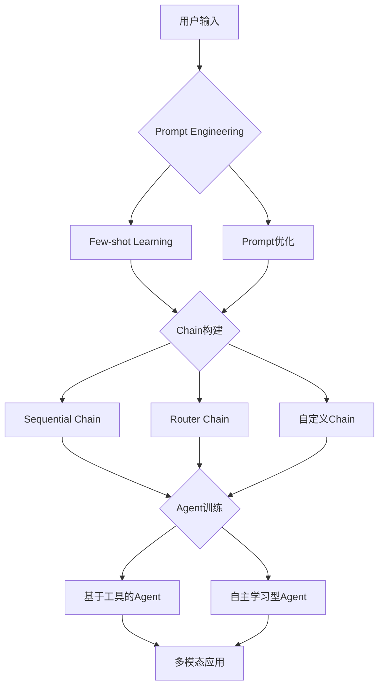

# 【LangChain编程：从入门到实践】实现多模态代理

## 1. 背景介绍
### 1.1 人工智能的发展历程
#### 1.1.1 早期人工智能的探索
#### 1.1.2 机器学习的兴起
#### 1.1.3 深度学习的突破

### 1.2 大语言模型的崛起
#### 1.2.1 Transformer架构的提出
#### 1.2.2 GPT系列模型的发展
#### 1.2.3 ChatGPT的广泛应用

### 1.3 LangChain的出现
#### 1.3.1 LangChain的定位与目标
#### 1.3.2 LangChain的核心功能
#### 1.3.3 LangChain在AI应用中的优势

## 2. 核心概念与联系
### 2.1 LangChain的核心组件
#### 2.1.1 Prompts 提示
#### 2.1.2 Models 模型
#### 2.1.3 Agents 智能体

### 2.2 LangChain中的关键概念
#### 2.2.1 Chains 链式调用
#### 2.2.2 Tools 工具集成
#### 2.2.3 Memory 记忆机制

### 2.3 LangChain与其他框架的联系
#### 2.3.1 与Hugging Face的结合
#### 2.3.2 与OpenAI API的对接
#### 2.3.3 与本地模型的集成

## 3. 核心算法原理具体操作步骤
### 3.1 Prompt Engineering
#### 3.1.1 Prompt的设计原则
#### 3.1.2 Few-shot Learning的应用
#### 3.1.3 Prompt的优化技巧

### 3.2 Chain的构建与执行
#### 3.2.1 Sequential Chain的实现
#### 3.2.2 Router Chain的应用场景
#### 3.2.3 自定义Chain的开发

### 3.3 Agent的训练与部署
#### 3.3.1 Agent的工作原理
#### 3.3.2 基于工具的Agent构建
#### 3.3.3 自主学习型Agent的实现



## 4. 数学模型和公式详细讲解举例说明
### 4.1 Transformer模型的数学原理
#### 4.1.1 Self-Attention机制
$$Attention(Q,K,V) = softmax(\frac{QK^T}{\sqrt{d_k}})V$$
其中，$Q$, $K$, $V$ 分别表示Query, Key, Value矩阵，$d_k$为Key向量的维度。

#### 4.1.2 Multi-Head Attention
$$MultiHead(Q,K,V) = Concat(head_1, ..., head_h)W^O$$
$$head_i = Attention(QW^Q_i, KW^K_i, VW^V_i)$$
其中，$W^Q_i$, $W^K_i$, $W^V_i$, $W^O$ 为可学习的权重矩阵。

#### 4.1.3 位置编码
$$PE_{(pos,2i)} = sin(pos/10000^{2i/d_{model}})$$
$$PE_{(pos,2i+1)} = cos(pos/10000^{2i/d_{model}})$$
其中，$pos$为位置，$i$为维度，$d_{model}$为词向量维度。

### 4.2 Prompt优化中的数学方法
#### 4.2.1 信息论中的互信息
$$I(X;Y) = \sum_{x \in X, y \in Y} p(x,y) \log \frac{p(x,y)}{p(x)p(y)}$$
其中，$I(X;Y)$表示随机变量$X$和$Y$之间的互信息。

#### 4.2.2 贝叶斯优化
$$x^* = \arg\max_{x \in X} f(x)$$
其中，$f(x)$为黑盒函数，$X$为搜索空间，目标是找到使$f(x)$最大化的$x^*$。

## 5. 项目实践：代码实例和详细解释说明
### 5.1 使用LangChain构建问答系统
```python
from langchain.chains import RetrievalQA
from langchain.llms import OpenAI
from langchain.document_loaders import TextLoader
from langchain.indexes import VectorstoreIndexCreator

# 加载文档
loader = TextLoader('document.txt')
documents = loader.load()

# 创建向量存储索引
index_creator = VectorstoreIndexCreator()
docsearch = index_creator.from_loaders([loader])

# 初始化问答链
chain = RetrievalQA.from_chain_type(
    llm=OpenAI(), 
    chain_type="stuff", 
    retriever=docsearch.vectorstore.as_retriever()
)

# 执行问答
query = "What is the main topic of the document?"
result = chain.run(query)
print(result)
```

上述代码展示了如何使用LangChain快速构建一个基于文档检索的问答系统。首先加载文档，然后创建向量存储索引，接着初始化问答链，最后执行问答并输出结果。

### 5.2 实现基于工具的智能对话Agent
```python
from langchain.agents import initialize_agent, Tool
from langchain.llms import OpenAI
from langchain.utilities import PythonREPL

# 定义工具
tools = [
    Tool(
        name="Python REPL",
        func=PythonREPL().run,
        description="A Python shell to execute Python code."
    )
]

# 初始化Agent
agent = initialize_agent(
    tools, 
    OpenAI(temperature=0), 
    agent="zero-shot-react-description", 
    verbose=True
)

# 执行对话
agent.run("Write a Python function to calculate the Fibonacci sequence up to n.")
```

以上代码演示了如何利用LangChain创建一个基于工具的智能对话Agent。首先定义了一个Python REPL工具，然后初始化Agent，最后执行对话任务。Agent会根据用户的输入自动选择合适的工具来完成任务。

## 6. 实际应用场景
### 6.1 智能客服
利用LangChain构建的多模态对话系统可以应用于智能客服场景，通过文本、语音、图像等多种交互方式为用户提供全方位的服务。系统可以理解用户的问题，并给出准确、有针对性的回答，大大提升客户服务的效率和质量。

### 6.2 个性化推荐
LangChain可以帮助实现个性化推荐系统，通过分析用户的行为数据、偏好等信息，利用多模态的方式为用户推荐感兴趣的内容、商品等。系统可以根据用户的反馈不断优化推荐策略，提供更加精准、贴心的服务。

### 6.3 智能教育
在教育领域，LangChain可以用于开发智能教学助手，为学生提供个性化的学习指导和辅导。系统可以根据学生的学习进度、掌握程度等因素，利用多模态交互的方式给出针对性的学习建议和练习题，帮助学生高效地学习和提升。

## 7. 工具和资源推荐
### 7.1 LangChain官方文档
LangChain的官方文档提供了详尽的教程、API参考和最佳实践指南，是学习和使用LangChain的重要资源。文档地址：https://docs.langchain.com/

### 7.2 LangChain GitHub仓库
LangChain的GitHub仓库包含了框架的源代码、示例项目和贡献指南等，是深入研究和参与LangChain开发的必备资源。仓库地址：https://github.com/hwchase17/langchain

### 7.3 LangChain社区
LangChain拥有活跃的开发者社区，用户可以通过Discord、Twitter等渠道与其他开发者交流、分享经验和寻求帮助。社区地址：https://discord.gg/6adMQxSpJS

## 8. 总结：未来发展趋势与挑战
### 8.1 多模态融合的深入探索
未来，LangChain将继续深入探索多模态融合的技术，包括视觉、语音、文本等模态的无缝集成，以实现更加自然、高效的人机交互。同时，如何处理不同模态之间的信息对齐和语义理解也是一大挑战。

### 8.2 大模型的高效应用
随着大语言模型的不断发展，如何在LangChain中高效地应用和优化这些大模型，以提升系统的性能和效果，将是一个重要的研究方向。同时，如何平衡模型的性能和计算资源的消耗也是一个需要关注的问题。

### 8.3 可解释性和可控性
在实际应用中，LangChain构建的智能系统需要具备良好的可解释性和可控性，以确保系统的决策过程透明、合理，并能够根据需求进行调整和优化。如何设计出可解释、可控的LangChain模型和算法，是未来研究的重点之一。

## 9. 附录：常见问题与解答
### 9.1 LangChain支持哪些编程语言？
LangChain目前主要支持Python语言，但也提供了JavaScript/TypeScript的实现。未来可能会支持更多的编程语言。

### 9.2 LangChain可以与哪些AI模型集成？
LangChain可以与各种主流的AI模型进行集成，包括OpenAI的GPT系列模型、Hugging Face的Transformers库中的模型、本地部署的模型等。LangChain提供了灵活的接口，方便用户进行扩展和定制。

### 9.3 LangChain的性能如何？
LangChain的性能取决于多个因素，如所使用的AI模型、数据量、硬件配置等。通过合理的优化和调整，LangChain可以在各种任务上取得较好的性能。同时，LangChain也在不断优化和改进，以提升框架的性能和效率。

作者：禅与计算机程序设计艺术 / Zen and the Art of Computer Programming