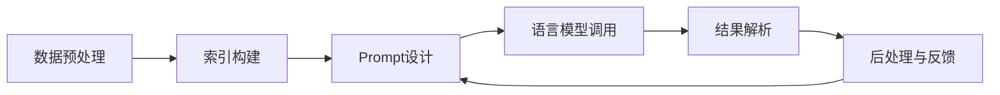

# 【LangChain编程：从入门到实践】教程用例

## 1. 背景介绍
### 1.1 人工智能与自然语言处理的发展
#### 1.1.1 人工智能的历史与现状
#### 1.1.2 自然语言处理的重要性
#### 1.1.3 人工智能在自然语言处理中的应用

### 1.2 LangChain的诞生与发展
#### 1.2.1 LangChain的起源与目标
#### 1.2.2 LangChain的发展历程
#### 1.2.3 LangChain在自然语言处理领域的地位

### 1.3 LangChain的应用前景
#### 1.3.1 LangChain在智能问答系统中的应用
#### 1.3.2 LangChain在文本生成领域的应用
#### 1.3.3 LangChain在其他自然语言处理任务中的应用潜力

## 2. 核心概念与联系
### 2.1 LangChain的核心组件
#### 2.1.1 Prompt模板
#### 2.1.2 语言模型接口
#### 2.1.3 索引与检索
#### 2.1.4 代理与工具

### 2.2 LangChain的工作流程
#### 2.2.1 数据预处理与索引构建
#### 2.2.2 Prompt设计与语言模型调用
#### 2.2.3 结果解析与后处理
#### 2.2.4 反馈与迭代优化

### 2.3 LangChain与其他自然语言处理框架的比较
#### 2.3.1 LangChain与Hugging Face的比较
#### 2.3.2 LangChain与OpenAI GPT系列的比较
#### 2.3.3 LangChain的独特优势与局限性

## 3. 核心算法原理具体操作步骤
### 3.1 Prompt模板设计与优化
#### 3.1.1 Prompt模板的基本结构
#### 3.1.2 Prompt模板的设计原则
#### 3.1.3 Prompt模板的优化策略

### 3.2 语言模型接口的使用
#### 3.2.1 OpenAI API的接入与调用
#### 3.2.2 Hugging Face Transformers的集成
#### 3.2.3 自定义语言模型接口的开发

### 3.3 索引与检索技术
#### 3.3.1 向量数据库的选择与使用
#### 3.3.2 相似度搜索算法的实现
#### 3.3.3 索引的更新与维护

### 3.4 代理与工具的开发
#### 3.4.1 代理的设计与实现
#### 3.4.2 工具的开发与集成
#### 3.4.3 代理与工具的组合与调度

## 4. 数学模型和公式详细讲解举例说明
### 4.1 语言模型的数学原理
#### 4.1.1 Transformer架构与自注意力机制
#### 4.1.2 预训练与微调的数学基础
#### 4.1.3 语言模型的评估指标与损失函数

### 4.2 向量空间模型与相似度计算
#### 4.2.1 向量空间模型的数学表示
#### 4.2.2 余弦相似度与欧几里得距离
#### 4.2.3 其他相似度计算方法及其数学原理

### 4.3 概率图模型在自然语言处理中的应用
#### 4.3.1 隐马尔可夫模型与序列标注
#### 4.3.2 条件随机场与命名实体识别
#### 4.3.3 主题模型与文本聚类

## 5. 项目实践：代码实例和详细解释说明
### 5.1 智能问答系统的开发
#### 5.1.1 数据准备与预处理
#### 5.1.2 索引构建与查询
#### 5.1.3 Prompt设计与语言模型调用
#### 5.1.4 结果解析与展示

### 5.2 文本生成应用的实现
#### 5.2.1 数据集的选择与处理
#### 5.2.2 语言模型的微调
#### 5.2.3 Prompt模板的设计与优化
#### 5.2.4 生成结果的评估与改进

### 5.3 其他自然语言处理任务的实践
#### 5.3.1 命名实体识别与关系抽取
#### 5.3.2 文本分类与情感分析
#### 5.3.3 机器翻译与多语言支持

## 6. 实际应用场景
### 6.1 智能客服与对话系统
#### 6.1.1 客户意图识别与理解
#### 6.1.2 个性化回复生成
#### 6.1.3 上下文信息的管理与利用

### 6.2 知识图谱构建与问答
#### 6.2.1 实体与关系的抽取
#### 6.2.2 知识图谱的存储与查询
#### 6.2.3 基于知识图谱的问答系统

### 6.3 内容生成与创意辅助
#### 6.3.1 文章与新闻的自动生成
#### 6.3.2 诗歌与歌词的创作辅助
#### 6.3.3 广告文案与产品描述的生成

## 7. 工具和资源推荐
### 7.1 LangChain官方文档与示例
#### 7.1.1 官方文档的结构与内容
#### 7.1.2 示例代码的运行与调试
#### 7.1.3 社区支持与交流渠道

### 7.2 相关开源项目与工具
#### 7.2.1 Hugging Face Transformers
#### 7.2.2 OpenAI API与模型
#### 7.2.3 其他自然语言处理工具与库

### 7.3 数据集与预训练模型
#### 7.3.1 常用的自然语言处理数据集
#### 7.3.2 预训练语言模型的选择与使用
#### 7.3.3 领域特定数据集的收集与处理

## 8. 总结：未来发展趋势与挑战
### 8.1 LangChain的发展方向
#### 8.1.1 更加灵活与模块化的设计
#### 8.1.2 与其他人工智能技术的融合
#### 8.1.3 面向特定领域的定制化解决方案

### 8.2 自然语言处理的未来趋势
#### 8.2.1 大规模预训练模型的发展
#### 8.2.2 多模态学习与跨领域迁移
#### 8.2.3 可解释性与公平性的研究

### 8.3 面临的挑战与机遇
#### 8.3.1 数据隐私与安全问题
#### 8.3.2 算法偏差与伦理考量
#### 8.3.3 人机协作与知识管理的新范式

## 9. 附录：常见问题与解答
### 9.1 安装与环境配置
#### 9.1.1 Python版本与依赖库的兼容性
#### 9.1.2 GPU加速与并行计算的设置
#### 9.1.3 常见的安装错误与解决方法

### 9.2 模型训练与调优
#### 9.2.1 训练数据的准备与清洗
#### 9.2.2 超参数的选择与调整
#### 9.2.3 过拟合与欠拟合的诊断与处理

### 9.3 部署与性能优化
#### 9.3.1 模型的量化与压缩
#### 9.3.2 服务化部署与负载均衡
#### 9.3.3 实时推理的加速与优化

LangChain是一个强大的自然语言处理编程框架,它提供了一系列工具和组件,帮助开发者快速构建基于语言模型的应用。本文将深入探讨LangChain的核心概念、工作原理以及在实际项目中的应用。

在背景介绍部分,我们首先回顾了人工智能和自然语言处理的发展历程,强调了LangChain在这一领域中的重要地位。接着,我们介绍了LangChain的核心组件,包括Prompt模板、语言模型接口、索引与检索以及代理与工具等,并通过一个简明的流程图展示了它们之间的关系与工作流程:

在核心算法原理部分,我们详细讲解了Prompt模板设计、语言模型接口使用、索引与检索技术以及代理与工具开发等关键步骤,并提供了具体的操作指南。同时,我们还深入探讨了LangChain所涉及的数学模型和公式,如Transformer架构、向量空间模型以及概率图模型等,帮助读者全面理解其背后的理论基础。

为了让读者更直观地了解LangChain的应用,我们提供了多个项目实践案例,包括智能问答系统、文本生成应用以及其他常见的自然语言处理任务。每个案例都包含了详细的代码实现和解释说明,读者可以根据自己的需求进行参考和改进。

在实际应用场景部分,我们展示了LangChain在智能客服、知识图谱构建、内容生成等领域的广泛应用,并分析了其中涉及的关键技术和挑战。此外,我们还推荐了一些有用的工具和资源,如官方文档、开源项目以及常用的数据集与预训练模型,以帮助读者快速入门和进阶。

最后,我们总结了LangChain的未来发展趋势,展望了自然语言处理领域的前沿方向,并讨论了面临的挑战与机遇。在附录部分,我们列出了一些常见问题与解答,涵盖了安装配置、模型训练、部署优化等方面的实用技巧。

总之,LangChain是一个功能强大、灵活易用的自然语言处理编程框架,它为开发者提供了一站式的解决方案。通过学习和掌握LangChain,我们可以快速构建出高质量的语言应用,推动人工智能技术在各个领域的应用与发展。

作者：禅与计算机程序设计艺术 / Zen and the Art of Computer Programming