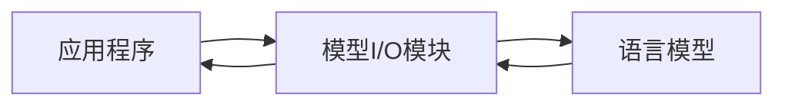

# 【LangChain编程：从入门到实践】模型I/O模块

## 1. 背景介绍
### 1.1 LangChain简介
LangChain是一个强大的AI编程框架，旨在帮助开发者构建基于语言模型的应用程序。它提供了一系列工具和组件，用于与各种语言模型进行交互，包括OpenAI的GPT系列模型、Anthropic的Claude模型等。LangChain的核心理念是将语言模型视为一种可编程的组件，通过灵活的组合和编排，可以实现复杂的自然语言处理任务。

### 1.2 模型I/O在LangChain中的重要性
在LangChain框架中，模型I/O（Input/Output）模块扮演着至关重要的角色。它负责处理与语言模型的输入和输出交互，是连接应用程序和语言模型的桥梁。通过模型I/O模块，开发者可以方便地向语言模型发送输入，并获取模型生成的输出结果。同时，模型I/O模块还提供了各种配置选项和功能，用于控制和优化模型的行为和性能。

### 1.3 本文的目的和结构
本文旨在深入探讨LangChain的模型I/O模块，帮助读者全面了解其核心概念、工作原理和实践应用。我们将从模型I/O的基本概念出发，介绍其在LangChain中的角色和功能。接下来，我们将详细阐述模型I/O的核心算法原理和操作步骤，并通过数学模型和公式进行详细讲解。此外，我们还将提供实际的代码实例，演示如何使用LangChain的模型I/O模块进行项目实践。最后，我们将探讨模型I/O在实际应用场景中的价值，并总结其未来的发展趋势和挑战。

## 2. 核心概念与联系
### 2.1 语言模型
语言模型是自然语言处理领域的核心概念之一。它是一种基于概率统计的模型，用于预测给定上下文下的下一个单词或字符。语言模型通过学习大量的文本数据，捕捉语言的统计规律和模式，从而能够生成连贯且合理的文本。在LangChain中，语言模型是构建应用程序的基础，模型I/O模块负责与语言模型进行交互。

### 2.2 Prompt工程
Prompt工程是指设计和优化输入到语言模型中的文本提示（Prompt）的过程。一个好的Prompt可以引导语言模型生成更加准确、相关和有意义的输出。在LangChain中，模型I/O模块提供了各种工具和技术，用于构建和优化Prompt，例如模板化的Prompt设计、动态Prompt生成等。通过合理的Prompt工程，可以显著提升语言模型的性能和效果。

### 2.3 模型输入与输出
模型输入是指发送给语言模型的文本数据，通常包括Prompt和其他上下文信息。模型输出则是语言模型根据输入生成的文本结果。在LangChain的模型I/O模块中，开发者可以灵活地配置和控制模型的输入和输出，例如设置输入的最大长度、调整输出的生成策略等。合理的输入和输出设置可以优化模型的性能和生成质量。

### 2.4 流程图
下面是LangChain模型I/O模块的核心概念和工作流程图：



从流程图可以看出，应用程序通过模型I/O模块与语言模型进行交互。模型I/O模块接收来自应用程序的输入，并将其转发给语言模型进行处理。语言模型根据输入生成输出，并将输出结果返回给模型I/O模块。最后，模型I/O模块将输出结果传递给应用程序进行后续处理和展示。

## 3. 核心算法原理具体操作步骤
### 3.1 模型加载与初始化
使用LangChain的模型I/O模块的第一步是加载和初始化语言模型。LangChain提供了多种语言模型的接口，例如OpenAI的GPT系列模型、Anthropic的Claude模型等。开发者需要选择合适的语言模型，并提供必要的配置参数，如API密钥、模型版本等。以下是使用OpenAI的GPT-3模型的示例代码：

```python
from langchain.llms import OpenAI

llm = OpenAI(model_name="text-davinci-002", openai_api_key="your_api_key")
```

### 3.2 Prompt构建与优化
构建合适的Prompt是使用语言模型的关键。LangChain提供了多种Prompt构建和优化的技术，例如模板化的Prompt设计、动态Prompt生成等。开发者可以根据具体的任务需求，设计出高质量的Prompt。以下是一个使用模板化Prompt的示例代码：

```python
from langchain import PromptTemplate

template = """
你是一位客服助理，请用友好的语气回答以下问题：

问题：{question}

回答：
"""

prompt = PromptTemplate(
    input_variables=["question"],
    template=template,
)

question = "如何申请退款？"
formatted_prompt = prompt.format(question=question)
```

### 3.3 模型推理与输出生成
有了合适的Prompt后，就可以将其输入到语言模型中进行推理和输出生成。LangChain的模型I/O模块提供了简单易用的接口，用于与语言模型进行交互。开发者可以通过调用相应的方法，将Prompt发送给模型，并获取生成的输出结果。以下是使用OpenAI的GPT-3模型进行推理的示例代码：

```python
output = llm(formatted_prompt)
print(output)
```

### 3.4 输出结果处理与应用
语言模型生成的输出结果通常是原始的文本形式，需要进行进一步的处理和应用。LangChain提供了各种工具和组件，用于对输出结果进行解析、提取、格式化等操作。开发者可以根据具体的应用场景，选择合适的处理方式。以下是一个提取输出结果中关键信息的示例代码：

```python
from langchain.output_parsers import RegexParser

parser = RegexParser(
    regex=r"退款流程：(.*)",
    output_keys=["refund_process"],
)

parsed_output = parser.parse(output)
refund_process = parsed_output["refund_process"]
print(refund_process)
```

## 4. 数学模型和公式详细讲解举例说明
### 4.1 语言模型的概率基础
语言模型的核心是基于概率统计的建模方法。给定一个单词序列 $w_1, w_2, \dots, w_n$，语言模型的目标是估计该序列出现的概率 $P(w_1, w_2, \dots, w_n)$。根据链式法则，可以将联合概率分解为一系列条件概率的乘积：

$$
P(w_1, w_2, \dots, w_n) = P(w_1) \times P(w_2 | w_1) \times \dots \times P(w_n | w_1, w_2, \dots, w_{n-1})
$$

其中，$P(w_i | w_1, w_2, \dots, w_{i-1})$ 表示在给定前 $i-1$ 个单词的条件下，第 $i$ 个单词出现的条件概率。

### 4.2 N-gram语言模型
N-gram语言模型是一种简单而有效的语言模型，它假设当前单词只依赖于前面的 $n-1$ 个单词。常见的N-gram模型包括Unigram（$n=1$）、Bigram（$n=2$）和Trigram（$n=3$）等。以Bigram模型为例，单词序列的概率可以近似为：

$$
P(w_1, w_2, \dots, w_n) \approx \prod_{i=1}^n P(w_i | w_{i-1})
$$

其中，$P(w_i | w_{i-1})$ 可以通过统计语料库中 $w_{i-1}$ 和 $w_i$ 共同出现的频率来估计：

$$
P(w_i | w_{i-1}) = \frac{Count(w_{i-1}, w_i)}{Count(w_{i-1})}
$$

### 4.3 神经语言模型
神经语言模型是基于深度学习的语言模型，它使用神经网络来学习单词之间的复杂依赖关系。常见的神经语言模型包括循环神经网络（RNN）、长短期记忆网络（LSTM）和Transformer等。以Transformer模型为例，它使用自注意力机制来捕捉单词之间的长距离依赖关系。给定输入单词序列 $x_1, x_2, \dots, x_n$，Transformer模型的输出概率可以表示为：

$$
P(w_i | x_1, x_2, \dots, x_n) = \text{Softmax}(W_o \cdot h_i + b_o)
$$

其中，$h_i$ 是第 $i$ 个单词的隐藏状态，通过自注意力机制和前向神经网络计算得到；$W_o$ 和 $b_o$ 是输出层的权重矩阵和偏置向量；$\text{Softmax}$ 函数将输出转换为概率分布。

## 5. 项目实践：代码实例和详细解释说明
下面是一个使用LangChain的模型I/O模块进行项目实践的完整代码示例，并对关键部分进行详细解释说明。

```python
from langchain.llms import OpenAI
from langchain import PromptTemplate
from langchain.chains import LLMChain
from langchain.output_parsers import RegexParser

# 加载和初始化语言模型
llm = OpenAI(model_name="text-davinci-002", openai_api_key="your_api_key")

# 定义Prompt模板
template = """
你是一位客服助理，请用友好的语气回答以下问题：

问题：{question}

回答：
"""

prompt = PromptTemplate(
    input_variables=["question"],
    template=template,
)

# 创建LLMChain
chain = LLMChain(llm=llm, prompt=prompt)

# 定义输出解析器
parser = RegexParser(
    regex=r"退款流程：(.*)",
    output_keys=["refund_process"],
)

# 用户输入问题
question = "如何申请退款？"

# 运行LLMChain，获取输出结果
output = chain.run(question)

# 解析输出结果，提取关键信息
parsed_output = parser.parse(output)
refund_process = parsed_output["refund_process"]

# 打印结果
print("用户问题：", question)
print("客服回答：", output)
print("退款流程：", refund_process)
```

代码解释：

1. 首先，我们加载和初始化了OpenAI的GPT-3语言模型，提供了模型名称和API密钥。
2. 接下来，我们定义了一个Prompt模板，用于生成客服助理回答问题的Prompt。模板中包含一个输入变量`question`，表示用户的问题。
3. 然后，我们创建了一个LLMChain，将语言模型和Prompt模板组合在一起。LLMChain提供了一种方便的方式来管理和运行语言模型的输入和输出。
4. 我们还定义了一个输出解析器，使用正则表达式从输出结果中提取退款流程的关键信息。
5. 用户输入一个问题，例如"如何申请退款？"。
6. 我们运行LLMChain，将用户问题传递给语言模型，并获取生成的输出结果。
7. 使用输出解析器对输出结果进行解析，提取退款流程的关键信息。
8. 最后，我们打印出用户问题、客服回答和提取的退款流程信息。

通过这个项目实践，我们展示了如何使用LangChain的模型I/O模块来构建一个简单的客服助理应用。通过合理的Prompt设计、语言模型选择和输出解析，我们可以实现自然语言问答的功能，并提取关键信息以满足具体的业务需求。

## 6. 实际应用场景
LangChain的模型I/O模块在实际应用中有广泛的应用场景，下面是几个具体的例子：

### 6.1 智能客服系统
利用LangChain的模型I/O模块，可以构建智能客服系统，自动回答用户的常见问题。通过设计合适的Prompt模板和语言模型，客服系统可以理解用户的问题，并生成相关的回答。同时，通过输出解析器，可以提取关键信息，如退款流程、订单状态等，提供更加精准和个性化的服务。

### 6.