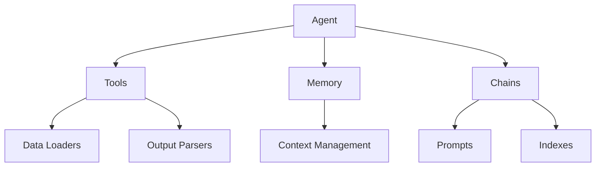

# 【LangChain编程：从入门到实践】

## 1. 背景介绍

### 1.1 什么是LangChain?

LangChain是一个用于构建应用程序的框架,旨在与大型语言模型(LLM)进行交互。它的目标是使开发人员能够轻松地构建基于LLM的应用程序,同时提供了一个模块化和可扩展的架构。LangChain支持各种LLM,如GPT、BLOOM和Anthropic等,并提供了一系列工具,用于处理输入和输出数据、执行链式推理和构建复杂的应用程序流程。

### 1.2 为什么需要LangChain?

随着大型语言模型的不断发展,它们在各种任务中展现出了惊人的能力,如自然语言处理、问答系统、内容生成等。然而,将这些模型集成到实际应用程序中仍然是一个挑战,需要处理输入数据、管理模型调用、解析输出结果等繁琐的任务。LangChain旨在简化这一过程,提供一个统一的接口和工具集,使开发人员能够专注于构建应用程序逻辑,而不必过多关注底层细节。

### 1.3 LangChain的主要特性

- **模块化设计**:LangChain采用模块化设计,使得开发人员可以轻松地组合不同的组件,如LLM、数据加载器、输出解析器等,构建复杂的应用程序流程。
- **多模型支持**:LangChain支持多种LLM,如GPT、BLOOM和Anthropic等,并提供了统一的接口,使开发人员可以轻松地切换和比较不同的模型。
- **链式推理**:LangChain允许开发人员构建链式推理流程,将多个LLM调用和其他操作链接在一起,以解决复杂的任务。
- **数据加载和处理**:LangChain提供了多种数据加载器和处理器,用于从各种来源(如文件、数据库和Web API)加载数据,并对数据进行预处理和格式化。
- **输出解析和后处理**:LangChain包含了多种输出解析器和后处理工具,用于解析LLM的输出结果,并根据需要进行进一步处理和格式化。
- **内存管理**:LangChain支持内存管理,允许开发人员在链式推理过程中保持上下文信息,提高模型的响应质量和一致性。

## 2. 核心概念与联系

### 2.1 LangChain的核心概念

LangChain的核心概念包括以下几个方面:

1. **Agents**:代理是LangChain中的核心抽象,它封装了与LLM交互的逻辑。代理可以执行各种任务,如问答、文本生成、数据分析等。
2. **Tools**:工具是代理可以使用的功能模块,例如数据加载器、Web搜索器、计算器等。代理可以调用这些工具来完成特定的任务。
3. **Memory**:内存用于在链式推理过程中保存上下文信息,以提高模型的响应质量和一致性。LangChain支持多种内存类型,如conversational memory、buffer memory等。
4. **Chains**:链是一系列代理和工具的组合,用于执行特定的任务流程。开发人员可以定义自己的链,或使用LangChain提供的预定义链。
5. **Prompts**:提示是与LLM交互时使用的文本输入,它们可以包含指令、上下文信息和示例等。LangChain提供了多种工具来管理和优化提示。
6. **Indexes**:索引用于高效地搜索和检索大量文本数据,如文档、网页等。LangChain支持多种索引类型,如向量索引、树形索引等。

### 2.2 LangChain的核心组件关系

LangChain的核心组件之间存在着紧密的关系,它们共同构建了一个完整的应用程序流程。下图展示了这些组件之间的关系:

- **Agent**:代理是核心组件,它与工具、内存、链等其他组件交互,执行特定的任务。
- **Tools**:工具提供了各种功能,如数据加载、Web搜索、计算等,供代理调用。
- **Memory**:内存用于保存上下文信息,以提高模型的响应质量和一致性。
- **Chains**:链是代理和工具的组合,用于执行特定的任务流程。
- **Prompts**:提示是与LLM交互时使用的文本输入,链会生成和管理提示。
- **Indexes**:索引用于高效地搜索和检索大量文本数据,链可以利用索引来获取相关信息。
- **Data Loaders**:数据加载器用于从各种来源加载数据,作为工具的输入。
- **Output Parsers**:输出解析器用于解析LLM的输出结果,并进行后处理和格式化。

通过这些核心组件的紧密集成,LangChain为开发人员提供了一个强大而灵活的框架,用于构建基于LLM的应用程序。

## 3. 核心算法原理具体操作步骤

LangChain的核心算法原理涉及多个方面,包括代理、链、内存管理等。下面将详细介绍这些核心算法原理的具体操作步骤。

### 3.1 代理算法原理

代理是LangChain中的核心抽象,它封装了与LLM交互的逻辑。代理算法的主要步骤如下:

1. **初始化代理**:首先需要初始化一个代理实例,指定要使用的LLM、工具、内存等配置。

2. **构建观察**:代理会根据当前的上下文信息和任务要求,构建一个观察对象。这个观察对象包含了代理需要处理的所有信息,如输入数据、上下文信息、任务描述等。

3. **选择工具**:代理会分析观察对象,并根据可用的工具列表,选择最合适的工具来执行当前任务。这个过程可能涉及到启发式搜索或其他决策算法。

4. **执行工具**:代理会调用选择的工具,并将观察对象作为输入传递给工具。工具会执行相应的操作,如加载数据、进行Web搜索、执行计算等,并返回结果。

5. **更新观察**:代理会根据工具的执行结果,更新观察对象。这可能包括添加新的信息、修改上下文或任务描述等。

6. **生成响应**:代理会基于更新后的观察对象,调用LLM生成最终的响应。这个响应可能是一个答案、一段文本或其他形式的输出。

7. **返回响应**:代理将生成的响应返回给调用方。

8. **更新内存**:如果配置了内存,代理会将当前的观察对象和响应存储在内存中,以供后续的链式推理使用。

通过这些步骤,代理可以灵活地利用各种工具和LLM,执行复杂的任务。代理算法的核心在于观察构建、工具选择和响应生成这三个环节,它们共同确定了代理的行为和输出。

### 3.2 链算法原理

链是LangChain中的另一个核心概念,它表示一系列代理和工具的组合,用于执行特定的任务流程。链算法的主要步骤如下:

1. **定义链**:开发人员需要定义一个链,指定要使用的代理、工具、内存等组件,以及它们之间的执行顺序和依赖关系。

2. **初始化链**:根据链的定义,初始化一个链实例。这个过程会创建所需的代理、工具和内存实例,并建立它们之间的连接。

3. **构建初始观察**:链会根据输入数据和任务要求,构建一个初始观察对象。

4. **执行链**:链会按照预定义的顺序和依赖关系,依次执行每个代理和工具。每个代理或工具会根据当前的观察对象执行相应的操作,并更新观察对象。

5. **传递观察**:链会将更新后的观察对象传递给下一个代理或工具,以继续执行链中的后续步骤。

6. **内存管理**:如果配置了内存,链会在执行过程中持续更新内存,以保存上下文信息。

7. **生成最终响应**:链的最后一个步骤通常是调用LLM生成最终的响应,基于整个执行过程中累积的观察对象。

8. **返回响应**:链将生成的最终响应返回给调用方。

通过链,开发人员可以将多个代理和工具组合在一起,构建复杂的任务流程。链算法的核心在于观察对象的传递和更新,以及代理和工具的有序执行。这种模块化设计使得LangChain具有很强的灵活性和可扩展性。

### 3.3 内存管理算法原理

内存管理是LangChain中的一个重要特性,它允许代理和链在执行过程中保存和利用上下文信息。内存管理算法的主要步骤如下:

1. **选择内存类型**:开发人员需要选择一种内存类型,如conversational memory、buffer memory等,根据应用程序的需求。

2. **初始化内存**:根据选择的内存类型,初始化一个内存实例。不同的内存类型可能需要不同的配置参数。

3. **加载初始内存**:如果有现有的上下文信息,可以将其加载到内存中。这可能来自于先前的对话记录、文档内容或其他数据源。

4. **更新内存**:在代理或链的执行过程中,每当有新的观察对象或响应生成时,都会将相关信息存储到内存中。这可能包括输入数据、上下文信息、中间结果或最终响应等。

5. **读取内存**:当代理或链需要访问上下文信息时,它们可以从内存中读取相关数据。这些数据将被用于构建新的观察对象或生成响应。

6. **内存压缩**:为了控制内存的大小和效率,LangChain提供了多种内存压缩算法,用于删除旧的或不相关的信息。

7. **内存持久化**:在某些情况下,可能需要将内存的内容持久化到磁盘或数据库中,以便在应用程序重启后继续使用。

通过内存管理,LangChain可以保持上下文一致性,提高模型的响应质量和相关性。不同的内存类型和压缩算法可以根据应用程序的需求进行选择和配置,实现最佳的性能和效果。

## 4. 数学模型和公式详细讲解举例说明

虽然LangChain主要是一个应用程序框架,但它也涉及一些数学模型和公式,特别是在内存管理和向量检索方面。下面将详细介绍一些常见的数学模型和公式,并给出具体的例子和说明。

### 4.1 向量空间模型

向量空间模型是一种常见的文本表示方法,它将文本映射到一个高维向量空间中。在LangChain中,向量空间模型被广泛应用于文本相似性计算、聚类和检索等任务。

假设我们有一个文本语料库$D$,包含$n$个文档$\{d_1, d_2, \dots, d_n\}$。我们可以使用一个向量嵌入模型$f$将每个文档映射到一个$m$维向量空间中,得到向量表示$\{v_1, v_2, \dots, v_n\}$,其中$v_i = f(d_i) \in \mathbb{R}^m$。

在这个向量空间中,我们可以使用各种距离度量来计算文本之间的相似性。常见的距离度量包括欧几里得距离、余弦相似度等。例如,对于两个文档向量$v_i$和$v_j$,它们的余弦相似度可以计算如下:

$$
\text{sim}_\text{cos}(v_i, v_j) = \frac{v_i \cdot v_j}{\|v_i\| \|v_j\|} = \frac{\sum_{k=1}^m v_{i,k} v_{j,k}}{\sqrt{\sum_{k=1}^m v_{i,k}^2} \sqrt{\sum_{k=1}^m v_{j,k}^2}}
$$

余弦相似度的值范围在$[-1, 1]$之间,值越大表示两