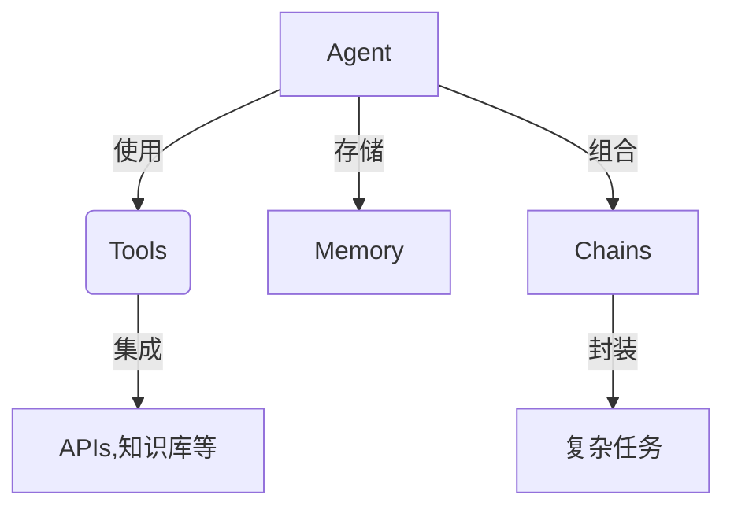
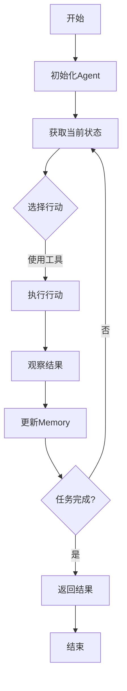

# 【LangChain编程：从入门到实践】聊天模型

## 1. 背景介绍

### 1.1 人工智能的发展历程

人工智能(Artificial Intelligence, AI)是当代科技发展的热点领域之一。自20世纪50年代AI概念被正式提出以来,经历了几个重要的发展阶段。早期的AI系统主要集中在专家系统、机器学习和自然语言处理等领域。近年来,随着计算能力的飞速提升和大数据时代的到来,AI技术取得了长足进步,尤其是深度学习在计算机视觉、自然语言处理等领域的广泛应用,推动了AI的快速发展。

### 1.2 大语言模型的兴起

在自然语言处理领域,大型预训练语言模型(Large Pre-trained Language Models, LLMs)的出现引发了广泛关注。这些模型通过在海量文本数据上进行预训练,学习了丰富的语言知识,可以生成高质量的文本输出。代表性模型包括GPT(Generative Pre-trained Transformer)、BERT(Bidirectional Encoder Representations from Transformers)等。这些模型展现出了强大的语言理解和生成能力,在机器翻译、问答系统、文本摘要等任务中表现出色。

### 1.3 聊天模型的兴起

随着大语言模型的不断进化,聊天模型(Conversational AI)成为了一个新的研究热点。聊天模型旨在与人类进行自然、流畅的对话交互,可以应用于虚拟助手、客户服务、教育等多个领域。目前,OpenAI的GPT-3、Anthropic的Claude、Google的LaMDA、以及中国的人工智能公司如百度、商汤等,都在聊天模型领域取得了重要进展。

### 1.4 LangChain的作用

LangChain是一个用于构建大型语言模型应用程序的框架。它提供了一系列模块化的构建块,可以轻松地将大语言模型与其他组件(如知识库、API等)集成,从而构建复杂的AI系统。LangChain支持多种语言模型,包括OpenAI的GPT、Anthropic的Claude、以及其他开源模型等。通过LangChain,开发者可以快速搭建聊天机器人、问答系统、文本生成应用等,极大地提高了开发效率。

## 2. 核心概念与联系

LangChain的核心概念包括Agent、Tool、Memory和Chain等,它们相互协作,构建了一个强大的AI系统。



### 2.1 Agent

Agent是LangChain中的核心概念,代表一个具有决策能力的智能体。它可以根据当前的上下文信息和目标,选择合适的工具(Tools)来执行任务。Agent通过与工具的交互,完成复杂的任务。

### 2.2 Tools

Tools是LangChain中的另一个关键概念,代表可由Agent使用的各种功能组件。Tools可以是API调用、数据库查询、文件操作等。Agent可以根据当前的上下文信息,选择合适的工具来执行特定的子任务。

### 2.3 Memory

Memory用于存储Agent在执行任务过程中的上下文信息,如对话历史、中间结果等。这些信息可以供Agent在后续的决策中使用,从而实现更加连贯、一致的交互体验。

### 2.4 Chains

Chains是LangChain中的高级概念,它将多个Agent、Tools和内存组合在一起,封装成可重用的复杂任务流程。开发者可以根据需求,灵活地构建和组合不同的Chains,从而快速搭建各种AI应用。

通过这些核心概念的紧密协作,LangChain为构建大型语言模型应用程序提供了强大的支持。开发者可以专注于定义任务流程和集成所需的组件,而无需过多关注底层的实现细节。

## 3. 核心算法原理具体操作步骤

LangChain的核心算法原理是基于代理-环境(Agent-Environment)范式。在这个范式中,Agent通过与Environment(包括Tools、Memory等)进行交互,学习完成复杂任务。具体的操作步骤如下:



1. **初始化Agent**:根据任务需求,初始化一个合适的Agent实例,并为其配置可用的Tools和Memory。

2. **获取当前状态**:Agent获取当前的上下文信息,包括对话历史、任务描述等,形成当前状态的表示。

3. **选择行动**:基于当前状态,Agent通过内部的决策机制(如语言模型)选择一个合适的行动,例如使用某个工具执行特定的子任务。

4. **执行行动**:Agent执行选择的行动,可能涉及调用API、查询数据库、进行文本生成等操作。

5. **观察结果**:Agent观察执行行动后的结果,如API返回的数据、生成的文本等。

6. **更新Memory**:Agent将执行行动的过程和结果存储到Memory中,以供后续的决策使用。

7. **任务完成判断**:Agent判断当前任务是否已经完成。如果任务已完成,则返回最终结果;否则,回到步骤2,基于更新后的Memory继续执行任务。

通过不断地与Environment交互,Agent可以逐步完成复杂的任务。这种基于代理-环境范式的算法原理,使LangChain具有很强的灵活性和可扩展性,能够应对各种复杂的AI应用场景。

## 4. 数学模型和公式详细讲解举例说明

虽然LangChain主要是一个应用层框架,但它的底层依赖于一些重要的数学模型和算法,尤其是在语言模型和决策过程中。下面我们将介绍一些核心的数学模型和公式。

### 4.1 Transformer模型

Transformer是当前主流的序列到序列(Sequence-to-Sequence)模型,广泛应用于机器翻译、文本生成等任务。它的核心是自注意力(Self-Attention)机制,能够有效地捕捉输入序列中的长程依赖关系。

自注意力机制的数学表示如下:

$$
\mathrm{Attention}(Q, K, V) = \mathrm{softmax}\left(\frac{QK^T}{\sqrt{d_k}}\right)V
$$

其中,Q(Query)、K(Key)和V(Value)是通过线性变换得到的向量表示。注意力分数通过Q和K的点积计算,然后经过softmax函数归一化,最终与V相乘得到加权和。

Transformer的编码器(Encoder)和解码器(Decoder)都采用了多头自注意力(Multi-Head Attention)机制,公式如下:

$$
\mathrm{MultiHead}(Q, K, V) = \mathrm{Concat}(\mathrm{head}_1, \dots, \mathrm{head}_h)W^O
$$

$$
\mathrm{head}_i = \mathrm{Attention}(QW_i^Q, KW_i^K, VW_i^V)
$$

其中,查询(Q)、键(K)和值(V)通过不同的线性变换得到多个头,每个头计算自己的注意力,最后将所有头的结果拼接并进行线性变换。

Transformer模型在LangChain中扮演着核心的角色,为语言理解和生成提供了强大的支持。

### 4.2 强化学习算法

在LangChain的Agent-Environment范式中,Agent需要根据当前状态选择合适的行动,以最大化任务的完成质量。这个过程可以建模为强化学习(Reinforcement Learning)问题。

强化学习的目标是找到一个策略π,使得在环境中执行该策略时,可以最大化累积奖励的期望:

$$
J(\pi) = \mathbb{E}_{\tau \sim \pi}\left[\sum_{t=0}^{T} \gamma^t r_t\right]
$$

其中,τ表示在策略π下生成的轨迹序列,r_t是第t个时刻的即时奖励,γ是折现因子。

常见的强化学习算法包括Q-Learning、Policy Gradient等。以Q-Learning为例,其核心思想是学习一个状态-行动值函数Q(s,a),表示在状态s下执行行动a后,可获得的期望累积奖励。Q函数的更新规则如下:

$$
Q(s_t, a_t) \leftarrow Q(s_t, a_t) + \alpha \left[r_t + \gamma \max_{a'} Q(s_{t+1}, a') - Q(s_t, a_t)\right]
$$

其中,α是学习率,r_t是即时奖励,γ是折现因子。

在LangChain中,可以将Agent的决策过程建模为强化学习问题,通过与Environment的交互来学习最优策略。虽然目前LangChain还没有直接集成强化学习算法,但它为将来的集成留下了空间。

### 4.3 贝叶斯推理

在一些复杂的AI任务中,我们需要根据观测到的证据来推断隐藏变量的分布。这个过程可以通过贝叶斯推理(Bayesian Inference)来实现。

贝叶斯推理的核心思想是使用贝叶斯公式来更新先验分布,得到后验分布:

$$
P(\theta | X) = \frac{P(X | \theta) P(\theta)}{P(X)}
$$

其中,θ是需要推断的隐藏变量,X是观测到的证据,P(θ)是θ的先验分布,P(X|θ)是似然函数,P(X)是证据的边际概率,P(θ|X)是θ的后验分布。

在实践中,由于后验分布通常难以直接计算,我们常采用近似推理算法,如变分推理(Variational Inference)、马尔可夫蒙特卡罗(Markov Chain Monte Carlo, MCMC)等。

虽然LangChain目前还没有直接集成贝叶斯推理算法,但它为将来的集成留下了空间。例如,在一些需要基于不完全信息做出决策的任务中,可以利用贝叶斯推理来估计隐藏变量的分布,从而指导Agent的决策过程。

通过上述数学模型和算法,LangChain为构建复杂的AI应用程序提供了坚实的理论基础。随着LangChain的不断发展,我们可以预见更多先进的模型和算法将被集成到框架中,进一步提升其性能和功能。

## 5. 项目实践:代码实例和详细解释说明

在本节中,我们将通过一个实际的代码示例,演示如何使用LangChain构建一个简单的问答系统。

### 5.1 问答系统概述

我们的目标是构建一个问答系统,能够根据给定的文本内容回答相关的问题。这个系统的工作流程如下:

1. 用户提出一个问题。
2. 系统从预先加载的文本内容中检索相关的上下文信息。
3. 系统利用语言模型,结合检索到的上下文信息,生成对问题的回答。

### 5.2 准备工作

首先,我们需要安装LangChain及其依赖项:

```bash
pip install langchain openai
```

接下来,准备一些示例文本内容,保存在`data.txt`文件中:

```
人工智能(Artificial Intelligence, AI)是一门探索如何使机器模拟人类智能行为的科学与技术。AI的研究包括机器学习、自然语言处理、计算机视觉、机器人技术等领域。

机器学习是AI的一个重要分支,它赋予计算机系统从数据中学习和改进的能力,而无需显式编程。常见的机器学习算法包括监督学习、非监督学习和强化学习等。

自然语言处理(Natural Language Processing, NLP)是AI的另一个重要领域,旨在使计算机能够理解和生成人类语言。NLP技术广泛应用于机器翻译、文本摘要、问答系统等场景。

计算机视觉(Computer Vision)是AI的一个分支,专注于使计算机能够从数字图像或视频中获取高层次的理解。计算机视觉技术在图像识别、目标检测、视频分析等领域有着广泛的应