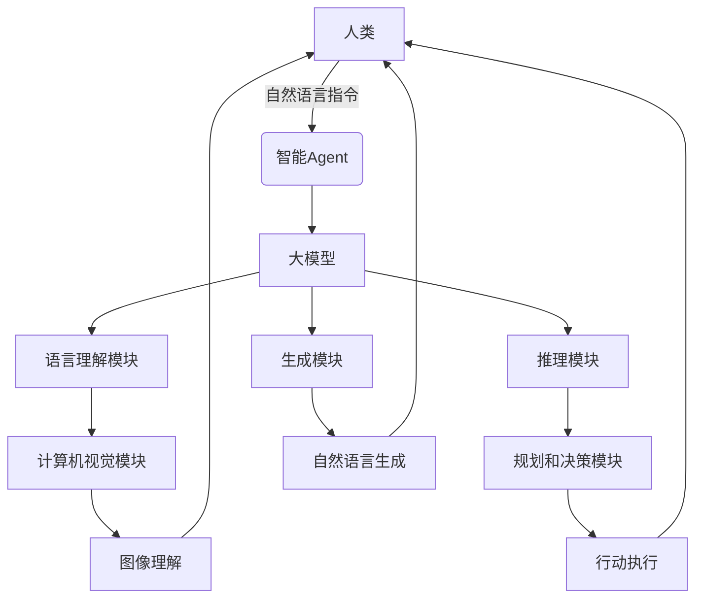

# 【大模型应用开发 动手做AI Agent】Agent的大脑：大模型的通用推理能力

## 1. 背景介绍

### 1.1 人工智能的新时代

人工智能(AI)技术的发展正在改变着我们的生活和工作方式。近年来,大型语言模型(Large Language Models, LLMs)的出现,标志着人工智能进入了一个新的里程碑。这些模型通过吸收大量的文本数据,展现出令人惊叹的自然语言理解和生成能力,为构建智能对话系统、问答系统、文本摘要和创作等应用提供了强大的支持。

### 1.2 大模型的崛起

大模型是指具有数十亿甚至上万亿个参数的深度神经网络模型。这些模型通过消化海量的数据,学习到了丰富的知识和语义表示,从而获得了强大的推理和生成能力。代表性的大模型包括 GPT-3、PaLM、ChatGPT 等,它们在自然语言处理、推理、问答等任务上表现出色,引发了广泛的关注和探索。

### 1.3 智能 Agent 的需求

随着人工智能技术的不断发展,人们对智能系统的期望也在不断提高。传统的规则系统和狭窄的人工智能模型已经无法满足日益复杂的需求。因此,构建具有通用推理能力、可以理解和回应自然语言指令的智能 Agent 成为了一个重要目标。这种智能 Agent 可以作为人类的助手,协助完成各种任务,从而大大提高工作效率和生活质量。

## 2. 核心概念与联系

### 2.1 大模型的通用推理能力

大模型的一个关键优势是其通用推理能力。通过学习海量的文本数据,大模型获得了丰富的知识和语义表示,能够理解和推理各种领域的信息。这种推理能力不仅体现在语言理解和生成上,还能够应用于各种任务,如问答、推理、规划、决策等。

### 2.2 基于大模型的智能 Agent

基于大模型的通用推理能力,我们可以构建智能 Agent,作为人类的助手来协助完成各种任务。这种智能 Agent 可以理解自然语言指令,进行推理和决策,并通过自然语言或其他方式与人类进行交互。

智能 Agent 的核心是大模型,它提供了语言理解、推理和生成的能力。同时,还需要其他模块来处理特定的任务,如计算机视觉、语音识别、规划和决策等。这些模块可以与大模型进行交互,共同完成复杂的任务。



上图展示了一个基于大模型的智能 Agent 的基本架构。人类通过自然语言指令与智能 Agent 进行交互。智能 Agent 的核心是大模型,它负责语言理解、推理和生成。同时,它与其他模块(如计算机视觉、规划和决策等)进行交互,共同完成复杂的任务。最终,智能 Agent 可以通过自然语言生成、图像理解或行动执行等方式与人类进行交互。

## 3. 核心算法原理具体操作步骤

### 3.1 大模型的训练

大模型的训练过程通常采用自监督学习(Self-Supervised Learning)的方式,利用大量的文本数据进行预训练。常见的预训练任务包括掩码语言模型(Masked Language Modeling)和下一句预测(Next Sentence Prediction)等。

1. **数据准备**：收集大量的文本数据,如网页、书籍、新闻等,并进行适当的预处理,如去除噪声、标记化等。

2. **模型架构**：选择合适的神经网络架构,如 Transformer、BERT、GPT 等,并根据需求调整模型大小和参数。

3. **预训练**：将准备好的数据输入到模型中,执行自监督学习任务,如掩码语言模型和下一句预测等,让模型学习到文本中蕴含的语义和知识。

4. **微调**：在特定任务上进行微调,使模型适应该任务的特点,提高性能。

### 3.2 基于大模型的推理

经过预训练后,大模型获得了通用的语言理解和生成能力。在实际应用中,我们可以利用这种能力进行各种推理任务。

1. **输入处理**：将人类的自然语言指令或问题转换为模型可以理解的形式,例如将文本进行标记化、编码等。

2. **上下文构建**：根据需要,为模型提供相关的上下文信息,如背景知识、任务描述等。

3. **推理过程**：将处理后的输入和上下文信息输入到大模型中,让模型进行推理和生成。

4. **输出后处理**：对模型的输出进行解码、解析和格式化,以便人类可以理解和使用。

5. **交互和反馈**：根据人类的反馈,进一步优化和调整模型的输出,实现更好的交互体验。

### 3.3 示例:基于 GPT-3 的问答系统

以 GPT-3 为例,我们可以构建一个基于大模型的问答系统。具体步骤如下:

1. **数据准备**：收集大量的问答数据对,作为 GPT-3 的训练数据。

2. **预训练**：在问答数据上进行预训练,让 GPT-3 学习到问答的模式和知识。

3. **微调**：在特定的问答任务上进行微调,提高模型在该任务上的性能。

4. **问答交互**：用户输入一个问题,系统将问题输入到 GPT-3 中,模型根据学习到的知识和模式生成答案。

5. **输出后处理**：对模型生成的答案进行格式化和优化,以提供更好的用户体验。

6. **反馈和优化**：根据用户的反馈,不断优化和改进模型的输出。

通过上述步骤,我们可以利用 GPT-3 的通用推理能力,构建一个高质量的问答系统。同时,这种基于大模型的方法也可以应用于其他任务,如对话系统、文本摘要、内容创作等。

## 4. 数学模型和公式详细讲解举例说明

### 4.1 Transformer 模型

大模型通常采用 Transformer 架构,它是一种基于自注意力机制(Self-Attention)的序列到序列模型。Transformer 模型能够有效地捕捉输入序列中的长程依赖关系,从而提高了模型的表现能力。

Transformer 模型的核心是多头自注意力机制,它可以被表示为:

$$\mathrm{MultiHead}(Q, K, V) = \mathrm{Concat}(head_1, \ldots, head_h)W^O$$

其中 $head_i = \mathrm{Attention}(QW_i^Q, KW_i^K, VW_i^V)$,

$$\mathrm{Attention}(Q, K, V) = \mathrm{softmax}(\frac{QK^T}{\sqrt{d_k}})V$$

$Q$、$K$ 和 $V$ 分别表示查询(Query)、键(Key)和值(Value)。$W_i^Q$、$W_i^K$ 和 $W_i^V$ 是可学习的线性投影矩阵,用于将输入映射到不同的子空间。$d_k$ 是缩放因子,用于防止点积过大导致的梯度饱和。

多头自注意力机制允许模型从不同的表示子空间捕捉不同的相关性,从而提高了模型的表现能力。

### 4.2 掩码语言模型

掩码语言模型(Masked Language Modeling, MLM)是一种常用的自监督学习任务,用于预训练大模型。在 MLM 任务中,模型需要根据上下文预测被掩码的单词。

具体来说,给定一个输入序列 $X = (x_1, x_2, \ldots, x_n)$,我们随机选择一些位置,将对应的单词替换为特殊的 `[MASK]` 标记,得到掩码序列 $X' = (x_1, x_2, \ldots, [MASK], \ldots, x_n)$。模型的目标是最大化掩码位置的条件概率:

$$\mathcal{L}_\mathrm{MLM} = -\mathbb{E}_{X, X'}\left[\sum_{i \in \mathrm{mask}} \log P(x_i | X')\right]$$

其中 $P(x_i | X')$ 表示在给定掩码序列 $X'$ 的情况下,正确预测第 $i$ 个位置的单词 $x_i$ 的概率。

通过优化 MLM 损失函数,模型可以学习到上下文的语义信息,从而获得强大的语言理解和生成能力。

### 4.3 示例:基于 BERT 的命名实体识别

BERT 是一种基于 Transformer 的预训练语言模型,它在 MLM 和下一句预测(Next Sentence Prediction, NSP)任务上进行了预训练。我们可以利用预训练的 BERT 模型,在命名实体识别(Named Entity Recognition, NER)任务上进行微调。

NER 任务的目标是从给定的文本中识别出实体(如人名、地名、组织名等)及其类别。我们可以将 NER 任务建模为序列标注问题,即为每个单词预测一个标签(实体类别或非实体)。

具体来说,给定一个输入序列 $X = (x_1, x_2, \ldots, x_n)$,我们需要预测对应的标签序列 $Y = (y_1, y_2, \ldots, y_n)$,其中 $y_i$ 表示第 $i$ 个单词的标签。我们可以使用 BERT 模型计算每个单词的上下文表示 $h_i$,然后通过一个线性层和 softmax 层预测标签:

$$P(y_i | X) = \mathrm{softmax}(W h_i + b)$$

在训练阶段,我们可以最小化交叉熵损失函数:

$$\mathcal{L}_\mathrm{NER} = -\frac{1}{n}\sum_{i=1}^n \log P(y_i | X)$$

通过在 NER 任务上微调 BERT 模型,我们可以利用其强大的语言理解能力,提高命名实体识别的性能。

上述示例展示了如何利用大模型的通用推理能力,并结合任务特定的微调,解决实际问题。类似的方法也可以应用于其他自然语言处理任务,如文本分类、机器翻译、问答系统等。

## 5. 项目实践:代码实例和详细解释说明

在这一部分,我们将通过一个基于 Hugging Face 的 Transformers 库的实例,演示如何利用预训练的大模型进行文本生成。

### 5.1 安装依赖

首先,我们需要安装所需的 Python 库:

```bash
pip install transformers
```

### 5.2 加载预训练模型

我们将使用 GPT-2 模型进行文本生成。Hugging Face 提供了各种预训练模型的访问接口,方便我们直接加载和使用这些模型。

```python
from transformers import GPT2LMHeadModel, GPT2Tokenizer

# 加载预训练模型和分词器
model = GPT2LMHeadModel.from_pretrained('gpt2')
tokenizer = GPT2Tokenizer.from_pretrained('gpt2')
```

### 5.3 文本生成

接下来,我们定义一个函数,用于生成给定提示(prompt)的续写文本。

```python
import torch

def generate_text(prompt, max_length=100, top_k=50, top_p=0.95, num_return_sequences=1):
    """
    生成给定提示的续写文本
    
    参数:
    prompt (str): 输入的提示文本
    max_length (int): 生成文本的最大长度
    top_k (int): 在每个解码步骤中,只考虑前 top_k 个概率最高的标记
    top_p (float): 在每个解码步骤中,只考虑累积概率达到 top_p 的标记
    num_return_sequences (int): 要生成的序列数量
    
    返回:
    generated_texts (list): 生成的文本序列