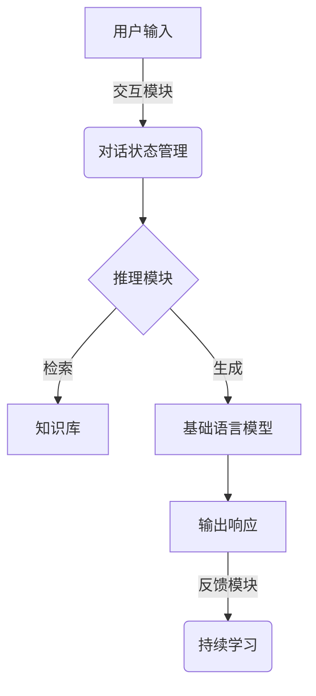

# 【大模型应用开发 动手做AI Agent】CAMEL实战

## 1.背景介绍

### 1.1 人工智能的发展历程

人工智能(Artificial Intelligence, AI)是现代科技发展的重要领域,旨在创建出能够模仿人类智能行为的机器系统。自20世纪50年代人工智能概念被正式提出以来,经历了几个重要的发展阶段。

#### 1.1.1 早期阶段(1950s-1960s)

早期人工智能主要关注逻辑推理、机器学习、机器视觉等基础理论研究,并取得了一些初步成果,如逻辑理论家推理、感知器等。但由于计算能力和数据量的限制,实际应用受到很大制约。

#### 1.1.2 知识驱动时期(1970s-1980s)  

这一阶段人工智能研究侧重于基于规则的专家系统,试图通过知识库和推理引擎来模拟人类专家的决策过程。诸如医疗诊断、金融决策等领域都建立了一些成功的应用系统。

#### 1.1.3 统计学习时期(1990s-2010s)

随着计算能力的飞速提升和大数据的出现,机器学习、深度学习等统计学习方法成为人工智能研究的主流。神经网络、支持向量机等算法在语音识别、图像识别等领域取得了突破性进展。

#### 1.1.4 大模型时代(2010s至今)

进入21世纪后,benefiting from更强大的硬件计算能力、更丰富的数据资源和新的深度学习模型,人工智能迎来了大模型的时代。大型的预训练语言模型(如GPT、BERT等)和多模态模型(如DALL-E、Stable Diffusion等)展现出了强大的泛化能力,在自然语言处理、计算机视觉等领域取得了令人惊叹的成就,推动了人工智能的快速发展。

### 1.2 大模型的兴起及其重要性

大模型是指具有数十亿甚至上万亿参数的巨大神经网络模型。这些庞大的模型通过在海量数据上进行预训练,学习到了丰富的世界知识和语义表示能力,从而在下游任务上表现出了强大的泛化性能。

大模型的兴起主要得益于以下几个关键因素:

1. **计算能力提升**: GPU和TPU等专用硬件的出现,使得训练大规模深度学习模型成为可能。
2. **数据量激增**: 互联网时代海量文本、图像、视频等数据的积累,为大模型训练提供了丰富数据源。 
3. **算法创新**: Transformer等注意力机制的提出,使得序列建模任务的性能得到极大提升。
4. **预训练范式**: 采用自监督的预训练-微调范式,使得大模型能够在有限标注数据上获得很好的泛化性能。

大模型在自然语言处理、计算机视觉、多模态等多个领域展现出了强大的能力,成为推动人工智能发展的重要驱动力。它们不仅在特定任务上表现优异,更重要的是具备跨任务的泛化能力,有望成为通用人工智能(AGI)的关键基础模块。

然而,大模型也面临着诸如训练成本高昂、能耗大、安全隐患等挑战,如何高效训练、部署和应用大模型,将是未来人工智能发展需要重点关注的课题。

## 2.核心概念与联系  

### 2.1 CAMEL模型

CAMEL(Communicative Agents for "Mind" Exploration of Learned)是一种新型的大模型,旨在创建具有交互和推理能力的人工智能代理(AI Agent)。它由OpenAI提出,是对GPT-3等大型语言模型的拓展和发展。

CAMEL模型的核心思想是:通过引入交互和推理机制,赋予语言模型更强的理解、推理和交互能力,使其不仅能够生成流畅的自然语言,还能够像人一样与用户进行自然交互、回答开放式问题、解决复杂任务。

CAMEL的设计灵感来自于"心智探索"(Mind Exploration)的概念。它将大模型视为一种类似于人类心智的系统,通过与之交互和探索,试图揭示其内在的认知过程和知识表示。

CAMEL模型由以下几个关键组件组成:

1. **基础语言模型(Base LM)**: 一个经过大规模预训练的大型语言模型,如GPT-3。
2. **交互模块(Interaction Module)**: 用于处理用户输入,管理对话状态,进行多轮交互。
3. **推理模块(Reasoning Module)**: 执行复杂的推理和决策,解决开放式问题。
4. **知识库(Knowledge Base)**: 存储结构化的领域知识,为推理过程提供支撑。
5. **反馈模块(Feedback Module)**: 根据人类反馈进行持续学习和模型改进。

通过这些模块的协同工作,CAMEL模型能够像人一样与用户进行自然交互,理解上下文,回答开放式问题,解决复杂任务,并且具备持续学习的能力。

### 2.2 CAMEL与大模型的关系

CAMEL模型可以看作是对传统大模型(如GPT-3)的拓展和增强,它在大模型的基础上引入了交互性、推理能力和持续学习机制,旨在创建更加"智能"的人工智能代理。

大模型为CAMEL提供了强大的语言理解和生成能力的基础。通过在海量数据上预训练,大模型能够学习到丰富的世界知识和语义表示,为CAMEL提供了处理自然语言的基本能力。

而CAMEL则在大模型之上,增加了交互、推理和持续学习等高级认知能力。它不仅能够生成流畅的语言,还能够像人一样进行对话交互、解答开放式问题、执行复杂推理任务。

可以说,CAMEL是在大模型的基础上,通过引入额外的模块和机制,赋予其更强的"智能"特性,使其更接近于人类智能系统。它代表了人工智能发展的一个新阶段,旨在创建出真正具备认知和推理能力的"智能代理"。

### 2.3 CAMEL与人工通用智能(AGI)的关系

人工通用智能(Artificial General Intelligence, AGI)是人工智能领域的终极目标,指能够像人一样具备广泛的理解、推理、学习、交互等认知能力的智能系统。

CAMEL模型被视为朝着AGI迈出的一个重要步伐。相比于传统的专用AI系统,CAMEL具有以下更接近AGI的特点:

1. **泛化能力强**:基于大模型预训练,CAMEL能够处理广泛的任务,不局限于某个特定领域。
2. **交互性好**:能够像人一样进行自然语言交互,而不是简单的输入输出。
3. **推理能力强**:能够执行复杂的推理和决策,解决开放式问题。
4. **持续学习**:能够根据人类反馈不断改进和学习新知识。

这些特性使得CAMEL更加贴近人类智能的本质,有望成为通向AGI的重要基础模块。

然而,要实现真正的AGI仍然是一个巨大的挑战,需要在认知架构、知识表示、推理机制、学习算法等多个方面取得重大突破。CAMEL只是朝着这一目标迈出的一小步,未来仍需要更多的创新和努力。

## 3.核心算法原理具体操作步骤

### 3.1 CAMEL模型的整体架构

CAMEL模型的整体架构如下所示的流程图:

该架构主要包括以下几个核心模块:

1. **交互模块(Interaction Module)**: 负责处理用户的自然语言输入,维护对话状态和上下文信息。
2. **推理模块(Reasoning Module)**: 根据对话状态和知识库,执行复杂的推理和决策过程,生成响应。
3. **知识库(Knowledge Base)**: 存储结构化的领域知识,为推理过程提供支撑。
4. **基础语言模型(Base LM)**: 一个大型预训练语言模型,用于生成自然语言响应。
5. **反馈模块(Feedback Module)**: 根据人类反馈,对模型进行持续学习和改进。

这些模块通过有机结合,使CAMEL模型能够像人一样进行自然语言交互、回答开放式问题、执行复杂推理任务,并且具备持续学习的能力。

### 3.2 交互模块

交互模块是CAMEL与用户进行自然语言交互的入口,其主要功能包括:

1. **输入处理**: 对用户的自然语言输入进行预处理,如分词、词性标注等。
2. **对话状态管理**: 维护当前对话的状态和上下文信息,如对话历史、焦点主题等。
3. **意图识别**: 识别用户输入的意图,如询问、命令、反馈等。
4. **上下文融合**: 将对话状态和用户输入融合,形成对推理模块的请求。

交互模块的核心是一个基于序列到序列(Seq2Seq)模型的对话管理器,能够根据当前对话状态和用户输入,生成对推理模块的请求表示。

此外,交互模块还包括一些辅助组件,如自然语言理解(NLU)模块、语音识别模块等,以支持多模态交互。

### 3.3 推理模块

推理模块是CAMEL模型的"大脑",负责根据交互模块的请求、知识库中的信息,执行复杂的推理和决策过程,生成最终的响应。

推理模块的核心是一个基于注意力机制的推理网络,能够在知识库和语言模型的支持下,执行如下关键操作:

1. **知识检索**: 根据请求,从知识库中检索相关的事实和规则。
2. **推理链规划**: 根据检索到的知识,规划出一系列推理步骤,形成推理链。
3. **逐步推理**: 沿着推理链依次执行每个推理步骤,更新中间状态。
4. **结果生成**: 根据最终推理状态,生成对应的自然语言响应。

在推理过程中,推理模块需要与基础语言模型和知识库紧密配合:

- 基础语言模型为推理过程提供语言理解和生成的支持。
- 知识库为推理过程提供必要的事实知识和规则知识。

通过将符号推理、结构化知识与大模型语义理解能力相结合,推理模块赋予了CAMEL强大的推理和决策能力。

### 3.4 知识库

知识库是CAMEL模型的核心知识源,为推理过程提供必要的支撑。它存储了结构化的事实知识和规则知识,可以是关系数据库、知识图谱或者其他形式的知识表示。

知识库中的知识可以来自多种渠道,包括:

1. **人工构建**: 由领域专家手工编写的知识库。
2. **自动构建**: 利用信息抽取等技术,从非结构化数据(如文本、网页等)自动构建知识库。
3. **模型学习**: CAMEL模型在交互过程中不断学习新知识,并持续扩充知识库。

推理模块可以根据具体的推理任务,从知识库中检索相关的事实和规则,并将它们与语言模型的语义理解能力相结合,执行复杂的推理过程。

知识库的设计是CAMEL模型的一个重要方面,需要权衡知识的广度、深度、一致性和可获取性等多个因素。一个高质量的知识库,对于提升CAMEL的推理能力至关重要。

### 3.5 基础语言模型

基础语言模型(Base LM)是CAMEL模型的另一个关键组件,为整个系统提供强大的自然语言理解和生成能力。

CAMEL中使用的基础语言模型通常是一个大型的预训练语言模型,如GPT-3、PaLM等,具有数十亿甚至上百亿参数。这些模型通过在大规模文本语料上进行预训