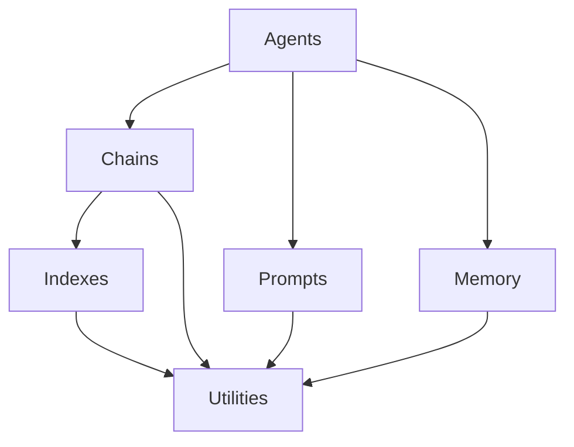
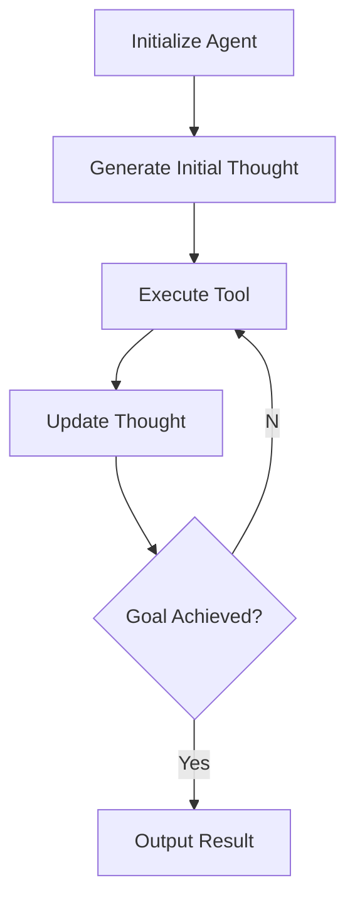

# 【大模型应用开发 动手做AI Agent】LangChain中的六大模块

## 1. 背景介绍

随着大语言模型的不断发展和应用场景的日益丰富,LangChain应运而生,成为了构建大模型应用程序的强大框架。LangChain是一个用于构建应用程序与语言模型交互的Python库,它提供了模块化和可组合的构建块,使开发人员能够轻松构建复杂的应用程序。

LangChain的核心理念是将大语言模型视为一种"程序",通过组合各种组件(如提示模板、数据加载器、链式应用等),实现与模型的高效交互。这种模块化设计使得开发人员可以专注于应用程序的逻辑,而不必过多关注底层模型的细节。

在本文中,我们将深入探讨LangChain的六大核心模块,了解它们的功能和应用场景,并通过实例代码帮助读者更好地掌握LangChain的使用方法。

## 2. 核心概念与联系

LangChain由六大核心模块组成,它们分别是:

1. **Agents**: 代理模块,用于构建具有特定目标和能力的智能代理。
2. **Chains**: 链式应用模块,用于组合多个组件以完成复杂的任务。
3. **Indexes**: 索引模块,用于构建和查询知识库。
4. **Memory**: 记忆模块,用于管理代理的上下文和状态。
5. **Prompts**: 提示模块,用于构建和管理提示模板。
6. **Utilities**: 实用工具模块,提供了一些常用的辅助函数和类。

这六大模块相互关联,共同构建了LangChain的核心功能。例如,Agents模块可以利用Chains模块构建复杂的任务流程,同时使用Prompts模块生成提示,并通过Memory模块管理上下文状态。Indexes模块则用于构建和查询知识库,为代理提供所需的信息。



## 3. 核心算法原理具体操作步骤

### 3.1 Agents模块

Agents模块是LangChain中最核心的模块之一,它提供了一种构建具有特定目标和能力的智能代理的方式。代理可以根据给定的目标和工具,自主地计划和执行一系列操作,以完成特定任务。

Agent的工作原理如下:

1. 初始化Agent时,需要指定一个语言模型(如GPT-3)和一组工具(Tools)。
2. Agent根据给定的目标,生成一个初始的思路计划(Initial Thought)。
3. 根据思路计划,Agent执行相应的工具操作,获取所需的信息或执行特定的操作。
4. Agent将工具的输出结果传递给语言模型,生成新的思路计划。
5. 重复步骤3和4,直到Agent认为目标已经完成。



以下是一个简单的示例代码,展示如何创建一个基于GPT-3的Agent,并使用它来解答问题:

```python
from langchain.agents import initialize_agent, Tool
from langchain.llms import OpenAI

# 定义工具
tools = [
    Tool(
        name="Wikipedia",
        func=lambda query: f"Wikipedia search result for '{query}'",
        description="A tool for searching Wikipedia"
    )
]

# 初始化Agent
llm = OpenAI(temperature=0)
agent = initialize_agent(tools, llm, agent="zero-shot-react-description", verbose=True)

# 运行Agent
query = "What is the capital of France?"
result = agent.run(query)
print(result)
```

在这个示例中,我们定义了一个名为"Wikipedia"的工具,它只是简单地返回一个字符串。然后,我们使用OpenAI的GPT-3模型初始化了一个Agent。最后,我们向Agent提出了一个问题,它会根据给定的工具和目标,自主地计划和执行操作,并输出最终结果。

### 3.2 Chains模块

Chains模块提供了一种组合多个组件(如提示模板、数据加载器、语言模型等)以完成复杂任务的方式。链式应用可以将多个步骤串联起来,每个步骤的输出将作为下一步骤的输入,从而实现更加复杂的功能。

LangChain提供了多种预定义的链式应用,如:

- **LLMChain**: 将语言模型作为链式应用的核心组件。
- **ConversationChain**: 用于构建对话式应用程序。
- **SequenceChain**: 将多个链式应用按顺序执行。
- **VectorDBQAChain**: 用于基于向量数据库进行问答。

以下是一个使用LLMChain的示例代码:

```python
from langchain import PromptTemplate, LLMChain
from langchain.llms import OpenAI

# 定义提示模板
template = """
Question: {question}

Answer:
"""
prompt = PromptTemplate(template=template, input_variables=["question"])

# 初始化链式应用
llm = OpenAI(temperature=0)
chain = LLMChain(prompt=prompt, llm=llm)

# 运行链式应用
question = "What is the capital of France?"
result = chain.run(question)
print(result)
```

在这个示例中,我们首先定义了一个提示模板,用于将用户的问题格式化为语言模型可以理解的输入。然后,我们使用OpenAI的GPT-3模型和提示模板初始化了一个LLMChain。最后,我们向链式应用提出了一个问题,它会将问题传递给语言模型,并输出模型的响应结果。

### 3.3 Indexes模块

Indexes模块提供了一种构建和查询知识库的方式。知识库可以是各种形式的数据,如文本文件、PDF文档、网页等。LangChain支持多种索引方式,如向量索引、文本索引等,用于高效地存储和检索知识库中的信息。

以下是一个使用向量索引的示例代码:

```python
from langchain.vectorstores import Chroma
from langchain.text_splitter import CharacterTextSplitter

# 加载数据
with open("data.txt", "r") as f:
    data = f.read()

# 分割文本
text_splitter = CharacterTextSplitter(chunk_size=1000, chunk_overlap=200)
texts = text_splitter.split_text(data)

# 创建向量索引
vectorstore = Chroma.from_texts(texts)

# 查询知识库
query = "What is the capital of France?"
results = vectorstore.similarity_search(query)
print(results)
```

在这个示例中,我们首先从文本文件中加载数据,并使用CharacterTextSplitter将文本分割成多个块。然后,我们使用Chroma向量存储库创建了一个向量索引,将分割后的文本块存储为向量表示。最后,我们可以使用`similarity_search`方法查询知识库,并获取与查询最相关的文本块。

### 3.4 Memory模块

Memory模块用于管理代理的上下文和状态。在与代理交互的过程中,代理可能需要记住之前的对话或操作,以便更好地理解当前的情况和做出正确的决策。Memory模块提供了多种不同的内存类型,如ConversationBufferMemory、ConversationEntityMemory等,用于存储和检索代理的状态信息。

以下是一个使用ConversationBufferMemory的示例代码:

```python
from langchain.agents import initialize_agent, Tool
from langchain.llms import OpenAI
from langchain.memory import ConversationBufferMemory

# 定义工具
tools = [
    Tool(
        name="Wikipedia",
        func=lambda query: f"Wikipedia search result for '{query}'",
        description="A tool for searching Wikipedia"
    )
]

# 初始化Agent
llm = OpenAI(temperature=0)
memory = ConversationBufferMemory()
agent = initialize_agent(tools, llm, agent="conversational-react-description", verbose=True, memory=memory)

# 运行Agent
query = "What is the capital of France?"
result = agent.run(query)
print(result)

# 继续对话
query = "What about the capital of Germany?"
result = agent.run(query)
print(result)
```

在这个示例中,我们使用ConversationBufferMemory初始化了一个具有记忆能力的Agent。在第一次查询后,Agent会将查询和响应存储在内存中。当我们继续提出新的查询时,Agent会根据之前的对话上下文做出响应,从而实现连贯的对话交互。

### 3.5 Prompts模块

Prompts模块用于构建和管理提示模板。提示模板是与语言模型交互的关键,它决定了模型输入的格式和内容。LangChain提供了多种预定义的提示模板,如PromptTemplate、FewShotPromptTemplate等,用于构建不同类型的提示。

以下是一个使用PromptTemplate的示例代码:

```python
from langchain import PromptTemplate, LLMChain
from langchain.llms import OpenAI

# 定义提示模板
template = """
Question: {question}

Answer:
"""
prompt = PromptTemplate(template=template, input_variables=["question"])

# 初始化链式应用
llm = OpenAI(temperature=0)
chain = LLMChain(prompt=prompt, llm=llm)

# 运行链式应用
question = "What is the capital of France?"
result = chain.run(question)
print(result)
```

在这个示例中,我们定义了一个简单的提示模板,用于将用户的问题格式化为语言模型可以理解的输入。然后,我们使用这个提示模板和OpenAI的GPT-3模型初始化了一个LLMChain。最后,我们向链式应用提出了一个问题,它会将问题传递给语言模型,并输出模型的响应结果。

### 3.6 Utilities模块

Utilities模块提供了一些常用的辅助函数和类,用于简化LangChain的使用和开发。这些实用工具包括:

- **SerpAPIWrapper**: 用于与Google搜索引擎API交互,获取搜索结果。
- **WikipediaAPIWrapper**: 用于与Wikipedia API交互,获取Wikipedia条目。
- **TextSplitter**: 用于将长文本分割成多个块。
- **OpenAIEmbeddings**: 用于使用OpenAI的嵌入模型生成文本的向量表示。

以下是一个使用SerpAPIWrapper的示例代码:

```python
from langchain.utilities import SerpAPIWrapper

# 初始化SerpAPIWrapper
search = SerpAPIWrapper()

# 进行搜索
query = "What is the capital of France?"
results = search.run(query)
print(results)
```

在这个示例中,我们首先初始化了SerpAPIWrapper。然后,我们使用`run`方法进行Google搜索,并获取搜索结果。SerpAPIWrapper会自动处理与Google搜索引擎API的交互,并返回结构化的搜索结果数据。

## 4. 数学模型和公式详细讲解举例说明

在LangChain中,数学模型和公式主要用于文本嵌入和相似性计算。文本嵌入是将文本映射到向量空间的过程,而相似性计算则用于衡量两个向量之间的相似程度。

LangChain使用了一种称为"余弦相似度"的度量方法来计算向量之间的相似性。余弦相似度的计算公式如下:

$$
\text{similarity}(A, B) = \cos(\theta) = \frac{A \cdot B}{\|A\| \|B\|} = \frac{\sum_{i=1}^{n} A_i B_i}{\sqrt{\sum_{i=1}^{n} A_i^2} \sqrt{\sum_{i=1}^{n} B_i^2}}
$$

其中 $A$ 和 $B$ 分别表示两个向量,而 $\theta$ 则是它们之间的夹角。余弦相似度的取值范围在 $[-1, 1]$ 之间,值越接近 $1$ 表示两个向量越相似。

在LangChain中,我们可以使用OpenAIEmbeddings类来生成文本的向量表示。以下是一个示例代码:

```python
from langchain.embeddings import OpenAIEmbeddings

# 初始化OpenAIEmbeddings
embeddings = OpenAIEmbeddings()

# 生成文本嵌入
text = "What is the capital of France?"
query_embedding = embeddings.embed_query(text)
print(query_embedding)
```

在这个示例中,我们首先初始化了OpenAIEmbeddings类。然后,我们使用`embed_query`方法将文本映射到向量空间,生成了一个向量表示。

生成的向量可以用于与知识库中的向量进行相似性计算,从而检索与查询最相关的文本块。以下是一个使用Chroma向量存储库进行相似性