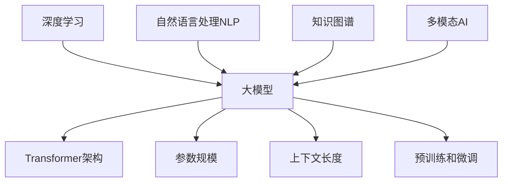
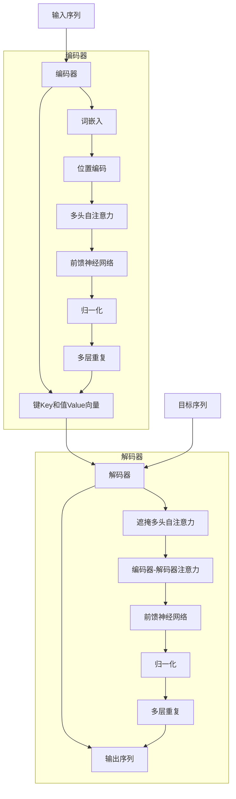
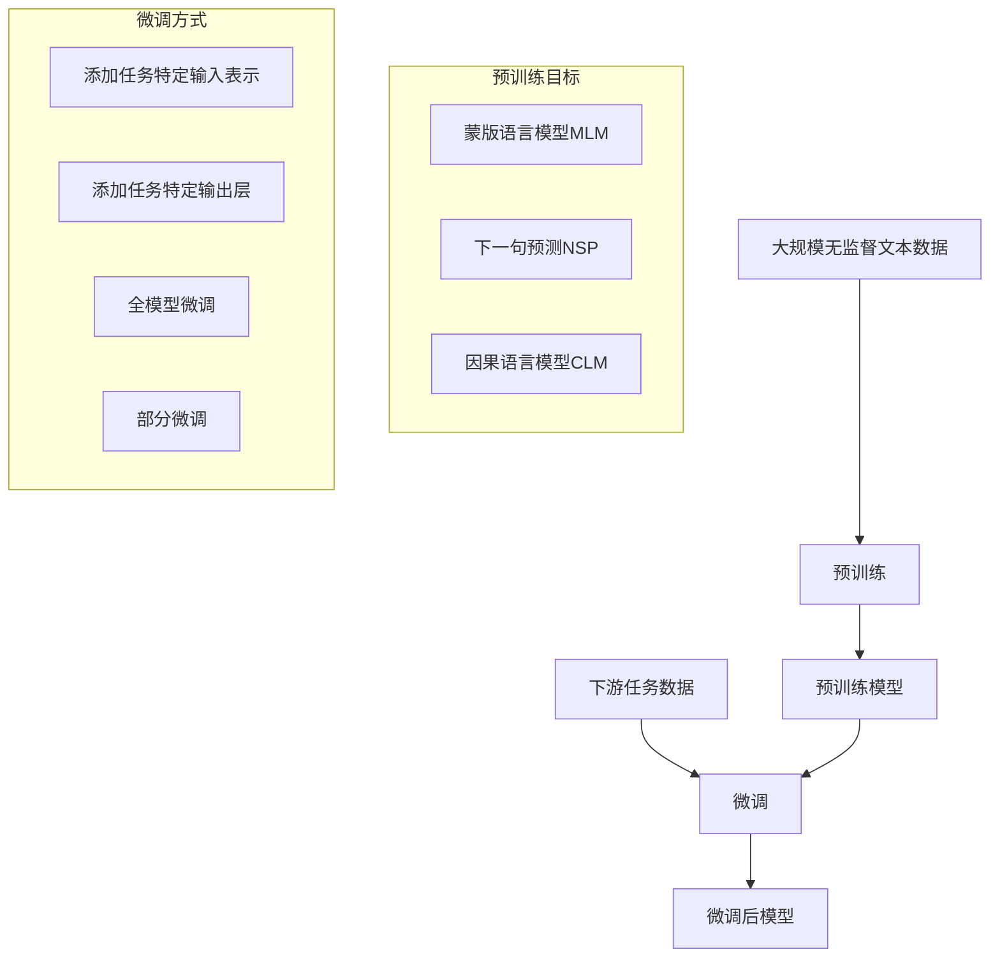

# 【大模型应用开发 动手做AI Agent】创建一个简短的虚构PPT

## 1.背景介绍

### 1.1 什么是大模型

大模型(Large Language Model, LLM)是一种基于自然语言处理(NLP)和深度学习技术训练的巨大神经网络模型。它们被训练在海量的文本数据上,旨在捕捉和学习人类语言的模式和语义,从而能够生成看似人类写作的连贯、流畅的文本输出。

大模型的出现是人工智能(AI)领域的一个重大突破,它们展现出令人惊叹的语言生成能力,在自然语言理解、问答、文本摘要、内容创作等多个领域都有广泛的应用前景。

### 1.2 大模型的发展历程

大模型的发展可以追溯到2018年,当时谷歌发布了Transformer模型,这是第一个能够高效并行训练的大型语言模型。随后,OpenAI发布了GPT(Generative Pre-trained Transformer)系列模型,包括GPT、GPT-2和GPT-3,后者拥有1750亿个参数,是当时最大的语言模型。

2020年,谷歌发布了BERT(Bidirectional Encoder Representations from Transformers)模型,它在自然语言理解任务上取得了突破性进展。此后,各大科技公司和研究机构纷纷投入大量资源开发更大更强大的语言模型,例如微软的Turing NLG、OpenAI的GPT-3、谷歌的LaMDA、DeepMind的Gopher等。

### 1.3 大模型的挑战

尽管大模型取得了令人瞩目的成就,但它们也面临着一些重大挑战:

1. **计算资源需求巨大** :训练大模型需要海量数据和极高的计算能力,导致训练成本昂贵。
2. **缺乏语义理解能力** :大模型更多是在模仿人类语言,缺乏真正的理解和推理能力。
3. **存在偏见和不当输出** :由于训练数据的局限性,大模型可能产生有偏见或不当的输出。
4. **缺乏可解释性和可控性** :大模型的内部工作机制往往是一个黑箱,难以解释和控制。
5. **隐私和安全风险** :大模型可能会泄露训练数据中的敏感信息,或被滥用于生成有害内容。

## 2.核心概念与联系

### 2.1 大模型的核心概念

- **Transformer架构** :大模型通常采用Transformer编码器-解码器架构,利用自注意力机制来捕捉输入序列中的长程依赖关系。
- **预训练和微调** :大模型首先在大规模无监督文本数据上进行预训练,获得通用的语言表示能力,然后针对特定任务进行微调(fine-tuning)。
- **参数规模** :大模型通常拥有数十亿甚至上千亿个参数,以捕捉更丰富的语言模式。
- **上下文长度** :大模型能够处理较长的文本输入,捕捉更长程的上下文信息。

### 2.2 大模型与其他AI技术的联系

大模型与其他AI技术存在密切联系:

- **深度学习** :大模型是基于深度神经网络训练而成,利用深度学习技术来学习语言表示。
- **自然语言处理(NLP)** :大模型是NLP领域的重要突破,推动了语言理解、生成、翻译等任务的发展。
- **知识图谱** :大模型可以与知识图谱相结合,融入结构化知识,提高语义理解能力。
- **多模态AI** :大模型有望与计算机视觉、语音识别等其他模态相融合,实现多模态智能。

## 3.核心算法原理具体操作步骤

### 3.1 Transformer架构

Transformer架构是大模型的核心,它包括编码器(Encoder)和解码器(Decoder)两个主要部分。

#### 3.1.1 编码器(Encoder)

编码器的主要作用是将输入序列(如文本)映射为一系列向量表示,称为键(Key)和值(Value)。具体步骤如下:

1. **词嵌入(Word Embedding)** :将每个词映射为一个固定长度的向量表示。
2. **位置编码(Positional Encoding)** :因为Transformer没有递归或卷积结构,无法直接获取序列的位置信息,因此需要为每个位置添加一个位置编码向量。
3. **多头自注意力(Multi-Head Attention)** :计算输入序列中每个词与其他词的注意力权重,捕捉长程依赖关系。
4. **前馈神经网络(Feed-Forward NN)** :对每个位置的表示进行非线性变换,提供更强的表达能力。
5. **归一化(Normalization)** :对每一层的输出进行归一化,以防止梯度消失或爆炸。

经过多个编码器层的处理,输入序列被编码为一系列键(Key)和值(Value)向量,作为解码器的输入。

#### 3.1.2 解码器(Decoder)

解码器的作用是根据编码器的输出和目标序列(如需要生成的文本),生成最终的输出序列。具体步骤如下:

1. **遮掩多头自注意力(Masked Multi-Head Attention)** :计算目标序列中每个词与其之前词的注意力权重,以保持自回归属性。
2. **编码器-解码器注意力(Encoder-Decoder Attention)** :计算目标序列中每个词与编码器输出的注意力权重,融合编码器的信息。
3. **前馈神经网络(Feed-Forward NN)** :对每个位置的表示进行非线性变换。
4. **归一化(Normalization)** :对每一层的输出进行归一化。

经过多个解码器层的处理,最终生成输出序列。在训练过程中,通过最大似然估计,最小化输出序列与真实目标序列之间的差异,从而学习模型参数。

### 3.2 预训练和微调

大模型通常采用两阶段训练策略:预训练(Pre-training)和微调(Fine-tuning)。

#### 3.2.1 预训练

在预训练阶段,模型在大规模无监督文本数据上进行训练,目标是学习通用的语言表示能力。常见的预训练目标包括:

- **蒙版语言模型(Masked Language Modeling, MLM)** :随机掩蔽输入序列中的部分词,模型需要预测被掩蔽的词。
- **下一句预测(Next Sentence Prediction, NSP)** :判断两个句子是否相邻出现。
- **因果语言模型(Causal Language Modeling, CLM)** :给定前文,预测下一个词。

通过在大规模数据上预训练,模型可以学习到丰富的语言知识,为后续的下游任务奠定基础。

#### 3.2.2 微调

在微调阶段,预训练模型在特定的下游任务数据上进行进一步训练,以适应该任务的特征。常见的微调方式包括:

- **添加任务特定的输入表示** :为输入序列添加任务相关的特殊标记或embedding。
- **添加任务特定的输出层** :在模型输出端添加用于特定任务的输出层,如分类层或回归层。
- **全模型微调** :对整个预训练模型的所有参数进行微调。
- **部分微调** :只微调预训练模型的部分层,如最后几层。

通过微调,模型可以将通用的语言知识转移到特定任务上,提高任务性能。微调通常需要较少的数据和计算资源,是一种高效的迁移学习方式。

## 4.数学模型和公式详细讲解举例说明

### 4.1 自注意力机制(Self-Attention)

自注意力机制是Transformer架构的核心,它能够捕捉输入序列中任意两个位置之间的依赖关系。给定一个长度为n的序列 $X = (x_1, x_2, ..., x_n)$,自注意力计算过程如下:

1. 将输入序列 $X$ 线性映射为查询(Query)、键(Key)和值(Value)向量:

$$
\begin{aligned}
Q &= XW^Q \\
K &= XW^K \\
V &= XW^V
\end{aligned}
$$

其中 $W^Q, W^K, W^V$ 分别是可学习的查询、键和值的权重矩阵。

2. 计算查询 $Q$ 与所有键 $K$ 的点积,获得注意力分数矩阵 $A$:

$$
A = \text{softmax}\left(\frac{QK^T}{\sqrt{d_k}}\right)
$$

其中 $d_k$ 是缩放因子,用于防止点积过大导致梯度饱和。

3. 将注意力分数矩阵 $A$ 与值向量 $V$ 相乘,得到加权和作为输出:

$$
\text{Attention}(Q, K, V) = AV
$$

自注意力机制能够自动学习输入序列中不同位置之间的相关性,捕捉长程依赖关系。

### 4.2 多头自注意力(Multi-Head Attention)

为了提高模型的表达能力和学习能力,Transformer采用了多头自注意力机制。具体来说,将查询、键和值向量进行线性变换,得到 $h$ 组不同的投影,分别计算自注意力,然后将结果拼接:

$$
\begin{aligned}
\text{head}_i &= \text{Attention}(QW_i^Q, KW_i^K, VW_i^V) \\
\text{MultiHead}(Q, K, V) &= \text{Concat}(\text{head}_1, \text{head}_2, \dots, \text{head}_h)W^O
\end{aligned}
$$

其中 $W_i^Q, W_i^K, W_i^V$ 是第 $i$ 个注意力头的线性变换权重, $W^O$ 是最终的输出线性变换权重。

多头自注意力机制允许模型从不同的子空间关注不同的位置,提高了模型的表达能力和泛化性。

### 4.3 位置编码(Positional Encoding)

由于Transformer没有递归或卷积结构,无法直接获取序列的位置信息。因此,需要为每个位置添加一个位置编码向量,将位置信息编码到序列的表示中。

常用的位置编码方式是使用正弦和余弦函数,对不同的位置赋予不同的相位:

$$
\begin{aligned}
\text{PE}_{(pos, 2i)} &= \sin\left(\frac{pos}{10000^{2i/d_\text{model}}}\right) \\
\text{PE}_{(pos, 2i+1)} &= \cos\left(\frac{pos}{10000^{2i/d_\text{model}}}\right)
\en