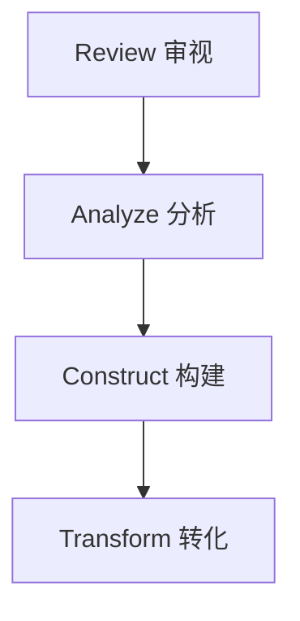

# 【大模型应用开发 动手做AI Agent】复习ReAct框架

## 1.背景介绍

### 1.1 人工智能的发展历程

人工智能(Artificial Intelligence,AI)是当代最具革命性和颠覆性的技术之一。自20世纪50年代问世以来,AI经历了几个重要的发展阶段。早期的AI系统主要基于符号推理和专家系统,具有一定局限性。21世纪初,机器学习和深度学习的兴起推动了AI的飞速发展,使AI系统能够从海量数据中自主学习,在语音识别、图像识别、自然语言处理等领域取得了突破性进展。

### 1.2 大模型的兴起

近年来,benefing from 算力、数据和算法的飞速发展,大模型(Large Language Model,LLM)应运而生。大模型是一种基于自然语言的人工智能模型,通过对海量文本数据进行预训练,掌握了丰富的自然语言知识。大模型具有强大的泛化能力,可以应用于多种自然语言处理任务,如问答、文本生成、文本摘要等,极大推动了AI的发展。

### 1.3 ReAct框架的重要性

随着大模型在各领域的广泛应用,如何高效、安全地利用大模型成为一个迫切的问题。ReAct(Review, Analyze, Construct and Transform)框架应运而生,旨在为开发人员提供一种结构化的方法,利用大模型构建人工智能应用程序(AI Agent)。本文将全面介绍ReAct框架的核心概念、算法原理、实践应用等,帮助读者掌握大模型应用开发的方法论。

## 2.核心概念与联系

### 2.1 什么是AI Agent?

AI Agent是一种基于人工智能技术的软件实体,能够感知环境、分析信息、做出决策并执行相应行为。AI Agent广泛应用于聊天机器人、智能助理、游戏AI等领域。

在ReAct框架中,AI Agent是以大模型为核心的人工智能系统,通过与用户的交互来完成特定任务。

### 2.2 ReAct框架的核心流程

ReAct框架将AI Agent的开发过程划分为四个阶段:Review(审视)、Analyze(分析)、Construct(构建)和Transform(转化)。



1. **Review(审视)**: 明确AI Agent的目标和需求,审视用户的输入和上下文信息。
2. **Analyze(分析)**: 利用大模型对用户输入进行分析和理解,提取关键信息。
3. **Construct(构建)**: 基于分析结果,构建AI Agent的响应内容。
4. **Transform(转化)**: 根据特定场景和需求,对响应内容进行转化和优化,输出最终结果。

### 2.3 ReAct框架与大模型的关系

大模型是ReAct框架的核心,在Analyze和Construct阶段发挥关键作用。

1. **Analyze阶段**: 利用大模型的自然语言理解能力,对用户输入进行语义分析和信息提取。
2. **Construct阶段**: 基于大模型的自然语言生成能力,构建AI Agent的响应内容。

同时,ReAct框架还提供了一系列辅助模块,如安全性检查、上下文管理等,确保大模型的安全、高效应用。

## 3.核心算法原理具体操作步骤

### 3.1 Review阶段

在Review阶段,需要明确AI Agent的目标和需求,审视用户的输入和上下文信息。具体步骤如下:

1. **目标确定**: 明确AI Agent要完成的任务,如问答、文本生成、决策辅助等。
2. **需求分析**: 分析用户的具体需求,包括期望的输出形式、安全性要求等。
3. **输入审视**: 审视用户的输入,包括文本、图像、音频等多模态信息。
4. **上下文获取**: 获取与当前交互相关的上下文信息,如历史对话记录、用户个人资料等。

### 3.2 Analyze阶段

在Analyze阶段,利用大模型对用户输入进行分析和理解,提取关键信息。具体步骤如下:

1. **预处理**: 对用户输入进行必要的预处理,如分词、词性标注、命名实体识别等。
2. **语义理解**: 利用大模型的自然语言理解能力,对用户输入进行语义分析,提取关键信息。
3. **知识库查询**: 根据需要,查询外部知识库,补充相关背景知识。
4. **信息融合**: 将用户输入、上下文信息和知识库信息进行融合,形成综合语义表示。

### 3.3 Construct阶段

在Construct阶段,基于Analyze阶段的分析结果,利用大模型构建AI Agent的响应内容。具体步骤如下:

1. **响应规划**: 根据AI Agent的目标和需求,规划响应的内容框架和结构。
2. **内容生成**: 利用大模型的自然语言生成能力,生成响应内容的初始版本。
3. **一致性检查**: 检查生成内容与用户输入、上下文信息的一致性,必要时进行修正。
4. **安全性检查**: 对生成内容进行安全性检查,过滤不当内容。

### 3.4 Transform阶段

在Transform阶段,根据特定场景和需求,对响应内容进行转化和优化,输出最终结果。具体步骤如下:

1. **格式转换**: 根据需求,将响应内容转换为特定格式,如文本、图像、音频等。
2. **个性化优化**: 根据用户个人资料和偏好,对响应内容进行个性化优化。
3. **交互优化**: 根据历史对话记录,优化响应内容的交互体验。
4. **输出渲染**: 将优化后的响应内容渲染为最终输出,呈现给用户。

## 4.数学模型和公式详细讲解举例说明

在ReAct框架中,大模型扮演着核心角色。本节将介绍大模型的数学原理,以及在Analyze和Construct阶段的具体应用。

### 4.1 大模型的数学原理

大模型通常采用自注意力机制(Self-Attention Mechanism)和变换器(Transformer)架构,能够有效捕捉输入序列中的长程依赖关系。

自注意力机制的核心思想是允许每个位置的输出与输入序列的其他位置相关联,捕捉序列内部的结构信息。对于长度为 $n$ 的输入序列 $\boldsymbol{x} = (x_1, x_2, \dots, x_n)$,自注意力机制计算过程如下:

$$
\begin{aligned}
\boldsymbol{q}_i &= \boldsymbol{x}_i \boldsymbol{W}^Q \\
\boldsymbol{k}_j &= \boldsymbol{x}_j \boldsymbol{W}^K \\
\boldsymbol{v}_j &= \boldsymbol{x}_j \boldsymbol{W}^V \\
\alpha_{i,j} &= \text{softmax}\left(\frac{\boldsymbol{q}_i^\top \boldsymbol{k}_j}{\sqrt{d_k}}\right) \\
\boldsymbol{z}_i &= \sum_{j=1}^n \alpha_{i,j} \boldsymbol{v}_j
\end{aligned}
$$

其中 $\boldsymbol{W}^Q$、$\boldsymbol{W}^K$、$\boldsymbol{W}^V$ 分别是查询(Query)、键(Key)和值(Value)的线性变换矩阵,用于将输入序列映射到不同的子空间;$d_k$ 是缩放因子,用于防止点积过大导致梯度消失;$\alpha_{i,j}$ 表示第 $i$ 个位置对第 $j$ 个位置的注意力权重;$\boldsymbol{z}_i$ 是第 $i$ 个位置的输出,是所有位置值的加权和。

变换器(Transformer)架构则是基于多头自注意力机制和前馈神经网络构建的编码器-解码器模型,能够高效地对序列数据进行建模。

在ReAct框架中,大模型在Analyze和Construct阶段发挥关键作用:

- **Analyze阶段**: 利用大模型的自注意力机制,对用户输入进行语义理解和信息提取。
- **Construct阶段**: 利用大模型的自然语言生成能力,构建AI Agent的响应内容。

### 4.2 示例:基于大模型的问答系统

以基于大模型的问答系统为例,介绍大模型在Analyze和Construct阶段的具体应用。

#### 4.2.1 Analyze阶段

在Analyze阶段,问答系统需要理解用户提出的问题,并从知识库中提取相关信息。

1. **问题理解**: 利用大模型的自注意力机制,对用户提出的问题进行语义分析,提取关键词和查询意图。
2. **知识库检索**: 根据提取的关键词,在知识库中检索相关段落或文档。
3. **上下文融合**: 将问题、相关知识库内容和历史对话记录进行融合,形成综合语义表示。

#### 4.2.2 Construct阶段

在Construct阶段,问答系统需要基于分析结果,生成对问题的回答。

1. **答案生成**: 利用大模型的自然语言生成能力,根据综合语义表示生成初始答案。
2. **一致性检查**: 检查生成答案与问题、知识库内容的一致性,必要时进行修正。
3. **安全性检查**: 对生成答案进行安全性检查,过滤不当内容。

通过大模型的自注意力机制和自然语言生成能力,问答系统能够高效地理解问题、检索相关知识,并生成准确、一致的答复。

## 5.项目实践:代码实例和详细解释说明

为了更好地理解ReAct框架的实践应用,本节将提供一个基于Python和Hugging Face Transformers库的代码示例,实现一个简单的问答AI Agent。

### 5.1 环境配置

首先,我们需要配置Python环境并安装必要的库:

```bash
# 创建并激活虚拟环境
python -m venv env
source env/bin/activate

# 安装依赖库
pip install transformers
```

### 5.2 加载大模型

接下来,我们加载一个预训练的大模型,在本例中使用DistilBERT模型:

```python
from transformers import AutoTokenizer, AutoModelForQuestionAnswering

tokenizer = AutoTokenizer.from_pretrained("distilbert-base-uncased-distilled-squad")
model = AutoModelForQuestionAnswering.from_pretrained("distilbert-base-uncased-distilled-squad")
```

### 5.3 实现ReAct框架

现在,我们实现ReAct框架的四个阶段:

#### 5.3.1 Review阶段

在Review阶段,我们获取用户输入的问题和上下文文本:

```python
question = "什么是人工智能?"
context = "人工智能是一门研究、开发用于模拟、延伸和扩展人类智能的理论、方法、技术及应用系统的新的技术科学。"
```

#### 5.3.2 Analyze阶段

在Analyze阶段,我们使用大模型对问题和上下文进行语义理解和信息提取:

```python
inputs = tokenizer(question, context, return_tensors="pt")
outputs = model(**inputs)
answer_start = torch.argmax(outputs.start_logits)
answer_end = torch.argmax(outputs.end_logits) + 1
answer = tokenizer.convert_tokens_to_string(tokenizer.convert_ids_to_tokens(inputs["input_ids"][0][answer_start:answer_end]))
```

#### 5.3.3 Construct阶段

在Construct阶段,我们构建AI Agent的响应内容,即问题的答案:

```python
response = f"答案: {answer}"
```

#### 5.3.4 Transform阶段

在Transform阶段,我们直接输出响应内容:

```python
print(response)
```

运行上述代码,我们将得到AI Agent的响应:

```
答案: 人工智能是一门研究、开发用于模拟、延伸和扩展人类智能的理论、方法、技术及应用系统的新的技术科学。
```

### 5.4 代码解释

在上述示例中,我们利用Hugging Face Transformers库加载了一个预训练的DistilBERT模型,用于问答任务。

在Analyze阶段,我们将问题和上下文文本输入到模型中,模型会输出两个logits向量,分别对应答案的起始位置和结束位置。我们通过取最大值的位置,从上下文文本中