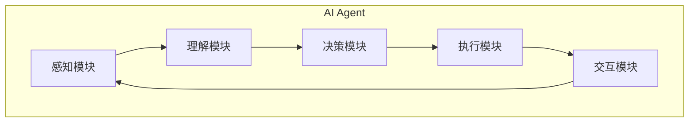

# 【大模型应用开发 动手做AI Agent】工具使用能力

## 1. 背景介绍

在当今时代，人工智能(AI)已经渗透到我们生活的方方面面。大型语言模型(Large Language Models, LLMs)作为一种强大的AI技术,正在推动着智能应用的快速发展。随着计算能力的不断提升和算法的持续优化,LLMs已经能够生成高质量、多样化的文本内容,展现出令人惊叹的语言理解和生成能力。

LLMs的崛起为构建智能应用程序(AI Agents)带来了前所未有的机遇。AI Agent是一种能够感知环境、理解指令、执行任务并与用户进行自然交互的智能系统。通过将LLMs与其他AI技术(如计算机视觉、自然语言处理等)相结合,我们可以创建出功能强大、易于使用的AI Agent,为各个领域带来革命性的变革。

本文将重点探讨如何利用LLMs及相关工具开发AI Agent应用程序。我们将深入剖析LLMs的核心概念和算法原理,介绍实现AI Agent所需的关键技术,并提供实践指南和最佳实践,帮助读者掌握AI Agent开发的全流程。

## 2. 核心概念与联系

### 2.1 大型语言模型(LLMs)

大型语言模型(LLMs)是一种基于深度学习的自然语言处理(NLP)模型,能够从大量文本数据中学习语言模式和语义关系。LLMs通常由数十亿甚至上百亿个参数组成,具有强大的语言理解和生成能力。

LLMs的核心思想是利用自注意力(Self-Attention)机制和transformer架构,捕捉输入序列中词与词之间的长程依赖关系。通过在海量语料库上进行预训练,LLMs能够学习到丰富的语言知识,并在下游任务中进行微调(Fine-tuning),展现出卓越的性能表现。

一些典型的LLMs包括:

- GPT(Generative Pre-trained Transformer)系列模型: GPT-2、GPT-3等
- BERT(Bidirectional Encoder Representations from Transformers)
- XLNet(Generalized Autoregressive Pretraining for Language Understanding)
- RoBERTa(Robustly Optimized BERT Pretraining Approach)
- ...

### 2.2 AI Agent

AI Agent是一种能够感知环境、理解指令、执行任务并与用户进行自然交互的智能系统。它通常由以下几个关键模块组成:

1. **感知模块**: 用于从环境中获取信息,如图像、文本、语音等。
2. **理解模块**: 基于LLMs等技术,对获取的信息进行理解和解析,形成对环境的表示。
3. **决策模块**: 根据理解的结果,制定行动计划并选择合适的操作。
4. **执行模块**: 执行选定的操作,可能涉及自然语言生成、图像生成等多模态输出。
5. **交互模块**: 与用户进行自然语言交互,接收指令并提供反馈。

AI Agent的核心在于将多种AI技术(如LLMs、计算机视觉、规划与决策等)有机结合,形成一个端到端的智能系统,为用户提供无缝的交互体验。



## 3. 核心算法原理具体操作步骤

### 3.1 LLMs的预训练

LLMs的预训练过程是一个自监督学习的过程,旨在从大量无标注文本数据中学习通用的语言知识。常见的预训练目标包括:

1. **蒙特卡洛采样(Masked Language Modeling, MLM)**: 随机掩蔽输入序列中的部分词,模型需要根据上下文预测被掩蔽的词。
2. **下一句预测(Next Sentence Prediction, NSP)**: 判断两个句子是否相邻出现。
3. **因果语言建模(Causal Language Modeling, CLM)**: 基于前面的词预测下一个词。

以BERT为例,其预训练过程包括以下步骤:

1. **数据预处理**: 将原始文本数据转换为模型可接受的格式(如词元化、添加特殊标记等)。
2. **构建预训练语料库**: 从多个数据源(如书籍、网页、维基百科等)收集大量文本数据,构建预训练语料库。
3. **掩蔽词元**: 随机选择输入序列中的15%的词元进行掩蔽,其中80%被替换为[MASK]标记,10%被保留不变,10%被替换为随机词元。
4. **预训练**: 使用MLM和NSP目标函数,在预训练语料库上对BERT模型进行预训练。
5. **模型优化**: 使用梯度下降等优化算法,不断调整模型参数,最小化预训练目标函数的损失。

经过大规模预训练后,BERT模型能够捕捉到丰富的语言知识,为下游任务(如文本分类、问答系统等)提供强大的语义表示能力。

### 3.2 LLMs的微调

虽然经过预训练,LLMs已经学习到了通用的语言知识,但为了在特定任务上发挥最佳性能,我们还需要对模型进行微调(Fine-tuning)。微调的过程是在预训练模型的基础上,使用任务相关的标注数据进行进一步训练,以使模型更好地适应特定任务。

以文本分类任务为例,微调过程包括以下步骤:

1. **准备训练数据**: 收集并标注与文本分类任务相关的数据集,通常包括文本输入和对应的类别标签。
2. **数据预处理**: 将训练数据转换为模型可接受的格式,例如词元化、添加特殊标记等。
3. **构建微调模型**: 在预训练模型的基础上,添加一个分类头(Classification Head),用于将模型的输出映射到任务的类别空间。
4. **微调训练**: 使用文本分类任务的训练数据,对整个模型(包括预训练部分和分类头)进行端到端的微调训练。
5. **模型评估**: 在保留的测试集上评估微调后模型的性能,根据需要进行进一步的超参数调整和模型优化。

通过微调,LLMs能够将通用的语言知识与任务特定的知识相结合,从而在下游任务上取得更好的性能表现。

## 4. 数学模型和公式详细讲解举例说明

### 4.1 自注意力机制(Self-Attention)

自注意力机制是LLMs中的核心组件,它允许模型捕捉输入序列中任意两个位置之间的依赖关系。与传统的循环神经网络(RNNs)相比,自注意力机制具有更好的并行计算能力和长期依赖捕获能力。

给定一个长度为 $n$ 的输入序列 $X = (x_1, x_2, \dots, x_n)$,自注意力机制首先计算每个位置 $i$ 与其他所有位置 $j$ 之间的注意力分数 $a_{ij}$:

$$a_{ij} = \frac{e^{s_{ij}}}{\sum_{k=1}^{n}e^{s_{ik}}}$$

其中 $s_{ij}$ 是一个基于查询(Query)、键(Key)和值(Value)的相似性打分函数,通常由以下公式计算:

$$s_{ij} = \frac{q_i^T k_j}{\sqrt{d_k}}$$

这里 $q_i$、$k_j$ 和 $v_j$ 分别表示位置 $i$ 和 $j$ 的查询、键和值向量,它们通过线性投影从输入向量 $x_i$ 和 $x_j$ 得到。$d_k$ 是键向量的维度,用于缩放点积。

接下来,自注意力机制会根据注意力分数 $a_{ij}$ 对值向量 $v_j$ 进行加权求和,得到位置 $i$ 的输出向量 $y_i$:

$$y_i = \sum_{j=1}^{n}a_{ij}v_j$$

通过这种方式,自注意力机制能够捕捉输入序列中任意两个位置之间的依赖关系,从而更好地建模长程上下文信息。

### 4.2 transformer架构

transformer是LLMs中广泛采用的一种架构,它完全基于自注意力机制,避免了RNNs中的递归计算,从而具有更好的并行性和计算效率。

transformer的核心组件包括编码器(Encoder)和解码器(Decoder)。编码器用于处理输入序列,生成其对应的上下文表示;解码器则根据编码器的输出和目标序列,生成最终的输出序列。

以机器翻译任务为例,transformer的工作流程如下:

1. 将源语言句子 $X$ 输入编码器,编码器通过多层自注意力和前馈网络,计算出 $X$ 的上下文表示 $C_X$。
2. 将目标语言句子的起始标记 $\langle$bos$\rangle$ 输入解码器,解码器会基于 $C_X$ 和 $\langle$bos$\rangle$,通过自注意力和编码器-解码器注意力机制,预测第一个目标词 $y_1$。
3. 将预测的 $y_1$ 作为输入,重复步骤2,预测下一个目标词 $y_2$。
4. 重复步骤3,直到预测出终止标记 $\langle$eos$\rangle$,得到完整的目标语言翻译 $Y = (y_1, y_2, \dots, y_n)$。

transformer架构的自注意力机制和残差连接设计,使其能够有效地捕捉长程依赖关系,同时避免了梯度消失和爆炸问题。这种架构在机器翻译、文本生成等任务中表现出色,成为LLMs的主流选择。

## 5. 项目实践:代码实例和详细解释说明

在本节中,我们将通过一个实际案例,演示如何使用Python和Hugging Face Transformers库来微调一个LLM模型,用于文本分类任务。

### 5.1 准备数据集

我们将使用一个常见的文本分类数据集:IMDB电影评论数据集。该数据集包含50,000条电影评论,每条评论都被标记为"正面"或"负面"情感。我们将使用该数据集训练一个二分类模型,对新的电影评论进行情感分类。

```python
from datasets import load_dataset

dataset = load_dataset("imdb")
```

### 5.2 数据预处理

接下来,我们需要对数据进行预处理,将文本转换为模型可接受的格式。我们将使用Hugging Face的`AutoTokenizer`来执行词元化和编码操作。

```python
from transformers import AutoTokenizer

model_name = "bert-base-uncased"
tokenizer = AutoTokenizer.from_pretrained(model_name)

def preprocess_data(examples):
    return tokenizer(examples["text"], truncation=True, padding="max_length", max_length=512)

tokenized_datasets = dataset.map(preprocess_data, batched=True, remove_columns=["text"])
```

### 5.3 微调BERT模型

现在,我们可以加载预训练的BERT模型,并在IMDB数据集上进行微调。我们将使用Hugging Face的`AutoModelForSequenceClassification`作为分类头,并使用`Trainer`API进行训练。

```python
from transformers import AutoModelForSequenceClassification, TrainingArguments, Trainer

model = AutoModelForSequenceClassification.from_pretrained(model_name, num_labels=2)

training_args = TrainingArguments(
    output_dir="./results",
    evaluation_strategy="epoch",
    learning_rate=2e-5,
    per_device_train_batch_size=16,
    per_device_eval_batch_size=16,
    num_train_epochs=3,
    weight_decay=0.01,
)

trainer = Trainer(
    model=model,
    args=training_args,
    train_dataset=tokenized_datasets["train"],
    eval_dataset=tokenized_datasets["test"],
    tokenizer=tokenizer,
)

trainer.train()
```

在训练过程中,BERT模型将根据IMDB数据集进行微调,学习将文本映射到"正面"或"负面"情感标签的能力。

### 5.4 模型评估和预测

训练完成后,我们可以在测试集上评估模型的性能,并对新的电影评论进行情感分类预测。

```python
eval_result = trainer.evaluate()
print(f"Evaluation result: {eval_result}")

test_review