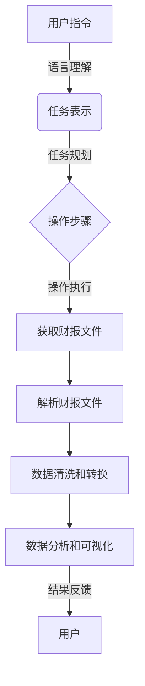

# 【大模型应用开发 动手做AI Agent】获取并加载电商的财报文件

## 1.背景介绍

### 1.1 大模型在企业中的应用

随着人工智能技术的不断发展,大型语言模型(Large Language Model,LLM)在企业中的应用日益广泛。LLM具有出色的自然语言理解和生成能力,可以帮助企业自动化各种任务,如客户服务、内容创作、数据分析等。其中,LLM在企业财务领域的应用尤为突出。

### 1.2 财报数据的重要性

财务报告是企业经营状况的重要体现,包含了公司的收入、支出、资产负债等关键信息。对于投资者、分析师和监管机构来说,及时获取并理解财报数据是制定投资策略、进行风险评估和监管的关键。然而,手工收集和分析财报数据是一项极其耗时且容易出错的工作。

### 1.3 AI Agent在财报数据处理中的作用

在这种背景下,AI Agent(智能代理)应运而生。AI Agent是一种基于LLM的智能系统,能够根据用户的自然语言指令执行各种任务。在财报数据处理领域,AI Agent可以自动从各种来源获取财报文件,并对其进行解析和分析,为用户提供所需的信息。这不仅大大提高了工作效率,而且降低了人为错误的风险。

## 2.核心概念与联系

### 2.1 大型语言模型(LLM)

LLM是一种基于深度学习的自然语言处理模型,通过在大量文本数据上进行训练,学习到了丰富的语言知识和上下文理解能力。常见的LLM包括GPT-3、BERT、XLNet等。这些模型可以用于各种自然语言处理任务,如文本生成、机器翻译、问答系统等。

### 2.2 AI Agent

AI Agent是一种基于LLM的智能系统,能够根据用户的自然语言指令执行各种任务。它由三个主要组件构成:

1. **语言理解模块**:将用户的自然语言指令转换为结构化的任务表示。
2. **任务规划模块**:根据任务表示生成一系列操作步骤。
3. **操作执行模块**:执行每个操作步骤,并将结果反馈给用户。

AI Agent的核心在于将LLM的语言理解和生成能力与外部数据源和工具相结合,实现端到端的任务自动化。

### 2.3 财报数据处理流程

财报数据处理的主要流程包括:

1. **获取财报文件**:从公司网站、监管机构网站等渠道下载财报文件。
2. **解析财报文件**:将财报文件(通常为PDF或HTML格式)解析为结构化数据。
3. **数据清洗和转换**:对解析后的数据进行清洗和转换,以适应后续分析需求。
4. **数据分析和可视化**:对处理后的数据进行分析和可视化,以获取有价值的见解。

AI Agent可以参与到这个流程的每一个环节,提高效率和准确性。



## 3.核心算法原理具体操作步骤

### 3.1 获取财报文件

获取财报文件是整个流程的第一步,也是最关键的一步。常见的获取渠道包括:

1. **公司网站**:大多数上市公司都会在其官方网站上发布年度报告、季度报告等财务文件。
2. **监管机构网站**:如美国证券交易委员会(SEC)的EDGAR系统,中国证监会的公告系统等。
3. **第三方数据提供商**:一些专门从事财经数据服务的公司,如彭博(Bloomberg)、汤森路透(Thomson Reuters)等。

AI Agent需要根据用户指定的公司名称、报告类型和时间范围,自动从这些渠道下载相应的财报文件。这通常需要进行网页爬虫、API调用等操作。

以获取亚马逊(Amazon)2022年第四季度财报为例,具体步骤如下:

1. 用户输入指令:"获取亚马逊2022年第四季度财报"。
2. AI Agent解析指令,确定需要获取的是亚马逊公司、2022年第四季度、财务报告文件。
3. AI Agent访问亚马逊的投资者关系网站,定位到最新的季度报告链接。
4. AI Agent下载该季度报告文件(通常为PDF格式)。
5. AI Agent将下载的文件存储到本地或云端,以备后续处理。

### 3.2 解析财报文件

获取到财报文件后,需要将其解析为结构化的数据格式,以便进行后续的清洗、转换和分析操作。由于财报文件通常是PDF或HTML格式,解析过程较为复杂。

常见的解析方法包括:

1. **基于模板的解析**:根据财报文件的固定格式和布局,使用预定义的模板进行解析。这种方法适用于结构相对固定的财报文件。
2. **基于规则的解析**:根据一些预定义的规则(如关键词、数字模式等)来识别和提取相关信息。这种方法适用于结构相对灵活的财报文件。
3. **基于机器学习的解析**:使用深度学习模型(如OCR、序列标注等)自动识别和提取文本和表格中的关键信息。这种方法具有较强的泛化能力,但需要大量的训练数据。

以解析亚马逊2022年第四季度财报为例,具体步骤如下:

1. AI Agent使用OCR技术从PDF文件中提取文本内容。
2. AI Agent根据预定义的规则识别出关键部分,如营收、净利润、现金流等。
3. AI Agent将识别出的数据提取到结构化的数据格式中,如CSV或JSON。

### 3.3 数据清洗和转换

解析后的数据通常需要进一步的清洗和转换,以满足后续分析的需求。常见的操作包括:

1. **去重和填充缺失值**:由于解析过程中可能存在重复数据或缺失值,需要进行去重和填充操作。
2. **格式转换**:将数据转换为统一的格式,如日期格式、货币格式等。
3. **数据规范化**:将数据转换为标准化的形式,如将绝对值转换为相对值(百分比)等。
4. **数据聚合**:根据需求对数据进行聚合,如按季度、年度等维度进行汇总。

以处理亚马逊2022年第四季度财报数据为例,具体步骤如下:

1. AI Agent检查解析后的数据,发现存在一些重复的行和缺失的值。
2. AI Agent对重复的行进行去重,对缺失的值进行填充(如使用前一个值或后一个值填充)。
3. AI Agent将日期格式统一转换为"yyyy-mm-dd"的形式,将货币值统一转换为美元。
4. AI Agent将绝对值转换为相对值,如将营收转换为同比增长率。
5. AI Agent按季度对数据进行聚合,生成按季度汇总的数据集。

### 3.4 数据分析和可视化

经过前面的步骤,我们已经获得了结构化、清洗后的财报数据。接下来,就可以对这些数据进行分析和可视化,以获取有价值的见解。

常见的分析方法包括:

1. **描述性统计分析**:计算均值、中位数、方差等统计量,了解数据的整体分布情况。
2. **趋势分析**:绘制时序图,分析数据随时间的变化趋势。
3. **相关性分析**:计算不同指标之间的相关系数,发现潜在的关联关系。
4. **回归分析**:建立回归模型,探究不同因素对目标指标的影响程度。
5. **聚类分析**:根据数据的相似性将其划分为不同的群组。

常见的可视化方法包括:

1. **折线图**:展示数据随时间的变化趋势。
2. **柱状图**:比较不同类别或时间点的数据大小。
3. **散点图**:展示两个变量之间的关系。
4. **热力图**:使用颜色深浅表示数据的大小。
5. **树状图**:展示分层数据的结构。

以分析亚马逊2022年第四季度财报数据为例,具体步骤如下:

1. AI Agent计算营收、净利润等关键指标的描述性统计量,了解它们的整体分布情况。
2. AI Agent绘制营收、净利润等指标的时序图,分析其随时间的变化趋势。
3. AI Agent计算营收与净利润之间的相关系数,探究两者之间的关联关系。
4. AI Agent建立多元线性回归模型,分析影响净利润的主要因素及其影响程度。
5. AI Agent使用聚类算法,将不同季度的数据划分为几个群组,探究不同群组的特征。
6. AI Agent绘制折线图展示营收和净利润的趋势,绘制柱状图比较不同季度的数据大小,绘制散点图展示营收与净利润的关系。

通过上述分析和可视化,我们可以深入理解公司的财务状况,为投资决策和风险评估提供有力支持。

## 4.数学模型和公式详细讲解举例说明

在财报数据分析过程中,常常需要使用一些数学模型和公式。下面我们将详细介绍其中的几个常用模型和公式。

### 4.1 相关性分析

相关性分析旨在发现两个或多个变量之间的关联关系。常用的相关性度量包括**皮尔逊相关系数**和**斯皮尔曼相关系数**。

#### 4.1.1 皮尔逊相关系数

皮尔逊相关系数(Pearson Correlation Coefficient)是衡量两个连续变量线性相关程度的统计量,取值范围为[-1,1]。皮尔逊相关系数的计算公式如下:

$$r=\frac{\sum_{i=1}^{n}(x_i-\bar{x})(y_i-\bar{y})}{\sqrt{\sum_{i=1}^{n}(x_i-\bar{x})^2}\sqrt{\sum_{i=1}^{n}(y_i-\bar{y})^2}}$$

其中,n为样本数,$x_i$和$y_i$分别表示第i个样本的x值和y值,$\bar{x}$和$\bar{y}$分别表示x和y的均值。

相关系数的绝对值越大,说明两个变量之间的线性相关程度越高。当r=1时,表示两个变量存在完全正相关;当r=-1时,表示两个变量存在完全负相关;当r=0时,表示两个变量不存在线性相关关系。

#### 4.1.2 斯皮尔曼相关系数

斯皮尔曼相关系数(Spearman's Rank Correlation Coefficient)是基于变量的排名而不是实际值来计算的非参数相关性统计量,适用于变量之间存在非线性关系的情况。斯皮尔曼相关系数的计算公式如下:

$$\rho=1-\frac{6\sum_{i=1}^{n}d_i^2}{n(n^2-1)}$$

其中,n为样本数,$d_i$表示第i个样本的x值和y值的排名差。

与皮尔逊相关系数类似,斯皮尔曼相关系数的取值范围也是[-1,1],绝对值越大表示相关性越强。

让我们以亚马逊的财报数据为例,计算一下营收和净利润之间的皮尔逊相关系数和斯皮尔曼相关系数:

```python
import pandas as pd
from scipy.stats import pearsonr, spearmanr

# 读取财报数据
data = pd.read_csv('amazon_financials.csv')

# 计算皮尔逊相关系数
r, p_value = pearsonr(data['Revenue'], data['Net Income'])
print(f"Pearson Correlation Coefficient: {r:.2f}")

# 计算斯皮尔曼相关系数
rho, p_value = spearmanr(data['Revenue'], data['Net Income'])
print(f"Spearman's Rank Correlation Coefficient: {rho:.2f}")
```

输出结果:

```
Pearson