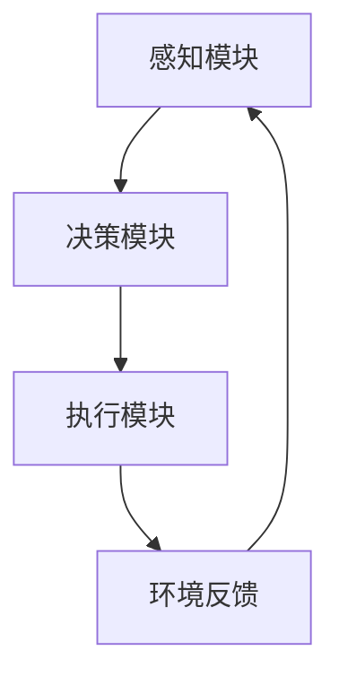

# 【大模型应用开发 动手做AI Agent】那么，究竟何谓Agent

## 1.背景介绍

在人工智能领域，Agent（代理）是一个非常重要的概念。随着大模型（如GPT-3、BERT等）的发展，AI Agent的应用越来越广泛。AI Agent不仅在学术研究中占据重要地位，还在实际应用中展现出巨大的潜力。本文将深入探讨AI Agent的核心概念、算法原理、数学模型、实际应用场景等，帮助读者全面理解和掌握这一技术。

## 2.核心概念与联系

### 2.1 什么是AI Agent

AI Agent是指能够感知环境、做出决策并执行行动的智能系统。它通常由感知模块、决策模块和执行模块组成。感知模块负责获取环境信息，决策模块根据感知信息和预设目标做出决策，执行模块则将决策转化为具体行动。

### 2.2 AI Agent与大模型的关系

大模型，如GPT-3和BERT，提供了强大的自然语言处理能力，使得AI Agent能够更好地理解和生成自然语言。这些大模型可以作为AI Agent的核心组件，提升其感知和决策能力。

### 2.3 AI Agent的分类

AI Agent可以根据不同的标准进行分类，如基于学习方式的分类（监督学习、无监督学习、强化学习等），基于应用场景的分类（对话系统、推荐系统、自动驾驶等）。

## 3.核心算法原理具体操作步骤

### 3.1 感知模块

感知模块的主要任务是从环境中获取信息。这可以通过传感器、摄像头、麦克风等设备实现。在自然语言处理领域，感知模块通常使用大模型来理解文本或语音输入。

### 3.2 决策模块

决策模块是AI Agent的核心。它需要根据感知模块提供的信息和预设目标，选择最优的行动策略。常用的决策算法包括马尔可夫决策过程（MDP）、强化学习（RL）等。

### 3.3 执行模块

执行模块负责将决策模块的输出转化为具体的行动。这可以是机械臂的运动、对话系统的回复、自动驾驶汽车的转向等。

### 3.4 算法流程图



## 4.数学模型和公式详细讲解举例说明

### 4.1 马尔可夫决策过程（MDP）

MDP是AI Agent决策过程中的一种常用模型。它由状态集 $S$、动作集 $A$、状态转移概率 $P$ 和奖励函数 $R$ 组成。

$$
P(s'|s, a) = \text{Pr}(S_{t+1} = s' | S_t = s, A_t = a)
$$

$$
R(s, a) = \mathbb{E}[R_{t+1} | S_t = s, A_t = a]
$$

### 4.2 强化学习（RL）

强化学习是一种通过试错法学习最优策略的算法。常用的强化学习算法包括Q-learning和深度Q网络（DQN）。

$$
Q(s, a) = R(s, a) + \gamma \sum_{s'} P(s'|s, a) \max_{a'} Q(s', a')
$$

### 4.3 示例说明

假设我们有一个简单的迷宫问题，AI Agent需要找到从起点到终点的最短路径。我们可以使用Q-learning算法来解决这个问题。

```python
import numpy as np

# 初始化Q表
Q = np.zeros((state_size, action_size))

# Q-learning算法
for episode in range(num_episodes):
    state = env.reset()
    for t in range(max_steps):
        action = choose_action(state, Q)
        next_state, reward, done, _ = env.step(action)
        Q[state, action] = Q[state, action] + alpha * (reward + gamma * np.max(Q[next_state, :]) - Q[state, action])
        state = next_state
        if done:
            break
```

## 5.项目实践：代码实例和详细解释说明

### 5.1 项目简介

我们将实现一个简单的对话系统AI Agent，使用GPT-3作为感知模块，基于规则的决策模块和执行模块。

### 5.2 代码实例

```python
import openai

# 设置OpenAI API密钥
openai.api_key = 'your-api-key'

def get_response(prompt):
    response = openai.Completion.create(
        engine="davinci",
        prompt=prompt,
        max_tokens=150
    )
    return response.choices[0].text.strip()

def main():
    print("AI Agent: 你好，我是你的AI助手。")
    while True:
        user_input = input("你: ")
        if user_input.lower() in ['退出', '再见']:
            print("AI Agent: 再见！")
            break
        response = get_response(user_input)
        print(f"AI Agent: {response}")

if __name__ == "__main__":
    main()
```

### 5.3 详细解释

1. **设置API密钥**：首先，我们需要设置OpenAI API密钥，以便访问GPT-3模型。
2. **获取响应**：`get_response`函数使用GPT-3生成对话响应。
3. **主函数**：`main`函数实现了一个简单的对话循环，用户输入文本后，AI Agent生成并输出响应。

## 6.实际应用场景

### 6.1 对话系统

对话系统是AI Agent的一个重要应用场景。通过使用大模型，AI Agent可以实现自然语言理解和生成，提供智能客服、虚拟助手等服务。

### 6.2 推荐系统

推荐系统通过分析用户行为和偏好，向用户推荐个性化内容。AI Agent可以使用大模型进行用户画像分析和推荐策略优化。

### 6.3 自动驾驶

在自动驾驶领域，AI Agent通过感知环境、决策和执行，控制车辆的行驶。大模型可以提升感知模块的精度，增强自动驾驶系统的安全性和可靠性。

## 7.工具和资源推荐

### 7.1 开发工具

- **TensorFlow**：一个开源的机器学习框架，适用于构建和训练大模型。
- **PyTorch**：另一个流行的深度学习框架，具有灵活性和易用性。
- **OpenAI API**：提供访问GPT-3等大模型的接口，适用于自然语言处理任务。

### 7.2 学习资源

- **《深度学习》**：Ian Goodfellow等人编写的经典教材，适合深入学习深度学习理论和实践。
- **Coursera**：提供多种人工智能和机器学习课程，适合不同水平的学习者。
- **Kaggle**：一个数据科学竞赛平台，提供丰富的数据集和实践机会。

## 8.总结：未来发展趋势与挑战

### 8.1 未来发展趋势

随着大模型的不断发展，AI Agent将在更多领域展现出巨大的潜力。未来，AI Agent将更加智能化、个性化，能够更好地理解和满足用户需求。

### 8.2 挑战

尽管AI Agent具有广泛的应用前景，但仍面临一些挑战，如数据隐私、安全性、伦理问题等。如何在保证用户隐私和安全的前提下，充分发挥AI Agent的潜力，是未来需要解决的重要问题。

## 9.附录：常见问题与解答

### 9.1 什么是AI Agent？

AI Agent是指能够感知环境、做出决策并执行行动的智能系统。

### 9.2 AI Agent与大模型有什么关系？

大模型提供了强大的自然语言处理能力，使得AI Agent能够更好地理解和生成自然语言。

### 9.3 如何实现一个简单的AI Agent？

可以使用大模型（如GPT-3）作为感知模块，基于规则的决策模块和执行模块，实现一个简单的对话系统AI Agent。

### 9.4 AI Agent有哪些实际应用场景？

AI Agent在对话系统、推荐系统、自动驾驶等领域有广泛的应用。

### 9.5 AI Agent面临哪些挑战？

AI Agent面临数据隐私、安全性、伦理问题等挑战。

---

作者：禅与计算机程序设计艺术 / Zen and the Art of Computer Programming