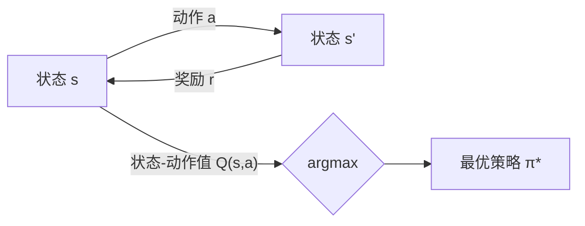

# 一切皆是映射：AI Q-learning在医疗诊断中的应用

## 1. 背景介绍
### 1.1 人工智能在医疗领域的应用现状
#### 1.1.1 医疗AI的发展历程
#### 1.1.2 医疗AI的主要应用方向
#### 1.1.3 医疗AI面临的机遇与挑战
### 1.2 强化学习与Q-learning算法概述  
#### 1.2.1 强化学习的基本原理
#### 1.2.2 Q-learning算法的提出与发展
#### 1.2.3 Q-learning在实际问题中的应用

## 2. 核心概念与联系
### 2.1 状态、动作、奖励与价值函数
#### 2.1.1 MDP中的状态与动作
#### 2.1.2 即时奖励与累积奖励
#### 2.1.3 状态价值函数与动作价值函数
### 2.2 探索与利用的平衡
#### 2.2.1 探索与利用的矛盾
#### 2.2.2 ε-贪婪策略
#### 2.2.3 软性策略
### 2.3 Q-learning与其他强化学习算法的区别
#### 2.3.1 Q-learning与Sarsa算法的比较
#### 2.3.2 Q-learning与蒙特卡洛方法的比较
#### 2.3.3 Q-learning与DQN的关系

## 3. 核心算法原理具体操作步骤
### 3.1 Q-learning的数学描述
#### 3.1.1 Q函数的定义与贝尔曼方程
#### 3.1.2 Q-learning的更新公式
#### 3.1.3 Q-learning的收敛性证明
### 3.2 Q-learning的具体实现步骤
#### 3.2.1 初始化Q表
#### 3.2.2 与环境交互并更新Q表
#### 3.2.3 训练终止条件与最优策略的生成
### 3.3 Q-learning算法的伪代码

## 4. 数学模型和公式详细讲解举例说明 
### 4.1 MDP的数学定义与性质
#### 4.1.1 状态转移概率与奖励函数
#### 4.1.2 策略与价值函数的数学定义
#### 4.1.3 MDP的贝尔曼方程
### 4.2 Q-learning的数学推导
#### 4.2.1 从贝尔曼方程到Q-learning更新公式
#### 4.2.2 Q-learning算法的数学证明
#### 4.2.3 Q-learning的收敛性分析
### 4.3 Q-learning在简单游戏中的数学建模
#### 4.3.1 悬崖寻路问题的MDP建模
#### 4.3.2 Q-learning求解最优策略的数学过程
#### 4.3.3 Q-learning解悬崖寻路的实验结果与分析

## 5. 项目实践：代码实例和详细解释说明
### 5.1 Q-learning解决悬崖寻路问题的Python代码实现
#### 5.1.1 Cliff Walking环境的代码实现
#### 5.1.2 Q-learning主体代码的实现
#### 5.1.3 实验结果展示与分析
### 5.2 Q-learning玩Atari游戏的TensorFlow实现
#### 5.2.1 OpenAI Gym与Atari游戏环境介绍
#### 5.2.2 DQN算法的TensorFlow实现
#### 5.2.3 实验结果展示与分析
### 5.3 医疗诊断系统中的Q-learning应用实例
#### 5.3.1 医疗诊断问题的MDP建模
#### 5.3.2 Q-learning在诊断系统中的代码实现
#### 5.3.3 实验结果展示与分析

## 6. 实际应用场景
### 6.1 智能医疗决策系统
#### 6.1.1 辅助诊断与治疗决策
#### 6.1.2 药物推荐与用药指导
#### 6.1.3 手术方案规划与评估
### 6.2 医学影像分析
#### 6.2.1 病灶检测与分割
#### 6.2.2 影像分类与诊断
#### 6.2.3 影像配准与融合
### 6.3 临床路径优化
#### 6.3.1 住院流程管理与优化
#### 6.3.2 手术排程与资源调度
#### 6.3.3 出院计划与康复指导

## 7. 工具和资源推荐
### 7.1 Q-learning相关的开源框架
#### 7.1.1 OpenAI Gym
#### 7.1.2 TensorFlow与Keras
#### 7.1.3 PyTorch
### 7.2 医疗AI相关的数据集
#### 7.2.1 MIMIC-III临床数据集
#### 7.2.2 ChestX-ray8肺部X光数据集  
#### 7.2.3 BraTS脑肿瘤分割数据集
### 7.3 其他学习资源
#### 7.3.1 Coursera强化学习专项课程
#### 7.3.2 《Reinforcement Learning: An Introduction》
#### 7.3.3 医疗AI相关的学术会议与期刊

## 8. 总结：未来发展趋势与挑战
### 8.1 Q-learning在连续状态空间问题中的局限性
### 8.2 Q-learning与深度学习结合的新方向  
### 8.3 Q-learning在多智能体协作中的应用前景
### 8.4 医疗领域应用Q-learning需要克服的困难
### 8.5 医疗AI发展的机遇与挑战

## 9. 附录：常见问题与解答
### 9.1 Q-learning能否处理部分可观测马尔可夫决策过程？
### 9.2 Q-learning能否用于连续动作空间问题？
### 9.3 Q-learning的探索策略如何选择？
### 9.4 Q-learning收敛速度慢的原因是什么？
### 9.5 如何评估Q-learning算法的性能？



## 1. 背景介绍

随着人工智能技术的飞速发展，越来越多的领域开始尝试引入智能算法来解决传统方法难以攻克的问题。医疗健康领域作为与人类生命安全息息相关的重要方向，更是人工智能的一大应用热点。近年来，从辅助诊断、医学影像分析，到药物研发、智能健康管理，人工智能正在深刻地影响和改变着传统医疗模式。

强化学习作为人工智能的三大分支之一，通过智能体与环境的交互来学习最优决策，在许多领域展现了卓越的性能，尤其是在面对复杂多变的动态环境时，强化学习无需大量标注数据，能够通过自主学习不断优化策略，具有得天独厚的优势。而在众多强化学习算法中，Q-learning以其简洁高效的特点脱颖而出，成为应用最为广泛的算法之一。

本文将重点探讨Q-learning算法在医疗诊断领域的应用。诊断是医疗过程中至关重要的一环，其准确性直接关系到后续的治疗效果。传统诊断主要依赖医生的经验和知识，而人工智能诊断系统的出现，为提高诊断效率和准确率提供了新的可能。我们将从Q-learning的基本原理出发，详细阐述其数学模型和推导过程，并通过实际项目案例展示Q-learning在医疗诊断中的应用情况。同时，我们还将讨论Q-learning在实际应用中可能面临的问题与挑战，以及未来的发展方向。

## 2. 核心概念与联系

在深入探讨Q-learning算法之前，我们首先需要了解几个核心概念。强化学习问题通常被建模为马尔可夫决策过程（MDP），一个MDP由状态空间、动作空间、状态转移概率和奖励函数组成。在每个时间步，智能体根据当前环境状态采取一个动作，环境状态随之转移到下一个状态，同时智能体获得一定的即时奖励。智能体的目标是最大化累积奖励，即在整个交互过程中获得的奖励之和。

为了实现这一目标，我们需要引入价值函数的概念。价值函数分为状态价值函数和动作价值函数两种。状态价值函数 $V(s)$ 表示从状态 $s$ 开始，遵循某一策略所能获得的期望累积奖励。动作价值函数 $Q(s,a)$ 表示在状态 $s$ 下选择动作 $a$，遵循某一策略所能获得的期望累积奖励。Q-learning算法的核心就是学习动作价值函数，进而得到最优策略。

在学习过程中，智能体需要在探索（exploration）和利用（exploitation）之间进行权衡。探索是指尝试新的动作，获取对环境的新知识；利用是指基于已有的知识，选择当前最优的动作。过度探索会降低学习效率，而过度利用则可能导致局部最优。一个常用的平衡策略是 $\epsilon$-贪婪策略，即以 $\epsilon$ 的概率随机选择动作，以 $1-\epsilon$ 的概率选择当前最优动作。

Q-learning与其他强化学习算法的主要区别在于，它是一种异策略（off-policy）算法，即在学习过程中使用的行为策略与最终得到的目标策略不同。相比而言，Sarsa算法是一种同策略（on-policy）算法。此外，Q-learning是基于价值函数的方法，而策略梯度等算法是基于策略函数的方法。近年来，Q-learning又与深度学习结合，形成了DQN（Deep Q-Network）等算法，进一步拓展了其应用范围。

## 3. 核心算法原理具体操作步骤

Q-learning算法的核心是通过不断更新动作价值函数 $Q(s,a)$ 来逼近最优值函数 $Q^*(s,a)$。根据贝尔曼最优方程，最优动作价值函数满足：

$$Q^*(s,a) = R(s,a) + \gamma \max_{a'}Q^*(s',a')$$

其中 $R(s,a)$ 是在状态 $s$ 下采取动作 $a$ 的期望即时奖励，$\gamma$ 是折扣因子，$s'$ 是采取动作 $a$ 后环境转移到的下一个状态。

Q-learning算法的更新公式为：

$$Q(s,a) \leftarrow Q(s,a) + \alpha[r + \gamma \max_{a'}Q(s',a') - Q(s,a)]$$

其中 $\alpha$ 是学习率，$r$ 是获得的即时奖励。这个公式可以解释为，将当前的Q值向TD目标值 $r + \gamma \max_{a'}Q(s',a')$ 进行调整，学习率 $\alpha$ 控制调整的幅度。

Q-learning的具体实现步骤如下：

1. 初始化Q表，可以将所有状态-动作对的Q值初始化为0，或者随机初始化。
2. 重复以下步骤直到满足终止条件（如达到最大训练轮数或Q值收敛）：
   - 根据 $\epsilon$-贪婪策略选择动作 $a$，即以 $\epsilon$ 的概率随机选择动作，以 $1-\epsilon$ 的概率选择Q值最大的动作。
   - 执行动作 $a$，观察环境反馈的即时奖励 $r$ 和下一个状态 $s'$。 
   - 根据Q-learning的更新公式更新 $Q(s,a)$。
   - 将当前状态 $s$ 更新为 $s'$。
3. 返回最终得到的Q表，即为问题的近似最优策略。在实际应用中，可以直接使用贪婪策略，即始终选择Q值最大的动作。

Q-learning算法的伪代码如下：

```python
初始化Q(s,a)
for episode = 1 to max_episodes:
    初始化状态s
    while s is not terminal:
        根据ε-贪婪策略选择动作a
        执行动作a，观察奖励r和下一个状态s'
        Q(s,a) ← Q(s,a) + α[r + γ max_a' Q(s',a') - Q(s,a)]
        s ← s'
```

Q-learning算法可以被证明在一定条件下收敛到最优值函数。其收敛性的主要影响因素包括学习率、折扣因子、探索策略等。在实际应用中，还需要针对