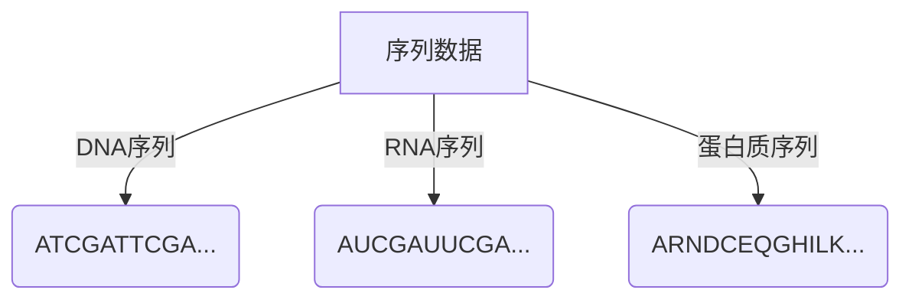
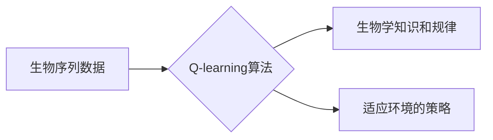
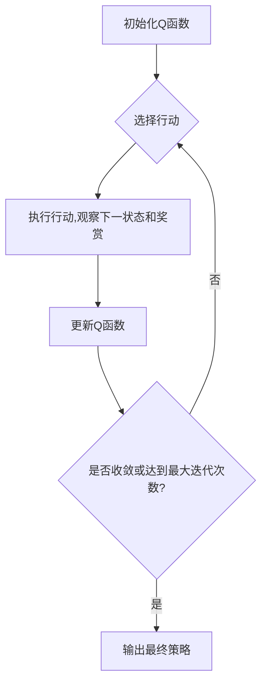

# 一切皆是映射：AI Q-learning在生物信息学中的可能

## 1. 背景介绍

### 1.1 生物信息学的崛起

生物信息学是一门融合了生物学、计算机科学、数学和统计学的新兴学科。随着基因组测序技术的飞速发展,生物数据的产生呈现爆炸式增长,这为生物信息学的发展提供了广阔的空间。生物信息学旨在通过计算机算法和统计模型来分析和解释这些海量的生物数据,从而揭示生命奥秘,促进生物医学研究的进步。

### 1.2 人工智能在生物信息学中的应用

人工智能(AI)技术在生物信息学领域发挥着越来越重要的作用。AI算法可以从复杂的生物数据中发现隐藏的模式和规律,预测蛋白质的结构和功能,识别基因表达谱的变化,优化药物设计等。传统的机器学习算法如支持向量机、决策树等已经在生物信息学中得到广泛应用,但它们往往需要大量的人工特征工程,且难以处理序列数据等结构化数据。

### 1.3 强化学习(Reinforcement Learning)的兴起

近年来,深度学习算法取得了令人瞩目的成就,尤其是在自然语言处理、计算机视觉等领域。强化学习(Reinforcement Learning)作为深度学习的一个重要分支,正在引起越来越多的关注。强化学习是一种基于奖赏机制的学习方式,其目标是通过与环境的交互,不断尝试和学习,最终找到一个在给定情况下可以获得最大累积奖赏的策略。

### 1.4 Q-learning算法

Q-learning是强化学习中最著名和最成功的算法之一。它通过构建一个Q函数来估计在当前状态下采取某个行动所能获得的长期累积奖赏。通过不断更新Q函数,Q-learning算法可以逐步找到最优策略,而无需建模环境的转移规律。由于其简单有效的特点,Q-learning已经在许多领域得到了成功应用,如机器人控制、游戏AI等。

## 2. 核心概念与联系

### 2.1 生物信息学中的序列数据

在生物信息学中,序列数据是一种非常重要的数据形式。DNA序列、RNA序列、蛋白质序列等都可以看作是由一个个碱基或者氨基酸组成的序列。这些序列数据蕴含着丰富的生物学信息,如基因的功能、蛋白质的结构和作用等。然而,由于序列数据的高维性和结构化特征,传统的机器学习算法往往难以直接处理这些数据。

### 2.2 Q-learning算法的本质

Q-learning算法的核心思想是通过不断探索和利用,来学习在给定状态下采取哪些行动可以获得最大的长期累积奖赏。具体来说,Q-learning维护一个Q函数,用于估计在当前状态下采取某个行动所能获得的长期累积奖赏。在每一个时间步,智能体根据当前状态选择一个行动,并观察到下一个状态和获得的即时奖赏。然后,Q-learning算法会根据这个转移过程来更新Q函数,以期望在未来的决策中获得更大的累积奖赏。

$$
Q(s_t, a_t) \leftarrow Q(s_t, a_t) + \alpha \Big[r_t + \gamma \max_a Q(s_{t+1}, a) - Q(s_t, a_t)\Big]
$$

其中,$ \alpha $是学习率,$ \gamma $是折扣因子,$ r_t $是即时奖赏,$ s_t $和$ s_{t+1} $分别表示当前状态和下一个状态。

### 2.3 Q-learning与生物信息学的联系

虽然Q-learning算法最初是为解决强化学习问题而提出的,但它的核心思想——通过不断探索和利用来学习最优策略,却与生物进化过程有着内在的相似性。生物进化也是一个不断探索和利用的过程,生物体通过基因突变(探索)和自然选择(利用)来适应环境,从而获得更大的生存和繁衍机会。

因此,我们可以将生物序列数据看作是生物体在进化过程中探索和利用的结果,蕴含着生物体适应环境的策略。如果我们将生物序列数据映射为Q-learning中的状态,将生物体的适应度作为奖赏信号,那么Q-learning算法就可以被用来学习这些序列数据所蕴含的生物学知识和规律。

通过这种方式,Q-learning算法可以在生物信息学领域发挥重要作用,帮助我们更好地理解生命现象,促进生物医学研究的进步。

## 3. 核心算法原理具体操作步骤

### 3.1 Q-learning算法的基本流程

Q-learning算法的基本流程如下:

1. 初始化Q函数,可以将所有状态-行动对的Q值初始化为0或者一个较小的常数。
2. 对于每一个时间步:
    a. 根据当前状态$ s_t $和Q函数,选择一个行动$ a_t $。常见的选择策略有$ \epsilon $-贪婪策略和软max策略。
    b. 执行选择的行动$ a_t $,观察到下一个状态$ s_{t+1} $和即时奖赏$ r_t $。
    c. 根据下面的公式更新Q函数:

    $$
    Q(s_t, a_t) \leftarrow Q(s_t, a_t) + \alpha \Big[r_t + \gamma \max_a Q(s_{t+1}, a) - Q(s_t, a_t)\Big]
    $$

    其中,$ \alpha $是学习率,$ \gamma $是折扣因子。
3. 重复步骤2,直到算法收敛或达到最大迭代次数。

### 3.2 探索与利用的权衡

在Q-learning算法中,探索与利用之间的权衡是一个关键问题。探索是指选择一些可能获得较低奖赏但有助于发现新知识的行动,而利用是指选择目前已知的可获得较高奖赏的行动。过多探索会导致算法收敛缓慢,而过多利用则可能陷入局部最优解。

常见的探索与利用策略有:

- $ \epsilon $-贪婪策略:以$ \epsilon $的概率随机选择一个行动(探索),以$ 1-\epsilon $的概率选择当前Q值最大的行动(利用)。
- 软max策略:根据Q值的软max概率分布来选择行动,Q值较大的行动被选择的概率就较高。
- 其他策略:如基于计数的策略、基于上下界的策略等。

### 3.3 Q-learning算法的优化

为了提高Q-learning算法的性能和收敛速度,研究人员提出了许多优化技术,如:

- 经验回放(Experience Replay):将过去的经验存储在回放池中,并在训练时随机抽取这些经验进行学习,以提高数据的利用率和算法的稳定性。
- 目标网络(Target Network):使用一个独立的目标网络来计算$ \max_a Q(s_{t+1}, a) $,以提高算法的稳定性。
- 双重Q-learning(Double Q-learning):使用两个Q网络来估计Q值,以减小Q值的过估计问题。
- 优先经验回放(Prioritized Experience Replay):根据经验的重要性给予不同的采样概率,以加快学习速度。

这些优化技术在实践中已经显示出了良好的效果,可以有效提高Q-learning算法的性能。

## 4. 数学模型和公式详细讲解举例说明

### 4.1 Q-learning算法的数学模型

Q-learning算法的目标是找到一个最优策略$ \pi^* $,使得在任意状态$ s $下,执行该策略可以获得最大的期望累积奖赏,即:

$$
\pi^*(s) = \arg\max_\pi \mathbb{E}\Big[\sum_{t=0}^\infty \gamma^t r_t \Big| s_0 = s, \pi\Big]
$$

其中,$ r_t $是在时间步$ t $获得的即时奖赏,$ \gamma \in [0, 1] $是折扣因子,用于平衡当前奖赏和未来奖赏的权重。

为了找到最优策略,Q-learning算法引入了Q函数$ Q^\pi(s, a) $,表示在状态$ s $下执行行动$ a $,之后按策略$ \pi $行动所能获得的期望累积奖赏:

$$
Q^\pi(s, a) = \mathbb{E}\Big[\sum_{t=0}^\infty \gamma^t r_t \Big| s_0 = s, a_0 = a, \pi\Big]
$$

可以证明,最优Q函数$ Q^*(s, a) $满足下面的Bellman方程:

$$
Q^*(s, a) = \mathbb{E}_{s' \sim \mathcal{P}(\cdot|s, a)}\Big[r(s, a) + \gamma \max_{a'} Q^*(s', a')\Big]
$$

其中,$ \mathcal{P}(s'|s, a) $表示在状态$ s $下执行行动$ a $后转移到状态$ s' $的概率分布,$ r(s, a) $表示在状态$ s $下执行行动$ a $获得的即时奖赏。

Q-learning算法就是通过不断更新Q函数,使其逼近最优Q函数$ Q^* $,从而找到最优策略$ \pi^* $。

### 4.2 Q-learning算法在生物信息学中的应用举例

假设我们要研究一种蛋白质的功能,并希望找到一个最优的氨基酸序列,使得该蛋白质在特定环境下具有最大的活性。我们可以将这个问题建模为一个强化学习问题,并使用Q-learning算法来解决。

具体来说,我们可以将:

- 状态$ s $定义为当前的氨基酸序列。
- 行动$ a $定义为在序列的某个位置插入、删除或替换一个氨基酸。
- 奖赏$ r(s, a) $定义为在执行行动$ a $后,新序列所对应的蛋白质活性的变化。

在每一个时间步,Q-learning算法会根据当前的序列状态$ s_t $和Q函数,选择一个行动$ a_t $(如在某个位置插入一个氨基酸)。然后,我们可以通过实验或者计算模拟的方式,观察到新的序列$ s_{t+1} $及其对应的蛋白质活性变化$ r_t $。根据这个转移过程,Q-learning算法会更新Q函数,以期望在未来的决策中获得更大的累积奖赏(即更高的蛋白质活性)。

通过不断探索和利用,Q-learning算法最终可以找到一个最优的氨基酸序列,使得该蛋白质在特定环境下具有最大的活性。这种方法不仅可以应用于蛋白质设计,也可以推广到其他生物信息学问题,如药物设计、基因调控网络分析等。

## 5. 项目实践:代码实例和详细解释说明

为了更好地理解Q-learning算法在生物信息学中的应用,我们以一个简单的蛋白质折叠问题为例,实现一个基于Q-learning的算法。

### 5.1 问题描述

蛋白质折叠是指蛋白质从一条线性的氨基酸序列折叠成特定的三维结构的过程。蛋白质的三维结构直接决定了它的功能,因此研究蛋白质折叠对于理解蛋白质的功能至关重要。

在这个简化的例子中,我们将蛋白质看作是一条长度为$ N $的链,每个节点代表一个氨基酸残基。链的两端是固定的,中间的残基可以在