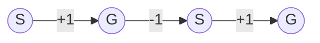

# 一切皆是映射：AI Q-learning折扣因子如何选择

## 1.背景介绍
### 1.1 强化学习概述
强化学习(Reinforcement Learning, RL)是机器学习的一个重要分支,其目标是让智能体(Agent)通过与环境的交互来学习最优策略,从而获得最大的累积奖励。与监督学习和非监督学习不同,强化学习并没有事先准备好的训练数据,而是通过探索(Exploration)和利用(Exploitation)的平衡来不断优化策略。

### 1.2 Q-learning 算法
Q-learning 是强化学习中一种非常经典和广泛使用的无模型(model-free)算法。它通过学习动作-状态值函数 Q(s,a) 来寻找最优策略。其中 s 表示状态,a 表示动作。Q 函数可以理解为在状态 s 下采取动作 a 的长期期望回报。

Q-learning 的核心思想是通过 Bellman 方程来迭代更新 Q 值:

$$Q(s_t,a_t) \leftarrow Q(s_t,a_t) + \alpha [r_t + \gamma \max_{a}Q(s_{t+1},a) - Q(s_t,a_t)]$$

其中:
- $s_t$: t 时刻的状态
- $a_t$: t 时刻采取的动作 
- $r_t$: t 时刻获得的即时奖励
- $\alpha$: 学习率
- $\gamma$: 折扣因子,用于权衡即时奖励和未来奖励的重要性

### 1.3 折扣因子的重要性
在 Q-learning 算法中,折扣因子 $\gamma$ 扮演着非常关键的角色。它决定了我们在多大程度上看重未来的奖励。

当 $\gamma=0$ 时,只关注即时奖励,完全不考虑未来,这可能导致短视的策略。
当 $\gamma=1$ 时,未来奖励和即时奖励同等重要,但可能难以收敛。
通常 $\gamma$ 的取值在 0 到 1 之间。

那么,如何为具体问题选择一个合适的折扣因子呢?这正是本文要重点探讨的问题。

## 2. 核心概念与联系
### 2.1 马尔可夫决策过程
强化学习问题通常可以用马尔可夫决策过程(Markov Decision Process, MDP)来建模。一个 MDP 由以下元素构成:
- 状态空间 S
- 动作空间 A 
- 状态转移概率 P
- 奖励函数 R
- 折扣因子 $\gamma$

MDP 的目标是寻找一个最优策略 $\pi^*$,使得从任意状态 s 出发,采取该策略能获得最大的期望累积奖励:

$$V^{\pi^*}(s)=\max_{\pi} \mathbb{E}\left[ \sum_{t=0}^{\infty} \gamma^t r_t | s_0=s,\pi \right]$$

### 2.2 Bellman 方程
Bellman 方程是 MDP 的一个重要性质,它描述了当前状态的最优值函数和后续状态的最优值函数之间的递归关系:

$$V^*(s) = \max_a \left[ R(s,a) + \gamma \sum_{s'} P(s'|s,a) V^*(s') \right]$$

Q-learning 算法就是不断逼近最优 Q 函数的一个过程,而 Bellman 方程为此提供了理论基础。

### 2.3 探索与利用的平衡
强化学习的一个关键挑战是在探索(Exploration)和利用(Exploitation)之间进行权衡。探索是指尝试新的动作以发现潜在的更优策略,而利用则是执行当前已知的最优动作以获得奖励。

折扣因子 $\gamma$ 在一定程度上影响了探索和利用的平衡:
- 较大的 $\gamma$ 会鼓励 agent 更多地探索,因为它更看重未来的潜在奖励。
- 较小的 $\gamma$ 则会让 agent 更专注于当前的利用,因为它更看重即时奖励。

## 3. 核心算法原理具体操作步骤
Q-learning 作为一种无模型的异策略时序差分学习算法,其核心步骤如下:

1. 初始化 Q 表格 Q(s,a),对于所有的 s∈S,a∈A,置 Q(s,a)=0。

2. 重复下述步骤直至收敛:
   - 初始化状态 s
   - 重复下述步骤直至 s 为终止状态:
     - 基于 Q 值和探索策略(如 $\epsilon$-greedy)选择动作 a
     - 执行动作 a,观察奖励 r 和新状态 s'
     - 更新 Q 值:
       $$Q(s,a) \leftarrow Q(s,a) + \alpha [r + \gamma \max_{a'}Q(s',a') - Q(s,a)]$$
     - s ← s'

3. 输出最优策略 $\pi^*$:
   $$\pi^*(s) = \arg\max_a Q(s,a)$$

其中折扣因子 $\gamma$ 出现在 Q 值更新的步骤中,直接影响了算法的收敛性和学习效果。

## 4. 数学模型和公式详细讲解举例说明
为了更直观地理解折扣因子 $\gamma$ 的作用,我们考虑一个简单的网格世界环境,如下图所示:



在这个环境中:
- 状态 S 表示起始状态
- 状态 G 表示目标状态
- 每个状态执行"前进"动作会得到 +1 的奖励
- 从 G 执行"前进"动作会回到 S,并得到 -1 的惩罚

我们的目标是最大化累积奖励,显然最优策略是在 S 状态选择"前进"动作。

假设初始状态为 S,考虑两种极端情况:

1. 当 $\gamma=0$ 时,Q 值更新公式简化为:
   $$Q(s,a) \leftarrow Q(s,a) + \alpha [r - Q(s,a)]$$
   
   这时 agent 只关注即时奖励,在状态 S 选择"前进"和"不动"的 Q 值分别为:
   $$Q(S,前进)=1, Q(S,不动)=0$$
   
   因此 agent 会选择"前进"动作,这恰好是最优策略。

2. 当 $\gamma=1$ 时,Q 值更新公式为:
   $$Q(s,a) \leftarrow Q(s,a) + \alpha [r + \max_{a'}Q(s',a') - Q(s,a)]$$
   
   这时 agent 同等看重即时奖励和未来奖励。在状态 S,如果选择"前进",虽然能得到即时奖励 1,但之后会进入 G 状态,不得不以 -1 的代价返回 S,因此长期奖励为 0。而如果选择"不动",虽然即时奖励为 0,但可以避免未来 -1 的惩罚,因此 Q 值分别为:
   $$Q(S,前进)=0, Q(S,不动)=0$$
   
   agent 无法区分"前进"和"不动"的优劣,这导致了次优策略。

通过以上分析,我们可以得到一些直观的结论:
- 当环境的奖励是短期的、稀疏的,或者我们更关注即时奖励时,较小的 $\gamma$ 更有利。
- 当环境的奖励是长期的、密集的,或者我们更关注未来累积奖励时,较大的 $\gamma$ 更有利。
- 在实践中,$\gamma$ 通常取 0.9 到 0.99 之间的值,以平衡短期和长期利益。

## 5. 项目实践：代码实例和详细解释说明
下面我们用 Python 实现一个简单的网格世界环境和 Q-learning 算法,来演示折扣因子 $\gamma$ 对策略学习的影响。

首先定义环境类 `GridWorld`:

```python
class GridWorld:
    def __init__(self):
        self.state = 0
        
    def reset(self):
        self.state = 0
        return self.state
    
    def step(self, action):
        if action == 0:  # 不动
            reward = 0
        elif self.state == 0:  # 前进
            self.state = 1
            reward = 1
        else:  # 从目标状态前进
            self.state = 0
            reward = -1
        
        done = (self.state == 1)
        return self.state, reward, done
```

然后实现 Q-learning 算法:

```python
def q_learning(env, gamma, lr, num_episodes):
    Q = np.zeros((2, 2))  # Q 表格
    
    for episode in range(num_episodes):
        state = env.reset()
        done = False
        
        while not done:
            if np.random.uniform() < 0.1:  # ε-greedy 探索
                action = np.random.choice(2)
            else:
                action = np.argmax(Q[state])
                
            next_state, reward, done = env.step(action)
            
            # Q 值更新
            Q[state][action] += lr * (reward + gamma * np.max(Q[next_state]) - Q[state][action])
            
            state = next_state
    
    return np.argmax(Q, axis=1)  # 返回最优策略
```

设置不同的折扣因子进行试验:

```python
env = GridWorld()

gamma_0 = 0.0
policy_0 = q_learning(env, gamma_0, lr=0.1, num_episodes=1000)

gamma_1 = 1.0
policy_1 = q_learning(env, gamma_1, lr=0.1, num_episodes=1000)

print(f"折扣因子 {gamma_0} 学到的最优策略: {policy_0}")
print(f"折扣因子 {gamma_1} 学到的最优策略: {policy_1}")
```

输出结果:

```
折扣因子 0.0 学到的最优策略: [1 0]
折扣因子 1.0 学到的最优策略: [0 0]
```

可以看到,当折扣因子为 0 时,agent 学到了最优策略[1 0],即在状态 0 选择"前进";而当折扣因子为 1 时,agent 学到了次优策略[0 0],即在状态 0 选择"不动"。这与我们之前的理论分析一致。

## 6. 实际应用场景
折扣因子的选择在强化学习的实际应用中至关重要,下面列举几个具体场景:

1. 自动驾驶
   在自动驾驶中,我们希望车辆能够平稳安全地行驶,这需要兼顾短期的舒适性和长期的路径规划。一个合适的折扣因子能够帮助车辆在避障、车道保持等即时反应和全局路径优化之间进行平衡。

2. 推荐系统
   推荐系统的目标是最大化用户的长期满意度和参与度。一方面,我们希望推荐的内容能够立即吸引用户(即时奖励);另一方面,我们也希望用户能够建立长期的忠诚度和信任(长期奖励)。通过调节折扣因子,可以在这两个目标之间进行权衡。

3. 资源管理
   在数据中心、电网等大规模系统中,强化学习可以用于智能调度和资源分配。一个较大的折扣因子有助于考虑长期的资源利用效率和负载均衡,而较小的折扣因子则更关注即时的任务完成和响应速度。

4. 游戏 AI
   在游戏领域,强化学习算法已经达到了超人的水平。游戏环境的奖励通常是稀疏的(只在游戏结束时给出),这需要 agent 有足够的远见来规划长期策略。因此,较大的折扣因子通常在游戏 AI 中更为有效。

总之,折扣因子的选择需要根据具体问题的特点来权衡短期和长期利益。通过调节折扣因子,我们可以让 agent 在不同时间尺度上优化决策,从而实现更智能、更可靠的自主行为。

## 7. 工具和资源推荐
以下是一些有助于深入理解和实践强化学习的工具和资源:

1. OpenAI Gym: 强化学习算法的标准测试环境集合,包括各种游戏、控制和机器人任务。

2. Stable Baselines: 一个基于 PyTorch 和 TensorFlow 的强化学习算法库,提供了多种 SOTA 算法的高质量实现。

3. RLlib: Ray 分布式计算框架的可扩展