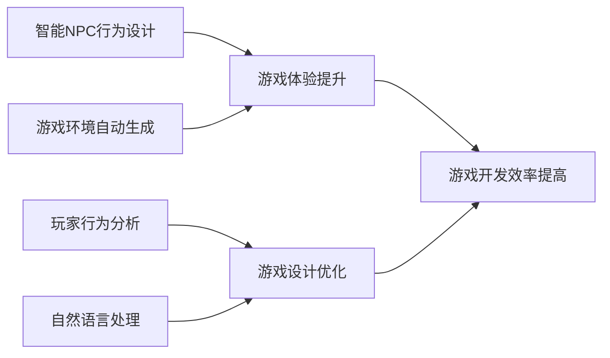

# 一切皆是映射：AI在游戏开发中的应用

## 1. 背景介绍
随着人工智能技术的飞速发展，其在游戏开发中的应用已经成为推动游戏产业进步的重要力量。AI不仅改变了游戏玩法，提升了玩家体验，还在游戏设计、测试和运营等多个环节发挥着至关重要的作用。本文将深入探讨AI在游戏开发中的核心概念、算法原理、数学模型，并结合实际项目实践，展示AI技术如何在游戏产业中大放异彩。

## 2. 核心概念与联系
在游戏开发中，AI的核心概念包括但不限于智能NPC行为设计、游戏环境自动生成、玩家行为分析、自然语言处理等。这些概念之间的联系在于，它们共同构建了一个互动丰富、反应灵敏、自我进化的游戏世界。



## 3. 核心算法原理具体操作步骤
以智能NPC行为设计为例，核心算法原理包括状态机、决策树、行为树和机器学习等。具体操作步骤如下：

1. 定义NPC可能的状态集合和行为集合。
2. 构建状态机，映射状态之间的转换关系。
3. 设计决策树，根据游戏环境和玩家行为制定NPC行为策略。
4. 实现行为树，管理复杂行为的执行流程。
5. 应用机器学习算法，使NPC行为自适应和优化。

## 4. 数学模型和公式详细讲解举例说明
以决策树为例，数学模型可以表示为一个有向无环图，其中每个节点代表一个决策问题，每个分支代表决策的可能结果，每个叶节点代表一个行为或策略。例如，决策树的信息增益计算公式为：

$$
\text{信息增益}(D, A) = \text{信息熵}(D) - \sum_{v=1}^{n} \frac{|D^v|}{|D|} \text{信息熵}(D^v)
$$

其中，$D$ 是数据集，$A$ 是特征，$D^v$ 是特征 $A$ 上值为 $v$ 的子集。

## 5. 项目实践：代码实例和详细解释说明
以行为树的实现为例，以下是一个简单的行为树节点的Python代码实例：

```python
class BehaviorTreeNode:
    def __init__(self, name):
        self.name = name
        self.children = []
        self.status = "READY"

    def add_child(self, child):
        self.children.append(child)

    def execute(self):
        pass  # 具体执行逻辑根据节点类型而定

class SelectorNode(BehaviorTreeNode):
    def execute(self):
        for child in self.children:
            if child.execute() == "SUCCESS":
                return "SUCCESS"
        return "FAILURE"

class SequenceNode(BehaviorTreeNode):
    def execute(self):
        for child in self.children:
            if child.execute() == "FAILURE":
                return "FAILURE"
        return "SUCCESS"
```

## 6. 实际应用场景
AI在游戏开发中的应用场景极其广泛，包括但不限于：

- 动态游戏内容生成
- 玩家行为预测与分析
- 游戏测试自动化
- 实时策略游戏中的AI对手
- 交互式故事叙述

## 7. 工具和资源推荐
对于游戏开发者来说，以下工具和资源是进行AI集成的宝贵资产：

- Unity ML-Agents
- TensorFlow
- OpenAI Gym
- Unreal Engine 4 AI

## 8. 总结：未来发展趋势与挑战
AI在游戏开发中的应用前景广阔，未来的发展趋势将更加注重AI的自适应性、创造性和协同性。同时，挑战也不容忽视，包括算法的复杂性管理、AI伦理问题以及玩家体验的个性化需求。

## 9. 附录：常见问题与解答
Q1: AI如何平衡游戏难度？
A1: 通过玩家行为分析和机器学习，AI可以动态调整游戏难度，以适应不同玩家的技能水平。

Q2: AI在游戏中的应用是否会取代人类设计师？
A2: AI是工具而非替代品，它增强而不是取代人类设计师的创造力。

作者：禅与计算机程序设计艺术 / Zen and the Art of Computer Programming