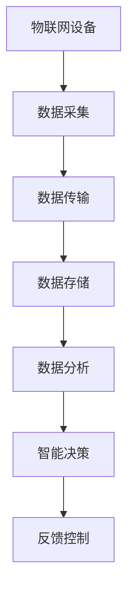
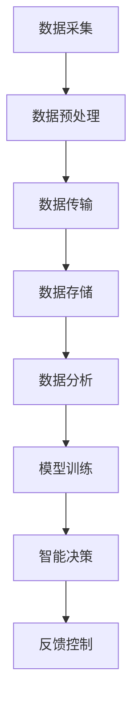

# 一切皆是映射：AI在物联网(IoT)中的角色与挑战

## 1.背景介绍

物联网（IoT）和人工智能（AI）是当今技术领域中最具革命性的两个概念。物联网通过将物理设备连接到互联网，实现了数据的实时采集和传输，而人工智能则通过数据分析和机器学习，赋予这些设备智能化的能力。两者的结合不仅改变了我们的生活方式，也为各行各业带来了前所未有的机遇和挑战。

物联网设备的数量正在以惊人的速度增长。据统计，到2025年，全球物联网设备的数量将达到750亿台。这些设备生成的数据量也是巨大的，如何有效地处理和分析这些数据成为了一个关键问题。人工智能在这一过程中扮演了重要角色，通过智能算法和模型，能够从海量数据中提取有价值的信息，做出智能决策。

## 2.核心概念与联系

### 2.1 物联网的基本概念

物联网是指通过各种信息传感设备，如传感器、射频识别（RFID）技术、全球定位系统（GPS）、激光扫描器等，按照约定的协议，把任何物品与互联网连接起来，进行信息交换和通信，以实现智能化识别、定位、跟踪、监控和管理的一种网络。

### 2.2 人工智能的基本概念

人工智能是一门研究如何使计算机系统能够执行通常需要人类智能才能完成的任务的学科。这些任务包括但不限于感知、推理、学习、规划和自然语言处理。人工智能的核心技术包括机器学习、深度学习、自然语言处理和计算机视觉等。

### 2.3 物联网与人工智能的联系

物联网和人工智能的结合可以说是天作之合。物联网设备生成大量的数据，而人工智能则需要大量的数据来进行训练和优化。通过将物联网设备生成的数据输入到人工智能模型中，可以实现对数据的智能分析和处理，从而做出更为准确和高效的决策。

以下是物联网与人工智能结合的一个简单示意图：



## 3.核心算法原理具体操作步骤

### 3.1 数据采集与预处理

物联网设备通过传感器采集数据，这些数据通常是非结构化的，需要进行预处理。预处理步骤包括数据清洗、数据归一化、特征提取等。

### 3.2 数据传输与存储

采集到的数据通过网络传输到云端或边缘计算设备进行存储。数据传输过程中需要考虑数据的安全性和传输效率。

### 3.3 数据分析与建模

数据存储后，使用人工智能算法对数据进行分析和建模。常用的算法包括回归分析、分类算法、聚类算法和深度学习算法等。

### 3.4 模型训练与优化

通过对历史数据进行训练，生成预测模型。模型训练过程中需要不断优化参数，以提高模型的准确性和鲁棒性。

### 3.5 智能决策与反馈控制

训练好的模型可以用于实时数据的预测和决策。根据预测结果，系统可以自动进行反馈控制，实现智能化管理。

以下是一个简单的物联网与人工智能结合的流程图：



## 4.数学模型和公式详细讲解举例说明

### 4.1 回归分析

回归分析是一种统计方法，用于确定两个或多个变量之间的关系。常用的回归模型包括线性回归和多项式回归。

线性回归模型的数学表达式为：

$$
y = \beta_0 + \beta_1 x_1 + \beta_2 x_2 + \cdots + \beta_n x_n + \epsilon
$$

其中，$y$ 是因变量，$x_1, x_2, \cdots, x_n$ 是自变量，$\beta_0, \beta_1, \cdots, \beta_n$ 是回归系数，$\epsilon$ 是误差项。

### 4.2 分类算法

分类算法用于将数据分为不同的类别。常用的分类算法包括逻辑回归、支持向量机（SVM）和决策树等。

逻辑回归模型的数学表达式为：

$$
P(y=1|x) = \frac{1}{1 + e^{-(\beta_0 + \beta_1 x_1 + \beta_2 x_2 + \cdots + \beta_n x_n)}}
$$

其中，$P(y=1|x)$ 是样本属于类别1的概率，$x_1, x_2, \cdots, x_n$ 是自变量，$\beta_0, \beta_1, \cdots, \beta_n$ 是回归系数。

### 4.3 聚类算法

聚类算法用于将数据分为不同的组。常用的聚类算法包括K均值聚类和层次聚类等。

K均值聚类的目标是最小化以下目标函数：

$$
J = \sum_{i=1}^{k} \sum_{j=1}^{n} ||x_j^{(i)} - \mu_i||^2
$$

其中，$k$ 是聚类的数量，$n$ 是样本的数量，$x_j^{(i)}$ 是第$i$个聚类中的第$j$个样本，$\mu_i$ 是第$i$个聚类的中心。

### 4.4 深度学习

深度学习是一种基于人工神经网络的机器学习方法，适用于处理复杂的非线性关系。常用的深度学习模型包括卷积神经网络（CNN）和循环神经网络（RNN）等。

卷积神经网络的前向传播过程可以表示为：

$$
a^{(l)} = f(W^{(l)} a^{(l-1)} + b^{(l)})
$$

其中，$a^{(l)}$ 是第$l$层的激活值，$W^{(l)}$ 是第$l$层的权重矩阵，$b^{(l)}$ 是第$l$层的偏置向量，$f$ 是激活函数。

## 5.项目实践：代码实例和详细解释说明

### 5.1 数据采集与预处理

以下是一个简单的Python代码示例，展示如何从物联网设备采集数据并进行预处理：

```python
import pandas as pd
import numpy as np

# 模拟物联网设备数据采集
data = {
    'temperature': [22.4, 23.1, 21.8, 22.9, 23.5],
    'humidity': [45, 50, 55, 60, 65],
    'pressure': [1012, 1013, 1011, 1010, 1014]
}

# 转换为DataFrame
df = pd.DataFrame(data)

# 数据预处理：归一化
df_normalized = (df - df.min()) / (df.max() - df.min())
print(df_normalized)
```

### 5.2 数据传输与存储

以下是一个简单的Python代码示例，展示如何将预处理后的数据传输到云端并进行存储：

```python
import requests

# 定义云端API地址
api_url = 'http://example.com/api/data'

# 发送数据到云端
response = requests.post(api_url, json=df_normalized.to_dict())
print(response.status_code)
```

### 5.3 数据分析与建模

以下是一个简单的Python代码示例，展示如何使用线性回归模型对数据进行分析和建模：

```python
from sklearn.linear_model import LinearRegression

# 定义自变量和因变量
X = df_normalized[['temperature', 'humidity']]
y = df_normalized['pressure']

# 创建线性回归模型
model = LinearRegression()
model.fit(X, y)

# 输出回归系数
print(model.coef_)
print(model.intercept_)
```

### 5.4 模型训练与优化

以下是一个简单的Python代码示例，展示如何使用深度学习模型进行训练和优化：

```python
import tensorflow as tf
from tensorflow.keras.models import Sequential
from tensorflow.keras.layers import Dense

# 创建深度学习模型
model = Sequential([
    Dense(64, activation='relu', input_shape=(2,)),
    Dense(64, activation='relu'),
    Dense(1)
])

# 编译模型
model.compile(optimizer='adam', loss='mse')

# 训练模型
model.fit(X, y, epochs=10, batch_size=1)

# 输出模型参数
print(model.get_weights())
```

### 5.5 智能决策与反馈控制

以下是一个简单的Python代码示例，展示如何使用训练好的模型进行智能决策和反馈控制：

```python
# 使用模型进行预测
predictions = model.predict(X)

# 根据预测结果进行反馈控制
for i, prediction in enumerate(predictions):
    if prediction > 0.5:
        print(f'样本{i}：采取措施A')
    else:
        print(f'样本{i}：采取措施B')
```

## 6.实际应用场景

### 6.1 智能家居

在智能家居中，物联网设备如智能温控器、智能灯泡和智能门锁等，通过采集环境数据和用户行为数据，结合人工智能算法，实现自动化控制和智能化管理。例如，智能温控器可以根据室内外温度和用户的作息时间，自动调整室内温度，提高能源利用效率。

### 6.2 智能交通

在智能交通系统中，物联网设备如交通摄像头、车载传感器和智能交通信号灯等，通过采集交通流量数据和车辆状态数据，结合人工智能算法，实现交通流量的智能调控和交通事故的实时预警。例如，智能交通信号灯可以根据实时交通流量，动态调整信号灯的切换时间，减少交通拥堵。

### 6.3 智能医疗

在智能医疗中，物联网设备如智能手环、智能血压计和智能药盒等，通过采集患者的生理数据和用药数据，结合人工智能算法，实现健康监测和疾病预防。例如，智能手环可以实时监测用户的心率和睡眠质量，结合人工智能算法，提供个性化的健康建议。

### 6.4 智能农业

在智能农业中，物联网设备如土壤传感器、气象站和无人机等，通过采集土壤湿度、气温和作物生长状态等数据，结合人工智能算法，实现精准农业和智能化管理。例如，土壤传感器可以实时监测土壤湿度，结合人工智能算法，自动控制灌溉系统，提高水资源利用效率。

## 7.工具和资源推荐

### 7.1 开发工具

- **Python**：Python是一种广泛使用的编程语言，具有丰富的库和工具，适用于数据分析和机器学习。
- **TensorFlow**：TensorFlow是一个开源的机器学习框架，适用于构建和训练深度学习模型。
- **Keras**：Keras是一个高级神经网络API，基于TensorFlow，简化了深度学习模型的构建和训练过程。
- **Scikit-learn**：Scikit-learn是一个开源的机器学习库，提供了丰富的机器学习算法和工具。

### 7.2 数据集

- **Kaggle**：Kaggle是一个数据科学竞赛平台，提供了丰富的公开数据集，适用于机器学习和数据分析。
- **UCI Machine Learning Repository**：UCI机器学习库是一个广泛使用的机器学习数据集库，提供了各种领域的数据集。

### 7.3 在线课程

- **Coursera**：Coursera提供了丰富的在线课程，涵盖了物联网和人工智能的各个方面。
- **edX**：edX是一个在线学习平台，提供了来自世界顶级大学和机构的在线课程，涵盖了物联网和人工智能的各个方面。

## 8.总结：未来发展趋势与挑战

### 8.1 未来发展趋势

物联网和人工智能的结合将继续推动各行各业的智能化发展。未来，随着5G技术的普及，物联网设备的连接速度和数据传输效率将大幅提升，进一步推动物联网的发展。同时，随着人工智能算法和计算能力的不断提升，人工智能在物联网中的应用将更加广泛和深入。

### 8.2 挑战

尽管物联网和人工智能的结合带来了巨大的机遇，但也面临着诸多挑战。首先，数据的安全性和隐私保护是一个重要问题。物联网设备采集的大量数据中包含了用户的隐私信息，如何保护这些数据不被滥用是一个亟待解决的问题。其次，物联网设备的互操作性和标准化也是一个挑战。不同厂商的设备之间如何实现无缝连接和数据共享，需要制定统一的标准和协议。最后，人工智能算法的透明性和可解释性也是一个重要问题。如何让用户理解和信任人工智能的决策过程，是人工智能在物联网中广泛应用的关键。

## 9.附录：常见问题与解答

### 9.1 什么是物联网？

物联网是指通过各种信息传感设备，将物品与互联网连接起来，实现信息交换和通信，以实现智能化识别、定位、跟踪、监控和管理的一种网络。

### 9.2 什么是人工智能？

人工智能是一门研究如何使计算机系统能够执行通常需要人类智能才能完成的任务的学科，包括感知、推理、学习、规划和自然语言处理等。

### 9.3 物联网和人工智能的结合有什么优势？

物联网设备生成大量的数据，而人工智能需要大量的数据进行训练和优化。通过将物联网设备生成的数据输入到人工智能模型中，可以实现对数据的智能分析和处理，从而做出更为准确和高效的决策。

### 9.4 如何保护物联网数据的安全性和隐私？

保护物联网数据的安全性和隐私需要采取多种措施，包括数据加密、访问控制、身份认证和隐私保护等。同时，制定相关的法律法规和标准，规范数据的采集、传输和使用，也是保护数据安全和隐私的重要手段。

### 9.5 物联网设备的互操作性和标准化如何实现？

实现物联网设备的互操作性和标准化需要制定统一的标准和协议，包括通信协议、数据格式和接口标准等。同时，推动不同厂商之间的合作和协同，共同制定和推广标准，也是实现物联网设备互操作性和标准化的重要途径。

### 9.6 人工智能算法的透明性和可解释性如何提高？

提高人工智能算法的透明性和可解释性需要从算法设计和模型解释两个方面入手。一方面，在算法设计过程中，尽量采用简单、透明的算法，减少黑箱操作。另一方面，开发和应用模型解释工具，如LIME和SHAP等，帮助用户理解和解释模型的决策过程。

---

作者：禅与计算机程序设计艺术 / Zen and the Art of Computer Programming