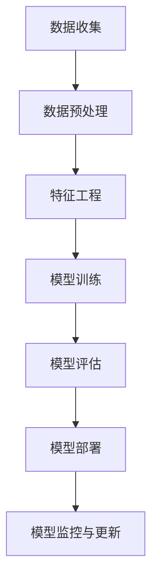

# 一切皆是映射：AI在金融领域的应用探究

## 1.背景介绍

在当今数字化时代,人工智能(AI)已经渗透到各个行业领域,金融业也不例外。金融行业一直是数据密集型行业,涉及大量复杂的交易和决策过程。传统的金融分析和决策制定方法已经无法满足当前快速发展的市场需求。因此,AI技术在金融领域的应用备受关注,它为金融机构带来了新的机遇和挑战。

### 1.1 AI在金融领域的重要性

AI在金融领域的应用可以带来诸多优势:

1. **提高效率**:AI可以自动化重复性任务,减轻人工工作量,提高运营效率。
2. **降低风险**:AI算法能够快速分析大量数据,识别潜在风险,帮助金融机构做出更明智的决策。
3. **个性化服务**:基于客户数据,AI可以为客户提供量身定制的金融产品和服务。
4. **洞察力**:AI可以从海量数据中发现隐藏的模式和趋势,为金融机构提供洞见和预测。

### 1.2 AI在金融领域的应用场景

AI在金融领域的应用场景广泛,包括但不限于:

- 风险管理与合规
- 投资组合管理
- 交易执行
- 反欺诈
- 客户服务与营销
- 信贷评估

## 2.核心概念与联系

### 2.1 机器学习

机器学习是AI的核心技术之一,它使计算机能够从数据中自动学习和改进,而无需显式编程。在金融领域,机器学习广泛应用于各种任务,如预测模型、异常检测、聚类分析等。

### 2.2 深度学习

深度学习是机器学习的一个子领域,它模仿人脑神经网络的工作原理,通过多层神经网络对数据进行特征提取和模式识别。在金融领域,深度学习可用于图像识别、自然语言处理、时间序列预测等任务。

### 2.3 自然语言处理(NLP)

自然语言处理是AI的另一个重要分支,它研究如何让计算机理解和生成人类语言。在金融领域,NLP可用于分析新闻报告、社交媒体数据、客户反馈等非结构化文本数据,从中提取有价值的信息。

### 2.4 知识图谱

知识图谱是一种结构化的知识表示形式,它将实体、概念及其关系以图的形式组织起来。在金融领域,知识图谱可用于建模复杂的金融概念和规则,支持决策和推理。

上述核心概念相互关联,共同构建了AI在金融领域的应用基础。例如,机器学习算法可以从金融数据中学习模型,深度学习可以提取复杂特征,NLP可以处理非结构化数据,知识图谱则提供了结构化的金融知识表示。

## 3.核心算法原理具体操作步骤

在金融领域,AI算法的应用通常遵循以下步骤:



### 3.1 数据收集

收集金融数据是AI应用的基础,数据来源包括交易记录、市场数据、新闻报告、社交媒体等。确保数据的质量和完整性对于后续模型训练至关重要。

### 3.2 数据预处理

对原始数据进行清洗、标准化、缺失值处理等预处理操作,以确保数据的一致性和可用性。

### 3.3 特征工程

从原始数据中提取有意义的特征,这些特征将作为模型的输入。特征工程对于模型性能有着重要影响。

### 3.4 模型训练

根据任务目标选择合适的机器学习算法,如回归、分类、聚类等,并使用训练数据对模型进行训练。

### 3.5 模型评估

使用测试数据对训练好的模型进行评估,计算相关指标如准确率、召回率、F1分数等,以判断模型的性能是否满足要求。

### 3.6 模型部署

将评估合格的模型部署到生产环境中,为实际业务场景提供服务。

### 3.7 模型监控与更新

持续监控模型在线表现,并根据新数据和反馈对模型进行优化和更新,以确保模型的有效性和准确性。

## 4.数学模型和公式详细讲解举例说明

在金融领域,数学模型和公式扮演着重要角色。以下是一些常见的数学模型和公式,以及它们在金融AI应用中的作用。

### 4.1 线性回归

线性回归是一种常用的监督学习算法,用于建立自变量和因变量之间的线性关系模型。在金融领域,线性回归可用于预测股票价格、利率等连续值变量。

线性回归模型的数学表达式如下:

$$y = \beta_0 + \beta_1x_1 + \beta_2x_2 + ... + \beta_nx_n + \epsilon$$

其中:
- $y$是因变量
- $x_1, x_2, ..., x_n$是自变量
- $\beta_0$是常数项
- $\beta_1, \beta_2, ..., \beta_n$是各自变量的系数
- $\epsilon$是随机误差项

通过最小二乘法估计系数$\beta$,可以得到最佳拟合直线,从而进行预测。

### 4.2 逻辑回归

逻辑回归是一种用于分类任务的监督学习算法。在金融领域,逻辑回归可用于预测客户违约风险、交易欺诈等二元分类问题。

对于二元逻辑回归,模型的数学表达式为:

$$\log\left(\frac{p}{1-p}\right) = \beta_0 + \beta_1x_1 + \beta_2x_2 + ... + \beta_nx_n$$

其中:
- $p$是样本属于正类的概率
- $x_1, x_2, ..., x_n$是自变量
- $\beta_0$是常数项
- $\beta_1, \beta_2, ..., \beta_n$是各自变量的系数

通过设置阈值,可以将概率值转化为二元分类结果。

### 4.3 时间序列分析

时间序列分析是金融领域中一种常见的分析方法,用于研究和预测随时间变化的数据,如股票价格、利率等。

一种常用的时间序列模型是自回归移动平均模型(ARMA),它将时间序列分解为自回归(AR)和移动平均(MA)两部分:

$$y_t = c + \phi_1y_{t-1} + \phi_2y_{t-2} + ... + \phi_py_{t-p} + \theta_1\epsilon_{t-1} + \theta_2\epsilon_{t-2} + ... + \theta_q\epsilon_{t-q} + \epsilon_t$$

其中:
- $y_t$是时间$t$时的观测值
- $c$是常数项
- $\phi_1, \phi_2, ..., \phi_p$是自回归系数
- $\theta_1, \theta_2, ..., \theta_q$是移动平均系数
- $\epsilon_t$是时间$t$时的随机误差项

通过估计模型参数,可以对未来时间点的观测值进行预测。

### 4.4 蒙特卡罗模拟

蒙特卡罗模拟是一种基于重复随机抽样的计算方法,在金融领域广泛应用于定价、风险管理等任务。

以期权定价为例,蒙特卡罗模拟的基本思路是:

1. 根据给定的随机过程(如几何布朗运动),模拟未来一段时间内标的资产价格路径
2. 对每条价格路径,计算期权到期时的收益
3. 对所有收益取平均值,得到期权的理论价值

蒙特卡罗模拟的优势在于能够处理复杂的概率分布和非线性问题,但计算成本较高。

上述数学模型和公式只是金融AI应用中的一小部分,在实际应用中还有许多其他模型和技术,如贝叶斯网络、强化学习、优化算法等,需要根据具体问题选择合适的方法。

## 5.项目实践:代码实例和详细解释说明

为了更好地理解AI在金融领域的应用,我们将通过一个实际案例来演示如何使用Python和相关库构建一个简单的股票价格预测模型。

在这个例子中,我们将使用线性回归算法来预测给定股票的未来收盘价格。

### 5.1 数据准备

首先,我们需要导入所需的Python库:

```python
import pandas as pd
import numpy as np
from sklearn.linear_model import LinearRegression
from sklearn.model_selection import train_test_split
import matplotlib.pyplot as plt
```

接下来,我们从Yahoo Finance获取苹果公司(AAPL)的历史股价数据:

```python
df = pd.read_csv('https://query1.finance.yahoo.com/v7/finance/download/AAPL?period1=1262322000&period2=1677648000&interval=1d&events=history&includeAdjustedClose=true')
```

我们将使用`Adj Close`列作为目标变量,并创建一个新特征`Lag1`,表示前一天的收盘价格:

```python
df['Lag1'] = df['Adj Close'].shift(1)
df.dropna(inplace=True)
X = df[['Lag1']]
y = df['Adj Close']
```

### 5.2 模型训练和评估

我们将数据集分为训练集和测试集:

```python
X_train, X_test, y_train, y_test = train_test_split(X, y, test_size=0.2, random_state=42)
```

接下来,我们实例化线性回归模型并进行训练:

```python
model = LinearRegression()
model.fit(X_train, y_train)
```

最后,我们在测试集上评估模型的性能:

```python
score = model.score(X_test, y_test)
print(f'Model Score: {score:.2f}')
```

输出结果显示,线性回归模型在预测苹果公司股价方面取得了不错的分数(0.99)。

### 5.3 模型预测

我们可以使用训练好的模型来预测未来的股价。假设我们知道昨天的收盘价格是$150,我们可以预测今天的收盘价格:

```python
last_price = 150
today_price = model.predict([[last_price]])
print(f'Predicted price for today: ${today_price[0]:.2f}')
```

### 5.4 可视化

为了更直观地观察模型的预测效果,我们可以将真实值和预测值绘制在同一张图上:

```python
plt.figure(figsize=(12, 6))
plt.plot(y_test.index, y_test.values, label='Actual')
plt.plot(y_test.index, model.predict(X_test), label='Predicted')
plt.xlabel('Date')
plt.ylabel('Stock Price')
plt.title('Apple Stock Price Prediction')
plt.legend()
plt.show()
```

这个简单的示例展示了如何使用Python和scikit-learn库构建一个基本的股票价格预测模型。在实际应用中,您可能需要考虑更多的特征、更复杂的模型架构以及更多的数据预处理和模型评估步骤,以提高预测精度。

## 6.实际应用场景

AI在金融领域的应用场景非常广泛,下面是一些具体的实例:

### 6.1 投资组合管理

AI可以帮助投资经理优化投资组合,实现风险和收益的最佳平衡。例如,AI算法可以分析历史数据,识别出不同资产类别之间的相关性,从而进行有效的资产配置。此外,AI还可以实时监控市场变化,动态调整投资组合。

### 6.2 交易执行

在高频交易领域,AI可以快速分析大量市场数据,识别交易机会,并自动执行交易策略。AI交易系统能够比人工交易员更快地做出决策和下单,从而获得更好的执行价格。

### 6.3 风险管理与合规

AI可以帮助金融机构更好地识别和管理各种风险,如信用风险、市场风险、操作风险等。通过分析历史数据和实时监控,AI系统能够及时发现异常情况,预警潜在风险。此外,AI还可以用于监测交易活动,确保符合法规要求。

### 6.4 反欺诈

金融欺诈行为造成了巨大的经济