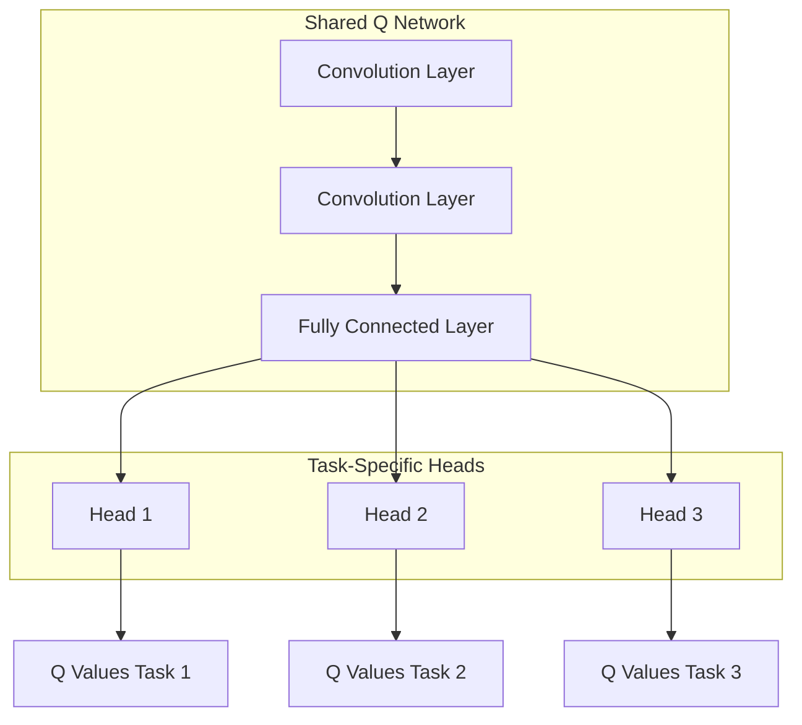

# 一切皆是映射：DQN与多任务学习：共享网络结构的效果分析

## 1. 背景介绍

### 1.1 强化学习与深度Q网络(DQN)

强化学习是机器学习的一个重要分支,它关注智能体如何通过与环境的交互来学习采取最优策略,以最大化预期的累积奖励。在强化学习中,智能体与环境进行交互,观察当前状态,根据策略选择行动,执行行动并获得奖励,然后转移到下一个状态。通过不断地尝试和学习,智能体可以逐步优化其策略,以获得更好的表现。

深度Q网络(Deep Q-Network, DQN)是将深度神经网络应用于强化学习中的一种突破性方法。它使用一个深度神经网络来近似Q函数,即在给定状态下采取某个行动的价值函数。通过训练神经网络来估计Q值,DQN可以直接从高维观测数据中学习策略,而无需手工设计特征。DQN的出现极大地推动了强化学习在视频游戏、机器人控制等领域的应用。

### 1.2 多任务学习

多任务学习(Multi-Task Learning, MTL)是机器学习中的一种范式,它旨在同时解决多个相关任务,以提高模型的泛化能力和学习效率。在传统的单任务学习中,模型仅专注于解决一个特定的任务,而多任务学习则试图利用不同任务之间的相关性,共享知识和表示,从而提高模型在各个任务上的性能。

多任务学习的主要思想是,通过在相关任务之间共享一部分模型参数或网络结构,可以更好地捕获任务之间的共同特征和知识,从而提高模型的泛化能力。同时,多任务学习还可以提高数据利用效率,缓解数据不足的问题,并且可以减少过拟合的风险。

### 1.3 DQN与多任务学习的结合

将DQN与多任务学习相结合,可以为强化学习任务带来诸多好处。由于不同强化学习任务之间存在一定的相关性,如环境动力学、状态表示等,因此可以通过共享网络结构来捕获这些共同的特征,提高模型的泛化能力和学习效率。

此外,在实际应用中,我们常常需要训练智能体来解决多个相关的任务,例如机器人需要同时完成导航、物体识别和操作等任务。在这种情况下,使用多任务学习可以显著减少训练时间和计算资源的消耗。

本文将探讨在DQN中应用多任务学习的方法,分析共享网络结构对模型性能的影响,并提供实用的技巧和见解。

## 2. 核心概念与联系

### 2.1 Q-Learning与Q函数

Q-Learning是强化学习中的一种基于值函数的算法,它通过估计状态-行为对的Q值来学习最优策略。Q值表示在给定状态下采取某个行动的长期预期奖励,定义如下:

$$Q(s, a) = \mathbb{E}\left[\sum_{t=0}^{\infty} \gamma^t r_{t+1} | s_t = s, a_t = a\right]$$

其中,$ s $表示状态,$ a $表示行动,$ r_t $表示在时间步$ t $获得的即时奖励,$ \gamma $是折现因子,用于权衡即时奖励和长期奖励的重要性。

根据贝尔曼最优方程,最优Q值函数$ Q^*(s, a) $满足以下等式:

$$Q^*(s, a) = \mathbb{E}_{s'}\left[r + \gamma \max_{a'} Q^*(s', a') | s, a\right]$$

这意味着,最优Q值等于在当前状态$ s $下采取行动$ a $获得的即时奖励$ r $,加上从下一个状态$ s' $开始采取最优策略所能获得的折现后的最大Q值。

Q-Learning算法通过不断更新Q值函数,使其逼近最优Q值函数$ Q^* $,从而找到最优策略。

### 2.2 深度Q网络(DQN)

深度Q网络(DQN)是将深度神经网络应用于Q-Learning的一种方法。在DQN中,我们使用一个深度神经网络$ Q(s, a; \theta) $来近似Q值函数,其中$ \theta $表示网络的参数。网络的输入是状态$ s $,输出是所有可能行动的Q值。

为了训练DQN,我们定义了一个损失函数,用于最小化网络输出的Q值与目标Q值之间的差异:

$$L(\theta) = \mathbb{E}_{(s, a, r, s')} \left[\left(Q(s, a; \theta) - y\right)^2\right]$$

其中,目标Q值$ y $根据贝尔曼方程计算:

$$y = r + \gamma \max_{a'} Q(s', a'; \theta^-)$$

$ \theta^- $表示目标网络的参数,用于估计下一个状态的最大Q值,以提高训练的稳定性。

通过反向传播算法优化损失函数,可以逐步更新网络参数$ \theta $,使Q网络逼近最优Q值函数。

### 2.3 多任务学习与共享网络结构

在多任务学习中,我们希望训练一个模型来同时解决多个相关任务。为了实现这一目标,我们可以设计一个共享网络结构,其中包含一些共享的层(如卷积层或全连接层),以及一些特定于每个任务的层。

共享层的作用是捕获不同任务之间的共同特征和知识,而任务特定层则用于学习每个任务的独特表示。通过这种方式,模型可以在相关任务之间共享知识,提高泛化能力和学习效率。

在DQN与多任务学习的结合中,我们可以设计一个共享网络结构,其中包含一个共享的Q网络作为主干网络,以及多个任务特定的头部网络。共享的Q网络用于提取状态的共同特征,而头部网络则根据不同的任务输出对应的Q值。

通过这种结构,我们可以利用不同强化学习任务之间的相关性,提高模型的性能和训练效率。

## 3. 核心算法原理具体操作步骤

在本节中,我们将详细介绍如何将DQN与多任务学习相结合,并分析共享网络结构对模型性能的影响。

### 3.1 多任务DQN网络结构

我们设计了一个共享网络结构,用于同时解决多个强化学习任务。如下图所示,该网络包含一个共享的Q网络作为主干网络,以及多个任务特定的头部网络。

共享的Q网络包含一些卷积层和全连接层,用于从状态输入中提取共同的特征表示。每个任务特定的头部网络则由一个或多个全连接层组成,用于根据共享特征输出对应任务的Q值。

在训练过程中,我们将多个任务的数据混合在一起,并使用多任务损失函数进行优化。对于每个任务,我们计算其Q值与目标Q值之间的均方差损失,然后将所有任务的损失相加,作为总的多任务损失:

$$L_\text{total} = \sum_{i=1}^{N} L_i(\theta)$$

其中,$ N $是任务的总数,$ L_i(\theta) $是第$ i $个任务的损失函数,$ \theta $表示共享网络和头部网络的所有参数。

通过反向传播算法优化总的多任务损失,我们可以同时更新共享网络和头部网络的参数,使模型在所有任务上的性能都得到提高。

### 3.2 梯度归一化

在多任务学习中,不同任务的损失值可能存在较大差异,这可能导致梯度不稳定,影响模型的收敛性能。为了解决这个问题,我们可以采用梯度归一化技术。

具体而言,对于每个任务,我们计算其梯度的$ L_2 $范数,然后将梯度除以该范数,从而将梯度归一化到单位球面上。最后,我们将所有任务的归一化梯度相加,得到总的梯度:

$$g_\text{total} = \sum_{i=1}^{N} \frac{g_i}{\|g_i\|_2}$$

其中,$ g_i $是第$ i $个任务的梯度,$ \|g_i\|_2 $表示其$ L_2 $范数。

通过梯度归一化,我们可以确保每个任务对总梯度的贡献相当,从而提高模型的收敛性能。

### 3.3 任务权重调节

在多任务学习中,不同任务的重要性可能不同,因此我们可以为每个任务分配不同的权重,以调节它们对总损失的贡献。具体来说,我们将总的多任务损失函数修改为:

$$L_\text{total} = \sum_{i=1}^{N} w_i L_i(\theta)$$

其中,$ w_i $是第$ i $个任务的权重系数。

通过调节任务权重,我们可以控制模型在不同任务上的性能权衡。例如,如果某个任务特别重要,我们可以为它分配更高的权重,使模型更关注该任务的性能。相反,如果某个任务相对不太重要,我们可以降低其权重,以避免过度拟合。

任务权重的设置可以根据具体的应用场景和性能要求进行调整,也可以在训练过程中动态更新。

## 4. 数学模型和公式详细讲解举例说明

在本节中,我们将详细解释DQN与多任务学习相结合的数学模型和公式,并通过具体示例加深理解。

### 4.1 DQN的数学模型

在DQN中,我们使用一个深度神经网络$ Q(s, a; \theta) $来近似Q值函数,其中$ \theta $表示网络的参数。网络的输入是状态$ s $,输出是所有可能行动的Q值。

为了训练DQN,我们定义了一个损失函数,用于最小化网络输出的Q值与目标Q值之间的差异:

$$L(\theta) = \mathbb{E}_{(s, a, r, s')} \left[\left(Q(s, a; \theta) - y\right)^2\right]$$

其中,目标Q值$ y $根据贝尔曼方程计算:

$$y = r + \gamma \max_{a'} Q(s', a'; \theta^-)$$

$ \theta^- $表示目标网络的参数,用于估计下一个状态的最大Q值,以提高训练的稳定性。

通过反向传播算法优化损失函数,可以逐步更新网络参数$ \theta $,使Q网络逼近最优Q值函数。

### 4.2 多任务DQN的数学模型

在多任务DQN中,我们设计了一个共享网络结构,包含一个共享的Q网络作为主干网络,以及多个任务特定的头部网络。

对于每个任务$ i $,我们计算其Q值与目标Q值之间的均方差损失:

$$L_i(\theta) = \mathbb{E}_{(s, a, r, s')} \left[\left(Q_i(s, a; \theta) - y_i\right)^2\right]$$

其中,$ Q_i(s, a; \theta) $是第$ i $个任务的Q网络输出,$ y_i $是对应的目标Q值。

然后,我们将所有任务的损失相加,作为总的多任务损失:

$$L_\text{total} = \sum_{i=1}^{N} L_i(\theta)$$

其中,$ N $是任务的总数,$ \theta $表示共享网络和头部网络的所有参数。

通过反向传播算法优化总的多任务损失,我们可以同时更新共享网络和头部网络的参数,使模型在所有任务上的性能都得到提高。

### 4.3 梯度归一化

在多任务学习中,不同任务的损失值可能存在较大差异,这可能导致梯度不稳定,影响模型的收敛性能。为了解决这个问题,我们可以采用梯度归一化技术。

具体而言,对于每个任务,我们计算