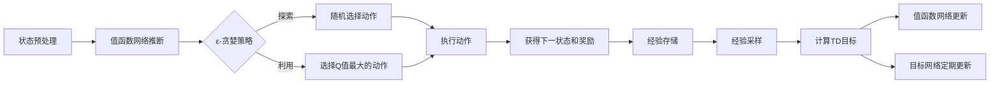

# 一切皆是映射：DQN在安全防御中的应用：智能检测与响应

## 1.背景介绍
### 1.1 网络安全现状与挑战
随着信息技术的飞速发展,网络安全问题日益严峻。黑客攻击、病毒木马、数据泄露等安全事件频发,给企业和个人带来巨大损失。传统的安全防御手段如防火墙、入侵检测等已难以应对日新月异的攻击手段。亟需智能化、自适应的安全防御技术。
### 1.2 人工智能在网络安全中的应用
人工智能技术如机器学习、深度学习为网络安全带来新的契机。利用AI可以从海量安全数据中自动学习攻击特征,实现智能检测。同时AI系统可通过强化学习不断优化策略,做出最佳安全决策。将AI应用于安全防御,有望极大提升防御效果。
### 1.3 DQN强化学习简介
强化学习是AI的一个重要分支,旨在通过"试错"学习最优策略。其中DQN(Deep Q Network)将深度学习与Q学习相结合,实现了端到端的策略学习。DQN在围棋、Atari游戏中取得了重大突破,展现了强大的学习能力。将DQN应用于网络安全,可望实现智能检测与自适应响应。

## 2.核心概念与联系
### 2.1 MDP与网络安全建模
MDP(Markov Decision Process)是强化学习的理论基础。MDP由状态、动作、转移概率和奖励函数组成。将网络安全问题建模为MDP,攻防对抗可抽象为agent与环境的交互过程。系统状态可包括资产状态、攻击状态等,动作空间涵盖各种防御措施,奖励函数根据安全目标设计。
### 2.2 Q学习与DQN
Q学习是一种无模型的强化学习算法,通过值函数逼近最优策略。Q函数评估某状态下采取动作的长期收益。Q学习通过不断更新值函数实现策略优化。DQN使用深度神经网络拟合Q函数,将高维状态映射到值函数,提升了学习能力与泛化性能。
### 2.3 DQN架构与训练流程
DQN的核心是值函数网络和目标网络。值函数网络用于估计当前值函数,目标网络用于计算TD目标。DQN通过两个网络的交替更新和经验回放等机制,保证了训练的稳定性。DQN的训练流程通常包括状态预处理、神经网络推断、ε-贪婪探索、经验存储与采样、网络更新等步骤。



## 3.核心算法原理具体操作步骤
### 3.1 DQN算法流程
1. 随机初始化值函数网络Q和目标网络Q̂的参数
2. for episode = 1 to M do
3.    初始化环境状态s
4.    for t = 1 to T do
5.        使用ε-贪婪策略基于Q选择动作a
6.        执行动作a,观察奖励r和下一状态s'
7.        将转移(s,a,r,s')存储到经验回放缓冲D
8.        从D中随机采样一批转移样本(s_i,a_i,r_i,s'_i)
9.        计算TD目标y_i = r_i + γ max_a' Q̂(s'_i, a')
10.       最小化损失L = (y_i - Q(s_i, a_i))^2更新Q的参数
11.       每C步将Q̂的参数更新为Q的参数
12.   end for
13. end for
### 3.2 状态预处理
将环境状态表示为神经网络的输入至关重要。对于网络安全场景,状态可包括系统日志、流量统计、资产信息等。需对原始数据进行特征提取、归一化等预处理,转换为固定维度的实值向量。同时为实现高效训练,状态表示应具有局部性和平稳性。
### 3.3 探索与利用
为平衡探索和利用,DQN通常采用ε-贪婪策略选择动作。以ε的概率随机选择动作,以1-ε的概率选择Q值最大的动作。ε随训练进行逐渐衰减,以在早期鼓励探索,后期趋向最优策略。此外,可在探索中引入先验知识,避免盲目尝试。
### 3.4 经验回放
经验回放是DQN的关键机制,用于打破转移样本间的相关性。将转移样本(s,a,r,s')存储到经验回放缓冲区,训练时从中随机采样小批量样本用于网络更新。经验回放提高了样本利用效率,平滑了训练数据分布。为提升采样效率,可引入优先级采样等技术。
### 3.5 网络更新
DQN交替更新值函数网络和目标网络。每一步根据TD误差更新值函数网络参数,以拟合最新值函数。而目标网络每C步从值函数网络复制参数,用于计算稳定的TD目标。双网络机制缓解了训练不稳定性。在实践中,还可采用Double DQN等改进算法,进一步提升稳定性和性能。

## 4.数学模型和公式详细讲解举例说明
### 4.1 MDP数学定义
MDP定义为一个五元组$(S,A,P,R,γ)$:
- 状态空间$S$,表示所有可能的环境状态
- 动作空间$A$,表示agent可执行的所有动作
- 转移概率$P(s'|s,a)$,表示在状态$s$下执行动作$a$后转移到状态$s'$的概率
- 奖励函数$R(s,a)$,表示在状态$s$下执行动作$a$获得的即时奖励
- 折扣因子$γ∈[0,1]$,表示未来奖励的衰减程度

例如在入侵检测场景中,状态可用特征向量$(x_1,\dots,x_n)$表示,包括系统调用、流量统计等;动作可为{允许,阻断};转移概率和奖励函数可根据专家知识设计;折扣因子可取0.99,以重视长期收益。
### 4.2 Q函数与Bellman方程
Q函数(Action-Value Function)$Q(s,a)$表示在状态$s$下选择动作$a$的长期累积奖励期望:

$$
Q(s,a) = \mathbb{E} \left[ \sum_{t=0}^{\infty} γ^t r_t | s_0=s, a_0=a \right]
$$

Q函数满足Bellman方程:

$$
Q(s,a) = R(s,a) + γ \sum_{s'} P(s'|s,a) \max_{a'} Q(s',a')
$$

即当前值函数等于即时奖励和下一状态值函数最大值的和。Bellman方程揭示了最优值函数的递归性质,为Q学习奠定了理论基础。
### 4.3 Q学习与DQN目标
Q学习通过不断估计和更新值函数逼近最优策略。Q学习的核心是值函数更新:

$$
Q(s,a) \leftarrow Q(s,a) + \alpha \left[ r + γ \max_{a'} Q(s',a') - Q(s,a) \right]
$$

其中$\alpha$为学习率。DQN将值函数近似为深度神经网络$Q(s,a;θ)$,并最小化TD误差:

$$
L(θ) = \mathbb{E}_{(s,a,r,s') \sim D} \left[ \left( r + γ \max_{a'} Q(s',a';θ^{-}) - Q(s,a;θ) \right)^2 \right]
$$

其中$θ^{-}$为目标网络参数。DQN通过梯度下降等优化算法最小化损失函数,实现值函数的更新。
### 4.4 策略评估与策略提升
DQN的训练过程可视为策略迭代(Policy Iteration)。每次网络更新对应一轮策略评估(Policy Evaluation)和策略提升(Policy Improvement)。策略评估通过拟合值函数估计策略的性能,策略提升依据更新后的值函数生成新策略。DQN通过函数逼近隐式地执行策略迭代,最终收敛到最优策略。

策略评估对应值函数更新:

$$
Q(s,a;θ) \leftarrow r + γ \max_{a'} Q(s',a';θ^{-})
$$

策略提升对应ε-贪婪动作选择:

$$
\pi(s) = 
\begin{cases}
\arg\max_{a} Q(s,a;θ)& \text{以概率}1-ε\\
随机动作 & \text{以概率}ε
\end{cases}
$$

DQN通过价值与策略的交替优化,最终学习到最优的安全防御策略。

## 5.项目实践：代码实例和详细解释说明
下面给出基于PyTorch实现DQN处理安全检测数据的示例代码:

```python
import torch
import torch.nn as nn
import torch.optim as optim
import numpy as np
import random
from collections import deque

# 定义DQN网络结构
class DQN(nn.Module):
    def __init__(self, state_dim, action_dim):
        super(DQN, self).__init__()
        self.fc1 = nn.Linear(state_dim, 64)
        self.fc2 = nn.Linear(64, 64)
        self.fc3 = nn.Linear(64, action_dim)
        
    def forward(self, x):
        x = torch.relu(self.fc1(x))
        x = torch.relu(self.fc2(x))
        x = self.fc3(x)
        return x

# 定义经验回放缓冲区        
class ReplayBuffer:
    def __init__(self, capacity):
        self.buffer = deque(maxlen=capacity)
    
    def push(self, state, action, reward, next_state, done):
        self.buffer.append((state, action, reward, next_state, done))
    
    def sample(self, batch_size):
        experiences = random.sample(self.buffer, batch_size)
        states, actions, rewards, next_states, dones = zip(*experiences)
        return states, actions, rewards, next_states, dones
    
    def __len__(self):
        return len(self.buffer)

# 定义DQN智能体
class DQNAgent:
    def __init__(self, state_dim, action_dim, lr, gamma, epsilon, target_update):
        self.state_dim = state_dim
        self.action_dim = action_dim
        self.gamma = gamma
        self.epsilon = epsilon
        self.target_update = target_update
        
        self.policy_net = DQN(state_dim, action_dim)
        self.target_net = DQN(state_dim, action_dim)
        self.target_net.load_state_dict(self.policy_net.state_dict())
        self.optimizer = optim.Adam(self.policy_net.parameters(), lr=lr)
        
        self.replay_buffer = ReplayBuffer(10000)
        
    def select_action(self, state):
        if np.random.rand() < self.epsilon:
            return np.random.randint(self.action_dim)
        else:
            state = torch.FloatTensor(state).unsqueeze(0)
            q_values = self.policy_net(state)
            return q_values.argmax().item()
        
    def update(self, batch_size):
        if len(self.replay_buffer) < batch_size:
            return
        
        states, actions, rewards, next_states, dones = self.replay_buffer.sample(batch_size)
        states = torch.FloatTensor(states)
        actions = torch.LongTensor(actions).unsqueeze(1)
        rewards = torch.FloatTensor(rewards).unsqueeze(1)
        next_states = torch.FloatTensor(next_states)
        dones = torch.FloatTensor(dones).unsqueeze(1)
        
        q_values = self.policy_net(states).gather(1, actions)
        next_q_values = self.target_net(next_states).max(1)[0].unsqueeze(1)
        expected_q_values = rewards + self.gamma * next_q_values * (1 - dones)
        
        loss = nn.MSELoss()(q_values, expected_q_values.detach())
        self.optimizer.zero_grad()
        loss.backward()
        self.optimizer.step()
        
    def soft_update(self):
        for target_param, policy_param in zip(self.target_net.parameters(), self.policy_net.parameters()):
            target_param.data.copy_(policy_param.data)