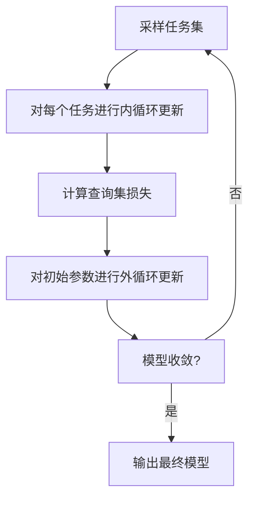

# 一切皆是映射：MAML算法原理与应用

## 1.背景介绍

### 1.1 元学习的兴起

在传统的机器学习范式中，我们通常会在大量的数据集上训练一个单一的模型,期望它能够很好地泛化到看不见的测试数据上。然而,这种"一个模型通吃"的做法在实践中存在一些局限性。首先,收集大规模的数据集本身就是一个巨大的挑战,尤其是在一些特殊领域。其次,即使有足够的数据,也难以保证模型能够很好地适应所有的任务。

为了解决这些问题,元学习(Meta-Learning)应运而生。元学习的核心思想是:利用多个不同但相关的任务,学习一种快速适应新任务的能力。换句话说,我们不再追求在单个任务上的高性能,而是追求在所有任务上的通用学习能力。通过元学习,我们可以在少量新数据的情况下快速适应新任务,从而大大减少了数据需求。

### 1.2 MAML算法的提出

2017年,来自加州大学伯克利分校的Chelsea Finn等人在论文《Model-Agnostic Meta-Learning for Fast Adaptation of Deep Networks》中提出了一种新的元学习算法:模型无关元学习(Model-Agnostic Meta-Learning,MAML)。MAML算法的核心思想是:通过多任务训练,找到一个好的初始化参数,使得在新任务上只需少量梯度更新步骤,就能得到一个有效的模型。

MAML算法具有以下两个显著特点:

1. 模型无关(Model-Agnostic):MAML算法不依赖于任何特定的模型结构,可以应用于任意可训练的模型。
2. 快速适应(Fast Adaptation):通过少量的梯度更新步骤,MAML算法就能快速适应新任务。

由于其简单高效的特点,MAML算法自问世以来就受到了广泛关注,在计算机视觉、自然语言处理、强化学习等多个领域取得了卓越的成绩。

## 2.核心概念与联系

### 2.1 任务(Task)

在MAML算法中,我们将整个问题抽象为一系列相关但不同的任务。每个任务代表了一个特定的数据分布,可以是分类任务、回归任务或者强化学习环境等。

具体来说,我们有一个任务分布 $p(\mathcal{T})$,每个任务 $\mathcal{T}_i$ 都是从这个分布中采样得到的。每个任务 $\mathcal{T}_i$ 包含一个支持集(Support Set) $\mathcal{D}_i^{tr}$ 和一个查询集(Query Set) $\mathcal{D}_i^{val}$,支持集用于模型的训练和适应,查询集用于评估模型的性能。

### 2.2 内循环(Inner Loop)和外循环(Outer Loop)

MAML算法包含两个循环过程:内循环(Inner Loop)和外循环(Outer Loop)。

**内循环**是指在每个任务 $\mathcal{T}_i$ 上,利用支持集 $\mathcal{D}_i^{tr}$ 对模型进行少量梯度更新,得到一个针对该任务的适应模型。这个过程模拟了快速适应新任务的能力。

**外循环**则是在所有任务上,通过优化查询集 $\mathcal{D}_i^{val}$ 上的性能,来更新模型的初始参数。这个过程确保了模型在所有任务上都有一个好的初始化,从而能够快速适应新任务。

内循环和外循环的交替迭代,是MAML算法实现快速适应能力的关键。

### 2.3 模型无关性(Model-Agnostic)

MAML算法的一个重要特点是模型无关性。也就是说,MAML算法不依赖于任何特定的模型结构,可以应用于任意可训练的模型,包括深度神经网络、决策树、高斯过程等。

这种模型无关性的实现关键在于,MAML算法直接优化模型参数的更新规则,而不是优化模型参数本身。具体来说,在内循环中,MAML算法计算出针对每个任务的参数更新方向,而在外循环中,MAML算法则优化这些更新方向,使得在所有任务上都能取得良好的性能。

模型无关性使得MAML算法具有很强的通用性和灵活性,可以应用于多种不同的场景和问题。

## 3.核心算法原理具体操作步骤

### 3.1 MAML算法流程

MAML算法的核心思想是:通过多任务训练,找到一个好的初始化参数 $\theta$,使得在新任务上只需少量梯度更新步骤,就能得到一个有效的模型。

具体来说,MAML算法包含以下步骤:

1. 从任务分布 $p(\mathcal{T})$ 中采样一批任务 $\{\mathcal{T}_1, \mathcal{T}_2, \cdots, \mathcal{T}_N\}$,每个任务 $\mathcal{T}_i$ 包含支持集 $\mathcal{D}_i^{tr}$ 和查询集 $\mathcal{D}_i^{val}$。
2. 对于每个任务 $\mathcal{T}_i$,利用支持集 $\mathcal{D}_i^{tr}$ 进行 $K$ 步梯度更新,得到适应后的模型参数 $\theta_i'$:

$$\theta_i' = \theta - \alpha \nabla_\theta \mathcal{L}_{\mathcal{T}_i}(f_\theta, \mathcal{D}_i^{tr})$$

其中 $\alpha$ 是学习率, $\mathcal{L}_{\mathcal{T}_i}$ 是任务 $\mathcal{T}_i$ 上的损失函数, $f_\theta$ 是以 $\theta$ 为参数的模型。
3. 在所有任务的查询集 $\{\mathcal{D}_i^{val}\}$ 上计算适应后模型的损失,并对初始参数 $\theta$ 进行梯度更新:

$$\theta \leftarrow \theta - \beta \nabla_\theta \sum_{\mathcal{T}_i \sim p(\mathcal{T})} \mathcal{L}_{\mathcal{T}_i}(f_{\theta_i'}, \mathcal{D}_i^{val})$$

其中 $\beta$ 是元学习率。
4. 重复步骤1-3,直到模型收敛。

通过上述过程,MAML算法能够找到一个好的初始化参数 $\theta$,使得在新任务上只需少量梯度更新步骤,就能得到一个有效的模型。

### 3.2 MAML算法流程图

下面是MAML算法的流程图,使用Mermaid语法绘制:

其中:

- 节点A: 从任务分布中采样一批任务,每个任务包含支持集和查询集。
- 节点B: 对每个任务,利用支持集进行少量梯度更新,得到适应后的模型参数。
- 节点C: 在所有任务的查询集上计算适应后模型的损失。
- 节点D: 对初始参数进行梯度更新,使得在所有任务上的查询集损失最小化。
- 节点E: 判断模型是否收敛,如果收敛则输出最终模型,否则返回节点A继续训练。

通过上述流程,MAML算法能够找到一个好的初始化参数,使得在新任务上只需少量梯度更新步骤,就能得到一个有效的模型。

## 4.数学模型和公式详细讲解举例说明

在上一节中,我们已经介绍了MAML算法的核心流程。现在,我们来详细解释其中涉及的数学模型和公式。

### 4.1 任务分布和损失函数

假设我们有一个任务分布 $p(\mathcal{T})$,每个任务 $\mathcal{T}_i$ 都是从这个分布中采样得到的。每个任务 $\mathcal{T}_i$ 包含一个支持集(Support Set) $\mathcal{D}_i^{tr}$ 和一个查询集(Query Set) $\mathcal{D}_i^{val}$。

对于每个任务 $\mathcal{T}_i$,我们定义一个损失函数 $\mathcal{L}_{\mathcal{T}_i}(f_\theta, \mathcal{D})$,用于评估模型 $f_\theta$ 在数据集 $\mathcal{D}$ 上的性能。损失函数的具体形式取决于任务的类型,例如对于分类任务,可以使用交叉熵损失;对于回归任务,可以使用均方误差损失。

### 4.2 内循环更新

在MAML算法的内循环中,我们利用支持集 $\mathcal{D}_i^{tr}$ 对模型进行 $K$ 步梯度更新,得到适应后的模型参数 $\theta_i'$:

$$\theta_i' = \theta - \alpha \nabla_\theta \mathcal{L}_{\mathcal{T}_i}(f_\theta, \mathcal{D}_i^{tr})$$

其中 $\alpha$ 是学习率, $\nabla_\theta \mathcal{L}_{\mathcal{T}_i}(f_\theta, \mathcal{D}_i^{tr})$ 是模型在支持集上的梯度。

这个过程模拟了快速适应新任务的能力。通过少量梯度更新步骤,我们就能得到一个针对该任务的适应模型 $f_{\theta_i'}$。

### 4.3 外循环更新

在MAML算法的外循环中,我们在所有任务的查询集 $\{\mathcal{D}_i^{val}\}$ 上计算适应后模型的损失,并对初始参数 $\theta$ 进行梯度更新:

$$\theta \leftarrow \theta - \beta \nabla_\theta \sum_{\mathcal{T}_i \sim p(\mathcal{T})} \mathcal{L}_{\mathcal{T}_i}(f_{\theta_i'}, \mathcal{D}_i^{val})$$

其中 $\beta$ 是元学习率, $\nabla_\theta \sum_{\mathcal{T}_i \sim p(\mathcal{T})} \mathcal{L}_{\mathcal{T}_i}(f_{\theta_i'}, \mathcal{D}_i^{val})$ 是在所有任务的查询集上计算的元梯度。

这个过程确保了模型在所有任务上都有一个好的初始化,从而能够快速适应新任务。通过优化查询集上的性能,我们得到了一个新的初始参数 $\theta$,使得在任何新任务上,只需少量梯度更新步骤,就能得到一个有效的模型。

### 4.4 二阶导数计算

在实际计算中,我们需要计算元梯度 $\nabla_\theta \sum_{\mathcal{T}_i \sim p(\mathcal{T})} \mathcal{L}_{\mathcal{T}_i}(f_{\theta_i'}, \mathcal{D}_i^{val})$。根据链式法则,我们有:

$$\nabla_\theta \mathcal{L}_{\mathcal{T}_i}(f_{\theta_i'}, \mathcal{D}_i^{val}) = \nabla_{\theta_i'} \mathcal{L}_{\mathcal{T}_i}(f_{\theta_i'}, \mathcal{D}_i^{val}) \cdot \nabla_\theta \theta_i'$$

其中第一项 $\nabla_{\theta_i'} \mathcal{L}_{\mathcal{T}_i}(f_{\theta_i'}, \mathcal{D}_i^{val})$ 是模型在查询集上的梯度,可以通过反向传播直接计算得到。

第二项 $\nabla_\theta \theta_i'$ 是一个二阶导数项,需要进行如下计算:

$$\nabla_\theta \theta_i' = \nabla_\theta (\theta - \alpha \nabla_\theta \mathcal{L}_{\mathcal{T}_i}(f_\theta, \mathcal{D}_i^{tr})) = I - \alpha \nabla_\theta^2 \mathcal{L}_{\mathcal{T}_i}(f_\theta, \mathcal{D}_i^{tr})$$

其中 $I$ 是单位矩阵, $\nabla_\theta^2 \mathcal{L}_{\mathcal{T}_i}(f_\theta, \mathcal{D}_i^{tr})$ 是损失函数在支持集上的二阶导数,也称为海森矩