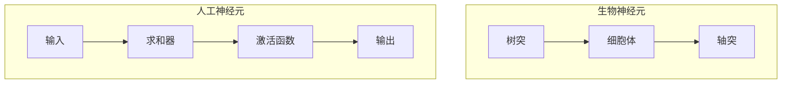
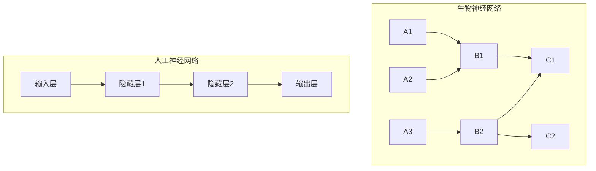
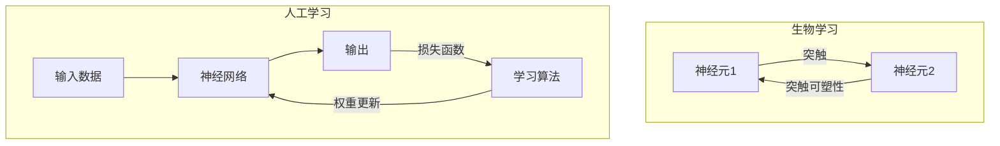
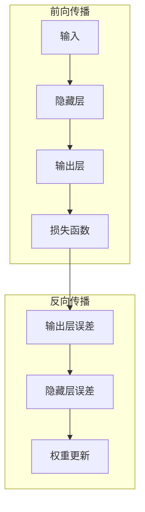
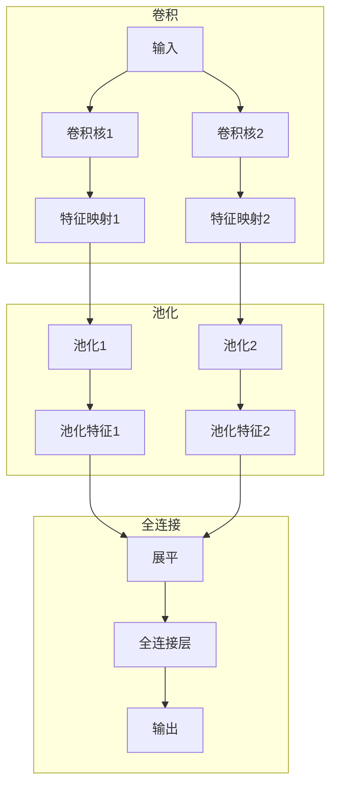

# 一切皆是映射：从生物神经到人工神经网络的演变

## 1.背景介绍

### 1.1 神经网络的起源

神经网络的概念源于对生物神经系统的研究。人类大脑是一个复杂的信息处理系统,由数十亿个神经元组成,这些神经元通过突触连接形成了庞大的网络。神经元接收来自其他神经元的电化学信号,对这些信号进行加权求和,如果总输入超过一定阈值,就会产生动作电位并将信号传递给下一层神经元。

生物神经系统的工作原理启发了人工神经网络的发展。1943年,神经生理学家沃伦·麦卡洛克(Warren McCulloch)和数理逻辑学家沃尔特·皮茨(Walter Pitts)提出了第一个形式神经网络模型,被称为M-P神经元模型。该模型将神经元抽象为一个加权求和器和一个阈值激活函数,为后来的人工神经网络奠定了基础。

### 1.2 人工神经网络的兴起

20世纪50年代,心理学家弗兰克·罗森布拉特(Frank Rosenblatt)在M-P神经元模型的基础上,提出了第一个实用的人工神经网络模型——感知器(Perceptron)。感知器可以学习对输入模式进行分类,为模式识别领域开辟了新的视野。

然而,在1969年,马文·明斯基(Marvin Minsky)和西摩尔·珀泽特(Seymour Papert)发表了著名的书籍"感知器",指出感知器只能解决线性可分问题,无法解决异或(XOR)等非线性问题,导致神经网络研究进入了一段低潮期。

直到20世纪80年代,随着反向传播算法(Backpropagation)的提出,多层前馈神经网络得以实现,神经网络研究重新焕发了生机。反向传播算法可以有效地训练多层神经网络,使其具备了解决非线性问题的能力。

### 1.3 深度学习的崛起

进入21世纪,随着计算能力的飞速提升和大数据时代的到来,深度神经网络(Deep Neural Networks)开始引领人工智能的新浪潮。深度神经网络由多个隐藏层组成,能够自动从大量数据中学习出高层次的抽象特征表示,在计算机视觉、自然语言处理、语音识别等领域取得了突破性的成就。

经典的深度神经网络模型包括卷积神经网络(Convolutional Neural Networks, CNN)、循环神经网络(Recurrent Neural Networks, RNN)、长短期记忆网络(Long Short-Term Memory, LSTM)等。这些模型借鉴了生物神经系统的一些特征,如局部连接、权值共享、反馈循环等,展现出强大的模式识别和序列建模能力。

如今,深度学习已成为人工智能的核心技术之一,在各个领域得到了广泛的应用和研究。从生物神经到人工神经网络,这一演变过程不仅揭示了智能的本质,也为我们开启了通往智能时代的大门。

## 2.核心概念与联系

### 2.1 神经元与人工神经元

生物神经元是构成生物神经系统的基本单元,而人工神经元则是组成人工神经网络的基本计算单元。两者在结构和功能上存在着显著的相似性。

生物神经元由细胞体、树突和轴突组成。树突接收来自其他神经元的化学信号,细胞体对这些信号进行加权求和,如果总输入超过一定阈值,就会通过轴突向下一层神经元传递动作电位。

人工神经元也具有类似的结构。它接收来自上一层神经元的加权输入,对这些输入进行求和,然后通过激活函数(如Sigmoid、ReLU等)进行非线性变换,得到该神经元的输出。该输出将作为下一层神经元的输入。



### 2.2 神经网络与人工神经网络

生物神经网络是由数十亿个神经元通过突触连接形成的庞大网络。这些神经元按照特定的拓扑结构组织在一起,通过电化学信号的传递实现信息处理和计算。

人工神经网络则是由大量的人工神经元按照特定的拓扑结构连接而成。不同的网络结构赋予了神经网络不同的功能,如前馈网络用于模式识别,循环网络用于序列建模等。



### 2.3 学习算法与生物学习

生物神经系统具有学习和记忆的能力,这种能力主要依赖于突触可塑性。当神经元之间的连接被反复激活时,突触的强度会发生变化,从而影响信号的传递效率。这种基于经验的突触强化或削弱过程,就是生物学习的本质。

人工神经网络也具有学习的能力,主要依赖于训练数据和学习算法。通过不断调整神经元之间连接的权重,使网络的输出逐渐逼近期望值,从而实现对输入模式的学习和泛化。常用的学习算法包括反向传播算法、优化算法(如梯度下降)等。



生物神经系统和人工神经网络在核心概念上存在着显著的相似性,但也有一些本质的区别。生物神经系统是一个高度复杂、动态、自适应的系统,而人工神经网络则是对生物神经系统的简化抽象模型。尽管如此,两者之间的联系为我们揭示了智能的本质,也为人工智能的发展提供了宝贵的启示。

## 3.核心算法原理具体操作步骤

### 3.1 前馈神经网络

前馈神经网络(Feedforward Neural Network)是最基本的人工神经网络结构,信号只沿着单一方向传播,不存在反馈环路。前馈网络通常由输入层、隐藏层和输出层组成,每一层的神经元与上一层的所有神经元相连。

前馈网络的核心算法包括前向传播(Forward Propagation)和反向传播(Backpropagation)两个阶段。

#### 3.1.1 前向传播

1. 初始化网络权重和偏置项(通常使用小的随机值)。
2. 对于每个输入样本,计算输入层到隐藏层的加权求和,并应用激活函数(如Sigmoid或ReLU)得到隐藏层的输出。
3. 重复上一步,计算隐藏层到输出层的加权求和,并应用激活函数得到输出层的输出。
4. 计算输出层与期望输出之间的损失函数值(如均方误差或交叉熵)。

#### 3.1.2 反向传播

1. 计算输出层误差,即输出层神经元的输出与期望输出之间的差值。
2. 依次计算隐藏层每个神经元的误差,误差由输出层误差通过权重传播而来。
3. 更新每个权重,使得损失函数值减小。常用的更新方法是梯度下降法,即沿着损失函数的负梯度方向更新权重。
4. 重复上述步骤,直到损失函数收敛或达到最大迭代次数。



### 3.2 卷积神经网络

卷积神经网络(Convolutional Neural Network, CNN)是一种专门用于处理网格结构数据(如图像)的神经网络。CNN利用局部连接、权值共享和池化操作等技术,能够有效地提取输入数据的空间特征,在计算机视觉领域取得了巨大成功。

CNN的核心算法包括卷积(Convolution)、池化(Pooling)和全连接(Fully Connected)三个阶段。

#### 3.2.1 卷积

1. 定义多个卷积核(也称滤波器),每个卷积核对应一种特征。
2. 将卷积核在输入数据(如图像)上滑动,计算卷积核与输入数据的元素wise乘积之和,得到一个特征映射(Feature Map)。
3. 对特征映射应用激活函数(如ReLU),得到该卷积核提取的特征。
4. 重复上述步骤,使用多个卷积核提取不同的特征。

#### 3.2.2 池化

1. 将特征映射划分为多个小区域。
2. 对每个小区域应用池化操作(如最大池化或平均池化),提取该区域的代表性特征。
3. 将所有小区域的代表性特征组合成一个新的特征映射,降低了特征的维度。

#### 3.2.3 全连接

1. 将池化层的输出展平成一维向量。
2. 将该向量输入到全连接层,与传统的前馈神经网络类似。
3. 全连接层的输出即为CNN的最终输出,可用于分类或回归任务。



### 3.3 循环神经网络

循环神经网络(Recurrent Neural Network, RNN)是一种专门用于处理序列数据(如文本、语音、时间序列等)的神经网络。与前馈网络不同,RNN在隐藏层之间存在循环连接,使得网络能够捕捉序列数据中的时间依赖关系。

RNN的核心算法包括前向传播和反向传播两个阶段,与前馈网络类似。但由于引入了循环连接,RNN的计算过程需要展开成多个时间步骤。

#### 3.3.1 前向传播

1. 初始化隐藏状态和权重。
2. 对于序列中的每个时间步:
   a. 计算当前时间步的隐藏状态,即将当前输入与上一时间步的隐藏状态进行加权求和,并应用激活函数。
   b. 计算当前时间步的输出,即将当前隐藏状态与输出权重进行加权求和,并应用激活函数。
3. 重复上述步骤,直到序列的最后一个时间步。

#### 3.3.2 反向传播

1. 计算最后一个时间步的输出误差。
2. 对于每个时间步(从后向前):
   a. 计算当前时间步的隐藏状态误差,即将下一时间步的隐藏状态误差与当前时间步的权重进行加权求和。
   b. 更新当前时间步的权重,使得损失函数值减小。
3. 重复上述步骤,直到第一个时间步。

```mermaid
graph TD
    subgraph 前向传播
        输入1 --> 隐藏状态1
        