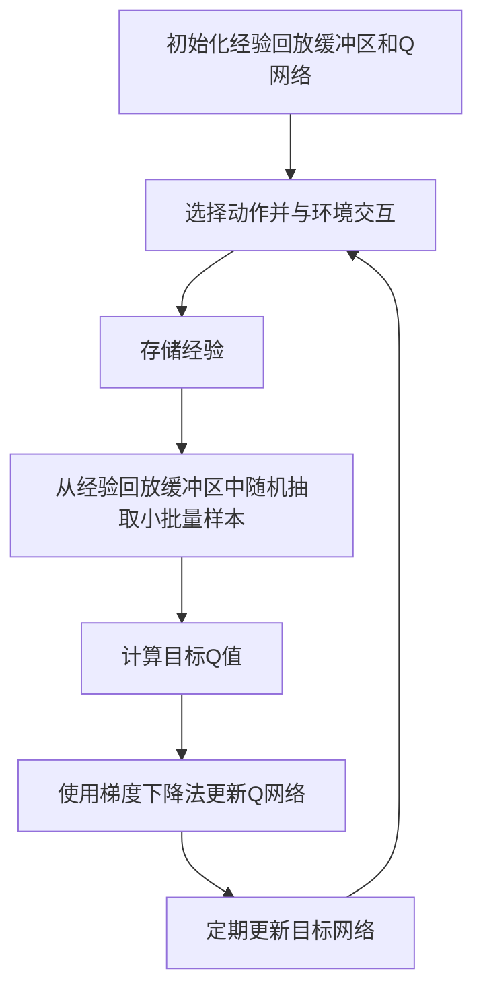

# 一切皆是映射：使用DQN解决连续动作空间问题：策略与挑战

## 1.背景介绍

在强化学习（Reinforcement Learning, RL）领域，深度Q网络（Deep Q-Network, DQN）已经成为解决离散动作空间问题的经典方法。然而，现实世界中的许多问题，如机器人控制、自动驾驶等，往往涉及连续动作空间。如何将DQN扩展到连续动作空间，成为了一个重要的研究课题。本文将深入探讨使用DQN解决连续动作空间问题的策略与挑战。

## 2.核心概念与联系

### 2.1 强化学习基础

强化学习是一种通过与环境交互来学习策略的机器学习方法。其核心要素包括状态（State, S）、动作（Action, A）、奖励（Reward, R）和策略（Policy, π）。智能体通过选择动作来最大化累积奖励。

### 2.2 深度Q网络（DQN）

DQN结合了Q学习和深度神经网络，用于估计状态-动作值函数（Q函数）。Q函数表示在给定状态下选择某一动作的预期累积奖励。DQN通过经验回放和目标网络来稳定训练过程。

### 2.3 连续动作空间

在连续动作空间中，动作不再是离散的，而是一个连续的范围。这使得直接应用DQN变得困难，因为Q值的计算和动作选择都需要在连续空间中进行优化。

## 3.核心算法原理具体操作步骤

### 3.1 DQN的基本流程

DQN的基本流程包括以下步骤：

1. 初始化经验回放缓冲区和Q网络。
2. 在每个时间步，选择动作并与环境交互，存储经验。
3. 从经验回放缓冲区中随机抽取小批量样本，计算目标Q值。
4. 使用梯度下降法更新Q网络。
5. 定期更新目标网络。

### 3.2 扩展到连续动作空间

为了将DQN扩展到连续动作空间，常用的方法包括：

1. **深度确定性策略梯度（DDPG）**：结合DQN和策略梯度方法，使用一个策略网络来选择动作。
2. **软演员-评论家（SAC）**：引入熵正则化项，鼓励策略探索。
3. **Twin Delayed DDPG（TD3）**：通过延迟更新和双Q网络减少过估计偏差。

### 3.3 算法流程图



## 4.数学模型和公式详细讲解举例说明

### 4.1 Q学习的数学模型

Q学习的目标是找到最优Q函数 $Q^*(s, a)$，其满足贝尔曼方程：

$$
Q^*(s, a) = \mathbb{E}[r + \gamma \max_{a'} Q^*(s', a') | s, a]
$$

其中，$s'$ 是状态 $s$ 执行动作 $a$ 后的下一个状态，$r$ 是即时奖励，$\gamma$ 是折扣因子。

### 4.2 DDPG的数学模型

DDPG使用两个网络：一个策略网络 $\mu(s|\theta^\mu)$ 和一个Q网络 $Q(s, a|\theta^Q)$。其目标是最大化目标函数：

$$
J(\theta^\mu) = \mathbb{E}[Q(s, \mu(s|\theta^\mu)|\theta^Q)]
$$

通过策略梯度方法更新策略网络参数：

$$
\nabla_{\theta^\mu} J \approx \mathbb{E}[\nabla_a Q(s, a|\theta^Q)|_{a=\mu(s)} \nabla_{\theta^\mu} \mu(s|\theta^\mu)]
$$

### 4.3 SAC的数学模型

SAC引入了熵正则化项，目标函数为：

$$
J(\pi) = \mathbb{E}[Q(s, a) + \alpha \mathcal{H}(\pi(\cdot|s))]
$$

其中，$\mathcal{H}$ 是策略的熵，$\alpha$ 是权衡探索和利用的超参数。

## 5.项目实践：代码实例和详细解释说明

### 5.1 环境设置

首先，安装必要的库：

```bash
pip install gym tensorflow
```

### 5.2 DDPG代码实例

以下是一个简单的DDPG实现：

```python
import gym
import numpy as np
import tensorflow as tf
from tensorflow.keras import layers

class OUActionNoise:
    def __init__(self, mean, std_deviation, theta=0.15, dt=1e-2, x_initial=None):
        self.theta = theta
        self.mean = mean
        self.std_dev = std_deviation
        self.dt = dt
        self.x_initial = x_initial
        self.reset()

    def __call__(self):
        x = (
            self.x_prev
            + self.theta * (self.mean - self.x_prev) * self.dt
            + self.std_dev * np.sqrt(self.dt) * np.random.normal(size=self.mean.shape)
        )
        self.x_prev = x
        return x

    def reset(self):
        self.x_prev = self.x_initial if self.x_initial is not None else np.zeros_like(self.mean)

def get_actor(num_states, num_actions):
    inputs = layers.Input(shape=(num_states,))
    out = layers.Dense(256, activation="relu")(inputs)
    out = layers.Dense(256, activation="relu")(out)
    outputs = layers.Dense(num_actions, activation="tanh")(out)
    model = tf.keras.Model(inputs, outputs)
    return model

def get_critic(num_states, num_actions):
    state_input = layers.Input(shape=(num_states))
    state_out = layers.Dense(16, activation="relu")(state_input)
    state_out = layers.Dense(32, activation="relu")(state_out)

    action_input = layers.Input(shape=(num_actions))
    action_out = layers.Dense(32, activation="relu")(action_input)

    concat = layers.Concatenate()([state_out, action_out])

    out = layers.Dense(256, activation="relu")(concat)
    out = layers.Dense(256, activation="relu")(out)
    outputs = layers.Dense(1)(out)

    model = tf.keras.Model([state_input, action_input], outputs)
    return model

def policy(state, noise_object, actor_model):
    sampled_actions = tf.squeeze(actor_model(state))
    noise = noise_object()
    sampled_actions = sampled_actions.numpy() + noise
    legal_action = np.clip(sampled_actions, lower_bound, upper_bound)
    return [np.squeeze(legal_action)]

env = gym.make("Pendulum-v0")
num_states = env.observation_space.shape[0]
num_actions = env.action_space.shape[0]
upper_bound = env.action_space.high[0]
lower_bound = env.action_space.low[0]

actor_model = get_actor(num_states, num_actions)
critic_model = get_critic(num_states, num_actions)
target_actor = get_actor(num_states, num_actions)
target_critic = get_critic(num_states, num_actions)

actor_model.compile(optimizer=tf.keras.optimizers.Adam(learning_rate=0.001))
critic_model.compile(optimizer=tf.keras.optimizers.Adam(learning_rate=0.002))

target_actor.set_weights(actor_model.get_weights())
target_critic.set_weights(critic_model.get_weights())

ou_noise = OUActionNoise(mean=np.zeros(num_actions), std_deviation=float(0.2) * np.ones(num_actions))

# Training loop
for ep in range(100):
    prev_state = env.reset()
    episodic_reward = 0
    while True:
        tf_prev_state = tf.expand_dims(tf.convert_to_tensor(prev_state), 0)
        action = policy(tf_prev_state, ou_noise, actor_model)
        state, reward, done, info = env.step(action)
        episodic_reward += reward

        # Store experience in replay buffer
        # Update actor and critic networks
        # Update target networks

        if done:
            break
        prev_state = state

    print(f"Episode {ep} - Reward: {episodic_reward}")
```

### 5.3 代码解释

1. **OUActionNoise**：用于生成噪声，促进探索。
2. **get_actor** 和 **get_critic**：构建策略网络和Q网络。
3. **policy**：根据当前状态和噪声生成动作。
4. **训练循环**：与环境交互，存储经验，更新网络。

## 6.实际应用场景

### 6.1 机器人控制

在机器人控制中，连续动作空间非常常见。DDPG和SAC等算法可以用于控制机械臂、无人机等。

### 6.2 自动驾驶

自动驾驶涉及连续的加速、刹车和转向控制。使用DQN扩展算法可以优化驾驶策略，提高安全性和效率。

### 6.3 游戏AI

在一些复杂的游戏中，动作空间是连续的。使用这些算法可以训练出更智能的游戏AI。

## 7.工具和资源推荐

### 7.1 开源库

- **OpenAI Gym**：提供多种环境用于强化学习研究。
- **TensorFlow** 和 **PyTorch**：主流的深度学习框架，支持构建和训练复杂的神经网络。

### 7.2 研究论文

- **DDPG**：Lillicrap et al., "Continuous control with deep reinforcement learning"
- **SAC**：Haarnoja et al., "Soft Actor-Critic: Off-Policy Maximum Entropy Deep Reinforcement Learning with a Stochastic Actor"

### 7.3 在线课程

- **Coursera**：深度强化学习课程
- **Udacity**：强化学习纳米学位

## 8.总结：未来发展趋势与挑战

### 8.1 未来发展趋势

1. **多智能体系统**：研究多智能体之间的协作和竞争。
2. **元强化学习**：提高算法的泛化能力，使其能够快速适应新任务。
3. **安全性和鲁棒性**：确保算法在现实世界中的安全性和稳定性。

### 8.2 挑战

1. **样本效率**：如何在有限的样本中高效学习。
2. **高维状态和动作空间**：处理高维度的状态和动作空间仍然是一个挑战。
3. **现实世界应用**：将算法应用于现实世界中的复杂问题需要解决许多工程和理论问题。

## 9.附录：常见问题与解答

### 9.1 DQN能否直接用于连续动作空间？

DQN直接用于连续动作空间会遇到动作选择和Q值计算的困难。通常需要结合策略梯度方法，如DDPG和SAC。

### 9.2 如何选择合适的算法？

选择算法取决于具体应用场景和需求。DDPG适用于确定性策略，SAC适用于需要更多探索的场景。

### 9.3 如何调试和优化算法？

调试和优化算法需要关注超参数选择、网络结构设计和训练过程中的稳定性。可以通过实验和经验回放缓冲区的调整来改进性能。

---

作者：禅与计算机程序设计艺术 / Zen and the Art of Computer Programming