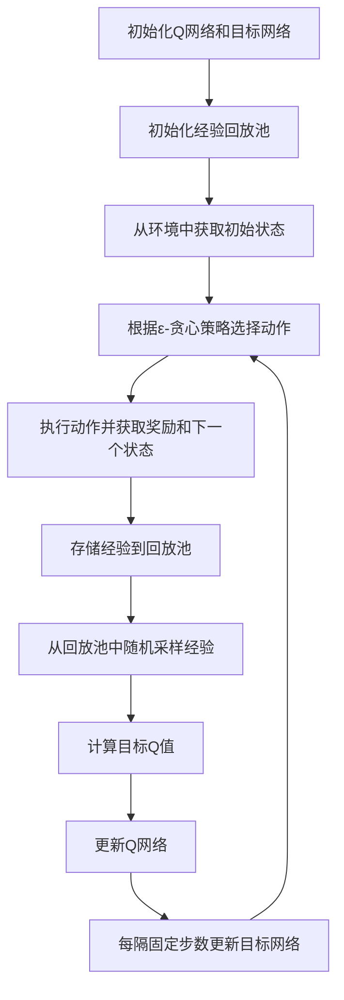

# 一切皆是映射：实现DQN的自然对话系统：挑战与策略

## 1.背景介绍

在人工智能领域，自然对话系统（NDS）一直是一个备受关注的研究方向。随着深度学习技术的不断进步，特别是深度强化学习（Deep Reinforcement Learning, DRL）的发展，研究人员开始探索如何将这些技术应用于自然对话系统中。深度Q网络（Deep Q-Network, DQN）作为DRL的一个重要分支，因其在游戏AI中的成功应用而备受瞩目。本文将探讨如何利用DQN实现一个高效的自然对话系统，并分析其中的挑战与策略。

## 2.核心概念与联系

### 2.1 自然对话系统

自然对话系统旨在通过自然语言与用户进行交互，常见的应用包括智能客服、语音助手等。一个高效的自然对话系统需要具备理解用户意图、生成自然语言响应以及持续学习和改进的能力。

### 2.2 深度Q网络（DQN）

DQN是一种基于Q学习的深度强化学习算法，通过神经网络来近似Q值函数，从而在高维状态空间中进行有效的决策。DQN的核心思想是利用经验回放和目标网络来稳定训练过程。

### 2.3 映射关系

在自然对话系统中，用户输入可以视为状态，系统响应可以视为动作，而对话的成功与否可以视为奖励。通过DQN，我们可以将对话系统的优化问题转化为一个强化学习问题，即通过不断地与用户交互，学习最优的对话策略。

## 3.核心算法原理具体操作步骤

### 3.1 状态表示

在自然对话系统中，状态表示是一个关键问题。常见的状态表示方法包括使用词向量、句向量或对话历史等。为了提高系统的鲁棒性，我们可以结合多种表示方法。

### 3.2 动作选择

动作选择即生成系统响应。在DQN中，动作空间可以是预定义的响应模板，也可以是通过生成模型生成的自然语言响应。为了平衡探索与利用，我们可以采用ε-贪心策略。

### 3.3 奖励设计

奖励设计是DQN训练的核心。对于自然对话系统，奖励可以基于用户反馈、对话成功率、对话长度等多种因素进行设计。合理的奖励设计可以有效引导系统学习最优策略。

### 3.4 经验回放与目标网络

经验回放和目标网络是DQN稳定训练的关键。通过存储对话经验并进行随机采样，我们可以打破数据相关性，提高训练效果。目标网络则用于计算目标Q值，避免训练过程中的不稳定性。

以下是DQN的基本流程图：



## 4.数学模型和公式详细讲解举例说明

### 4.1 Q值函数

Q值函数 $Q(s, a)$ 表示在状态 $s$ 下选择动作 $a$ 所能获得的期望回报。DQN通过神经网络来近似Q值函数，记为 $Q(s, a; \theta)$，其中 $\theta$ 是网络参数。

### 4.2 Bellman方程

DQN的目标是最小化Bellman方程的误差：

$$
L(\theta) = \mathbb{E}_{(s, a, r, s') \sim D} \left[ \left( r + \gamma \max_{a'} Q(s', a'; \theta^-) - Q(s, a; \theta) \right)^2 \right]
$$

其中，$r$ 是奖励，$\gamma$ 是折扣因子，$\theta^-$ 是目标网络的参数，$D$ 是经验回放池。

### 4.3 目标Q值

目标Q值 $y$ 的计算公式为：

$$
y = r + \gamma \max_{a'} Q(s', a'; \theta^-)
$$

### 4.4 参数更新

通过梯度下降法更新网络参数 $\theta$：

$$
\theta \leftarrow \theta - \alpha \nabla_\theta L(\theta)
$$

其中，$\alpha$ 是学习率。

## 5.项目实践：代码实例和详细解释说明

### 5.1 环境搭建

首先，我们需要搭建一个模拟对话环境。可以使用开源的对话数据集，如Cornell Movie Dialogs Corpus，来训练和测试我们的模型。

### 5.2 数据预处理

对话数据需要进行预处理，包括分词、去停用词、词向量表示等。可以使用NLTK、spaCy等自然语言处理工具进行预处理。

### 5.3 模型实现

以下是一个简单的DQN模型实现示例：

```python
import numpy as np
import tensorflow as tf
from collections import deque
import random

class DQN:
    def __init__(self, state_size, action_size):
        self.state_size = state_size
        self.action_size = action_size
        self.memory = deque(maxlen=2000)
        self.gamma = 0.95
        self.epsilon = 1.0
        self.epsilon_min = 0.01
        self.epsilon_decay = 0.995
        self.learning_rate = 0.001
        self.model = self._build_model()
        self.target_model = self._build_model()
        self.update_target_model()

    def _build_model(self):
        model = tf.keras.Sequential()
        model.add(tf.keras.layers.Dense(24, input_dim=self.state_size, activation='relu'))
        model.add(tf.keras.layers.Dense(24, activation='relu'))
        model.add(tf.keras.layers.Dense(self.action_size, activation='linear'))
        model.compile(loss='mse', optimizer=tf.keras.optimizers.Adam(lr=self.learning_rate))
        return model

    def update_target_model(self):
        self.target_model.set_weights(self.model.get_weights())

    def remember(self, state, action, reward, next_state, done):
        self.memory.append((state, action, reward, next_state, done))

    def act(self, state):
        if np.random.rand() <= self.epsilon:
            return random.randrange(self.action_size)
        act_values = self.model.predict(state)
        return np.argmax(act_values[0])

    def replay(self, batch_size):
        minibatch = random.sample(self.memory, batch_size)
        for state, action, reward, next_state, done in minibatch:
            target = reward
            if not done:
                target = (reward + self.gamma * np.amax(self.target_model.predict(next_state)[0]))
            target_f = self.model.predict(state)
            target_f[0][action] = target
            self.model.fit(state, target_f, epochs=1, verbose=0)
        if self.epsilon > self.epsilon_min:
            self.epsilon *= self.epsilon_decay

    def load(self, name):
        self.model.load_weights(name)

    def save(self, name):
        self.model.save_weights(name)
```

### 5.4 训练与评估

通过与用户的模拟对话进行训练，并定期评估模型的性能。可以使用BLEU、ROUGE等指标来评估对话生成的质量。

## 6.实际应用场景

### 6.1 智能客服

智能客服系统可以通过DQN不断优化对话策略，提高用户满意度和问题解决率。

### 6.2 语音助手

语音助手可以通过DQN学习用户的偏好和习惯，提供更加个性化的服务。

### 6.3 教育辅导

教育辅导系统可以通过DQN优化教学策略，提高学生的学习效果和参与度。

## 7.工具和资源推荐

### 7.1 开源工具

- TensorFlow: 一个开源的深度学习框架，支持DQN的实现。
- Keras: 一个高层神经网络API，简化了深度学习模型的构建和训练。
- NLTK: 一个强大的自然语言处理工具包，提供了丰富的文本处理功能。

### 7.2 数据集

- Cornell Movie Dialogs Corpus: 一个包含大量电影对话的数据集，适用于对话系统的训练和测试。
- OpenSubtitles: 一个包含大量电影和电视剧字幕的数据集，适用于对话系统的训练和测试。

## 8.总结：未来发展趋势与挑战

### 8.1 未来发展趋势

随着深度学习和强化学习技术的不断进步，自然对话系统将变得更加智能和高效。未来的发展趋势包括：

- 多模态对话系统：结合语音、图像等多种模态的信息，提高对话系统的理解和生成能力。
- 自适应对话系统：通过在线学习和自适应调整，提高对话系统的个性化和灵活性。
- 强化学习与生成模型结合：将强化学习与生成模型结合，生成更加自然和多样化的对话响应。

### 8.2 挑战

尽管DQN在自然对话系统中展现了巨大的潜力，但仍面临一些挑战：

- 数据稀疏性：对话数据的稀疏性和多样性使得模型训练变得困难。
- 长期依赖：对话系统需要处理长期依赖问题，确保对话的一致性和连贯性。
- 评价标准：对话系统的评价标准尚不统一，如何客观评估对话质量仍是一个难题。

## 9.附录：常见问题与解答

### 9.1 如何选择合适的状态表示方法？

选择合适的状态表示方法需要根据具体应用场景和数据特点进行调整。常见的方法包括词向量、句向量和对话历史等。可以结合多种表示方法，提高系统的鲁棒性。

### 9.2 如何设计合理的奖励函数？

奖励函数的设计需要综合考虑用户反馈、对话成功率、对话长度等因素。可以通过实验和调优，不断改进奖励函数的设计。

### 9.3 如何处理对话数据的稀疏性问题？

可以通过数据增强、预训练模型等方法缓解对话数据的稀疏性问题。此外，使用多模态数据和迁移学习也是有效的解决方案。

### 9.4 如何评估对话系统的性能？

常见的评估指标包括BLEU、ROUGE等。此外，可以通过用户调查和实际应用效果来综合评估对话系统的性能。

---

作者：禅与计算机程序设计艺术 / Zen and the Art of Computer Programming