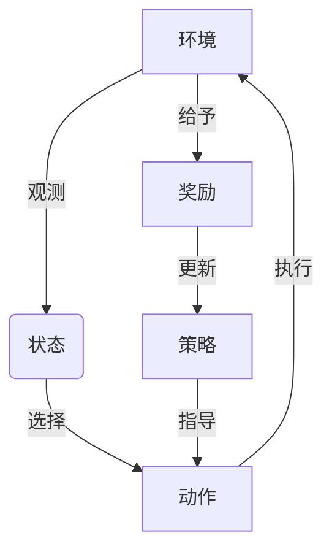

# 一切皆是映射：强化学习在机器人控制中的应用：挑战与策略

## 1.背景介绍

### 1.1 机器人控制的重要性

在当今科技飞速发展的时代，机器人技术已经渗透到我们生活的方方面面。无论是工业制造、医疗保健、探索航天,还是家庭服务,机器人都扮演着越来越重要的角色。然而,要实现高效、智能的机器人控制,需要解决诸多挑战。

### 1.2 传统机器人控制方法的局限性

传统的机器人控制方法主要依赖于人工编程和规则系统。这种方法需要预先对环境和任务进行详细建模,并为每种情况制定相应的规则。然而,真实世界环境的复杂性和不确定性使得这种方法难以应对各种情况。

### 1.3 强化学习在机器人控制中的潜力

强化学习(Reinforcement Learning, RL)作为一种基于奖惩机制的机器学习方法,具有巨大的潜力来解决机器人控制问题。通过与环境的不断互动,强化学习算法可以自主学习最优策略,从而实现智能控制。

## 2.核心概念与联系

### 2.1 强化学习基本概念

强化学习是一种基于奖惩机制的机器学习范式,其核心思想是通过与环境的互动,学习一个最优策略(Optimal Policy),以最大化预期的长期回报(Expected Long-term Reward)。

强化学习系统通常由以下几个要素组成:

- 环境(Environment)
- 状态(State)
- 动作(Action)
- 策略(Policy)
- 奖励(Reward)

### 2.2 马尔可夫决策过程(MDP)

强化学习问题通常被建模为马尔可夫决策过程(Markov Decision Process, MDP)。MDP由以下几个要素组成:

- 状态集合(State Space) $\mathcal{S}$
- 动作集合(Action Space) $\mathcal{A}$
- 转移概率(Transition Probability) $\mathcal{P}_{ss'}^a = \mathcal{P}(s' | s, a)$
- 奖励函数(Reward Function) $\mathcal{R}_s^a$
- 折扣因子(Discount Factor) $\gamma$

目标是找到一个最优策略 $\pi^*$,使得在该策略下的预期累积折扣奖励最大化:

$$\pi^* = \arg\max_\pi \mathbb{E}_\pi \left[ \sum_{t=0}^\infty \gamma^t r_t \right]$$

其中 $r_t$ 是在时间步 $t$ 获得的奖励。

### 2.3 价值函数(Value Function)

价值函数是强化学习中一个重要的概念,用于评估一个状态或状态-动作对的长期价值。

- 状态价值函数(State Value Function) $V^\pi(s)$:在策略 $\pi$ 下,从状态 $s$ 开始,期望获得的累积折扣奖励。
- 动作价值函数(Action Value Function) $Q^\pi(s, a)$:在策略 $\pi$ 下,从状态 $s$ 执行动作 $a$ 开始,期望获得的累积折扣奖励。

## 3.核心算法原理具体操作步骤

强化学习算法可分为基于价值函数(Value-based)和基于策略(Policy-based)两大类。下面将介绍两种典型算法的原理和具体操作步骤。

### 3.1 Q-Learning算法

Q-Learning是一种基于价值函数的强化学习算法,它直接学习动作价值函数 $Q(s, a)$,而不需要了解环境的转移概率和奖励函数。算法的具体步骤如下:

1. 初始化 $Q(s, a)$ 表格,所有状态-动作对的值设为任意值(通常为0)。
2. 对于每个Episode:
    - 初始化起始状态 $s$
    - 对于每个时间步:
        - 根据某种策略(如 $\epsilon$-贪婪)选择动作 $a$
        - 执行动作 $a$,观测到新状态 $s'$ 和奖励 $r$
        - 更新 $Q(s, a)$ 值:
        
        $$Q(s, a) \leftarrow Q(s, a) + \alpha \left[ r + \gamma \max_{a'} Q(s', a') - Q(s, a) \right]$$
        
        其中 $\alpha$ 是学习率, $\gamma$ 是折扣因子。
        - $s \leftarrow s'$
    - 直到Episode结束

3. 重复步骤2,直到收敛。

最终,我们可以从 $Q$ 表格中得到最优策略 $\pi^*(s) = \arg\max_a Q(s, a)$。

### 3.2 策略梯度算法(Policy Gradient)

策略梯度算法是一种基于策略的强化学习算法,它直接学习参数化策略 $\pi_\theta(a|s)$,使其最大化期望的累积折扣奖励。算法的具体步骤如下:

1. 初始化策略参数 $\theta$
2. 对于每个Episode:
    - 初始化起始状态 $s_0$
    - 对于每个时间步 $t$:
        - 根据当前策略 $\pi_\theta$ 选择动作 $a_t \sim \pi_\theta(\cdot|s_t)$
        - 执行动作 $a_t$,观测到新状态 $s_{t+1}$ 和奖励 $r_t$
        - 存储 $(s_t, a_t, r_t, s_{t+1})$ 到回放缓冲区
    - 计算Episode的累积折扣奖励 $R = \sum_{t=0}^T \gamma^t r_t$
    - 更新策略参数 $\theta$ 沿着累积奖励 $R$ 的梯度方向:
    
    $$\theta \leftarrow \theta + \alpha \nabla_\theta \log \pi_\theta(a_t|s_t) R$$
    
    其中 $\alpha$ 是学习率。

3. 重复步骤2,直到收敛。

通过不断优化策略参数 $\theta$,我们可以得到一个近似最优的策略 $\pi^*$。

## 4.数学模型和公式详细讲解举例说明

### 4.1 马尔可夫决策过程(MDP)

马尔可夫决策过程(MDP)是强化学习问题的数学建模,它由以下几个要素组成:

- 状态集合(State Space) $\mathcal{S}$
- 动作集合(Action Space) $\mathcal{A}$
- 转移概率(Transition Probability) $\mathcal{P}_{ss'}^a = \mathcal{P}(s' | s, a)$
- 奖励函数(Reward Function) $\mathcal{R}_s^a$
- 折扣因子(Discount Factor) $\gamma$

其中:

- $\mathcal{S}$ 是所有可能状态的集合,如机器人的位置、姿态等。
- $\mathcal{A}$ 是所有可能动作的集合,如移动、旋转等。
- $\mathcal{P}_{ss'}^a$ 表示在状态 $s$ 下执行动作 $a$ 后,转移到状态 $s'$ 的概率。
- $\mathcal{R}_s^a$ 表示在状态 $s$ 执行动作 $a$ 后获得的即时奖励。
- $\gamma \in [0, 1)$ 是折扣因子,用于权衡即时奖励和长期奖励的重要性。

在 MDP 中,我们的目标是找到一个最优策略 $\pi^*$,使得在该策略下的预期累积折扣奖励最大化:

$$\pi^* = \arg\max_\pi \mathbb{E}_\pi \left[ \sum_{t=0}^\infty \gamma^t r_t \right]$$

其中 $r_t$ 是在时间步 $t$ 获得的奖励。

### 4.2 价值函数(Value Function)

价值函数是强化学习中一个重要的概念,用于评估一个状态或状态-动作对的长期价值。

#### 4.2.1 状态价值函数(State Value Function)

状态价值函数 $V^\pi(s)$ 定义为在策略 $\pi$ 下,从状态 $s$ 开始,期望获得的累积折扣奖励:

$$V^\pi(s) = \mathbb{E}_\pi \left[ \sum_{t=0}^\infty \gamma^t r_t | s_0 = s \right]$$

它可以通过贝尔曼方程(Bellman Equation)来计算:

$$V^\pi(s) = \sum_{a \in \mathcal{A}} \pi(a|s) \left( \mathcal{R}_s^a + \gamma \sum_{s' \in \mathcal{S}} \mathcal{P}_{ss'}^a V^\pi(s') \right)$$

#### 4.2.2 动作价值函数(Action Value Function)

动作价值函数 $Q^\pi(s, a)$ 定义为在策略 $\pi$ 下,从状态 $s$ 执行动作 $a$ 开始,期望获得的累积折扣奖励:

$$Q^\pi(s, a) = \mathbb{E}_\pi \left[ \sum_{t=0}^\infty \gamma^t r_t | s_0 = s, a_0 = a \right]$$

它也可以通过贝尔曼方程来计算:

$$Q^\pi(s, a) = \mathcal{R}_s^a + \gamma \sum_{s' \in \mathcal{S}} \mathcal{P}_{ss'}^a \sum_{a' \in \mathcal{A}} \pi(a'|s') Q^\pi(s', a')$$

对于最优策略 $\pi^*$,我们有:

$$V^*(s) = \max_\pi V^\pi(s)$$
$$Q^*(s, a) = \max_\pi Q^\pi(s, a)$$

因此,找到最优价值函数 $V^*$ 或 $Q^*$ 就等价于找到最优策略 $\pi^*$。

### 4.3 Q-Learning算法

Q-Learning是一种基于价值函数的强化学习算法,它直接学习动作价值函数 $Q(s, a)$,而不需要了解环境的转移概率和奖励函数。

Q-Learning算法的核心是通过不断更新 $Q(s, a)$ 值,使其逼近真实的 $Q^*(s, a)$。更新规则如下:

$$Q(s, a) \leftarrow Q(s, a) + \alpha \left[ r + \gamma \max_{a'} Q(s', a') - Q(s, a) \right]$$

其中:

- $\alpha$ 是学习率,控制了新信息对旧信息的影响程度。
- $r$ 是执行动作 $a$ 后获得的即时奖励。
- $\gamma$ 是折扣因子,控制了未来奖励的重要性。
- $\max_{a'} Q(s', a')$ 是在新状态 $s'$ 下,所有可能动作的最大 $Q$ 值,代表了最优的期望未来奖励。

通过不断更新 $Q$ 表格,最终 $Q(s, a)$ 会收敛到 $Q^*(s, a)$,从而我们可以得到最优策略 $\pi^*(s) = \arg\max_a Q(s, a)$。

例如,考虑一个简单的网格世界,机器人需要从起点移动到终点。每一步移动都会获得-1的奖励,到达终点获得+100的奖励。通过 Q-Learning 算法,机器人可以学习到一个最优策略,即选择最短路径到达终点。

### 4.4 策略梯度算法(Policy Gradient)

策略梯度算法是一种基于策略的强化学习算法,它直接学习参数化策略 $\pi_\theta(a|s)$,使其最大化期望的累积折扣奖励。

我们定义目标函数为:

$$J(\theta) = \mathbb{E}_{\pi_\theta} \left[ \sum_{t=0}^\infty \gamma^t r_t \right]$$

即在策略 $\pi_\theta$ 下,期望获得的累积折扣奖励。我们的目标是找到参数 $\theta$ 使得 $J(\theta)$ 最大化。

根据策略梯度定理(Policy Gradient Theorem),我们可以计算目标函数 $J(\theta)$ 关于参数 $\theta$ 的梯度:

$$\nabla_\theta J(\theta) = \mathbb{E}_{\pi_\theta} \left[ \sum_{t=0}^\infty \nabla_\theta \log \pi_\theta(a_t|s_t) Q^{\pi_\theta}(s_t, a_t) \right]$$

其中