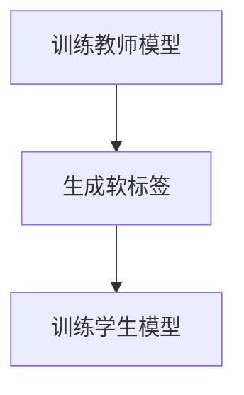

# 一切皆是映射：模型蒸馏和知识转移在神经网络中的实践

## 1.背景介绍

在人工智能和深度学习领域，模型蒸馏（Model Distillation）和知识转移（Knowledge Transfer）是两个重要的技术手段。它们不仅能够提高模型的性能，还能有效地减少模型的复杂度和计算资源的消耗。随着深度学习模型的规模和复杂度不断增加，如何在保证模型性能的前提下，降低计算资源的消耗，成为了一个亟待解决的问题。模型蒸馏和知识转移正是为了解决这一问题而提出的。

## 2.核心概念与联系

### 2.1 模型蒸馏

模型蒸馏是一种通过将一个复杂的“大”模型（教师模型）的知识转移到一个较小的“学生”模型中的技术。其核心思想是通过教师模型生成的软标签（Soft Labels）来训练学生模型，从而使学生模型能够在较少的参数和计算资源下，达到与教师模型相近的性能。

### 2.2 知识转移

知识转移是一种将一个模型中学到的知识应用到另一个模型中的技术。它不仅包括模型蒸馏，还包括迁移学习（Transfer Learning）、多任务学习（Multi-Task Learning）等方法。知识转移的目标是通过共享知识，提高新任务或新模型的学习效率和性能。

### 2.3 模型蒸馏与知识转移的联系

模型蒸馏可以看作是知识转移的一种具体实现方式。通过模型蒸馏，教师模型中的知识被有效地转移到学生模型中，从而实现知识的共享和重用。

## 3.核心算法原理具体操作步骤

### 3.1 模型蒸馏的基本流程

模型蒸馏的基本流程可以分为以下几个步骤：

1. **训练教师模型**：首先，训练一个性能较好的教师模型。
2. **生成软标签**：使用教师模型对训练数据进行预测，生成软标签。
3. **训练学生模型**：使用软标签和原始标签共同训练学生模型。

### 3.2 具体操作步骤

以下是模型蒸馏的具体操作步骤：

1. **训练教师模型**：
   - 使用标准的训练方法训练一个复杂的教师模型。
   - 记录教师模型在训练集和验证集上的性能。

2. **生成软标签**：
   - 使用教师模型对训练数据进行预测，生成软标签。
   - 软标签是教师模型输出的概率分布，而不是硬标签（one-hot 编码）。

3. **训练学生模型**：
   - 使用软标签和原始标签共同训练学生模型。
   - 损失函数可以是软标签的交叉熵损失和原始标签的交叉熵损失的加权和。

以下是一个简单的 Mermaid 流程图，展示了模型蒸馏的基本流程：



## 4.数学模型和公式详细讲解举例说明

### 4.1 软标签的生成

在模型蒸馏中，软标签是通过教师模型的输出概率分布生成的。假设教师模型的输出为 $z_i$，则软标签 $q_i$ 可以通过 softmax 函数计算得到：

$$
q_i = \frac{e^{z_i / T}}{\sum_j e^{z_j / T}}
$$

其中，$T$ 是温度参数，用于控制软标签的平滑程度。较高的温度会使得输出概率分布更加平滑。

### 4.2 损失函数

在训练学生模型时，损失函数通常是软标签的交叉熵损失和原始标签的交叉熵损失的加权和。假设学生模型的输出为 $p_i$，原始标签为 $y_i$，则损失函数可以表示为：

$$
L = \alpha \sum_i y_i \log(p_i) + \beta \sum_i q_i \log(p_i)
$$

其中，$\alpha$ 和 $\beta$ 是权重参数，用于平衡两部分损失。

### 4.3 举例说明

假设我们有一个简单的分类任务，教师模型的输出为 $[2.0, 1.0, 0.1]$，温度参数 $T=2$，则软标签可以计算为：

$$
q_1 = \frac{e^{2.0 / 2}}{e^{2.0 / 2} + e^{1.0 / 2} + e^{0.1 / 2}} = \frac{e^1}{e^1 + e^{0.5} + e^{0.05}} \approx 0.58
$$

$$
q_2 = \frac{e^{1.0 / 2}}{e^{2.0 / 2} + e^{1.0 / 2} + e^{0.1 / 2}} = \frac{e^{0.5}}{e^1 + e^{0.5} + e^{0.05}} \approx 0.31
$$

$$
q_3 = \frac{e^{0.1 / 2}}{e^{2.0 / 2} + e^{1.0 / 2} + e^{0.1 / 2}} = \frac{e^{0.05}}{e^1 + e^{0.5} + e^{0.05}} \approx 0.11
$$

## 5.项目实践：代码实例和详细解释说明

### 5.1 训练教师模型

首先，我们需要训练一个教师模型。以下是一个简单的 PyTorch 代码示例，用于训练一个教师模型：

```python
import torch
import torch.nn as nn
import torch.optim as optim
from torchvision import datasets, transforms

# 定义教师模型
class TeacherModel(nn.Module):
    def __init__(self):
        super(TeacherModel, self).__init__()
        self.conv1 = nn.Conv2d(1, 32, kernel_size=3)
        self.conv2 = nn.Conv2d(32, 64, kernel_size=3)
        self.fc1 = nn.Linear(9216, 128)
        self.fc2 = nn.Linear(128, 10)

    def forward(self, x):
        x = torch.relu(self.conv1(x))
        x = torch.relu(self.conv2(x))
        x = torch.flatten(x, 1)
        x = torch.relu(self.fc1(x))
        x = self.fc2(x)
        return x

# 加载数据集
transform = transforms.Compose([transforms.ToTensor()])
train_dataset = datasets.MNIST('./data', train=True, download=True, transform=transform)
train_loader = torch.utils.data.DataLoader(train_dataset, batch_size=64, shuffle=True)

# 初始化模型和优化器
teacher_model = TeacherModel()
optimizer = optim.Adam(teacher_model.parameters(), lr=0.001)
criterion = nn.CrossEntropyLoss()

# 训练教师模型
for epoch in range(10):
    teacher_model.train()
    for data, target in train_loader:
        optimizer.zero_grad()
        output = teacher_model(data)
        loss = criterion(output, target)
        loss.backward()
        optimizer.step()
    print(f'Epoch {epoch+1}, Loss: {loss.item()}')
```

### 5.2 生成软标签

接下来，我们使用训练好的教师模型生成软标签：

```python
teacher_model.eval()
soft_labels = []
with torch.no_grad():
    for data, _ in train_loader:
        output = teacher_model(data)
        soft_labels.append(torch.softmax(output / 2, dim=1))  # 温度参数 T=2
soft_labels = torch.cat(soft_labels)
```

### 5.3 训练学生模型

最后，我们使用软标签和原始标签共同训练学生模型：

```python
# 定义学生模型
class StudentModel(nn.Module):
    def __init__(self):
        super(StudentModel, self).__init__()
        self.conv1 = nn.Conv2d(1, 16, kernel_size=3)
        self.conv2 = nn.Conv2d(16, 32, kernel_size=3)
        self.fc1 = nn.Linear(4608, 64)
        self.fc2 = nn.Linear(64, 10)

    def forward(self, x):
        x = torch.relu(self.conv1(x))
        x = torch.relu(self.conv2(x))
        x = torch.flatten(x, 1)
        x = torch.relu(self.fc1(x))
        x = self.fc2(x)
        return x

# 初始化学生模型和优化器
student_model = StudentModel()
optimizer = optim.Adam(student_model.parameters(), lr=0.001)

# 训练学生模型
for epoch in range(10):
    student_model.train()
    for i, (data, target) in enumerate(train_loader):
        optimizer.zero_grad()
        output = student_model(data)
        loss = 0.5 * criterion(output, target) + 0.5 * criterion(output, soft_labels[i*64:(i+1)*64])
        loss.backward()
        optimizer.step()
    print(f'Epoch {epoch+1}, Loss: {loss.item()}')
```

## 6.实际应用场景

### 6.1 移动设备上的模型部署

在移动设备上，由于计算资源和存储空间的限制，直接部署大型深度学习模型往往是不现实的。通过模型蒸馏，可以将大型模型的知识转移到一个较小的模型中，从而在保证性能的前提下，减少计算资源的消耗。

### 6.2 多任务学习

在多任务学习中，不同任务之间往往存在一定的关联性。通过知识转移，可以将一个任务中学到的知识应用到另一个任务中，从而提高新任务的学习效率和性能。

### 6.3 数据隐私保护

在某些场景下，直接共享数据可能会涉及隐私问题。通过知识转移，可以在不直接共享数据的情况下，将知识从一个模型转移到另一个模型中，从而保护数据隐私。

## 7.工具和资源推荐

### 7.1 工具

- **PyTorch**：一个开源的深度学习框架，支持动态计算图，适合进行模型蒸馏和知识转移的研究和实践。
- **TensorFlow**：另一个流行的深度学习框架，提供了丰富的工具和库，支持模型蒸馏和知识转移。

### 7.2 资源

- **论文**：Hinton, G., Vinyals, O., & Dean, J. (2015). Distilling the Knowledge in a Neural Network. arXiv preprint arXiv:1503.02531.
- **书籍**：《深度学习》：Ian Goodfellow, Yoshua Bengio, Aaron Courville 著，花书，详细介绍了深度学习的基本概念和技术，包括模型蒸馏和知识转移。

## 8.总结：未来发展趋势与挑战

### 8.1 未来发展趋势

随着深度学习技术的不断发展，模型蒸馏和知识转移将会在更多的应用场景中得到广泛应用。未来，如何在更复杂的任务中实现高效的知识转移，以及如何在保证模型性能的前提下，进一步减少计算资源的消耗，将成为研究的重点。

### 8.2 挑战

尽管模型蒸馏和知识转移在很多场景中表现出色，但它们也面临一些挑战。例如，如何选择合适的温度参数和损失函数的权重参数，以及如何在多任务学习中实现高效的知识共享，都是需要进一步研究的问题。

## 9.附录：常见问题与解答

### 9.1 模型蒸馏的温度参数如何选择？

温度参数 $T$ 的选择对模型蒸馏的效果有重要影响。一般来说，较高的温度会使得输出概率分布更加平滑，从而有助于学生模型学习到更多的知识。具体的温度参数可以通过交叉验证等方法进行选择。

### 9.2 如何选择损失函数的权重参数？

损失函数的权重参数 $\alpha$ 和 $\beta$ 的选择需要根据具体的任务和数据集进行调整。一般来说，可以通过实验和调参的方法，选择使得学生模型性能最优的参数。

### 9.3 模型蒸馏和迁移学习有什么区别？

模型蒸馏和迁移学习都是知识转移的具体实现方式。模型蒸馏通过教师模型生成的软标签来训练学生模型，而迁移学习则是通过共享预训练模型的参数来提高新任务的学习效率。

---

作者：禅与计算机程序设计艺术 / Zen and the Art of Computer Programming