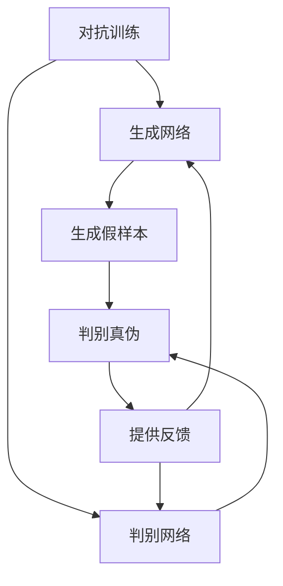

# 一切皆是映射：生成对抗网络(GAN)及其应用探索

## 1.背景介绍

### 1.1 人工智能的新里程碑

人工智能的发展历程中，有许多具有里程碑意义的技术突破,而生成对抗网络(Generative Adversarial Networks, GAN)无疑是其中的佼佼者。自2014年由伊恩·古德费洛等人提出以来,GAN就以其独特的思路和强大的生成能力在机器学习界掀起了热潮。

### 1.2 GAN的本质

GAN的核心思想是构建两个神经网络相互对抗、相互博弈,一个是生成网络(Generator),它的任务是从随机噪声中生成逼真的数据样本;另一个是判别网络(Discriminator),它的任务是判断输入的样本是真实数据还是生成网络生成的假数据。两个网络相互对抗、相互学习,生成网络不断努力欺骗判别网络,而判别网络也在不断提高识别能力,最终达到一种动态平衡,使生成网络能够生成逼真的样本。

### 1.3 应用前景广阔

GAN技术自诞生以来,就展现出了广阔的应用前景。无论是图像生成、语音合成、机器翻译,还是药物设计、金融分析等领域,GAN都有着巨大的潜力。本文将深入探讨GAN的核心原理、算法细节,并分享在实际项目中的应用案例,为读者提供全面的GAN技术解析。

## 2.核心概念与联系

### 2.1 生成模型与判别模型

在传统的机器学习中,常见的任务是判别模型(Discriminative Model),即根据输入数据对其进行分类或回归。而GAN所关注的则是生成模型(Generative Model),即学习数据的概率分布,并从该分布中生成新的样本。生成模型的目标是捕捉数据的整体统计规律,而非简单地对单个样本进行判别。

### 2.2 对抗训练

GAN的核心思想是对抗训练(Adversarial Training),即生成网络和判别网络相互对抗、相互学习。生成网络的目标是生成足以欺骗判别网络的假样本,而判别网络则努力区分真实数据和生成数据。两个网络在这种对抗过程中不断提高自身能力,最终达到一种动态平衡,使生成网络能够生成逼真的样本。

### 2.3 生成对抗网络的形式化描述

在数学上,GAN可以形式化描述为一个minimax两玩家游戏。生成网络G被训练以最小化判别网络D对其生成样本的判别能力,而判别网络D则被训练以最大化对真实样本和生成样本的判别能力。这可以用以下公式表示:

$$\min_G \max_D V(D,G) = \mathbb{E}_{x\sim p_{\text{data}}(x)}[\log D(x)] + \mathbb{E}_{z\sim p_z(z)}[\log(1-D(G(z)))]$$

其中,$p_{\text{data}}(x)$是真实数据的分布,$p_z(z)$是生成网络的输入噪声分布。判别网络D和生成网络G相互对抗,最终达到一个纳什均衡,使得生成数据的分布$p_g$与真实数据的分布$p_{\text{data}}$一致。