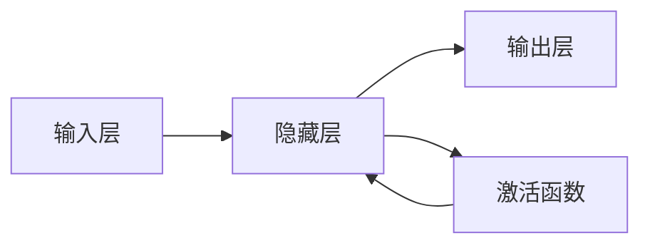

# 一切皆是映射：神经网络中的激活函数深度解析

## 1. 背景介绍

### 1.1 神经网络的重要性

在当今的人工智能时代，神经网络无疑是最为关键和广泛应用的技术之一。从计算机视觉、自然语言处理到推荐系统等诸多领域,神经网络都扮演着不可或缺的角色。作为机器学习的核心,神经网络已经渗透到我们生活的方方面面,为我们带来了无与伦比的便利。

### 1.2 激活函数在神经网络中的地位

在神经网络的架构中,激活函数是一个不可或缺的组成部分。它们扮演着"非线性映射"的角色,赋予了神经网络强大的函数拟合能力。没有激活函数,神经网络将只能学习线性函数,从而严重限制了其表达能力。可以说,激活函数是赋予神经网络"智能"的关键所在。

### 1.3 激活函数的重要意义

选择合适的激活函数对于神经网络的性能至关重要。不同的激活函数具有不同的数学特性,会直接影响神经网络的收敛性、泛化能力和计算效率等方面。因此,深入理解激活函数的本质及其在神经网络中扮演的角色,对于构建高性能的人工智能模型至关重要。

## 2. 核心概念与联系

### 2.1 神经网络的本质: 函数拟合

神经网络的本质是一种通用的函数拟合器。给定一个输入 $x$,神经网络的目标是学习一个映射函数 $f(x)$,使得输出 $y = f(x)$ 尽可能接近期望的目标值。这个映射函数 $f(x)$ 由神经网络的架构和参数共同决定。

### 2.2 激活函数: 赋予神经网络非线性能力

然而,如果没有激活函数的存在,神经网络将只能学习线性函数,这将严重限制其表达能力。激活函数 $\sigma(x)$ 被引入到神经网络中,赋予了它非线性映射的能力。具体来说,神经网络学习的是一个由多个非线性函数组合而成的复杂函数:

$$f(x) = \sigma_L(\sigma_{L-1}(\cdots \sigma_1(W_1x + b_1) \cdots ))$$

其中 $W_i$ 和 $b_i$ 分别表示第 $i$ 层的权重和偏置参数,而 $\sigma_i$ 则是该层使用的激活函数。

### 2.3 激活函数的作用

1. **非线性映射**: 激活函数赋予神经网络非线性映射的能力,使其能够拟合复杂的非线性函数。
2. **可导性**: 大多数激活函数都是可导的,这使得基于梯度下降的优化方法可以有效地训练神经网络。
3. **稀疏表达**: 某些激活函数(如ReLU)能够产生稀疏的神经元激活模式,有助于提高模型的泛化能力。
4. **梯度稳定性**: 合适的激活函数可以帮助控制梯度的流动,避免梯度消失或爆炸的问题。

### 2.4 激活函数与神经网络架构的关系

不同的神经网络架构对激活函数的选择也有不同的要求。例如,在循环神经网络中,激活函数需要具有良好的梯度流动特性;而在生成对抗网络中,激活函数的选择会影响生成样本的质量。因此,激活函数的选择需要与神经网络的具体任务和架构相匹配。

## 3. 核心算法原理具体操作步骤

在深入探讨激活函数的数学原理之前,我们先来看一下神经网络的基本工作原理。



上图展示了一个典型的前馈神经网络的架构。神经网络的核心运作过程如下:

1. **前向传播**: 输入数据 $x$ 经过一系列线性变换 $(W_ix + b_i)$ 后,得到隐藏层的输出。
2. **激活函数**: 隐藏层的输出通过激活函数 $\sigma(x)$ 进行非线性映射,得到最终的隐藏层输出 $h = \sigma(W_ix + b_i)$。
3. **输出层**: 隐藏层的输出 $h$ 再经过一次线性变换,得到神经网络的最终输出 $y = W_nh + b_n$。

在这个过程中,激活函数扮演着至关重要的角色。它将线性的隐藏层输出映射到一个非线性空间,赋予了神经网络强大的函数拟合能力。

## 4. 数学模型和公式详细讲解举例说明  

### 4.1 常见激活函数及其数学形式

下面我们来具体看一下常见的激活函数及其数学形式:

1. **Sigmoid函数**:

$$\sigma(x) = \frac{1}{1 + e^{-x}}$$

Sigmoid函数将输入值映射到 $(0, 1)$ 范围内,具有平滑和可导的特性。然而,它也存在梯度消失的问题,在深层网络中表现不佳。

2. **Tanh函数**:

$$\tanh(x) = \frac{e^x - e^{-x}}{e^x + e^{-x}}$$

Tanh函数的值域是 $(-1, 1)$,相比Sigmoid函数,它是一种更加集中的分布,梯度更大。但同样也存在梯度消失的问题。

3. **ReLU(整流线性单元)**:

$$\text{ReLU}(x) = \max(0, x)$$

ReLU函数是目前最常用的激活函数之一。它的优点是计算简单高效,并且能够产生稀疏的神经元激活模式,有助于提高模型的泛化能力。然而,它也存在"死亡神经元"的问题,即当输入为负值时,神经元将永远不会被激活。

4. **Leaky ReLU**:

$$\text{LeakyReLU}(x) = \begin{cases}
x, & \text{if } x > 0 \\
\alpha x, & \text{otherwise}
\end{cases}$$

Leaky ReLU是ReLU的一种变体,它为负值输入保留了一个很小的梯度 $\alpha$ (通常取 $0.01$),从而缓解了"死亡神经元"的问题。

5. **ELU(指数线性单元)**:

$$\text{ELU}(x) = \begin{cases}
x, & \text{if } x > 0 \\
\alpha (e^x - 1), & \text{otherwise}
\end{cases}$$

ELU函数也是ReLU的一种变体,它在负值区间内具有更加平滑的形状,有助于加快训练收敛并提高模型的精度。

6. **Swish函数**:

$$\text{Swish}(x) = x \cdot \sigma(\beta x)$$

Swish函数是一种新型的激活函数,它结合了ReLU和Sigmoid函数的优点。通过调节 $\beta$ 参数,Swish函数可以在保持简单的同时,获得更加平滑的形状和更好的表现。

### 4.2 激活函数的数学特性分析

不同的激活函数具有不同的数学特性,这些特性直接影响了神经网络的性能表现。下面我们来具体分析一下几个重要的数学特性:

1. **单调性**: 单调激活函数有助于保持输入和输出之间的一致性,从而提高模型的可解释性。例如,Sigmoid、Tanh和ReLU等函数都是单调的。

2. **可导性**: 可导性是基于梯度下降进行神经网络训练的前提条件。大多数激活函数都是可导的,但在某些点处可能出现不可导的情况,如ReLU在 $x=0$ 处不可导。

3. **梯度值**: 合适的梯度值有助于加快训练收敛并提高模型精度。例如,ReLU函数在正值区间内具有恒定的梯度 $1$,而Sigmoid和Tanh函数在saturate区域内梯度接近于 $0$,容易导致梯度消失问题。

4. **值域范围**: 不同的激活函数具有不同的值域范围。例如,Sigmoid函数的值域为 $(0, 1)$,而Tanh函数的值域为 $(-1, 1)$。值域范围会影响神经网络的表达能力和收敛性。

5. **中心化**: 一些激活函数具有较好的中心化特性,如Tanh函数的均值为 $0$。中心化有助于加快训练收敛并提高模型精度。

6. **稀疏性**: 某些激活函数(如ReLU)能够产生稀疏的神经元激活模式,有助于提高模型的泛化能力和计算效率。

通过对这些数学特性的深入理解,我们可以更加明智地选择适合特定任务和架构的激活函数,从而获得更好的模型性能。

### 4.3 激活函数的选择策略

由于不同的激活函数具有不同的数学特性,因此在实际应用中需要根据具体的任务和神经网络架构来选择合适的激活函数。下面是一些常见的选择策略:

1. **对于浅层网络**,通常使用Sigmoid或Tanh函数,因为它们的梯度更加平滑,有助于训练收敛。

2. **对于深层网络**,ReLU及其变体(如Leaky ReLU和ELU)通常是更好的选择,因为它们能够缓解梯度消失的问题,并产生稀疏的神经元激活模式。

3. **对于生成对抗网络(GAN)**,通常使用Leaky ReLU作为判别器的激活函数,而生成器则使用Tanh或Sigmoid函数,以确保生成的样本值域在合理范围内。

4. **对于循环神经网络(RNN)**,建议使用具有较好梯度流动特性的激活函数,如ReLU、ELU或GELU(高斯误差线性单元)。

5. **对于自注意力机制**,通常使用ReLU或GELU作为前馈网络的激活函数,以获得更好的表现。

6. **对于新型架构或任务**,可以尝试新型的激活函数,如Swish函数或GELU函数,它们在某些场景下表现出色。

总的来说,激活函数的选择需要综合考虑任务特点、网络架构、计算资源等多方面因素,并根据实际表现进行调整和优化。

## 5. 项目实践: 代码实例和详细解释说明

为了更好地理解激活函数在实际项目中的应用,我们来看一个基于PyTorch的代码示例。在这个示例中,我们将构建一个简单的前馈神经网络,并探索不同激活函数对模型性能的影响。

```python
import torch
import torch.nn as nn
import torch.optim as optim
from torchvision import datasets, transforms

# 定义神经网络模型
class FeedforwardNet(nn.Module):
    def __init__(self, activation):
        super(FeedforwardNet, self).__init__()
        self.activation = activation
        self.fc1 = nn.Linear(28 * 28, 512)
        self.fc2 = nn.Linear(512, 256)
        self.fc3 = nn.Linear(256, 10)

    def forward(self, x):
        x = x.view(-1, 28 * 28)
        x = self.activation(self.fc1(x))
        x = self.activation(self.fc2(x))
        x = self.fc3(x)
        return x

# 定义激活函数
activations = {
    'ReLU': nn.ReLU(),
    'Sigmoid': nn.Sigmoid(),
    'Tanh': nn.Tanh(),
    'LeakyReLU': nn.LeakyReLU(),
    'ELU': nn.ELU()
}

# 加载MNIST数据集
transform = transforms.Compose([transforms.ToTensor(), transforms.Normalize((0.1307,), (0.3081,))])
train_dataset = datasets.MNIST(root='./data', train=True, download=True, transform=transform)
test_dataset = datasets.MNIST(root='./data', train=False, download=True, transform=transform)

# 训练和评估模型
for name, activation in activations.items():
    print(f'Training with {name} activation function...')
    model = FeedforwardNet(activation)
    optimizer = optim.Adam(model.parameters())
    criterion = nn.CrossEntropyLoss()

    for epoch in range(10):
        train_loss = 0.0
        for data, target in train_dataset:
            optimizer.zero_grad()
            output = model(data)
            loss = criterion(output, target)
            