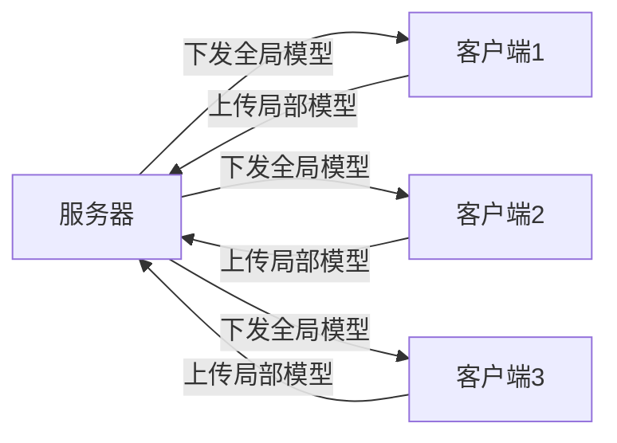

# 一切皆是映射：联邦学习与神经网络模型的分布式训练

## 1. 背景介绍
### 1.1 大数据时代的机遇与挑战
在当今大数据时代,海量的数据正在以前所未有的速度增长。据IDC预测,到2025年,全球数据圈将增长到163ZB。面对如此庞大的数据,传统的集中式机器学习方法面临着数据隐私保护、通信开销大、计算效率低等诸多挑战。

### 1.2 联邦学习的提出
为了应对这些挑战,谷歌在2016年提出了联邦学习(Federated Learning)的概念。联邦学习是一种分布式机器学习范式,它使参与方在不共享原始数据的前提下,通过加密通信协议实现协同建模,从而在保护数据隐私的同时,提高建模效率。

### 1.3 联邦学习的应用前景
联邦学习在医疗、金融、工业等领域都有广阔的应用前景。例如,医疗机构可以在不泄露患者隐私的情况下,联合训练疾病诊断模型;金融机构可以协同构建反欺诈模型,而无需共享敏感的用户数据。

## 2. 核心概念与联系
### 2.1 分布式机器学习
分布式机器学习是指将机器学习任务分布到多个节点上执行,通过并行计算提高训练效率。常见的分布式机器学习架构包括参数服务器架构和去中心化架构。

### 2.2 联邦学习
联邦学习是分布式机器学习的一种特殊形式,其特点是:
1. 参与方拥有自己的数据,不共享原始数据
2. 通过加密通信协议实现模型参数或梯度的安全聚合
3. 聚合后的全局模型在所有参与方之间共享

### 2.3 神经网络
神经网络是一种模仿生物神经系统结构和功能的机器学习模型,由大量的节点(神经元)组成,通过调整节点之间的连接权重,可以拟合复杂的非线性函数。常见的神经网络包括前馈神经网络、卷积神经网络、循环神经网络等。

### 2.4 核心概念之间的联系
联邦学习和神经网络都可以看作是一种映射:
- 联邦学习将分散在不同节点上的局部数据映射为全局模型
- 神经网络将输入数据映射为输出结果

在联邦学习中,神经网络是常用的基础模型。通过联邦学习协议,可以在分布式环境下对神经网络进行训练,实现模型的协同优化。

## 3. 核心算法原理与具体操作步骤
### 3.1 FederatedAveraging算法
FederatedAveraging(FedAvg)是最经典的联邦学习算法,其基本流程如下:
1. 服务器将全局模型参数分发给各个客户端
2. 各客户端在本地数据上对模型进行训练,得到局部模型参数
3. 客户端将局部模型参数上传至服务器
4. 服务器对收集到的局部模型参数进行加权平均,更新全局模型
5. 重复步骤1-4,直到模型收敛或达到预设的迭代次数



### 3.2 FederatedAveraging算法的改进
FedAvg算法存在一些问题,如收敛速度慢、容易陷入局部最优等。研究者提出了许多改进方案,如:
- FedProx:在本地目标函数中引入正则化项,控制局部模型与全局模型的偏离程度
- FedNova:根据客户端的数据量对局部模型进行自适应加权平均
- FedMA:利用客户端之间的相似性,构建多个子聚类,在子聚类内部进行模型聚合

### 3.3 vertical federated learning
除了横向联邦学习(如FedAvg),还有纵向联邦学习(vertical FL)。纵向联邦学习适用于不同参与方拥有相同用户的不同特征的场景。其核心是通过安全多方计算(Secure Multi-Party Computation)和同态加密等技术,在不泄露隐私的前提下计算模型的中间结果。

## 4. 数学模型与公式详解
### 4.1 FederatedAveraging的数学描述
假设有$K$个客户端参与联邦学习,第$k$个客户端的数据集为$D_k$,数据量为$n_k$。在第$t$轮通信中,客户端$k$在本地数据集$D_k$上对模型参数$w$进行如下更新:

$$w_{t+1}^k \leftarrow w_t^k - \eta \nabla F_k(w_t^k)$$

其中,$F_k$为客户端$k$的本地目标函数,$\eta$为学习率。

服务器收集所有客户端更新后的模型参数,进行加权平均,得到新的全局模型:

$$w_{t+1} \leftarrow \sum_{k=1}^K \frac{n_k}{n} w_{t+1}^k$$

其中,$n=\sum_{k=1}^K n_k$为总数据量。

### 4.2 FederatedAveraging的收敛性分析
令$F(w)=\sum_{k=1}^K \frac{n_k}{n} F_k(w)$为全局目标函数,可以证明,在一定条件下(如凸性、光滑性等),FedAvg算法能够以$O(\frac{1}{T})$的速率收敛到全局最优解,即:

$$F(w_T) - F(w^*) \leq O(\frac{1}{T})$$

其中,$w^*$为全局最优解,$T$为总通信轮数。

### 4.3 差分隐私在联邦学习中的应用
为了进一步保护数据隐私,可以在联邦学习中引入差分隐私(Differential Privacy)机制。常用的方法是在梯度或者模型参数中添加随机噪声,使得单个用户的数据变化不会显著影响学习结果。例如,在客户端更新时引入高斯噪声:

$$w_{t+1}^k \leftarrow w_t^k - \eta (\nabla F_k(w_t^k) + \mathcal{N}(0, \sigma^2))$$

其中,$\mathcal{N}(0, \sigma^2)$为均值为0、方差为$\sigma^2$的高斯分布。

## 5. 项目实践:代码实例与详解
下面以PyTorch为例,展示如何实现一个简单的联邦学习系统。

### 5.1 服务器端代码
```python
import torch
from torch import nn, optim

class Server:
    def __init__(self, model, num_clients):
        self.model = model
        self.num_clients = num_clients
        
    def aggregate(self, client_models):
        """对客户端模型进行聚合"""
        global_params = self.model.state_dict()
        for name in global_params:
            global_params[name] = torch.stack([client_model.state_dict()[name] 
                                               for client_model in client_models]).mean(0)
        self.model.load_state_dict(global_params)
        
    def distribute(self):
        """将全局模型分发给客户端"""
        return [self.model.state_dict() for _ in range(self.num_clients)]
```

### 5.2 客户端代码
```python
class Client:
    def __init__(self, model, dataset, lr):
        self.model = model
        self.dataset = dataset
        self.optimizer = optim.SGD(self.model.parameters(), lr=lr)
        self.criterion = nn.CrossEntropyLoss()
        
    def update(self, global_params):
        """用全局模型参数更新本地模型"""
        self.model.load_state_dict(global_params)
        
    def train(self, epochs):
        """在本地数据集上训练模型"""
        self.model.train()
        for _ in range(epochs):
            for inputs, labels in self.dataset:
                self.optimizer.zero_grad()
                outputs = self.model(inputs)
                loss = self.criterion(outputs, labels)
                loss.backward()
                self.optimizer.step()
        return self.model.state_dict()
```

### 5.3 联邦学习主流程
```python
def federated_learning(model, server_dataset, client_datasets, num_rounds, local_epochs, lr):
    clients = [Client(copy.deepcopy(model), dataset, lr) for dataset in client_datasets]
    server = Server(model, len(clients))
    
    for round in range(num_rounds):
        # 服务器分发全局模型
        global_params = server.distribute()
        
        # 客户端更新并训练本地模型
        client_params = []
        for client, params in zip(clients, global_params):
            client.update(params)
            client_params.append(client.train(local_epochs))
            
        # 服务器聚合客户端模型  
        server.aggregate(client_params)
        
        # 在服务器数据集上评估全局模型
        test_loss, test_acc = evaluate(server.model, server_dataset)
        print(f"Round {round}, Test loss: {test_loss:.4f}, Test accuracy: {test_acc:.2f}")
```

以上代码展示了联邦学习的基本流程:服务器分发全局模型,客户端在本地数据上更新并训练模型,服务器聚合客户端模型,得到新的全局模型,并在服务器端的测试集上进行评估。实际应用中,还需要考虑通信效率、容错、隐私保护等因素。

## 6. 实际应用场景
联邦学习在以下场景中有广泛的应用前景:

### 6.1 医疗健康
医疗数据通常分散在不同的医院和机构,直接共享这些敏感数据面临隐私和法律风险。利用联邦学习,多个医疗机构可以在不泄露患者隐私的前提下,协同训练疾病诊断、药物发现等模型,提高医疗服务的质量和效率。

### 6.2 金融风控
银行、保险公司等金融机构掌握了大量的用户数据,这些数据可以用于构建信用评估、反欺诈等模型。但由于数据隔离和隐私保护的要求,不同机构之间难以直接共享数据。通过联邦学习,金融机构可以在保护用户隐私的同时,共享模型,提升风险控制的能力。

### 6.3 智能手机
智能手机中存储了大量的用户数据,如应用使用记录、传感器数据等,这些数据可以用于改进手机的性能和服务。但是,直接上传这些数据至云端进行集中式训练,可能泄露用户隐私。利用联邦学习,可以在手机端进行本地训练,只上传模型参数,从而在保护隐私的同时,实现模型的持续优化。

### 6.4 工业物联网
在工业物联网场景中,设备数据通常分散在不同的工厂和车间,这些数据可以用于预测设备故障、优化生产流程等。但是,不同企业之间难以直接共享数据,存在数据孤岛问题。通过联邦学习,可以打破数据孤岛,实现跨企业、跨地域的模型协同训练,提升工业智能化水平。

## 7. 工具与资源推荐
### 7.1 开源框架
- Tensorflow Federated:谷歌开源的联邦学习框架,提供了多种联邦学习算法的实现
- PySyft:基于PyTorch的隐私保护机器学习框架,支持联邦学习和安全多方计算
- FATE:微众银行开源的联邦学习框架,提供了安全的多方计算协议
- FedML:联邦学习研究库,实现了多种联邦学习算法,支持多种机器学习平台

### 7.2 数据集
- LEAF:用于联邦学习研究的开源数据集,包括图像分类、语言建模等任务
- FederatedScope:联邦学习基准测试数据集,涵盖CV、NLP、推荐等领域
- Federated EMNIST:手写数字识别数据集的联邦学习版本

### 7.3 学习资源
- Federated Learning (Synthesis Lectures on Artificial Intelligence and Machine Learning):介绍联邦学习基础知识的书籍
- Federated Learning on Mobile, Edge and Cloud:介绍联邦学习在移动、边缘和云计算中应用的专著
- Advances and Open Problems in Federated Learning:综述联邦学习的最新进展和开放问题的论文
- Federated Learning:联邦学习顶会NeurIPS 2020的教程,介绍联