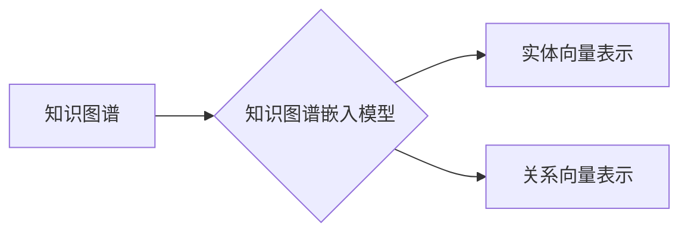

# 一切皆是映射：自然语言处理(NLP)中的AI技术

## 1.背景介绍

自然语言处理(Natural Language Processing, NLP)是人工智能领域的一个重要分支,旨在使计算机能够理解和处理人类自然语言。随着数据量的激增和计算能力的提高,NLP技术在近年来取得了长足的进步,广泛应用于机器翻译、智能问答、情感分析、文本摘要等诸多领域。

在NLP任务中,核心挑战之一是将自然语言的离散符号(单词)映射到连续的数值向量空间中,以便机器能够理解和操作这些数据。这种将符号映射到向量空间的过程被称为"嵌入"(Embedding),它是NLP中不可或缺的基础技术。

### 1.1 符号与向量的鸿沟

自然语言是由离散的符号构成的,例如单词、词组等。然而,机器学习算法通常需要处理连续的数值向量。这就产生了符号与向量之间的鸿沟,需要通过嵌入技术来弥合。

### 1.2 分布式表示

在NLP中,我们通常采用"分布式表示"(Distributed Representation)的思想,将每个符号(如单词)映射到一个连续的向量空间中。这种表示方式能够捕捉符号之间的语义关系,例如"国王"和"王后"在向量空间中会比较接近。

## 2.核心概念与联系

### 2.1 词嵌入(Word Embedding)

词嵌入是NLP中最基础和最广泛使用的嵌入技术。它将每个单词映射到一个固定长度的密集向量,这些向量能够捕捉单词之间的语义和句法关系。常用的词嵌入模型包括Word2Vec、GloVe等。

### 2.2 字符嵌入(Character Embedding)

字符嵌入是一种更细粒度的嵌入方式,它将每个字符映射到一个向量空间中。这种方法能够捕捉单词内部的结构信息,对于处理生僻词、新词等情况尤为有用。

### 2.3 上下文嵌入(Contextual Embedding)

上下文嵌入是一种动态的嵌入方式,它根据单词的上下文环境生成不同的向量表示。这种方法能够更好地捕捉单词在不同上下文中的语义差异。常用的上下文嵌入模型包括ELMo、BERT等。

### 2.4 知识图谱嵌入(Knowledge Graph Embedding)

知识图谱嵌入是将结构化的知识库(如实体、关系等)映射到低维向量空间中,以捕捉实体之间的语义关联。这种技术在知识表示和推理等任务中发挥着重要作用。常用的知识图谱嵌入模型包括TransE、RotatE等。

## 3.核心算法原理具体操作步骤

在这一部分,我们将详细介绍两种广泛使用的嵌入算法:Word2Vec和BERT,并解释它们的核心原理和操作步骤。

### 3.1 Word2Vec

Word2Vec是一种流行的词嵌入算法,由Google于2013年提出。它基于"连续词袋"(Continuous Bag-of-Words, CBOW)和"Skip-Gram"两种模型架构。

#### 3.1.1 CBOW模型

CBOW模型的目标是根据上下文词(context words)预测目标词(target word)。具体操作步骤如下:

1. 对于给定的文本序列,选择一个滑动窗口大小(例如5)。
2. 在每个窗口中,将目标词的上下文词(除目标词外的其他词)作为输入,目标词作为输出。
3. 使用神经网络模型(如浅层前馈网络)学习将上下文词的词向量映射到目标词的词向量。
4. 通过反向传播算法优化模型参数,使得给定上下文词时,能够最大化预测目标词的概率。

$$J(\theta) = \frac{1}{T}\sum_{t=1}^{T}\log P(w_t|w_{t-m}, \dots, w_{t-1}, w_{t+1}, \dots, w_{t+m}; \theta)$$

其中,$ \theta $表示模型参数,$ T $是语料库中的总词数,$ m $是窗口大小。

#### 3.1.2 Skip-Gram模型

Skip-Gram模型的目标则是根据目标词预测上下文词。操作步骤类似于CBOW,只是输入和输出的角色互换。

1. 对于给定的文本序列,选择一个滑动窗口大小。
2. 在每个窗口中,将目标词作为输入,上下文词作为输出。
3. 使用神经网络模型学习将目标词的词向量映射到上下文词的词向量。
4. 通过反向传播算法优化模型参数,使得给定目标词时,能够最大化预测上下文词的概率。

$$J(\theta) = \frac{1}{T}\sum_{t=1}^{T}\sum_{-m \leq j \leq m, j \neq 0}\log P(w_{t+j}|w_t; \theta)$$

Skip-Gram模型通常能够学习到更高质量的词向量表示,但训练速度较慢。

### 3.2 BERT

BERT(Bidirectional Encoder Representations from Transformers)是一种基于Transformer的预训练语言模型,由Google于2018年提出。它能够有效地捕捉单词的上下文信息,在多项NLP任务上取得了卓越的性能。

#### 3.2.1 预训练阶段

BERT的预训练分为两个任务:

1. **掩码语言模型(Masked Language Model, MLM)**: 在输入序列中随机掩码部分词元(token),模型需要根据剩余的上下文预测被掩码的词元。这有助于捕捉双向上下文信息。

2. **下一句预测(Next Sentence Prediction, NSP)**: 给定两个句子A和B,模型需要预测B是否为A的下一句。这有助于捕捉跨句子的关系。

通过在大规模语料库上预训练这两个任务,BERT可以学习到通用的语言表示。

#### 3.2.2 微调阶段

在特定的下游NLP任务上,我们需要对预训练的BERT模型进行微调(fine-tuning):

1. 将预训练的BERT模型作为初始化权重。
2. 在任务数据上训练额外的输出层(如分类器或序列标注层)。
3. 同时微调BERT模型的所有参数,使其适应特定的下游任务。

通过这种transfer learning的方式,BERT能够在各种NLP任务上取得出色的性能。

## 4.数学模型和公式详细讲解举例说明

在这一部分,我们将详细介绍Word2Vec和BERT模型中使用的数学模型和公式。

### 4.1 Word2Vec

Word2Vec使用了浅层神经网络模型,包括输入层、投影层和输出层。

#### 4.1.1 CBOW模型

在CBOW模型中,给定上下文词$ \{w_{t-m}, \dots, w_{t-1}, w_{t+1}, \dots, w_{t+m}\} $,我们需要预测目标词$ w_t $。具体计算过程如下:

1. 将上下文词的词向量$ \{v(w_{t-m}), \dots, v(w_{t-1}), v(w_{t+1}), \dots, v(w_{t+m})\} $相加,得到上下文向量$ x $:

$$x = \sum_{j=-m, j \neq 0}^{m}v(w_{t+j})$$

2. 将上下文向量$ x $通过投影层得到投影向量$ z $:

$$z = W^Tx + b$$

其中,$ W $是投影层的权重矩阵,$ b $是偏置向量。

3. 计算投影向量$ z $与所有词向量$ v(w_i) $的相似度得分$ u_i $:

$$u_i = v(w_i)^Tz$$

4. 将相似度得分$ u_i $通过Softmax函数转化为概率分布$ y_i $:

$$y_i = \frac{e^{u_i}}{\sum_{j=1}^{V}e^{u_j}}$$

其中,$ V $是词表的大小。

5. 最大化目标词$ w_t $的概率$ y_t $,即最小化负对数似然损失函数:

$$J(\theta) = -\log P(w_t|w_{t-m}, \dots, w_{t-1}, w_{t+1}, \dots, w_{t+m}; \theta)$$

$$= -\log y_t$$

通过梯度下降法优化模型参数$ \theta $,包括词向量$ v(w_i) $和投影层权重$ W $。

#### 4.1.2 Skip-Gram模型

Skip-Gram模型的计算过程与CBOW类似,只是输入和输出的角色互换。给定目标词$ w_t $,我们需要预测上下文词$ \{w_{t-m}, \dots, w_{t-1}, w_{t+1}, \dots, w_{t+m}\} $。

具体步骤如下:

1. 将目标词的词向量$ v(w_t) $通过投影层得到投影向量$ z $。
2. 计算投影向量$ z $与所有词向量$ v(w_i) $的相似度得分$ u_i $。
3. 将相似度得分$ u_i $通过Softmax函数转化为概率分布$ y_i $。
4. 最大化所有上下文词的概率之和,即最小化负对数似然损失函数:

$$J(\theta) = -\sum_{-m \leq j \leq m, j \neq 0}\log P(w_{t+j}|w_t; \theta)$$

### 4.2 BERT

BERT是一种基于Transformer的预训练语言模型,它使用了自注意力(Self-Attention)机制来捕捉长距离依赖关系。

#### 4.2.1 自注意力机制

自注意力机制能够捕捉输入序列中每个位置与其他位置之间的关系。给定一个长度为$ n $的输入序列$ X = (x_1, x_2, \dots, x_n) $,自注意力计算过程如下:

1. 将输入序列$ X $通过三个线性投影得到查询向量$ Q $、键向量$ K $和值向量$ V $:

$$Q = XW^Q, K = XW^K, V = XW^V$$

其中,$ W^Q $、$ W^K $和$ W^V $分别是查询、键和值的投影矩阵。

2. 计算查询向量$ Q $与所有键向量$ K $的点积,得到注意力分数矩阵$ S $:

$$S = QK^T$$

3. 对注意力分数矩阵$ S $进行行级softmax操作,得到注意力权重矩阵$ A $:

$$A = \text{softmax}(S/\sqrt{d_k})$$

其中,$ d_k $是键向量的维度,$ \sqrt{d_k} $是用于缩放注意力分数的常数。

4. 将注意力权重矩阵$ A $与值向量$ V $相乘,得到输出向量$ O $:

$$O = AV$$

自注意力机制能够自适应地捕捉输入序列中任意两个位置之间的关系,从而更好地建模长距离依赖。

#### 4.2.2 BERT预训练目标

BERT在预训练阶段使用了两个目标函数:掩码语言模型(MLM)和下一句预测(NSP)。

对于MLM目标,给定一个输入序列$ X $,我们随机掩码部分词元,得到掩码序列$ X^m $。BERT需要预测被掩码的词元,最小化交叉熵损失函数:

$$\mathcal{L}_\text{MLM} = -\sum_{i \in \text{mask}}\log P(x_i|X^m)$$

其中,$ i $是被掩码的词元位置索引。

对于NSP目标,给定两个句子$ S_1 