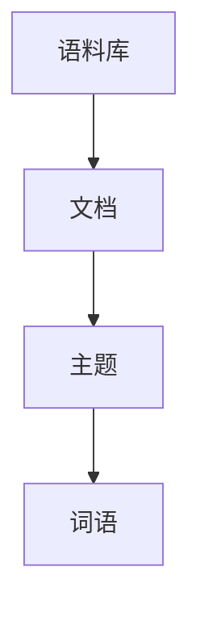

# 主题模型原理与代码实战案例讲解

## 1. 背景介绍

### 1.1 什么是主题模型?

主题模型(Topic Model)是一种无监督机器学习技术,用于从大规模文本语料中自动发现隐藏的主题信息。它基于这样一个假设:一篇文档可以看作是由多个潜在主题的混合而成,每个主题又是由一组相关词语组成。主题模型的目标是识别出文档集合中的主题,并发现每个文档中各个主题的组成比例。

### 1.2 主题模型的应用场景

主题模型广泛应用于自然语言处理、信息检索、文本挖掘等领域,具有重要的理论意义和应用价值。主要应用场景包括:

- 文本聚类: 根据主题对文档进行无监督聚类
- 文本摘要: 自动提取文档的主题关键词作为摘要
- 信息检索: 通过主题模型改善查询与文档的语义匹配
- 社交网络分析: 发现社交媒体中的热门话题
- 推荐系统: 根据用户的主题兴趣进行个性化推荐

## 2. 核心概念与联系

### 2.1 词袋模型(Bag of Words)

主题模型建立在词袋模型的基础之上。词袋模型将文档表示为一个无序的词集合,忽略了词与词之间的顺序和语法结构,只关注词频统计信息。

### 2.2 潜在语义分析(LSA)

潜在语义分析也是一种无监督主题发现方法,通过奇异值分解(SVD)将文档-词矩阵分解为主题-词和文档-主题矩阵。LSA可以发现隐含的语义关系,但无法直接得到每个主题的词分布。

### 2.3 概率主题模型

概率主题模型(如pLSA和LDA)则是基于概率统计原理,通过构建生成模型来发现主题。与LSA相比,概率主题模型更加严谨,能够直接给出每个主题的词分布概率。

## 3. 核心算法原理具体操作步骤 

### 3.1 LDA(Latent Dirichlet Allocation)

LDA是当前最流行的概率主题模型,由David Blei等人于2003年提出。它是一个三层贝叶斯概率生成模型:



1. 对每个文档:
   - 从狄利克雷分布 $\alpha$ 中抽取主题分布 $\theta$
2. 对每个主题:
   - 从狄利克雷分布 $\beta$ 中抽取词分布 $\phi$
3. 对每个词语:
   - 从词分布 $\phi$ 中抽取观测词语 w

LDA通过贝叶斯推断,从文档集合中反向估计出隐藏的主题-词分布和文档-主题分布。

### 3.2 LDA模型参数估计

LDA使用变分推断(VI)或者吉布斯采样(Gibbs Sampling)等方法进行参数估计。以吉布斯采样为例:

1. 初始化主题分配
2. 对每个词语:
   - 计算当前词语 $w_i$ 属于每个主题的概率
   - 按概率重新分配主题标签
3. 重复第2步直到收敛
4. 根据主题分配估计主题-词分布和文档-主题分布

### 3.3 LDA模型优化

标准LDA存在一些缺陷,如对较短文档主题识别困难、主题相关性较低等。研究人员提出了多种改进模型:

- 引入先验知识(Supervised LDA)
- 考虑词序信息(Topical N-Gram Model)
- 建模主题之间的关联关系(Correlated Topic Model)

## 4. 数学模型和公式详细讲解举例说明

### 4.1 LDA生成过程

LDA的生成过程可以用联合分布表示:

$$
p(\theta,z,w|\alpha,\beta) = p(\theta|\alpha)\prod_{n=1}^{N}p(z_n|\theta)p(w_n|z_n,\beta)
$$

其中:
- $\alpha$ 和 $\beta$ 分别是文档-主题分布和主题-词分布的狄利克雷先验
- $\theta$ 是文档的主题分布
- $z$ 是词语的主题分配
- $w$ 是观测词语

### 4.2 狄利克雷分布

狄利克雷分布是一种在单位K-1简单上的连续多元分布,常用作贝叶斯分析中的先验分布。

$$
\text{Dir}(\theta|\alpha) = \frac{\Gamma(\sum_{i=1}^{K}\alpha_i)}{\prod_{i=1}^{K}\Gamma(\alpha_i)}\prod_{i=1}^{K}\theta_i^{\alpha_i-1}
$$

其中 $\Gamma(x)$ 是伽马函数, $\alpha$ 是狄利克雷分布的参数向量。

### 4.3 变分推断

变分推断将复杂的后验分布 $p(\theta,z|w,\alpha,\beta)$ 近似为较简单的变分分布 $q(\theta,z)$,通过最小化KL散度来优化参数:

$$
\begin{aligned}
q^*(\theta,z) &= \arg\min_{q(\theta,z)} \text{KL}(q(\theta,z)||p(\theta,z|w,\alpha,\beta)) \\
             &= \arg\max_{q(\theta,z)} \mathbb{E}_{q(\theta,z)}[\log p(\theta,z,w|\alpha,\beta)] + H(q)
\end{aligned}
$$

其中 $H(q)$ 是 $q$ 的熵项,用于防止过拟合。

### 4.4 吉布斯采样

吉布斯采样则是通过构建马尔可夫链,从词语的主题分布中抽取样本,逐步逼近真实的后验分布。

对于第 $i$ 个词语 $w_i$,它被分配到主题 $z_i=k$ 的条件概率为:

$$
p(z_i=k|z_{\neg i},w) \propto \frac{n_{w_i}^{(k)}+\beta}{n_{.}^{(k)}+W\beta}\cdot\frac{n_{d_i}^{(k)}+\alpha_k}{n_{d_i}+\sum_k\alpha_k}
$$

其中:
- $n_{w_i}^{(k)}$ 是主题 $k$ 中词语 $w_i$ 的词频
- $n_{.}^{(k)}$ 是主题 $k$ 的总词频  
- $n_{d_i}^{(k)}$ 是文档 $d_i$ 中主题 $k$ 的词语数
- $\alpha$ 和 $\beta$ 是超参数

## 5. 项目实践: 代码实例和详细解释说明

以下是使用Python的Gensim库实现LDA主题模型的示例代码:

```python
# 导入相关库
import gensim
from gensim import corpora

# 加载语料库
corpus = [
    "This is the first document.",
    "This document is the second document.",
    "And this is the third one.",
    "Is this the first document?",
]

# 构建词袋模型
dictionary = corpora.Dictionary(corpus)
corpus_bow = [dictionary.doc2bow(text) for text in corpus]

# 训练LDA模型
lda_model = gensim.models.LdaMulticore(corpus=corpus_bow, id2word=dictionary, num_topics=3)

# 打印主题-词分布
print(lda_model.print_topics())

# 打印文档-主题分布
doc_lda = lda_model[corpus_bow[0]]
print(doc_lda)
```

代码解释:

1. 导入Gensim库和corpora模块,用于文本预处理和主题模型训练。
2. 加载示例语料库,每个元素是一个文档字符串。
3. 使用corpora.Dictionary构建词袋模型,将文档转换为词袋向量(bow)。
4. 使用gensim.models.LdaMulticore训练LDA模型,指定语料库、词典和主题数量。
5. 打印主题-词分布,每个主题包含概率最高的若干个词语。
6. 打印第一个文档的文档-主题分布,表示该文档由不同主题组成的比例。

## 6. 实际应用场景

主题模型在以下场景中有广泛应用:

1. **文本聚类**: 根据主题对文档进行无监督聚类,例如新闻分类、社交媒体内容聚类等。
2. **文本摘要**: 从文档中抽取主题词语作为摘要,用于自动文本摘要。
3. **信息检索**: 通过主题模型改善查询与文档的语义匹配,提高检索质量。
4. **个性化推荐**: 根据用户的主题兴趣推荐感兴趣的内容,如新闻、广告等。
5. **社交网络分析**: 发现社交媒体中的热门话题,分析用户兴趣和行为模式。
6. **主题演化分析**: 研究主题在时间维度上的演化和变迁规律。

## 7. 工具和资源推荐

以下是一些流行的主题模型工具和资源:

1. **Gensim**: 一个用Python实现的主题建模工具包,支持LSA、LDA等多种算法。
2. **MALLET**: 由UMass Amherst开发的主题建模工具包,提供了可伸缩的实现。
3. **Stanford Topic Modeling Toolbox**: 斯坦福大学开发的主题建模工具。
4. **LDA-C**: 一个高效的C++实现的LDA工具。
5. **LingPipe**: 一个综合的自然语言处理工具包,包含LDA等主题模型。
6. **Topic Modeling Resources**: David Blei维护的主题模型资源列表。

## 8. 总结: 未来发展趋势与挑战

主题模型作为一种重要的文本挖掘技术,在未来仍将有广阔的发展空间。一些潜在的发展方向和挑战包括:

1. **大规模主题模型**: 如何在海量文本数据上高效训练主题模型?
2. **在线主题模型**: 如何动态地更新主题模型以适应新出现的文本?
3. **多模态主题模型**: 如何将文本、图像、视频等多模态数据整合到主题模型中?
4. **主题模型的可解释性**: 如何提高主题模型的可解释性,使之更易于人类理解?
5. **主题模型在特定领域的应用**: 如何将主题模型与领域知识相结合,提高性能?

总的来说,主题模型将继续在文本挖掘、自然语言处理等领域发挥重要作用,并不断得到拓展和优化。

## 9. 附录: 常见问题与解答

1. **主题模型与传统文本聚类有什么区别?**

   主题模型是一种无监督的主题发现方法,可以自动从文本中发现隐含的主题结构。而传统的文本聚类则需要预先定义聚类数量和特征,无法发现文档的多主题性质。

2. **LDA模型中主题数量的选择?**

   主题数量是LDA模型的一个重要超参数,通常需要根据具体任务和数据集通过交叉验证等方法来确定一个合适的值。过多或过少的主题数量都会影响模型的性能。

3. **主题模型如何处理同义词和多义词?**

   标准的主题模型无法很好地处理同义词和多义词的问题。一种解决方案是在预处理阶段对同义词进行合并,对多义词进行词义消歧。另一种方法是在模型中引入外部知识或语义信息。

4. **主题模型如何处理短文本?**

   由于短文本包含的词语信息有限,标准的主题模型在处理短文本时往往效果不佳。一些改进方法包括引入先验知识、聚合短文本、考虑词序信息等。

5. **主题模型如何评估性能?**

   主题模型的评估通常包括两个方面:主题一致性(Topic Coherence)和保持率(Held-out Likelihood)。前者评估主题词语的相关性,后者评估模型对新文本的生成能力。

作者: 禅与计算机程序设计艺术 / Zen and the Art of Computer Programming